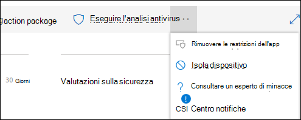

# Intraprendere azioni di risposta su un dispositivo

[!INCLUDE [Microsoft 365 Defender rebranding](../../includes/microsoft-defender.md)]

**Si applica a:**
- [Microsoft Defender per endpoint](https://go.microsoft.com/fwlink/?linkid=2154037)

>Vuoi provare Defender for Endpoint? [Iscriviti per una prova gratuita.](https://www.microsoft.com/microsoft-365/windows/microsoft-defender-atp?ocid=docs-wdatp-respondmachine-abovefoldlink) 

Rispondi rapidamente agli attacchi rilevati isolando i dispositivi o raccogliendo un pacchetto di indagini. Dopo aver esorato un'azione sui dispositivi, è possibile controllare i dettagli dell'attività nel Centro operativo.

Le azioni di risposta vengono eseguite nella parte superiore di una pagina del dispositivo specifica e includono:

- Gestire i tag
- Avviare un'indagine automatizzata
- Avviare la sessione di risposta in tempo vivo
- Raccogliere un pacchetto di indagini
- Eseguire ricerca del virus
- Limitare l'esecuzione dell'app
- Isolare il dispositivo
- Consultare un esperto di minacce
- Centro notifiche

 È possibile trovare le pagine del dispositivo da una delle visualizzazioni seguenti:

- **Dashboard operazioni di sicurezza:** selezionare il nome di un dispositivo dalla scheda Dispositivi a rischio.
- **Coda avvisi:** selezionare il nome del dispositivo accanto all'icona del dispositivo dalla coda avvisi.
- **Elenco Dispositivi:** selezionare l'intestazione del nome del dispositivo nell'elenco dei dispositivi.
- **Casella di** ricerca - Selezionare Dispositivo dal menu a discesa e immettere il nome del dispositivo.

>[!IMPORTANT]
> - Queste azioni di risposta sono disponibili solo per i dispositivi Windows 10, versione 1703 o successiva. 
> - Per le piattaforme Windows non di rete, le funzionalità di risposta (ad esempio l'isolamento del dispositivo) dipendono dalle funzionalità di terze parti.

## Gestire i tag

Aggiungere o gestire tag per creare un'affiliazione di gruppo logico. I tag di dispositivo supportano il mapping corretto della rete, consentendo di allegare tag diversi per acquisire il contesto e abilitare la creazione dinamica di elenco come parte di un incidente.

Per ulteriori informazioni sull'assegnazione di tag ai dispositivi, [vedere Creare e gestire i tag di dispositivo](machine-tags.md).

## Avviare un'indagine automatizzata

Se necessario, è possibile avviare una nuova indagine automatizzata di uso generale sul dispositivo. Durante l'esecuzione di un'indagine, qualsiasi altro avviso generato dal dispositivo verrà aggiunto a un'indagine automatizzata in corso fino al completamento dell'indagine. Inoltre, se la stessa minaccia viene vista su altri dispositivi, tali dispositivi vengono aggiunti all'indagine.

Per ulteriori informazioni sulle indagini automatizzate, vedere [Overview of Automated investigations](automated-investigations.md).

## Avviare la sessione di risposta in tempo vivo

La risposta in tempo vivo è una funzionalità che consente l'accesso istantaneo a un dispositivo utilizzando una connessione shell remota. Questo ti dà il potere di fare un lavoro investigativo approfondito e intraprendere azioni di risposta immediata per contenere prontamente le minacce identificate - in tempo reale.

Live response è progettato per migliorare le indagini consentendo di raccogliere dati forensi, eseguire script, inviare entità sospette per l'analisi, correggere le minacce e cercare in modo proattivo le minacce emergenti.

Per ulteriori informazioni sulla risposta in tempo in tempo, vedere [Investigate entities on devices using live response](live-response.md).

## Raccogli il pacchetto di indagini dai dispositivi

Come parte del processo di indagine o risposta, è possibile raccogliere un pacchetto di indagini da un dispositivo. Raccogliendo il pacchetto di indagini, è possibile identificare lo stato corrente del dispositivo e comprendere ulteriormente gli strumenti e le tecniche utilizzati dall'utente malintenzionato.

Per scaricare il pacchetto (file Zip) ed esaminare gli eventi che si sono verificati su un dispositivo

1. Selezionare **Raccogli pacchetto di** indagini dalla riga delle azioni di risposta nella parte superiore della pagina del dispositivo.
2. Specificare nella casella di testo il motivo per cui si desidera eseguire questa azione. Selezionare **Conferma**.
3. Il file zip verrà scaricato

Modo alternativo:

1. Selezionare **Centro operativo** dalla sezione azioni di risposta della pagina del dispositivo.

    

3. Nel riquadro a comparsa Centro operativo selezionare Pacchetto **di raccolta pacchetti disponibile** per scaricare il file zip.
  
    

Il pacchetto contiene le cartelle seguenti:

| cartella | Descrizione |
|:---|:---------|
|Esecuzione automatica | Contiene un set di file che rappresentano ciascuno il contenuto del Registro di sistema di un punto di ingresso di avvio automatico (ASEP) noto per identificare la persistenza dell'utente malintenzionato nel dispositivo.    
<b>NOTA:</b> Se la chiave del Registro di sistema non viene trovata, il file conterrà il seguente messaggio: "ERRORE: Impossibile trovare la chiave o il valore del Registro di sistema specificato".
                                                                                                                                |
|Programmi installati | Questo .CSV contiene l'elenco dei programmi installati che consentono di identificare ciò che è attualmente installato nel dispositivo. Per ulteriori informazioni, vedere [Win32_Product class](https://go.microsoft.com/fwlink/?linkid=841509).                                                                                  |
|Connessioni di rete | Questa cartella contiene un set di punti dati relativi alle informazioni di connettività che possono aiutare a identificare la connettività agli URL sospetti, all'infrastruttura di comando e controllo dell'utente malintenzionato (C&C), a qualsiasi movimento laterale o alle connessioni remote.   - ActiveNetConnections.txt : visualizza le statistiche del protocollo e le connessioni di rete TCP/IP correnti. Consente di cercare la connettività sospetta effettuata da un processo.    - Arp.txt : visualizza le tabelle della cache ARP (Address Resolution Protocol) correnti per tutte le interfacce.    La cache ARP può rivelare host aggiuntivi su una rete che sono stati compromessi o sistemi sospetti sulla rete che potrebbero essere stati utilizzati per eseguire un attacco interno.   - DnsCache.txt - Visualizza il contenuto della cache del resolver client DNS, che include sia le voci precaricate dal file Hosts locale che tutti i record di risorse ottenuti di recente per le query sui nomi risolte dal computer. Ciò può aiutare a identificare le connessioni sospette.    - IpConfig.txt: visualizza la configurazione TCP/IP completa per tutte le schede. Le schede possono rappresentare interfacce fisiche, ad esempio schede di rete installate, o interfacce logiche, ad esempio connessioni remote.    - FirewallExecutionLog.txt e pfirewall.log                                                                                  |
| Prelettura dei file| Windows I file prelettura sono progettati per accelerare il processo di avvio dell'applicazione. Può essere utilizzato per tenere traccia di tutti i file utilizzati di recente nel sistema e trovare tracce per le applicazioni che potrebbero essere state eliminate ma che possono ancora essere trovate nell'elenco dei file di prelettura.    - Cartella prelettura: contiene una copia dei file di prelettura da `%SystemRoot%\Prefetch` . NOTA: si consiglia di scaricare un visualizzatore di file prelettura per visualizzare i file di prelettura.    - PrefetchFilesList.txt - Contiene l'elenco di tutti i file copiati che possono essere utilizzati per tenere traccia se si sono verificati errori di copia nella cartella di prelettura.                                                                                                      |
| Processi| Contiene un .CSV file che elenca i processi in esecuzione, che consente di identificare i processi correnti in esecuzione nel dispositivo. Questo può essere utile quando si identifica un processo sospetto e il suo stato.                                                                                                                                                                                                       |
| Attività pianificate| Contiene un file .CSV che elenca le attività pianificate, che può essere utilizzato per identificare le routine eseguite automaticamente su un dispositivo scelto per cercare codice sospetto impostato per l'esecuzione automatica.                                                                                                                                                                                                      |
| Registro eventi di protezione| Contiene il registro eventi di protezione, che contiene i record dell'attività di accesso o disconnessione o altri eventi correlati alla sicurezza specificati dai criteri di controllo del sistema.   
<b>NOTA:</b> Aprire il file del registro eventi utilizzando il Visualizzatore eventi.
                                                                                    |
| Servizi| Contiene un .CSV file che elenca i servizi e i relativi stati.                                                                                      |
| Windows Sessioni SMB (Server Message Block) | Elenca l'accesso condiviso a file, stampanti e porte seriali e comunicazioni varie tra nodi di una rete. Ciò può aiutare a identificare l'esfiltrazione dei dati o il movimento laterale.    Contiene i file per SMBInboundSessions e SMBOutboundSession.    
<b>NOTA:</b> Se non sono presenti sessioni (in ingresso o in uscita), verrà visualizzato un file di testo che ti dirà che non sono state trovate sessioni SMB.
                                                                                                                          |
| System Information| Contiene un SystemInformation.txt file che elenca informazioni di sistema quali la versione del sistema operativo e le schede di rete.                                                                                     |
| Directory temp| Contiene un set di file di testo che elenca i file che si trovano in %Temp% per ogni utente del sistema.    Questo può aiutare a tenere traccia dei file sospetti che un utente malintenzionato potrebbe aver rilasciato nel sistema.    
<b>NOTA:</b> Se il file contiene il seguente messaggio: "Il sistema non riesce a trovare il percorso specificato", significa che non esiste una directory temporanea per questo utente e potrebbe essere dovuto al fatto che l'utente non ha effettuato l'accesso al sistema.
                                                                                                                                         |
| Utenti e gruppi| Fornisce un elenco di file che rappresentano ciascuno un gruppo e i relativi membri.                                                                                                                   |
|WdSupportLogs| Fornisce le MpCmdRunLog.txt e MPSupportFiles.cab     
<b>NOTA:</b> Questa cartella verrà creata solo su Windows 10, versione 1709 o successiva con aggiornamento cumulativo di febbraio 2020 o installato più recenti:  Win10 1709 (RS3) Build 16299.1717 : [KB4537816](https://support.microsoft.com/en-us/help/4537816/windows-10-update-kb4537816)   Win10 1803 (RS4) Build 17134.1345 : [KB4537795](https://support.microsoft.com/en-us/help/4537795/windows-10-update-kb4537795)   Win10 1809 (RS5) Build 17763.1075 : [KB4537818](https://support.microsoft.com/en-us/help/4537818/windows-10-update-kb4537818)   Win10 1903/1909 (19h1/19h2) Build 18362.693 e 18363.693 : [KB4535996](https://support.microsoft.com/en-us/help/4535996/windows-10-update-kb4535996) 
                                                                                                                    |
| CollectionSummaryReport.xls| Questo file è un riepilogo della raccolta di pacchetti di analisi, contiene l'elenco dei punti dati, il comando utilizzato per estrarre i dati, lo stato di esecuzione e il codice di errore in caso di errore. È possibile utilizzare questo report per tenere traccia se il pacchetto include tutti i dati previsti e identificare se si sono verificati errori. |

## Eseguire Antivirus Microsoft Defender scansione nei dispositivi

Come parte del processo di indagine o risposta, è possibile avviare in remoto una scansione antivirus per identificare e correggere il malware che potrebbe essere presente su un dispositivo compromesso.

>[!IMPORTANT]
>- Questa azione è disponibile per i dispositivi su Windows 10, versione 1709 o successiva.
>- Una Antivirus Microsoft Defender (Microsoft Defender AV) può essere eseguita insieme ad altre soluzioni antivirus, indipendentemente dal fatto che Microsoft Defender AV sia o meno la soluzione antivirus attiva. Microsoft Defender AV può essere in modalità Passiva. Per ulteriori informazioni, vedere [compatibilità Antivirus Microsoft Defender .](https://docs.microsoft.com/windows/security/threat-protection/microsoft-defender-antivirus/microsoft-defender-antivirus-compatibility.md)

Uno di questi è **stato selezionato Esegui analisi antivirus**, selezionare il tipo di analisi che si desidera eseguire (rapido o completo) e aggiungere un commento prima di confermare l'analisi.

Il Centro operativo mostrerà le informazioni di scansione e la sequenza temporale del dispositivo includerà un nuovo evento, che riflette che è stata inviata un'azione di scansione sul dispositivo. Gli avvisi AV di Microsoft Defender rifletteranno tutti i rilevamenti che sono stati vengono ati durante l'analisi.

>[!NOTE]
>Quando si attiva un'analisi utilizzando l'azione di risposta Defender for Endpoint, il valore 'ScanAvgCPULoadFactor' dell'antivirus Microsoft Defender continua ad essere applicabile e limita l'impatto della CPU dell'analisi.  Se ScanAvgCPULoadFactor non è configurato, il valore predefinito è un limite del 50% di carico massimo della CPU durante un'analisi. 
>Per ulteriori informazioni, vedere [configure-advanced-scan-types-microsoft-defender-antivirus](https://docs.microsoft.com/windows/security/threat-protection/microsoft-defender-antivirus/configure-advanced-scan-types-microsoft-defender-antivirus).

## Limitare l'esecuzione dell'app

Oltre a contenere un attacco arrestando processi dannosi, è anche possibile bloccare un dispositivo e impedire l'esecuzione di successivi tentativi di programmi potenzialmente dannosi.

>[!IMPORTANT]
> - Questa azione è disponibile per i dispositivi su Windows 10, versione 1709 o successiva.
> - Questa funzionalità è disponibile se l'organizzazione utilizza Antivirus Microsoft Defender.
> - Questa azione deve soddisfare i requisiti di Windows Defender dei criteri di integrità del codice controllo applicazioni e dei requisiti di firma. Per ulteriori informazioni, vedere Formati [e firma dei criteri di integrità del codice](https://docs.microsoft.com/windows/device-security/device-guard/requirements-and-deployment-planning-guidelines-for-device-guard#code-integrity-policy-formats-and-signing).

Per impedire l'esecuzione di un'applicazione, viene applicato un criterio di integrità del codice che consente l'esecuzione dei file solo se firmati da un certificato emesso da Microsoft. Questo metodo di restrizione consente di impedire a un utente malintenzionato di controllare i dispositivi compromessi e di eseguire ulteriori attività dannose.

>[!NOTE]
>Sarai in grado di invertire la restrizione dell'esecuzione delle applicazioni in qualsiasi momento. Il pulsante nella pagina del dispositivo cambierà in modo da **intere Rimuovi restrizioni dell'app** e quindi si es applicano gli stessi passaggi della limitazione dell'esecuzione dell'app.

Dopo aver selezionato Limita **l'esecuzione dell'app** nella pagina del dispositivo, digitare un commento e selezionare **Conferma**. Il Centro operativo mostrerà le informazioni di scansione e la sequenza temporale del dispositivo includerà un nuovo evento.

**Notifica sull'utente del dispositivo**: 
Quando un'app è limitata, viene visualizzata la notifica seguente per informare l'utente che l'esecuzione di un'app è limitata:

## Isolare i dispositivi dalla rete

A seconda della gravità dell'attacco e della sensibilità del dispositivo, è possibile isolare il dispositivo dalla rete. Questa azione può aiutare a impedire all'utente malintenzionato di controllare il dispositivo compromesso ed eseguire ulteriori attività come l'esfiltrazione dei dati e il movimento laterale.

>[!IMPORTANT]
>- L'isolamento completo è disponibile per i dispositivi Windows 10, versione 1703.
>- L'isolamento selettivo è disponibile per i dispositivi Windows 10, versione 1709 o successiva.
>- Quando si isola un dispositivo, sono consentiti solo determinati processi e destinazioni. Pertanto, i dispositivi che si trovano dietro un tunnel VPN completo non saranno in grado di raggiungere il servizio cloud Microsoft Defender for Endpoint dopo l'isolato del dispositivo. È consigliabile utilizzare una VPN con tunneling diviso per Microsoft Defender per endpoint e Antivirus Microsoft Defender traffico relativo alla protezione basato su cloud.

Questa funzione di isolamento del dispositivo disconnette il dispositivo compromesso dalla rete mantenendo la connettività al servizio Defender for Endpoint, che continua a monitorare il dispositivo.

In Windows 10, versione 1709 o successiva, avrai un controllo aggiuntivo sul livello di isolamento della rete. È inoltre possibile scegliere di abilitare Outlook, Microsoft Teams e Skype for Business connettività (ad esempio un 'Isolamento selettivo').

>[!NOTE]
>Sarai in grado di riconnettere il dispositivo alla rete in qualsiasi momento. Il pulsante nella pagina del dispositivo cambierà in modo da **ottenere il rilascio dall'isolamento** e quindi si elasceranno gli stessi passaggi dell'isolamento del dispositivo.

Dopo aver selezionato Isola **dispositivo nella** pagina del dispositivo, digitare un commento e selezionare **Conferma**. Il Centro operativo mostrerà le informazioni di scansione e la sequenza temporale del dispositivo includerà un nuovo evento.

>[!NOTE]
>Il dispositivo rimarrà connesso al servizio Defender for Endpoint anche se è isolato dalla rete. Se hai scelto di abilitare la Outlook e Skype for Business, sarai in grado di comunicare con l'utente mentre il dispositivo è isolato.

**Notifica sull'utente del dispositivo**: 
Quando un dispositivo viene isolato, viene visualizzata la seguente notifica per informare l'utente che il dispositivo viene isolato dalla rete:

## Consultare un esperto di minacce

È possibile consultare un esperto di minacce Microsoft per ulteriori informazioni su un dispositivo potenzialmente compromesso o già compromesso. Microsoft Threat Experts possono essere impegnati direttamente dall'interno del Microsoft Defender Security Center una risposta tempestiva e accurata. Gli esperti forniscono informazioni dettagliate non solo su un dispositivo potenzialmente compromesso, ma anche per comprendere meglio le minacce complesse, le notifiche di attacco mirate che ricevi o se hai bisogno di maggiori informazioni sugli avvisi o di un contesto di intelligence sulle minacce che vedi nella dashboard del portale.

Per [informazioni dettagliate, vedere Consultare un esperto](https://docs.microsoft.com/microsoft-365/security/defender-endpoint/configure-microsoft-threat-experts#consult-a-microsoft-threat-expert-about-suspicious-cybersecurity-activities-in-your-organization) di minacce Microsoft.

## Controllare i dettagli delle attività nel Centro operativo

Il **Centro operativo** fornisce informazioni sulle azioni intraprese in un dispositivo o in un file. Sarà possibile visualizzare i dettagli seguenti:

- Raccolta pacchetti di indagini
- Scansione antivirus
- Restrizione dell'app
- Isolamento del dispositivo

Vengono visualizzati anche tutti gli altri dettagli correlati, ad esempio la data/ora di invio, l'invio dell'utente e se l'azione ha avuto esito positivo o negativo.

## Argomento correlato
- [Intraprendere azioni di risposta su un file](respond-file-alerts.md)
- [Segnalare l'imprecisione](https://docs.microsoft.com/microsoft-365/security/defender-endpoint/tvm-security-recommendation#report-inaccuracy)
