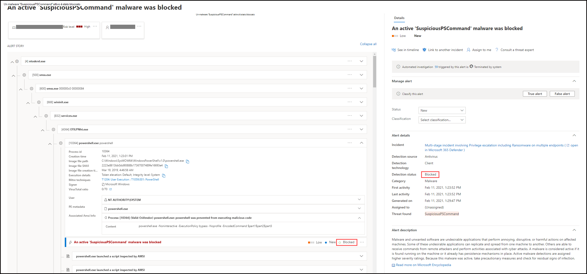
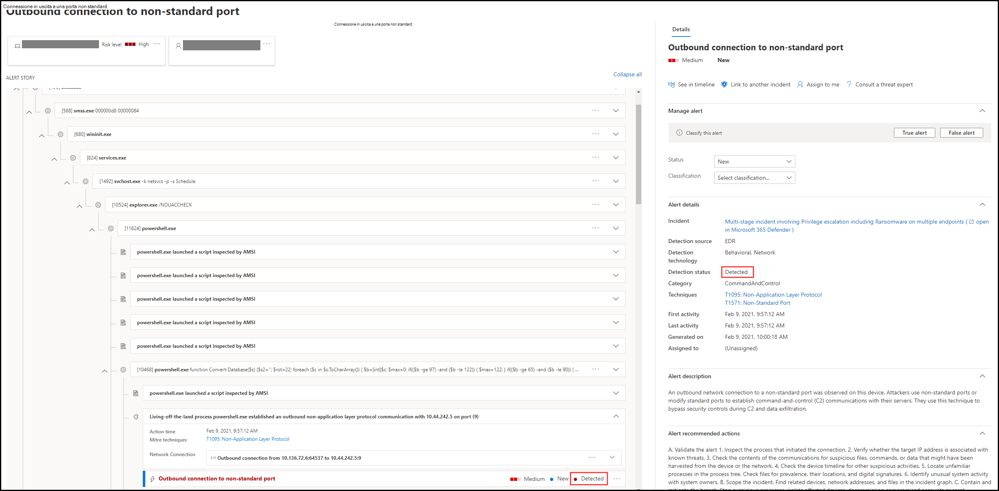
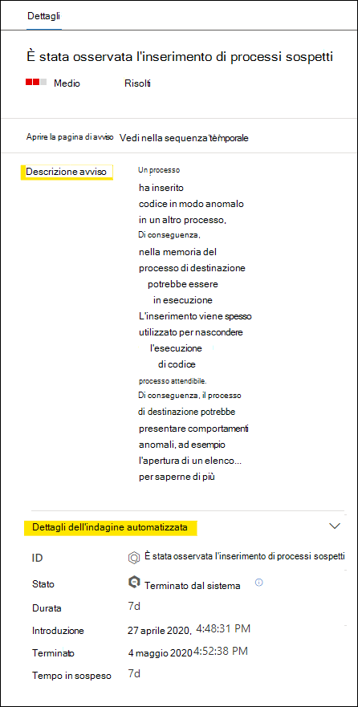
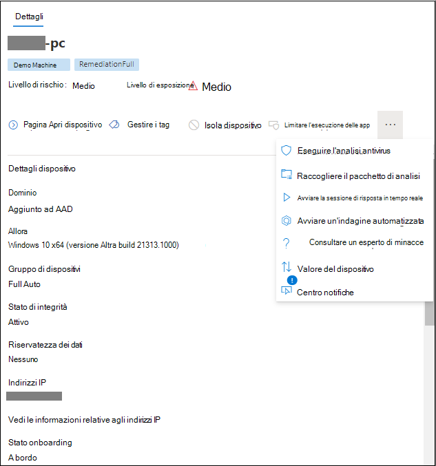

# Esaminare gli avvisi in Microsoft Defender for Endpoint

[!INCLUDE [Microsoft 365 Defender rebranding](../../includes/microsoft-defender.md)]

**Si applica a:**
- [Microsoft Defender ATP](https://go.microsoft.com/fwlink/?linkid=2154037)

>Vuoi provare Defender per Endpoint? [Iscriversi per una versione di valutazione gratuita.](https://www.microsoft.com/microsoft-365/windows/microsoft-defender-atp?ocid=docs-wdatp-managealerts-abovefoldlink)

La pagina di avviso in Microsoft Defender for Endpoint fornisce il contesto completo dell'avviso, combinando segnali di attacco e avvisi correlati all'avviso selezionato, per creare una storia di avviso dettagliata.

Analizzare, analizzare ed eseguire rapidamente azioni efficaci sugli avvisi che influiscono sull'organizzazione. Comprendere il motivo per cui sono stati attivati e il loro impatto da una posizione. Altre informazioni in questa panoramica.

> [!VIDEO https://www.microsoft.com/videoplayer/embed/RE4yiO5]

## Introduzione a un avviso

Selezionando il nome di un avviso in Defender for Endpoint, verrà visualizzata la relativa pagina di avviso. Nella pagina dell'avviso verranno visualizzate tutte le informazioni nel contesto dell'avviso selezionato. Ogni pagina di avviso è costituita da 4 sezioni:

1. **Il titolo dell'avviso** mostra il nome dell'avviso ed è presente per ricordarti quale avviso ha avviato l'indagine corrente indipendentemente da ciò che hai selezionato nella pagina.
2. [**Gli asset interessati elencano**](#review-affected-assets) le schede dei dispositivi e degli utenti interessati da questo avviso che possono essere selezionate per ulteriori informazioni e azioni.
3. La **storia dell'avviso** visualizza tutte le entità correlate all'avviso, interconnesse da una visualizzazione albero. L'avviso nel titolo sarà quello attivo quando si atterra per la prima volta nella pagina dell'avviso selezionato. Le entità nella storia dell'avviso sono espandibili e selezionabili, per fornire informazioni aggiuntive e accelerare la risposta consentendoti di eseguire azioni direttamente nel contesto della pagina di avviso. Usa la storia di avviso per avviare l'indagine. Scopri come analizzare [gli avvisi in Microsoft Defender for Endpoint.](https://docs.microsoft.com/microsoft-365/security/defender-endpoint/investigate-alerts)
4. Il **riquadro dei** dettagli mostrerà i dettagli dell'avviso selezionato in un primo momento, con i dettagli e le azioni correlati a questo avviso. Se si seleziona una delle risorse o entità interessate nella storia di avviso, il riquadro dei dettagli verrà modificato per fornire informazioni contestuali e azioni per l'oggetto selezionato.

Prendere nota dello stato di rilevamento dell'avviso. 
- Non consentito: il tentativo di azione sospetta è stato evitato. Ad esempio, un file non è stato scritto su disco o eseguito.

- Bloccato: il comportamento sospetto è stato eseguito e quindi bloccato. Ad esempio, un processo è stato eseguito ma, poiché in seguito presentava comportamenti sospetti, il processo è stato terminato.

- Rilevato: è stato rilevato un attacco ed è probabilmente ancora attivo.

È inoltre possibile  esaminare i dettagli dell'indagine automatizzata nel riquadro dei dettagli dell'avviso per vedere quali azioni sono già state eseguite, nonché leggere la descrizione dell'avviso per le azioni consigliate.

Altre informazioni disponibili nel riquadro dei dettagli all'apertura dell'avviso includono tecniche MITRE, origine e ulteriori dettagli contestuali.

## Esaminare gli asset interessati

Selezionando un dispositivo o una scheda utente nelle sezioni degli asset interessati, si passa ai dettagli del dispositivo o dell'utente nel riquadro dei dettagli.

- **Per i** dispositivi , nel riquadro dei dettagli verranno visualizzate informazioni sul dispositivo stesso, ad esempio Dominio, Sistema operativo e IP. Sono disponibili anche gli avvisi attivi e gli utenti connessi su tale dispositivo. Puoi intervenire immediatamente isolando il dispositivo, limitando l'esecuzione dell'app o eseguendo un'analisi antivirus. In alternativa, puoi raccogliere un pacchetto di indagine, avviare un'indagine automatizzata o passare alla pagina del dispositivo per analizzare dal punto di vista del dispositivo.

   

- Per gli utenti **,** nel riquadro dei dettagli verranno visualizzate informazioni dettagliate sull'utente, ad esempio il nome SAM e il SID dell'utente, nonché i tipi di accesso eseguiti dall'utente e gli avvisi e gli eventi imprevisti ad esso correlati. È possibile selezionare *Apri pagina utente* per continuare l'indagine dal punto di vista dell'utente.

   

## Argomenti correlati

- [Visualizzare e organizzare la coda degli eventi imprevisti](view-incidents-queue.md)
- [Indagare sugli eventi imprevisti](investigate-incidents.md)
- [Gestire gli eventi imprevisti](manage-incidents.md)
