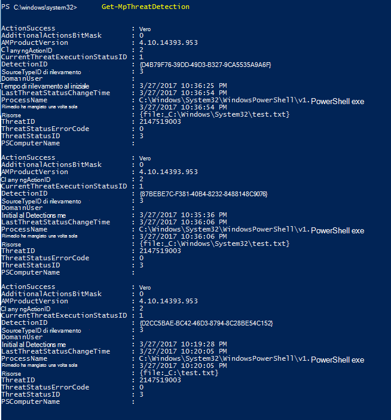
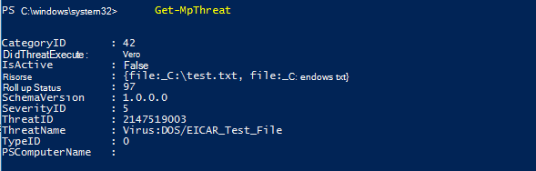

# <a name="review-microsoft-defender-antivirus-scan-results"></a><span data-ttu-id="0b913-104">Esaminare Antivirus Microsoft Defender risultati dell'analisi</span><span class="sxs-lookup"><span data-stu-id="0b913-104">Review Microsoft Defender Antivirus scan results</span></span>

[!INCLUDE [Microsoft 365 Defender rebranding](../../includes/microsoft-defender.md)]


<span data-ttu-id="0b913-105">**Si applica a:**</span><span class="sxs-lookup"><span data-stu-id="0b913-105">**Applies to:**</span></span>

- [<span data-ttu-id="0b913-106">Microsoft Defender per endpoint</span><span class="sxs-lookup"><span data-stu-id="0b913-106">Microsoft Defender for Endpoint</span></span>](/microsoft-365/security/defender-endpoint/)

<span data-ttu-id="0b913-107">Al termine Antivirus Microsoft Defender'analisi, se si [](run-scan-microsoft-defender-antivirus.md) tratta di un'analisi su richiesta o pianificata, [](scheduled-catch-up-scans-microsoft-defender-antivirus.md)i risultati vengono registrati ed è possibile visualizzarli.</span><span class="sxs-lookup"><span data-stu-id="0b913-107">After a Microsoft Defender Antivirus scan completes, whether it is an [on-demand](run-scan-microsoft-defender-antivirus.md) or [scheduled scan](scheduled-catch-up-scans-microsoft-defender-antivirus.md), the results are recorded and you can view the results.</span></span> 


## <a name="use-configuration-manager-to-review-scan-results"></a><span data-ttu-id="0b913-108">Usare Configuration Manager per esaminare i risultati dell'analisi</span><span class="sxs-lookup"><span data-stu-id="0b913-108">Use Configuration Manager to review scan results</span></span>

<span data-ttu-id="0b913-109">Vedi [Come monitorare lo stato Endpoint Protection stato](/configmgr/protect/deploy-use/monitor-endpoint-protection).</span><span class="sxs-lookup"><span data-stu-id="0b913-109">See [How to monitor Endpoint Protection status](/configmgr/protect/deploy-use/monitor-endpoint-protection).</span></span>

## <a name="use-powershell-cmdlets-to-review-scan-results"></a><span data-ttu-id="0b913-110">Utilizzare i cmdlet di PowerShell per esaminare i risultati dell'analisi</span><span class="sxs-lookup"><span data-stu-id="0b913-110">Use PowerShell cmdlets to review scan results</span></span>

<span data-ttu-id="0b913-111">Il cmdlet seguente restituirà ogni rilevamento nell'endpoint.</span><span class="sxs-lookup"><span data-stu-id="0b913-111">The following cmdlet will return each detection on the endpoint.</span></span> <span data-ttu-id="0b913-112">Se sono presenti più rilevamenti della stessa minaccia, ogni rilevamento verrà elencato separatamente, in base al momento di ogni rilevamento:</span><span class="sxs-lookup"><span data-stu-id="0b913-112">If there are multiple detections of the same threat, each detection will be listed separately, based on the time of each detection:</span></span>

```PowerShell
Get-MpThreatDetection
```



<span data-ttu-id="0b913-114">È possibile specificare `-ThreatID` di limitare l'output in modo da visualizzare solo i rilevamenti per una minaccia specifica.</span><span class="sxs-lookup"><span data-stu-id="0b913-114">You can specify `-ThreatID` to limit the output to only show the detections for a specific threat.</span></span>

<span data-ttu-id="0b913-115">Se si desidera elencare i rilevamenti delle minacce, ma combinare i rilevamenti della stessa minaccia in un singolo elemento, è possibile utilizzare il cmdlet seguente:</span><span class="sxs-lookup"><span data-stu-id="0b913-115">If you want to list threat detections, but combine detections of the same threat into a single item, you can use the following cmdlet:</span></span>

```PowerShell
Get-MpThreat
```



<span data-ttu-id="0b913-117">Per ulteriori informazioni su come usare PowerShell con Antivirus Microsoft Defender, vedere Use [PowerShell cmdlets to configure](use-powershell-cmdlets-microsoft-defender-antivirus.md) and Antivirus Microsoft Defender run Antivirus Microsoft Defender and [Defender cmdlets.](/powershell/module/defender/)</span><span class="sxs-lookup"><span data-stu-id="0b913-117">See [Use PowerShell cmdlets to configure and run Microsoft Defender Antivirus](use-powershell-cmdlets-microsoft-defender-antivirus.md) and [Defender cmdlets](/powershell/module/defender/) for more information on how to use PowerShell with Microsoft Defender Antivirus.</span></span>

## <a name="use-windows-management-instruction-wmi-to-review-scan-results"></a><span data-ttu-id="0b913-118">Utilizzare Windows Management Instruction (WMI) per esaminare i risultati dell'analisi</span><span class="sxs-lookup"><span data-stu-id="0b913-118">Use Windows Management Instruction (WMI) to review scan results</span></span>

<span data-ttu-id="0b913-119">Usa il [ **metodo Get** delle **classi MSFT_MpThreat** **e MSFT_MpThreatDetection.**](/previous-versions/windows/desktop/defender/windows-defender-wmiv2-apis-portal)</span><span class="sxs-lookup"><span data-stu-id="0b913-119">Use the [**Get** method of the **MSFT_MpThreat** and **MSFT_MpThreatDetection**](/previous-versions/windows/desktop/defender/windows-defender-wmiv2-apis-portal) classes.</span></span>


## <a name="related-articles"></a><span data-ttu-id="0b913-120">Articoli correlati</span><span class="sxs-lookup"><span data-stu-id="0b913-120">Related articles</span></span>

- [<span data-ttu-id="0b913-121">Personalizzare, avviare ed esaminare i risultati di Antivirus Microsoft Defender analisi e correzione</span><span class="sxs-lookup"><span data-stu-id="0b913-121">Customize, initiate, and review the results of Microsoft Defender Antivirus scans and remediation</span></span>](customize-run-review-remediate-scans-microsoft-defender-antivirus.md)
- [<span data-ttu-id="0b913-122">Antivirus Microsoft Defender in Windows 10</span><span class="sxs-lookup"><span data-stu-id="0b913-122">Microsoft Defender Antivirus in Windows 10</span></span>](microsoft-defender-antivirus-in-windows-10.md)