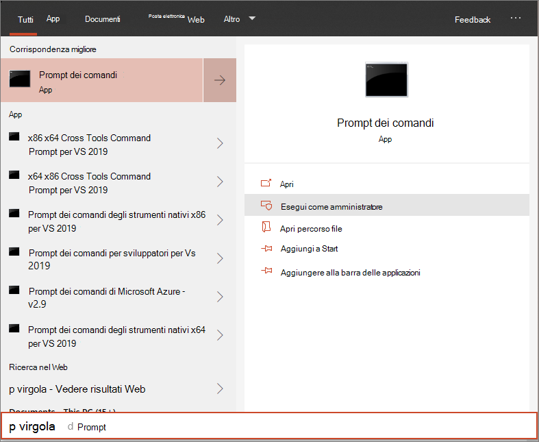

# <a name="run-a-detection-test-on-a-newly-onboarded-microsoft-defender-for-endpoint-device"></a><span data-ttu-id="497dc-104">Eseguire un test di rilevamento in un dispositivo Microsoft Defender for Endpoint appena onboarded</span><span class="sxs-lookup"><span data-stu-id="497dc-104">Run a detection test on a newly onboarded Microsoft Defender for Endpoint device</span></span> 

[!INCLUDE [Microsoft 365 Defender rebranding](../../includes/microsoft-defender.md)]


<span data-ttu-id="497dc-105">**Si applica a:**</span><span class="sxs-lookup"><span data-stu-id="497dc-105">**Applies to:**</span></span>
- <span data-ttu-id="497dc-106">Versioni Windows 10 supportate</span><span class="sxs-lookup"><span data-stu-id="497dc-106">Supported Windows 10 versions</span></span>
- <span data-ttu-id="497dc-107">Windows Server 2012 R2</span><span class="sxs-lookup"><span data-stu-id="497dc-107">Windows Server 2012 R2</span></span>
- <span data-ttu-id="497dc-108">Windows Server 2016</span><span class="sxs-lookup"><span data-stu-id="497dc-108">Windows Server 2016</span></span>
- <span data-ttu-id="497dc-109">Windows Server, versione 1803</span><span class="sxs-lookup"><span data-stu-id="497dc-109">Windows Server, version 1803</span></span>
- <span data-ttu-id="497dc-110">Windows Server, 2019</span><span class="sxs-lookup"><span data-stu-id="497dc-110">Windows Server, 2019</span></span>
- [<span data-ttu-id="497dc-111">Microsoft Defender per endpoint</span><span class="sxs-lookup"><span data-stu-id="497dc-111">Microsoft Defender for Endpoint</span></span>](https://go.microsoft.com/fwlink/?linkid=2154037)
- [<span data-ttu-id="497dc-112">Microsoft 365 Defender</span><span class="sxs-lookup"><span data-stu-id="497dc-112">Microsoft 365 Defender</span></span>](https://go.microsoft.com/fwlink/?linkid=2118804)

> <span data-ttu-id="497dc-113">Vuoi provare Microsoft Defender per Endpoint?</span><span class="sxs-lookup"><span data-stu-id="497dc-113">Want to experience Microsoft Defender for Endpoint?</span></span> [<span data-ttu-id="497dc-114">Iscriversi per una versione di valutazione gratuita.</span><span class="sxs-lookup"><span data-stu-id="497dc-114">Sign up for a free trial.</span></span>](https://www.microsoft.com/microsoft-365/windows/microsoft-defender-atp?ocid=docs-wdatp-exposedapis-abovefoldlink)

<span data-ttu-id="497dc-115">Eseguire lo script di PowerShell seguente in un dispositivo appena onboarded per verificare che sia correttamente segnalato al servizio Defender for Endpoint.</span><span class="sxs-lookup"><span data-stu-id="497dc-115">Run the following PowerShell script on a newly onboarded device to verify that it is properly reporting to the Defender for Endpoint service.</span></span>

1. <span data-ttu-id="497dc-116">Creare una cartella: 'C:\test-MDATP-test'.</span><span class="sxs-lookup"><span data-stu-id="497dc-116">Create a folder:  'C:\test-MDATP-test'.</span></span>
2. <span data-ttu-id="497dc-117">Apri un prompt della riga di comando con privilegi elevati nel dispositivo ed esegui lo script:</span><span class="sxs-lookup"><span data-stu-id="497dc-117">Open an elevated command-line prompt on the device and run the script:</span></span>

   1. <span data-ttu-id="497dc-118">Passare a **Start** e digitare **cmd**.</span><span class="sxs-lookup"><span data-stu-id="497dc-118">Go to **Start** and type **cmd**.</span></span>

   1. <span data-ttu-id="497dc-119">Fare clic con il **pulsante destro del mouse** su Prompt dei comandi e scegliere Esegui come **amministratore.**</span><span class="sxs-lookup"><span data-stu-id="497dc-119">Right-click **Command Prompt** and select **Run as administrator**.</span></span>

      

3. <span data-ttu-id="497dc-121">Al prompt dei comandi copiare ed eseguire il comando seguente:</span><span class="sxs-lookup"><span data-stu-id="497dc-121">At the prompt, copy and run the following command:</span></span>

   ```powershell
   powershell.exe -NoExit -ExecutionPolicy Bypass -WindowStyle Hidden $ErrorActionPreference = 'silentlycontinue';(New-Object System.Net.WebClient).DownloadFile('http://127.0.0.1/1.exe', 'C:\\test-MDATP-test\\invoice.exe');Start-Process 'C:\\test-MDATP-test\\invoice.exe'
   ```

<span data-ttu-id="497dc-122">La finestra del prompt dei comandi verrà chiusa automaticamente.</span><span class="sxs-lookup"><span data-stu-id="497dc-122">The Command Prompt window will close automatically.</span></span> <span data-ttu-id="497dc-123">Se ha esito positivo, il test di rilevamento verrà contrassegnato come completato e un nuovo avviso verrà visualizzato nel portale per il dispositivo onboarded in circa 10 minuti.</span><span class="sxs-lookup"><span data-stu-id="497dc-123">If successful, the detection test will be marked as completed and a new alert will appear in the portal for the onboarded device in approximately 10 minutes.</span></span>

## <a name="related-topics"></a><span data-ttu-id="497dc-124">Argomenti correlati</span><span class="sxs-lookup"><span data-stu-id="497dc-124">Related topics</span></span>
- [<span data-ttu-id="497dc-125">Aggiungere di dispositivi Windows 10</span><span class="sxs-lookup"><span data-stu-id="497dc-125">Onboard Windows 10 devices</span></span>](configure-endpoints.md)
- [<span data-ttu-id="497dc-126">Server di onboard</span><span class="sxs-lookup"><span data-stu-id="497dc-126">Onboard servers</span></span>](configure-server-endpoints.md)
- [<span data-ttu-id="497dc-127">Risolvere i problemi di onboarding di Microsoft Defender per endpoint</span><span class="sxs-lookup"><span data-stu-id="497dc-127">Troubleshoot Microsoft Defender for Endpoint onboarding issues</span></span>](https://docs.microsoft.com/microsoft-365/security/defender-endpoint/troubleshoot-onboarding)
