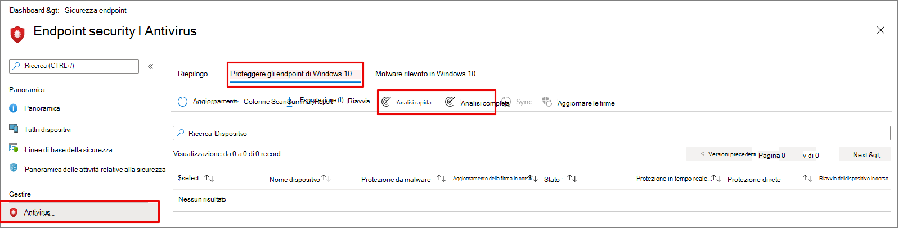

# <a name="configure-and-run-on-demand-microsoft-defender-antivirus-scans"></a><span data-ttu-id="76430-104">Configurare ed eseguire analisi di Microsoft Defender Antivirus su richiesta</span><span class="sxs-lookup"><span data-stu-id="76430-104">Configure and run on-demand Microsoft Defender Antivirus scans</span></span>

<span data-ttu-id="76430-105">**Si applica a:**</span><span class="sxs-lookup"><span data-stu-id="76430-105">**Applies to:**</span></span>

- [<span data-ttu-id="76430-106">Microsoft Defender per endpoint</span><span class="sxs-lookup"><span data-stu-id="76430-106">Microsoft Defender for Endpoint</span></span>](/microsoft-365/security/defender-endpoint/)

<span data-ttu-id="76430-107">È possibile eseguire un'analisi su richiesta su singoli endpoint.</span><span class="sxs-lookup"><span data-stu-id="76430-107">You can run an on-demand scan on individual endpoints.</span></span> <span data-ttu-id="76430-108">Queste analisi verranno avviate immediatamente ed è possibile definire i parametri per l'analisi, ad esempio la posizione o il tipo.</span><span class="sxs-lookup"><span data-stu-id="76430-108">These scans will start immediately, and you can define parameters for the scan, such as the location or type.</span></span> <span data-ttu-id="76430-109">Quando si esegue un'analisi, è possibile scegliere tra tre tipi: analisi rapida, analisi completa e analisi personalizzata.</span><span class="sxs-lookup"><span data-stu-id="76430-109">When you run a scan, you can choose from among three types: Quick scan, full scan, and custom scan.</span></span> <span data-ttu-id="76430-110">Nella maggior parte dei casi, utilizzare un'analisi rapida.</span><span class="sxs-lookup"><span data-stu-id="76430-110">In most cases, use a quick scan.</span></span> <span data-ttu-id="76430-111">Un'analisi rapida esamina tutti i percorsi in cui potrebbe essere registrato malware per iniziare con il sistema, ad esempio le chiavi del Registro di sistema e le cartelle di avvio Windows note.</span><span class="sxs-lookup"><span data-stu-id="76430-111">A quick scan looks at all the locations where there could be malware registered to start with the system, such as registry keys and known Windows startup folders.</span></span> 

<span data-ttu-id="76430-112">In combinazione con la protezione sempre in tempo reale, che rivede i file quando vengono aperti e chiusi e ogni volta che un utente passa a una cartella, un'analisi rapida consente di fornire una protezione avanzata dal malware che inizia con il malware a livello di sistema e kernel.</span><span class="sxs-lookup"><span data-stu-id="76430-112">Combined with always-on, real-time protection, which reviews files when they are opened and closed, and whenever a user navigates to a folder, a quick scan helps provide strong protection against malware that starts with the system and kernel-level malware.</span></span> <span data-ttu-id="76430-113">Nella maggior parte dei casi, un'analisi rapida è sufficiente ed è l'opzione consigliata per le analisi pianificate o su richiesta.</span><span class="sxs-lookup"><span data-stu-id="76430-113">In most cases, a quick scan is sufficient and is the recommended option for scheduled or on-demand scans.</span></span>  <span data-ttu-id="76430-114">[Ulteriori informazioni sui tipi di analisi](schedule-antivirus-scans.md#quick-scan-full-scan-and-custom-scan).</span><span class="sxs-lookup"><span data-stu-id="76430-114">[Learn more about scan types](schedule-antivirus-scans.md#quick-scan-full-scan-and-custom-scan).</span></span>

> [!IMPORTANT]
> <span data-ttu-id="76430-115">Antivirus Microsoft Defender viene eseguito nel contesto dell'account [LocalSystem](/windows/win32/services/localsystem-account) quando si esegue un'analisi locale.</span><span class="sxs-lookup"><span data-stu-id="76430-115">Microsoft Defender Antivirus runs in the context of the [LocalSystem](/windows/win32/services/localsystem-account) account when performing a local scan.</span></span> <span data-ttu-id="76430-116">Per le analisi di rete, usa il contesto dell'account del dispositivo.</span><span class="sxs-lookup"><span data-stu-id="76430-116">For network scans, it uses the context of the device account.</span></span> <span data-ttu-id="76430-117">Se l'account del dispositivo di dominio non dispone delle autorizzazioni appropriate per accedere alla condivisione, l'analisi non funzionerà.</span><span class="sxs-lookup"><span data-stu-id="76430-117">If the domain device account doesn't have appropriate permissions to access the share, the scan won't work.</span></span> <span data-ttu-id="76430-118">Assicurati che il dispositivo abbia le autorizzazioni per la condivisione di rete di accesso.</span><span class="sxs-lookup"><span data-stu-id="76430-118">Ensure that the device has permissions to the access network share.</span></span>

## <a name="use-microsoft-endpoint-manager-to-run-a-scan"></a><span data-ttu-id="76430-119">Utilizzare Microsoft Endpoint Manager per eseguire un'analisi</span><span class="sxs-lookup"><span data-stu-id="76430-119">Use Microsoft Endpoint Manager to run a scan</span></span>

1. <span data-ttu-id="76430-120">Accedere all'Microsoft Endpoint Manager di amministrazione ( [https://endpoint.microsoft.com](https://endpoint.microsoft.com) ) ed eseguire l'accesso.</span><span class="sxs-lookup"><span data-stu-id="76430-120">Go to the Microsoft Endpoint Manager admin center ([https://endpoint.microsoft.com](https://endpoint.microsoft.com)) and log in.</span></span>

2. <span data-ttu-id="76430-121">Scegliere **Endpoint security**  >  **Antivirus**.</span><span class="sxs-lookup"><span data-stu-id="76430-121">Choose **Endpoint security** > **Antivirus**.</span></span>

3. <span data-ttu-id="76430-122">Nell'elenco di schede selezionare **Windows 10 endpoint non integri.**</span><span class="sxs-lookup"><span data-stu-id="76430-122">In the list of tabs, select **Windows 10 unhealthy endpoints**.</span></span>

4. <span data-ttu-id="76430-123">Nell'elenco delle azioni fornite, selezionare **Analisi rapida** (scelta consigliata) o **Analisi completa.**</span><span class="sxs-lookup"><span data-stu-id="76430-123">From the list of actions provided, select **Quick Scan** (recommended) or **Full Scan**.</span></span>

<span data-ttu-id="76430-124">[](images/mem-antivirus-scan-on-demand.png#lightbox)</span><span class="sxs-lookup"><span data-stu-id="76430-124">[  ](images/mem-antivirus-scan-on-demand.png#lightbox)</span></span>

> [!TIP]
> <span data-ttu-id="76430-125">Per ulteriori informazioni sull'Microsoft Endpoint Manager per eseguire un'analisi, vedere [Antimalware and firewall tasks: How to perform an on-demand scan](/configmgr/protect/deploy-use/endpoint-antimalware-firewall#how-to-perform-an-on-demand-scan-of-computers).</span><span class="sxs-lookup"><span data-stu-id="76430-125">For more information about using Microsoft Endpoint Manager to run a scan, see [Antimalware and firewall tasks: How to perform an on-demand scan](/configmgr/protect/deploy-use/endpoint-antimalware-firewall#how-to-perform-an-on-demand-scan-of-computers).</span></span>

## <a name="use-the-mpcmdrunexe-command-line-utility-to-run-a-scan"></a><span data-ttu-id="76430-126">Utilizzare l'mpcmdrun.exe da riga di comando per eseguire un'analisi</span><span class="sxs-lookup"><span data-stu-id="76430-126">Use the mpcmdrun.exe command-line utility to run a scan</span></span>

<span data-ttu-id="76430-127">Utilizzare il parametro `-scan` seguente:</span><span class="sxs-lookup"><span data-stu-id="76430-127">Use the following `-scan` parameter:</span></span>

```console
mpcmdrun.exe -scan -scantype 1
```

<span data-ttu-id="76430-128">Per ulteriori informazioni su come utilizzare lo strumento e parametri aggiuntivi, tra cui l'avvio di un'analisi completa o la definizione di percorsi, vedere [Use the mpcmdrun.exe commandline tool to configure and manage Antivirus Microsoft Defender](command-line-arguments-microsoft-defender-antivirus.md).</span><span class="sxs-lookup"><span data-stu-id="76430-128">For more information about how to use the tool and additional parameters, including starting a full scan, or defining paths, see [Use the mpcmdrun.exe commandline tool to configure and manage Microsoft Defender Antivirus](command-line-arguments-microsoft-defender-antivirus.md).</span></span>

## <a name="use-microsoft-intune-to-run-a-scan"></a><span data-ttu-id="76430-129">Utilizzare Microsoft Intune per eseguire un'analisi</span><span class="sxs-lookup"><span data-stu-id="76430-129">Use Microsoft Intune to run a scan</span></span>

1. <span data-ttu-id="76430-130">Accedere all'Microsoft Endpoint Manager di amministrazione ( [https://endpoint.microsoft.com](https://endpoint.microsoft.com) ) ed eseguire l'accesso.</span><span class="sxs-lookup"><span data-stu-id="76430-130">Go to the Microsoft Endpoint Manager admin center ([https://endpoint.microsoft.com](https://endpoint.microsoft.com)) and log in.</span></span>

2. <span data-ttu-id="76430-131">Nella barra laterale seleziona **Dispositivi**  >  **tutti i dispositivi** e scegli il dispositivo che vuoi analizzare.</span><span class="sxs-lookup"><span data-stu-id="76430-131">From the sidebar, select **Devices** > **All Devices** and choose the device you want to scan.</span></span>

3. <span data-ttu-id="76430-132">Selezionare **... Altro**.</span><span class="sxs-lookup"><span data-stu-id="76430-132">Select **...More**.</span></span> <span data-ttu-id="76430-133">Nelle opzioni selezionare **Analisi rapida** (scelta consigliata) o Analisi **completa.**</span><span class="sxs-lookup"><span data-stu-id="76430-133">From the options, select **Quick Scan** (recommended) or **Full Scan**.</span></span>

## <a name="use-the-windows-security-app-to-run-a-scan"></a><span data-ttu-id="76430-134">Usare l'app Sicurezza di Windows per eseguire un'analisi</span><span class="sxs-lookup"><span data-stu-id="76430-134">Use the Windows Security app to run a scan</span></span>

<span data-ttu-id="76430-135">Vedi [Eseguire un'analisi nell'app Sicurezza di Windows per](microsoft-defender-security-center-antivirus.md) istruzioni sull'esecuzione di un'analisi su singoli endpoint.</span><span class="sxs-lookup"><span data-stu-id="76430-135">See [Run a scan in the Windows Security app](microsoft-defender-security-center-antivirus.md) for instructions on running a scan on individual endpoints.</span></span>

## <a name="use-powershell-cmdlets-to-run-a-scan"></a><span data-ttu-id="76430-136">Utilizzare i cmdlet di PowerShell per eseguire un'analisi</span><span class="sxs-lookup"><span data-stu-id="76430-136">Use PowerShell cmdlets to run a scan</span></span>

<span data-ttu-id="76430-137">Utilizzare il cmdlet seguente:</span><span class="sxs-lookup"><span data-stu-id="76430-137">Use the following cmdlet:</span></span>

```PowerShell
Start-MpScan
```

<span data-ttu-id="76430-138">Per ulteriori informazioni su come usare PowerShell con Antivirus Microsoft Defender, vedere Utilizzare i cmdlet di [PowerShell](use-powershell-cmdlets-microsoft-defender-antivirus.md) per configurare ed eseguire Antivirus Microsoft Defender [e i cmdlet defender.](/powershell/module/defender/)</span><span class="sxs-lookup"><span data-stu-id="76430-138">For more information on how to use PowerShell with Microsoft Defender Antivirus, see [Use PowerShell cmdlets to configure and run Microsoft Defender Antivirus](use-powershell-cmdlets-microsoft-defender-antivirus.md) and [Defender cmdlets](/powershell/module/defender/).</span></span>

## <a name="use-windows-management-instruction-wmi-to-run-a-scan"></a><span data-ttu-id="76430-139">Utilizzare Windows Management Instruction (WMI) per eseguire un'analisi</span><span class="sxs-lookup"><span data-stu-id="76430-139">Use Windows Management Instruction (WMI) to run a scan</span></span>

<span data-ttu-id="76430-140">Utilizzare il [ **metodo Start**](/previous-versions/windows/desktop/defender/start-msft-mpscan) della **classe MSFT_MpScan.**</span><span class="sxs-lookup"><span data-stu-id="76430-140">Use the [**Start** method](/previous-versions/windows/desktop/defender/start-msft-mpscan) of the **MSFT_MpScan** class.</span></span>

<span data-ttu-id="76430-141">Per altre informazioni sui parametri consentiti, [Windows Defender API WMIv2](/previous-versions/windows/desktop/defender/windows-defender-wmiv2-apis-portal)</span><span class="sxs-lookup"><span data-stu-id="76430-141">For more information about which parameters are allowed, see [Windows Defender WMIv2 APIs](/previous-versions/windows/desktop/defender/windows-defender-wmiv2-apis-portal)</span></span>

