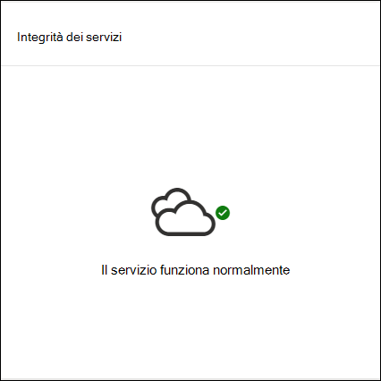

# Dashboard delle operazioni di sicurezza di Microsoft Defender Security Center

[!INCLUDE [Microsoft 365 Defender rebranding](../../includes/microsoft-defender.md)]

**Si applica a:**
- [Microsoft Defender ATP](https://go.microsoft.com/fwlink/?linkid=2154037)

>Vuoi provare Microsoft Defender per Endpoint? [Iscriversi per una versione di valutazione gratuita.](https://www.microsoft.com/microsoft-365/windows/microsoft-defender-atp?ocid=docs-wdatp-secopsdashboard-abovefoldlink) 

Il **dashboard delle operazioni di sicurezza** è il punto in cui vengono escose le funzionalità di rilevamento e risposta degli endpoint. Fornisce una panoramica generale della posizione in cui sono stati osservati i rilevamenti ed evidenzia i casi in cui sono necessarie azioni di risposta. 

Il dashboard visualizza uno snapshot di:

- Avvisi attivi
- Dispositivi a rischio
- Integrità del sensore
- Integrità dei servizi
- Report giornalieri sui dispositivi
- Indagini automatizzate attive
- Statistiche sulle indagini automatizzate
- Utenti a rischio
- Attività sospette

Puoi esplorare e analizzare gli avvisi e i dispositivi per determinare rapidamente se, dove e quando si sono verificate attività sospette nella rete per comprendere il contesto in cui sono apparsi.

Dal **dashboard Operazioni di sicurezza** vengono visualizzati eventi aggregati per facilitare l'identificazione di eventi o comportamenti significativi in un dispositivo. È inoltre possibile eseguire il drill-down in eventi granulari e indicatori di basso livello.

Sono inoltre disponibili riquadri selezionabili che forniscono segnali visivi sullo stato di integrità generale dell'organizzazione. Ogni riquadro apre una visualizzazione dettagliata della panoramica corrispondente.

## Avvisi attivi
Puoi visualizzare il numero complessivo di avvisi attivi degli ultimi 30 giorni nella rete dal riquadro. Gli avvisi sono raggruppati in **Nuovo** **e In corso.**

Ogni gruppo viene ulteriormente categorizzato nei livelli di gravità degli avvisi corrispondenti. Fare clic sul numero di avvisi all'interno di ogni anello di avviso per visualizzare una visualizzazione ordinata della coda della categoria (**Nuovo** o **In corso**).

Per ulteriori informazioni, vedere [Panoramica degli avvisi.](alerts-queue.md)

Ogni riga include una categoria di gravità dell'avviso e una breve descrizione dell'avviso. È possibile fare clic su un avviso per visualizzarne la visualizzazione dettagliata. Per altre informazioni, vedi Panoramica degli avvisi e degli avvisi [di Microsoft Defender for Endpoint.](investigate-alerts.md)

## Dispositivi a rischio
Questo riquadro mostra un elenco di dispositivi con il maggior numero di avvisi attivi. Il numero totale di avvisi per ogni dispositivo viene visualizzato in un cerchio accanto al nome del dispositivo e quindi ulteriormente categorizzato in base ai livelli di gravità all'estremità finale del riquadro (passare il mouse su ogni barra di gravità per visualizzare l'etichetta).

Fai clic sul nome del dispositivo per visualizzare i dettagli su tale dispositivo. Per altre informazioni, vedi [Analizzare i dispositivi nell'elenco Microsoft Defender per dispositivi endpoint.](investigate-machines.md)

Puoi anche fare clic **su Elenco** dispositivi nella parte superiore del riquadro per passare direttamente all'elenco **Dispositivi,** ordinato in base al numero di avvisi attivi. Per altre informazioni, vedi [Analizzare i dispositivi nell'elenco Microsoft Defender per dispositivi endpoint.](investigate-machines.md)

## Dispositivi con problemi di sensore
Il **riquadro Dispositivi con problemi del** sensore fornisce informazioni sulla capacità del singolo dispositivo di fornire dati del sensore al servizio Microsoft Defender for Endpoint. Segnala il numero di dispositivi che richiedono attenzione e ti aiuta a identificare i dispositivi problematici.

Esistono due indicatori di stato che forniscono informazioni sul numero di dispositivi che non segnalano correttamente al servizio:
- **Configurazione errata:** questi dispositivi potrebbero segnalare parzialmente i dati del sensore al servizio Microsoft Defender for Endpoint e potrebbero avere errori di configurazione che devono essere corretti.
- **Inattivo:** dispositivi che hanno interrotto la segnalazione al servizio Microsoft Defender for Endpoint per più di sette giorni nell'ultimo mese.

Quando fai clic su uno dei gruppi, sarai indirizzato all'elenco dei dispositivi, filtrato in base alla tua scelta. Per altre informazioni, vedi [Controllare lo stato del sensore](check-sensor-status.md) e Analizzare i [dispositivi.](investigate-machines.md)

## Integrità dei servizi
Il **riquadro Integrità** servizio informa l'utente se il servizio è attivo o se si verificano problemi.

Per altre informazioni sull'integrità del servizio, vedi [Controllare l'integrità del](service-status.md)servizio Endpoint in Microsoft Defender.

## Report giornalieri sui dispositivi
Il **riquadro Report dispositivi giornalieri** mostra un grafico a barre che rappresenta il numero di dispositivi che segnalano ogni giorno negli ultimi 30 giorni. Posizionare il puntatore del mouse sulle singole barre del grafico per visualizzare il numero esatto di report dei dispositivi in ogni giorno.

## Indagini automatizzate attive
Puoi visualizzare il numero complessivo di indagini automatizzate degli ultimi 30 giorni nella rete dal riquadro **Indagini automatizzate** attive. Le indagini sono raggruppate in **Azione in sospeso,** **In attesa del dispositivo** e In **esecuzione.**

## Statistiche sulle indagini automatizzate
Questo riquadro mostra le statistiche relative alle indagini automatizzate negli ultimi sette giorni. Mostra il numero di indagini completate, il numero di indagini correttive, il tempo medio in sospeso necessario per l'avvio di un'indagine, il tempo medio necessario per correggere un avviso, il numero di avvisi esaminati e il numero di ore di automazione salvate da un'indagine manuale tipica. 

È possibile fare clic **su** Indagini automatizzate,  Indagini correttive e  Avvisi esaminati per passare alla pagina Indagini, filtrata in base alla categoria appropriata.  In questo modo è possibile visualizzare una suddivisione dettagliata delle indagini nel contesto.

## Utenti a rischio
Il riquadro mostra un elenco di account utente con gli avvisi più attivi e il numero di avvisi visualizzati in avvisi alti, medi o bassi. 

Fare clic sull'account utente per visualizzare i dettagli sull'account utente. Per ulteriori informazioni, vedere [Investigate a user account](investigate-user.md).

>Vuoi provare Microsoft Defender per Endpoint? [Iscriversi per una versione di valutazione gratuita.](https://www.microsoft.com/microsoft-365/windows/microsoft-defender-atp?ocid=docs-wdatp-secopsdashboard-belowfoldlink)

## Argomenti correlati
- [Informazioni sul portale di Microsoft Defender for Endpoint](use.md)
- [Panoramica del portale](portal-overview.md)
- [Visualizzare il dashboard di gestione delle & delle minacce](tvm-dashboard-insights.md)
- [Visualizzare il dashboard di analisi delle minacce ed eseguire le azioni di mitigazione consigliate](threat-analytics.md)
