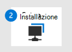

# Eseguire la migrazione da Symantec - Fase 3: onboard a Microsoft Defender per EndpointMigrate from Symantec - Phase 3: Onboard to Microsoft Defender for Endpoint

**Si applica a:****Applies to:**
- [Microsoft Defender per endpointMicrosoft Defender for Endpoint](https://go.microsoft.com/fwlink/p/?linkid=2154037)
- [Microsoft 365 DefenderMicrosoft 365 Defender](https://go.microsoft.com/fwlink/?linkid=2118804)

| [Fase 1: preparazionePhase 1: Prepare](symantec-to-microsoft-defender-atp-prepare.md) | [Fase 2: configurazionePhase 2: Set up](symantec-to-microsoft-defender-atp-setup.md) | Fase 3: onboardingPhase 3: Onboard |
|--|--|--|
|| |*Sei qui!**You are here!* |

**Benvenuti nella fase 3 della [migrazione da Symantec a Microsoft Defender per Endpoint.](symantec-to-microsoft-defender-endpoint-migration.md#the-migration-process)****Welcome to Phase 3 of [migrating from Symantec to Microsoft Defender for Endpoint](symantec-to-microsoft-defender-endpoint-migration.md#the-migration-process)**. Questa fase di migrazione include i passaggi seguenti:This migration phase includes the following steps:

1. [Onboard dei dispositivi a Microsoft Defender for Endpoint](#onboard-devices-to-microsoft-defender-for-endpoint).[Onboard devices to Microsoft Defender for Endpoint](#onboard-devices-to-microsoft-defender-for-endpoint).

2. [Eseguire un test di rilevamento](#run-a-detection-test).[Run a detection test](#run-a-detection-test).

3. [Verificare che Antivirus Microsoft Defender sia in modalità passiva negli endpoint](#confirm-that-microsoft-defender-antivirus-is-in-passive-mode-on-your-endpoints).[Confirm that Microsoft Defender Antivirus is in passive mode on your endpoints](#confirm-that-microsoft-defender-antivirus-is-in-passive-mode-on-your-endpoints).

4. [Ottenere gli aggiornamenti per Antivirus Microsoft Defender](#get-updates-for-microsoft-defender-antivirus).[Get updates for Microsoft Defender Antivirus](#get-updates-for-microsoft-defender-antivirus).

5. [Disinstallare Symantec](#uninstall-symantec).[Uninstall Symantec](#uninstall-symantec).

6. [Assicurati che Microsoft Defender for Endpoint funzioni correttamente.](#make-sure-microsoft-defender-for-endpoint-is-working-correctly)[Make sure Microsoft Defender for Endpoint is working correctly](#make-sure-microsoft-defender-for-endpoint-is-working-correctly).

## Aggiungere dispositivi a Microsoft Defender for EndpointOnboard devices to Microsoft Defender for Endpoint

1. Vai al Microsoft Defender Security Center ( [https://aka.ms/MDATPportal](https://aka.ms/MDATPportal) ) e accedi.Go to the Microsoft Defender Security Center ([https://aka.ms/MDATPportal](https://aka.ms/MDATPportal)) and sign in.

2. Scegliere **Impostazioni**  >    >  **Onboarding di Gestione dispositivi**.Choose **Settings** > **Device management** > **Onboarding**. 

3. **Nell'elenco Selezionare il sistema operativo per avviare il processo di onboarding** selezionare un sistema operativo.In the **Select operating system to start onboarding process** list, select an operating system. 

4. In **Metodo di distribuzione** selezionare un'opzione.Under **Deployment method**, select an option. Segui i collegamenti e le istruzioni per eseguire l'onboardboard dei dispositivi dell'organizzazione.Follow the links and prompts to onboard your organization's devices. Hai bisogno di assistenza?Need help? Vedere [Metodi di onboarding](#onboarding-methods) (in questo articolo).See [Onboarding methods](#onboarding-methods) (in this article).

### Metodi di onboardingOnboarding methods
 
I metodi di distribuzione variano a seconda del sistema operativo selezionato.Deployment methods vary, depending on which operating system is selected. Per informazioni sull'onboarding, fare riferimento alle risorse elencate nella tabella seguente.Refer to the resources listed in the table below to get help with onboarding.

|Sistema operativoOperating system  |MetodoMethod  |
|---------|---------|
|Windows 10Windows 10     | [Criteri di gruppoGroup Policy](configure-endpoints-gp.md)
[Configuration ManagerConfiguration Manager](configure-endpoints-sccm.md)
[Gestione dei dispositivi mobili (Intune)Mobile Device Management (Intune)](configure-endpoints-mdm.md)
[Script localeLocal script](configure-endpoints-script.md)  **NOTA:** uno script locale è adatto per un modello di prova, ma non deve essere utilizzato per la distribuzione di produzione.**NOTE**: A local script is suitable for a proof of concept but should not be used for production deployment. Per una distribuzione di produzione, è consigliabile usare Criteri di gruppo, Microsoft Endpoint Configuration Manager o Intune.For a production deployment, we recommend using Group Policy, Microsoft Endpoint Configuration Manager, or Intune.         |
| Windows 8.1 EnterpriseWindows 8.1 Enterprise 
Windows 8.1 ProWindows 8.1 Pro 
Windows 7 SP1 EnterpriseWindows 7 SP1 Enterprise
Windows 7 SP1 ProWindows 7 SP1 Pro     | [Microsoft Monitoring AgentMicrosoft Monitoring Agent](onboard-downlevel.md#install-and-configure-microsoft-monitoring-agent-mma-to-report-sensor-data-to-microsoft-defender-for-endpoint) **NOTA:** Microsoft Monitoring Agent è ora l'agente di Azure Log Analytics.**NOTE**: Microsoft Monitoring Agent is now Azure Log Analytics agent. Per ulteriori informazioni, vedere [Panoramica dell'agente di log analytics.](/azure/azure-monitor/platform/log-analytics-agent)To learn more, see [Log Analytics agent overview](/azure/azure-monitor/platform/log-analytics-agent).        |
| Windows Server 2019 e versioni successiveWindows Server 2019 and later 
Windows Server 2019 Core EditionWindows Server 2019 core edition
Windows Server versione 1803 e successiveWindows Server version 1803 and later | [Script localeLocal script](configure-endpoints-script.md)
[Criteri di gruppoGroup Policy](configure-endpoints-gp.md)
[Configuration ManagerConfiguration Manager](configure-endpoints-sccm.md)
[System Center Configuration ManagerSystem Center Configuration Manager](configure-endpoints-sccm.md#onboard-devices-using-system-center-configuration-manager)
[Script di onboarding VDI per dispositivi non persistentiVDI onboarding scripts for non-persistent devices](configure-endpoints-vdi.md)  **NOTA:** uno script locale è adatto per un modello di prova, ma non deve essere utilizzato per la distribuzione di produzione.**NOTE**: A local script is suitable for a proof of concept but should not be used for production deployment. Per una distribuzione di produzione, è consigliabile usare Criteri di gruppo, Microsoft Endpoint Configuration Manager o Intune.For a production deployment, we recommend using Group Policy, Microsoft Endpoint Configuration Manager, or Intune.    |
| Windows Server 2016Windows Server 2016
Windows Server 2012 R2Windows Server 2012 R2
Windows Server 2008 R2 SP1Windows Server 2008 R2 SP1  | [Microsoft Defender Security CenterMicrosoft Defender Security Center](configure-server-endpoints.md)
[Azure DefenderAzure Defender](/azure/security-center/security-center-wdatp) |
|macOSmacOS
11.3.1 (Big Sur)11.3.1 (Big Sur) 
10.15 (Catalina)10.15 (Catalina)
10.14 (Mojave)10.14 (Mojave) |[Aggiungere dispositivi non WindowsOnboard non-Windows devices](configure-endpoints-non-windows.md)  |
|iOSiOS |[Aggiungere dispositivi non WindowsOnboard non-Windows devices](configure-endpoints-non-windows.md)  |
|Linux:Linux:
RHEL 7.2+RHEL 7.2+
CentOS Linux 7.2+CentOS Linux 7.2+
Ubuntu 16 LTS o superioreUbuntu 16 LTS, or higher LTS
SLES 12+SLES 12+
Debian 9+Debian 9+
Oracle Linux 7.2Oracle Linux 7.2 |[Aggiungere dispositivi non WindowsOnboard non-Windows devices](configure-endpoints-non-windows.md)  |

## Eseguire un test di rilevamentoRun a detection test

Per verificare che i dispositivi onboarded siano connessi correttamente a Microsoft Defender for Endpoint, puoi eseguire un test di rilevamento.To verify that your onboarded devices are properly connected to Microsoft Defender for Endpoint, you can run a detection test.

|Sistema operativoOperating system  |Linee guidaGuidance  |
|---------|---------|
| Windows 10Windows 10
Windows Server 2019Windows Server 2019
Windows Server, versione 1803Windows Server, version 1803
Windows Server 2016Windows Server 2016
Windows Server 2012 R2Windows Server 2012 R2     |Vedere [Eseguire un test di rilevamento](run-detection-test.md).See [Run a detection test](run-detection-test.md). 
Visita il sito degli scenari demo di Microsoft Defender for Endpoint ( ) e [https://demo.wd.microsoft.com](https://demo.wd.microsoft.com) prova uno o più degli scenari.Visit the Microsoft Defender for Endpoint demo scenarios site ([https://demo.wd.microsoft.com](https://demo.wd.microsoft.com)) and try one or more of the scenarios. Ad esempio, provare lo **scenario demo di protezione fornito dal** cloud.For example, try the **Cloud-delivered protection** demo scenario.         |
|macOS:macOS:
11.3.1 (Big Sur)11.3.1 (Big Sur)
10.15 (Catalina)10.15 (Catalina)
10.14 (Mojave)10.14 (Mojave)     |Scarica e usa l'app FAI-da-to-app all'indirizzo [https://aka.ms/mdatpmacosdiy](https://aka.ms/mdatpmacosdiy) .Download and use the DIY app at [https://aka.ms/mdatpmacosdiy](https://aka.ms/mdatpmacosdiy). 
Per altre informazioni, vedi [Microsoft Defender per Endpoint su macOS.](microsoft-defender-endpoint-mac.md)For more information, see [Microsoft Defender for Endpoint on macOS](microsoft-defender-endpoint-mac.md).        |
|Linux:Linux:
RHEL 7.2+RHEL 7.2+
CentOS Linux 7.2+CentOS Linux 7.2+
Ubuntu 16 LTS o superioreUbuntu 16 LTS, or higher LTS
SLES 12+SLES 12+
Debian 9+Debian 9+
Oracle Linux 7.2Oracle Linux 7.2 |1. Eseguire il comando seguente e cercare il risultato **1**:1. Run the following command, and look for a result of **1**:  `mdatp health --field real_time_protection_enabled`.`mdatp health --field real_time_protection_enabled`. 
2. Aprire una finestra del terminale ed eseguire il comando seguente:2. Open a Terminal window, and run the following command:  `curl -o ~/Downloads/eicar.com.txt https://www.eicar.org/download/eicar.com.txt`.`curl -o ~/Downloads/eicar.com.txt https://www.eicar.org/download/eicar.com.txt`. 
3. Eseguire il comando seguente per elencare eventuali minacce rilevate:3. Run the following command to list any detected threats:  `mdatp threat list`.`mdatp threat list`. 
Per altre informazioni, vedi [Microsoft Defender per Endpoint su Linux.](microsoft-defender-endpoint-linux.md)For more information, see [Microsoft Defender for Endpoint on Linux](microsoft-defender-endpoint-linux.md). |

## Verificare che Antivirus Microsoft Defender sia in modalità passiva negli endpointConfirm that Microsoft Defender Antivirus is in passive mode on your endpoints

Ora che gli endpoint sono stati onboarded in Defender for Endpoint, il passaggio successivo consiste nel verificare che Antivirus Microsoft Defender sia in esecuzione in modalità passiva.Now that your endpoints have been onboarded to Defender for Endpoint, your next step is to make sure Microsoft Defender Antivirus is running in passive mode. È possibile utilizzare il prompt dei comandi o PowerShell per eseguire questa attività, come descritto nella tabella seguente:You can use either Command Prompt or PowerShell to perform this task, as described in the following table:

| MetodoMethod    | SoluzioneWhat to do |
|:--|:--|
| Prompt dei comandiCommand Prompt    | 1. In un dispositivo Windows, aprire prompt dei comandi come amministratore.1. On a Windows device, open Command Prompt as an administrator. 
2. Digitare `sc query windefend` e quindi premere INVIO.2. Type `sc query windefend`, and then press Enter. 
3. Esaminare i risultati per verificare che Antivirus Microsoft Defender in esecuzione in modalità passiva.3. Review the results to confirm that Microsoft Defender Antivirus is running in passive mode. |
|PowerShellPowerShell | 1. In un dispositivo Windows, aprire Windows PowerShell come amministratore.1. On a Windows device, open Windows PowerShell as an administrator. 
2. Eseguire il `Get-MpComputerStatus` cmdlet.2. Run the `Get-MpComputerStatus` cmdlet. 
3. Nell'elenco dei risultati, cercare **AMRunningMode: Modalità** passiva o **AMRunningMode: modalità passiva SxS.**3. In the list of results, look for either **AMRunningMode: Passive Mode** or **AMRunningMode: SxS Passive Mode**. |

> [!NOTE]
> Potrebbe essere visualizzato Windows Defender Antivirus anziché Antivirus Microsoft Defender in alcune versioni di Windows.You might see Windows Defender Antivirus instead of Microsoft Defender Antivirus in some versions of Windows.

### Impostare Antivirus Microsoft Defender su Windows Server per la modalità passiva manualmenteSet Microsoft Defender Antivirus on Windows Server to passive mode manually

Per impostare Antivirus Microsoft Defender modalità passiva in Windows Server, versione 1803 o successiva o Windows Server 2019, attenersi alla seguente procedura:To set Microsoft Defender Antivirus to passive mode on Windows Server, version 1803 or newer, or Windows Server 2019, follow these steps:

1. Aprire l'editor del Registro di sistema e quindi passare a `Computer\HKEY_LOCAL_MACHINE\SOFTWARE\Policies\Microsoft\Windows Advanced Threat Protection` .Open Registry Editor, and then navigate to `Computer\HKEY_LOCAL_MACHINE\SOFTWARE\Policies\Microsoft\Windows Advanced Threat Protection`.

2. Modificare (o creare) una voce DWORD denominata **ForcePassiveMode** e specificare le impostazioni seguenti:Edit (or create) a DWORD entry called **ForcePassiveMode**, and specify the following settings:

   - Imposta il valore DWORD su 1.Set the DWORD's value to 1.
   - In Base selezionare Esadecimale.Under Base, select Hexadecimal.

> [!NOTE]
> È possibile utilizzare altri metodi per impostare la chiave del Registro di sistema, ad esempio:You can use other methods to set the registry key, such as the following:
> - Preferenza di Criteri di gruppoGroup Policy Preference
> - Strumento Oggetto Criteri di gruppo localeLocal Group Policy Object tool
> - Un pacchetto in Configuration ManagerA package in Configuration Manager

### Avviare Antivirus Microsoft Defender su Windows Server 2016Start Microsoft Defender Antivirus on Windows Server 2016

Se si utilizza Windows Server 2016, potrebbe essere necessario avviare manualmente Antivirus Microsoft Defender computer.If you are using Windows Server 2016, you might have to start Microsoft Defender Antivirus manually. A tale scopo, è possibile utilizzare il cmdlet PowerShell `mpcmdrun.exe -wdenable` nel dispositivo.You can do this by using the PowerShell cmdlet `mpcmdrun.exe -wdenable` on the device.

## Ottenere gli aggiornamenti per Antivirus Microsoft DefenderGet updates for Microsoft Defender Antivirus

Mantenere Antivirus Microsoft Defender aggiornato è fondamentale per garantire ai dispositivi le tecnologie e le funzionalità più recenti necessarie per la protezione da nuove tecniche di malware e attacchi, anche se Antivirus Microsoft Defender è in esecuzione in modalità passiva.Keeping Microsoft Defender Antivirus up to date is critical to assure your devices have the latest technology and features needed to protect against new malware and attack techniques, even if Microsoft Defender Antivirus is running in passive mode.

Esistono due tipi di aggiornamenti correlati alla Antivirus Microsoft Defender aggiornati:There are two types of updates related to keeping Microsoft Defender Antivirus up to date:

- Aggiornamenti delle funzionalità di intelligence per la sicurezzaSecurity intelligence updates
- Aggiornamenti dei prodottiProduct updates

Per ottenere gli aggiornamenti, seguire le indicazioni in Gestire Antivirus Microsoft Defender [aggiornamenti e applicare le linee di base.](manage-updates-baselines-microsoft-defender-antivirus.md)To get your updates, follow the guidance in [Manage Microsoft Defender Antivirus updates and apply baselines](manage-updates-baselines-microsoft-defender-antivirus.md).

## Disinstallare SymantecUninstall Symantec

Dopo aver installato i dispositivi dell'organizzazione in Microsoft Defender for Endpoint, il passaggio successivo consiste nel disinstallare Symantec.Now that you have onboarded your organization's devices to Microsoft Defender for Endpoint, your next step is to uninstall Symantec.

1. [Disabilitare protezione manomissione](https://knowledge.broadcom.com/external/article?legacyId=tech192023) in Symantec.[Disable Tamper Protection](https://knowledge.broadcom.com/external/article?legacyId=tech192023) in Symantec.

2. Eliminare la password di disinstallazione per Symantec:Delete the uninstall password for Symantec: 

   1. Nei dispositivi Windows, aprire l'editor del Registro di sistema come amministratore.On your Windows devices, open Registry Editor as an administrator.

   2. Passare a `HKEY_LOCAL_MACHINE\SOFTWARE\Symantec\Symantec Endpoint Protection\SMC`.Go to `HKEY_LOCAL_MACHINE\SOFTWARE\Symantec\Symantec Endpoint Protection\SMC`.

   3. Cercare una voce denominata **SmcInstData**.Look for an entry named **SmcInstData**. 

   4. Fare clic con il pulsante destro del mouse sull'elemento e quindi scegliere **Elimina.**Right-click the item, and then choose **Delete**. 

3. Rimuovi Symantec dai dispositivi.Remove Symantec from your devices. Per assistenza, vedere la documentazione di Broadcom.If you need help with this, see Broadcom's documentation. Ecco alcune risorse Broadcom:Here are a few Broadcom resources: 

   - [Disinstallare Symantec Endpoint ProtectionUninstall Symantec Endpoint Protection](https://knowledge.broadcom.com/external/article/156148/uninstall-symantec-endpoint-protection.html)

   - Windows dispositivi: [disinstallare manualmente Endpoint Protection 14 client in Windows](https://knowledge.broadcom.com/external/article?articleId=170040)Windows devices: [Manually uninstall Endpoint Protection 14 clients on Windows](https://knowledge.broadcom.com/external/article?articleId=170040)
   
   - computer macOS: [rimuovere il software Symantec per Mac usando RemoveSymantecMacFiles](https://knowledge.broadcom.com/external/article?articleId=151387)macOS computers: [Remove Symantec software for Mac using RemoveSymantecMacFiles](https://knowledge.broadcom.com/external/article?articleId=151387)
   
   - Dispositivi Linux: [domande frequenti per Endpoint Protection su Linux](https://knowledge.broadcom.com/external/article?articleId=162054)Linux devices: [Frequently Asked Questions for Endpoint Protection on Linux](https://knowledge.broadcom.com/external/article?articleId=162054)

## Verificare che Microsoft Defender for Endpoint funzioni correttamenteMake sure Microsoft Defender for Endpoint is working correctly

Dopo aver disinstallato Symantec, il passaggio successivo consiste nel verificare che Defender for Endpoint funzioni correttamente.Now that you have uninstalled Symantec, your next step is to make sure that Defender for Endpoint is working correctly. Visitare il sito degli scenari demo di Microsoft Defender for Endpoint ( [https://demo.wd.microsoft.com](https://demo.wd.microsoft.com) ).Visit the Microsoft Defender for Endpoint demo scenarios site ([https://demo.wd.microsoft.com](https://demo.wd.microsoft.com)). Prova uno o più degli scenari dimostrativi in tale pagina, inclusi almeno gli scenari seguenti:Try one or more of the demo scenarios on that page, including at least the following:
- Protezione fornita dal cloudCloud-delivered protection
- Applicazioni potenzialmente indesideratePotentially Unwanted Applications (PUA)
- Protezione di reteNetwork Protection (NP)

## Passaggi successiviNext steps

**Congratulazioni**!**Congratulations**! La migrazione da [Symantec](symantec-to-microsoft-defender-endpoint-migration.md#the-migration-process)a Microsoft Defender for Endpoint è stata completata.You have completed your [migration from Symantec to Microsoft Defender for Endpoint](symantec-to-microsoft-defender-endpoint-migration.md#the-migration-process)! 
- [Visitare il dashboard delle operazioni](security-operations-dashboard.md) di sicurezza nella Microsoft Defender Security Center ( [https://aka.ms/MDATPportal](https://aka.ms/MDATPportal) ).[Visit your security operations dashboard](security-operations-dashboard.md) in the Microsoft Defender Security Center ([https://aka.ms/MDATPportal](https://aka.ms/MDATPportal)). 
- [Gestire Microsoft Defender per Endpoint, dopo la migrazione.](manage-atp-post-migration.md)[Manage Microsoft Defender for Endpoint, post migration](manage-atp-post-migration.md).
