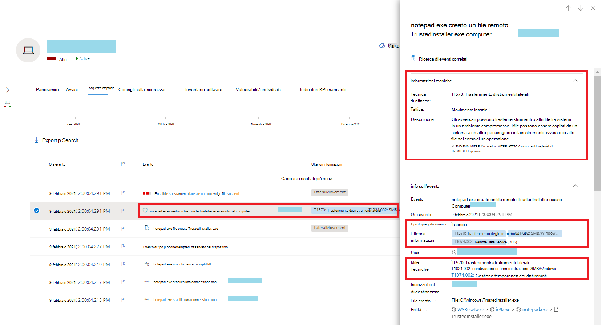
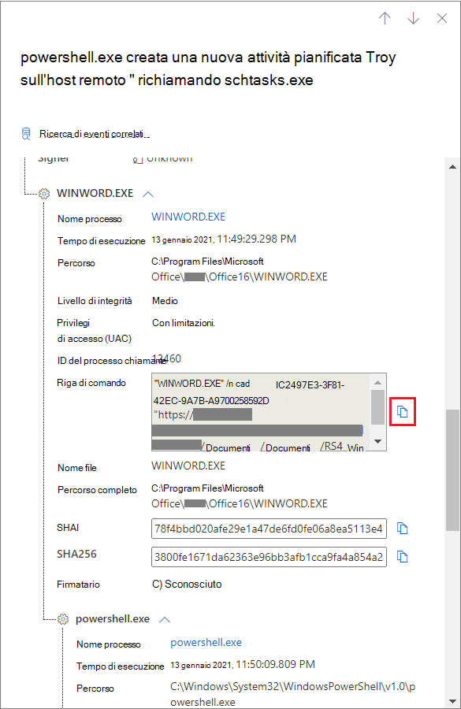
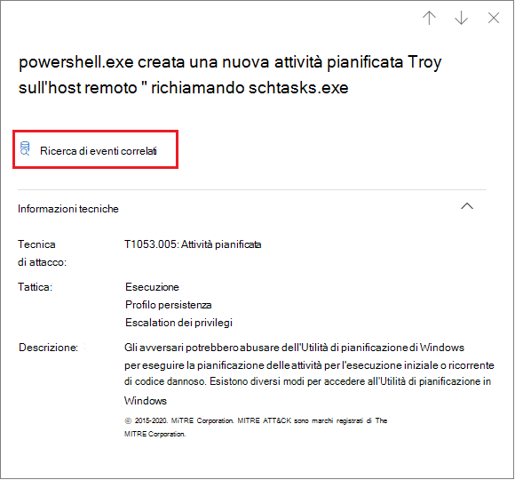
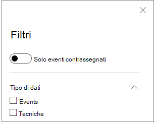

# Tecniche nella sequenza temporale del dispositivo

**Si applica a:**
- [Microsoft Defender per endpoint](https://go.microsoft.com/fwlink/p/?linkid=2154037)

Puoi ottenere maggiori informazioni in un'indagine analizzando gli eventi che si sono verificati in un dispositivo specifico. Prima di tutto, seleziona il dispositivo di interesse [nell'elenco Dispositivi](machines-view-overview.md). Nella pagina del dispositivo puoi selezionare la scheda **Sequenza** temporale per visualizzare tutti gli eventi che si sono verificati nel dispositivo.

## Comprendere le tecniche nella sequenza temporale

>[!IMPORTANT]
>Alcune informazioni riguardano una funzionalità di prodotto pre-rilasciata in anteprima pubblica che potrebbe essere sostanzialmente modificata prima che venga rilasciata commercialmente. Microsoft non fornisce alcuna garanzia, esplicita o implicita, in relazione alle informazioni contenute in questo documento.

In Microsoft Defender per **Endpoint, le tecniche sono** un tipo di dati aggiuntivo nella sequenza temporale dell'evento. Le tecniche forniscono maggiori informazioni sulle attività associate a [MITRE ATT&tecniche CK](https://attack.mitre.org/) o sub-tecniche. 

Questa funzionalità semplifica l'esperienza di indagine aiutando gli analisti a comprendere le attività osservate in un dispositivo. Gli analisti possono quindi decidere di approfondire le indagini.

Per l'anteprima pubblica, le tecniche sono disponibili per impostazione predefinita e vengono visualizzate insieme agli eventi quando viene visualizzata la sequenza temporale di un dispositivo. 

Le tecniche sono evidenziate in grassetto e vengono visualizzate con un'icona blu a sinistra. Il nome della tecnica e l'ID CK&MITRE ATT corrispondenti vengono visualizzati anche come tag in Informazioni aggiuntive. 

Le opzioni di ricerca ed esportazione sono disponibili anche per Tecniche.

## Analizzare usando il riquadro laterale

Selezionare una tecnica per aprire il riquadro laterale corrispondente. Qui puoi visualizzare ulteriori informazioni e informazioni dettagliate, ad esempio tecniche, tattiche e descrizioni ATT correlate&CK. 

Seleziona la tecnica *di attacco* specifica per aprire la pagina relativa alla tecnica ATT&CK in cui puoi trovare ulteriori informazioni su di essa.

È possibile copiare i dettagli di un'entità quando viene visualizzata un'icona blu a destra. Ad esempio, per copiare sha1 di un file correlato, selezionare l'icona pagina blu.

È possibile eseguire la stessa operazione per le righe di comando.

## Analizzare gli eventi correlati

Per utilizzare [la ricerca avanzata](advanced-hunting-overview.md) per trovare gli eventi correlati alla tecnica selezionata, selezionare Cerca eventi **correlati.** In questo modo viene visualizzata la pagina di ricerca avanzata con una query per trovare gli eventi correlati alla tecnica.

>[!NOTE]
>L'esecuzione  di query tramite il pulsante Cerca eventi correlati da un riquadro laterale Tecnica visualizza tutti gli eventi correlati alla tecnica identificata, ma non include la tecnica stessa nei risultati della query.

## Personalizzare la sequenza temporale del dispositivo

Nella parte superiore destra della sequenza temporale del dispositivo puoi scegliere un intervallo di date per limitare il numero di eventi e tecniche nella sequenza temporale. 

È possibile personalizzare le colonne da esporre. È inoltre possibile filtrare gli eventi contrassegnati in base al tipo di dati o al gruppo di eventi.

### Scegliere le colonne da esporre
Puoi scegliere le colonne da esporre nella sequenza temporale selezionando il **pulsante Scegli** colonne.

Da qui è possibile selezionare il set di informazioni da includere.

### Filtrare per visualizzare solo tecniche o eventi

Per visualizzare solo gli eventi o le tecniche, seleziona **Filtri** dalla sequenza temporale del dispositivo e scegli il tipo di dati preferito da visualizzare.

## Vedere anche
- [Visualizzare e organizzare l’elenco dispositivi](machines-view-overview.md)
- [Flag di evento della sequenza temporale del dispositivo Microsoft Defender for Endpoint](device-timeline-event-flag.md) 

 
