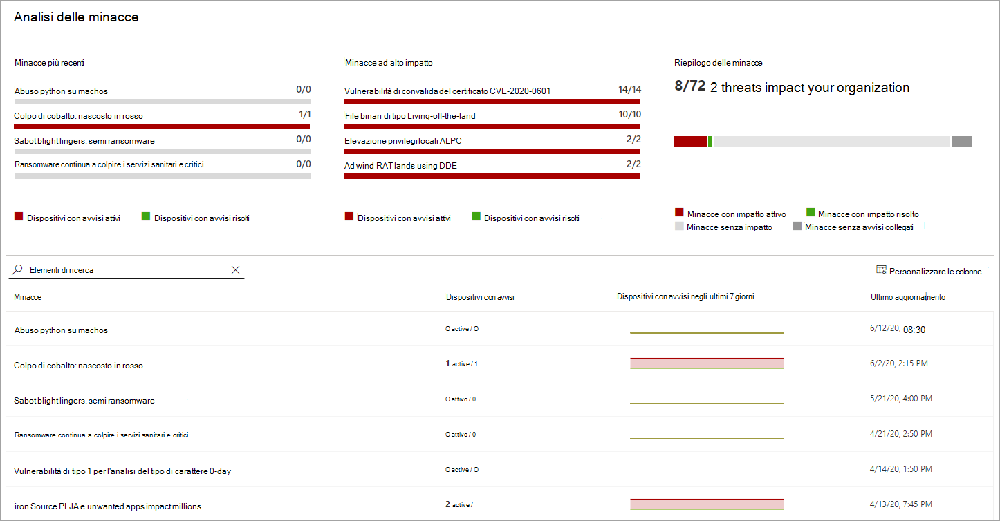
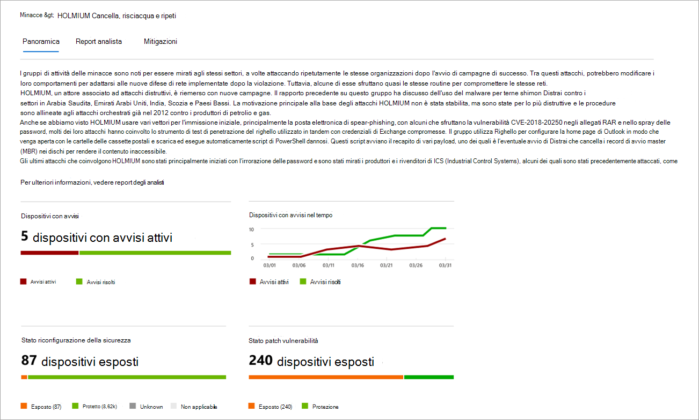
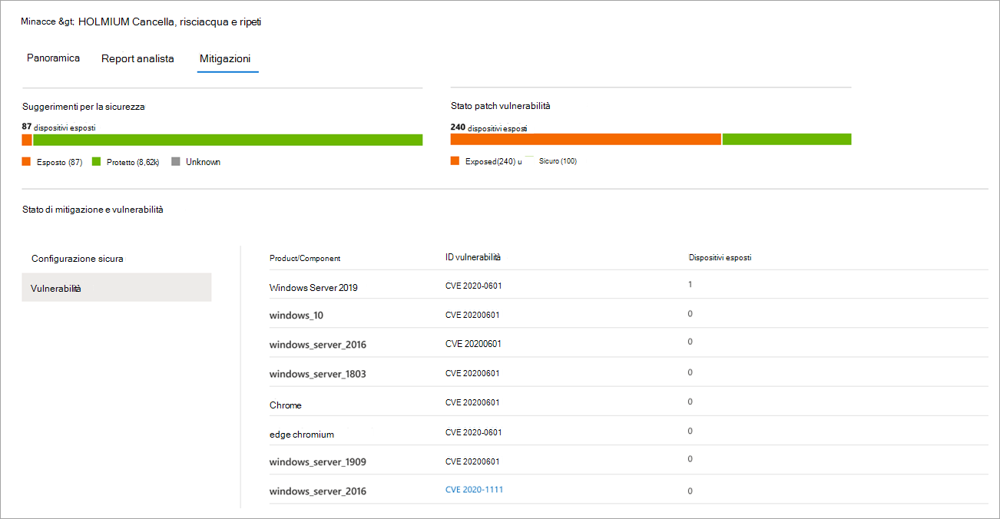

# Tenere traccia e rispondere alle minacce emergenti con l'analisi delle minacce 

[!INCLUDE [Microsoft 365 Defender rebranding](../../includes/microsoft-defender.md)]

**Si applica a:**
- [Microsoft Defender per endpoint](https://go.microsoft.com/fwlink/?linkid=2154037)
- [Microsoft 365 Defender](https://go.microsoft.com/fwlink/?linkid=2118804)

> Vuoi provare Microsoft Defender per Endpoint? [Iscriversi per una versione di valutazione gratuita.](https://www.microsoft.com/microsoft-365/windows/microsoft-defender-atp?ocid=docs-wdatp-exposedapis-abovefoldlink)

Con gli avversari più sofisticati e le nuove minacce che emergono spesso e prevalentemente, è fondamentale essere in grado di:

- Valutare l'impatto delle nuove minacce
- Esaminare la resilienza o l'esposizione alle minacce
- Identificare le azioni che è possibile eseguire per arrestare o contenere le minacce

L'analisi delle minacce è una serie di report di esperti ricercatori di sicurezza Microsoft che coprono le minacce più rilevanti, tra cui:

- Attori delle minacce attive e le loro campagne
- Tecniche di attacco popolari e nuove
- Vulnerabilità critiche
- Superfici di attacco comuni
- Malware diffuso

Ogni report fornisce un'analisi dettagliata di una minaccia e indicazioni dettagliate su come difendersi da tale minaccia. Incorpora inoltre i dati della rete, che indicano se la minaccia è attiva e se sono presenti protezioni applicabili.

Guarda questo breve video per saperne di più su come l'analisi delle minacce può aiutarti a tenere traccia delle minacce più recenti e a fermarle.

> [!VIDEO https://www.microsoft.com/en-us/videoplayer/embed/RE4bw1f]

## Visualizzare il dashboard di analisi delle minacce

Il dashboard di analisi delle minacce è un ottimo punto di partenza per accedere ai report più rilevanti per l'organizzazione. Riepiloga le minacce nelle sezioni seguenti:

- **Minacce più** recenti: elenca i report sulle minacce pubblicati più di recente, insieme al numero di dispositivi con avvisi attivi e risolti.
- **Minacce ad alto impatto:** elenca le minacce che hanno avuto il massimo impatto sull'organizzazione. Questa sezione classifica le minacce in base al numero di dispositivi con avvisi attivi.
- **Riepilogo delle** minacce: mostra l'impatto complessivo delle minacce rilevate mostrando il numero di minacce con avvisi attivi e risolti.

Selezionare una minaccia dal dashboard per visualizzare il report per tale minaccia.

## Visualizzare un report di analisi delle minacce

Ogni report di analisi delle minacce fornisce informazioni in tre sezioni: **Panoramica,** **Report analista** e **Mitigazioni.**

### Panoramica: comprendere rapidamente la minaccia, valutarne l'impatto ed esaminare le difese

La **sezione Panoramica** offre un'anteprima del report dettagliato degli analisti. Fornisce inoltre grafici che evidenziano l'impatto della minaccia per l'organizzazione e l'esposizione tramite dispositivi non configurati correttamente e senzapatch.

 _Sezione Panoramica di un report di analisi delle minacce_

#### Valutare l'impatto sull'organizzazione
Ogni report include grafici progettati per fornire informazioni sull'impatto organizzativo di una minaccia:
- **Dispositivi con avvisi:** mostra il numero corrente di dispositivi distinti che sono stati influenzati dalla minaccia. Un dispositivo viene classificato come **Attivo** se alla minaccia è associato  almeno un avviso e **Risolto** se tutti gli avvisi associati alla minaccia nel dispositivo sono stati risolti.
- **Dispositivi con avvisi nel tempo:** mostra il numero di dispositivi distinti con **avvisi attivi** **e** risolti nel tempo. Il numero di avvisi risolti indica la velocità con cui l'organizzazione risponde agli avvisi associati a una minaccia. Idealmente, il grafico dovrebbe mostrare gli avvisi risolti entro pochi giorni.

#### Esaminare la resilienza e la postura della sicurezza
Ogni report include grafici che forniscono una panoramica della resilienza dell'organizzazione rispetto a una determinata minaccia:
- **Stato della configurazione della** sicurezza: mostra il numero di dispositivi che hanno applicato le impostazioni di sicurezza consigliate che possono contribuire a ridurre la minaccia. I dispositivi sono **considerati sicuri** se hanno applicato _tutte_ le impostazioni rilevate.
- **Stato applicazione di patch** alle vulnerabilità: mostra il numero di dispositivi che hanno applicato aggiornamenti della sicurezza o patch che affrontano le vulnerabilità sfruttate dalla minaccia.

### Report degli analisti: ottenere informazioni approfondite dai ricercatori di sicurezza Microsoft
Vai alla sezione **Report analista** per leggere la dettagliata scrittura di esperti. La maggior parte dei report fornisce descrizioni dettagliate delle catene di attacco, tra cui tattiche e tecniche mappate al framework CK di MITRE ATT&, elenchi esaustivi di suggerimenti e potenti indicazioni per la ricerca di [minacce.](advanced-hunting-overview.md)

[Ulteriori informazioni sul report degli analisti](threat-analytics-analyst-reports.md)

### Mitigazioni: esaminare l'elenco delle mitigazioni e lo stato dei dispositivi
Nella sezione **Mitigazioni** esaminare l'elenco di suggerimenti specifici che consentono di aumentare la resilienza dell'organizzazione contro la minaccia. L'elenco delle mitigazioni rilevate include:

- **Aggiornamenti della sicurezza:** distribuzione di aggiornamenti della sicurezza o patch per le vulnerabilità
- **Impostazioni di Microsoft Defender Antivirus**
  - Versione di Security Intelligence
  - Protezione basata sul cloud  
  - Protezione delle applicazioni potenzialmente indesiderate
  - Protezione in tempo reale
 
Le informazioni di mitigazione contenute in questa sezione incorporano i dati della gestione delle minacce e delle [vulnerabilità,](next-gen-threat-and-vuln-mgt.md)che forniscono inoltre informazioni dettagliate di drill-down da vari collegamenti nel report.

 _Sezione Mitigazioni di un report di analisi delle minacce_

## Ulteriori dettagli e limitazioni del report
Quando si utilizzano i report, tenere presente quanto segue: 

- L'ambito dei dati è basato sull'ambito RBAC (Role-Based Access Control). Verrà visualizzato lo stato dei dispositivi in [gruppi a cui è possibile accedere.](machine-groups.md)
- I grafici riflettono solo le mitigazioni rilevate. Controllare la panoramica del report per ulteriori mitigazioni che non vengono visualizzate nei grafici.
- Le mitigazioni non garantiscono resilienza completa. Le mitigazioni fornite riflettono le migliori azioni possibili necessarie per migliorare la resilienza.
- I dispositivi vengono conteggiati come "non disponibili" se non hanno trasmesso dati al servizio.
- Le statistiche relative all'antivirus si basano sulle impostazioni di Microsoft Defender Antivirus. I dispositivi con soluzioni antivirus di terze parti possono apparire come "esposti".

## Argomenti correlati
- [Trovare in modo proattivo le minacce con la ricerca avanzata](advanced-hunting-overview.md) 
- [Informazioni sulla sezione relativa al report degli analisti](threat-analytics-analyst-reports.md)
- [Valutare e risolvere i punti deboli e le esposizioni della sicurezza](next-gen-threat-and-vuln-mgt.md)