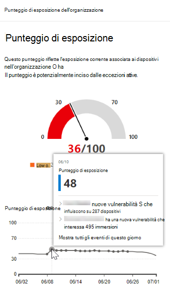
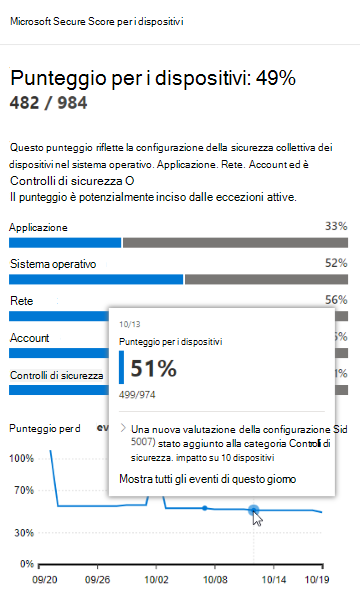
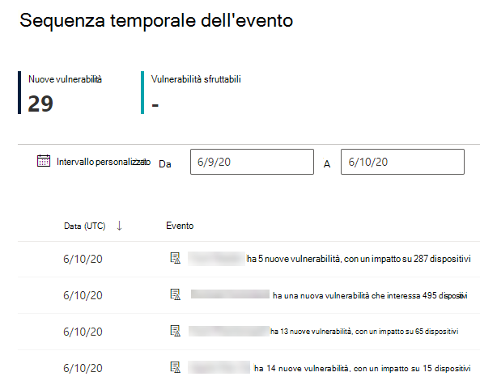
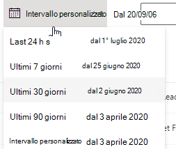
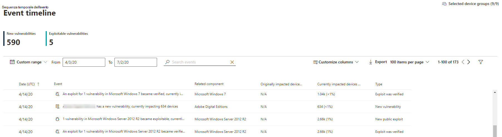
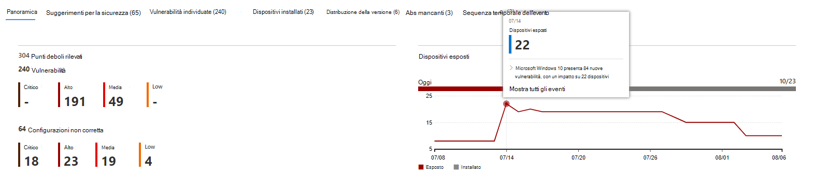

# Sequenza temporale degli eventi - Gestione delle minacce e delle vulnerabilitàEvent timeline - threat and vulnerability management

[!INCLUDE [Microsoft 365 Defender rebranding](../../includes/microsoft-defender.md)]

**Si applica a:****Applies to:**
- [Microsoft Defender per endpointMicrosoft Defender for Endpoint](https://go.microsoft.com/fwlink/?linkid=2154037)
- [Microsoft 365 DefenderMicrosoft 365 Defender](https://go.microsoft.com/fwlink/?linkid=2118804)

>Vuoi provare Microsoft Defender per Endpoint?Want to experience Microsoft Defender for Endpoint? [Iscriversi per una versione di valutazione gratuita.Sign up for a free trial.](https://www.microsoft.com/microsoft-365/windows/microsoft-defender-atp?ocid=docs-wdatp-portaloverview-abovefoldlink)

La sequenza temporale degli eventi è un feed di notizie sui rischi che consente di interpretare il modo in cui i rischi vengono introdotti nell'organizzazione attraverso nuove vulnerabilità o exploit.Event timeline is a risk news feed that helps you interpret how risk is introduced into the organization through new vulnerabilities or exploits. È possibile visualizzare gli eventi che possono influire sui rischi dell'organizzazione.You can view events that may impact your organization's risk. Ad esempio, è possibile trovare nuove vulnerabilità introdotte, vulnerabilità che sono diventate sfruttabili, exploit che è stato aggiunto a un exploit kit e altro ancora.For example, you can find new vulnerabilities that were introduced, vulnerabilities that became exploitable, exploit that was added to an exploit kit, and more.

La sequenza temporale dell'evento illustra anche la storia del punteggio di esposizione e [del punteggio microsoft sicuro](tvm-microsoft-secure-score-devices.md) per i dispositivi, in modo da poter determinare la causa di modifiche di grandi dimensioni. Event timeline also tells the story of your [exposure score](tvm-exposure-score.md) and [Microsoft Secure Score for Devices](tvm-microsoft-secure-score-devices.md) so you can determine the cause of large changes. Gli eventi possono influire sui dispositivi o sul punteggio per i dispositivi.Events can impact your devices or your score for devices. Riduci l'esposizione affrontando gli elementi da correggere in base alle raccomandazioni sulla [sicurezza con priorità.](tvm-security-recommendation.md)Reduce you exposure by addressing what needs to be remediated based on the prioritized [security recommendations](tvm-security-recommendation.md).

>[!TIP]
>Per ricevere messaggi di posta elettronica sui nuovi eventi di vulnerabilità, vedere Configurare le notifiche di posta elettronica relative alla vulnerabilità [in Microsoft Defender for Endpoint](configure-vulnerability-email-notifications.md)To get emails about new vulnerability events, see [Configure vulnerability email notifications in Microsoft Defender for Endpoint](configure-vulnerability-email-notifications.md)

## Passare alla pagina Sequenza temporale eventiNavigate to the Event timeline page

Esistono anche tre punti di ingresso dal dashboard di gestione delle [minacce e delle vulnerabilità:](tvm-dashboard-insights.md)There are also three entry points from the [threat and vulnerability management dashboard](tvm-dashboard-insights.md):

- **Scheda punteggio di esposizione** dell'organizzazione : passa il mouse sui punti dell'evento nel grafico "Punteggio di esposizione nel tempo" e seleziona "Vedi tutti gli eventi di questo giorno".**Organization exposure score card**: Hover over the event dots in the "Exposure Score over time" graph and select "See all events from this day." Gli eventi rappresentano vulnerabilità software.The events represent software vulnerabilities.
- **Microsoft Secure Score for Devices**: passa il mouse sui punti dell'evento nel grafico "Il punteggio per i dispositivi nel tempo" e seleziona "Vedi tutti gli eventi di questo giorno".**Microsoft Secure Score for Devices**: Hover over the event dots in the "Your score for devices over time" graph and select "See all events from this day." Gli eventi rappresentano nuove valutazioni della configurazione.The events represent new configuration assessments.
- **Scheda Eventi principali:** seleziona "Mostra altro" nella parte inferiore della tabella degli eventi principali.**Top events card**: Select "Show more" at the bottom of the top events table. La scheda visualizza i tre eventi più importanti degli ultimi 7 giorni.The card displays the three most impactful events in the last 7 days. Gli eventi di impatto possono includere se l'evento interessa un numero elevato di dispositivi o se si tratta di una vulnerabilità critica.Impactful events can include if the event affects a large number of devices, or if it is a critical vulnerability.

### Punteggio di esposizione e Microsoft Secure Score per i dispositivi graficiExposure score and Microsoft Secure Score for Devices graphs

Nel dashboard di gestione delle minacce e delle vulnerabilità passa il puntatore del mouse sul grafico del punteggio di esposizione per visualizzare i principali eventi di vulnerabilità software di quel giorno che hanno interessato i dispositivi.In the threat and vulnerability management dashboard, hover over the Exposure score graph to view top software vulnerability events from that day that impacted your devices. Passa il puntatore del mouse sul grafico Microsoft Secure Score for Devices per visualizzare le nuove valutazioni della configurazione della sicurezza che influiscono sul punteggio.Hover over the Microsoft Secure Score for Devices graph to view new security configuration assessments that affect your score.

Se non sono presenti eventi che influiscono sui dispositivi o sul punteggio per i dispositivi, non verrà visualizzato alcun evento.If there are no events that affect your devices or your score for devices, then none will be shown.

 
  

### Drill-down per gli eventi di quel giornoDrill down to events from that day

Selezionando **Mostra tutti gli eventi di questo giorno,** si visualizza la pagina Sequenza temporale eventi con un intervallo di date personalizzato per quel giorno.Selecting **Show all events from this day** takes you to the Event timeline page with a custom date range for that day.

Selezionare **Intervallo personalizzato** per modificare l'intervallo di date in un altro intervallo personalizzato o in un intervallo di tempo pre-impostato.Select **Custom range** to change the date range to another custom one, or a pre-set time range.

## Panoramica della sequenza temporale degli eventiEvent timeline overview

Nella pagina Sequenza temporale evento puoi visualizzare tutte le informazioni necessarie relative a un evento.On the Event timeline page, you can view the all the necessary info related to an event. 

Caratteristiche:Features:

- Personalizzare le colonneCustomize columns
- Filtrare in base al tipo di evento o alla percentuale dei dispositivi a cui è stato applicato l'impattoFilter by event type or percent of impacted devices
- Visualizzare 30, 50 o 100 elementi per paginaView 30, 50, or 100 items per page

I due numeri grandi nella parte superiore della pagina mostrano il numero di nuove vulnerabilità e vulnerabilità sfruttabili, non eventi.The two large numbers at the top of the page show the number of new vulnerabilities and exploitable vulnerabilities, not events. Alcuni eventi possono avere più vulnerabilità e altre possono avere più eventi.Some events can have multiple vulnerabilities, and some vulnerabilities can have multiple events.

### ColonneColumns

- **Data**: mese, giorno, anno**Date**: month, day, year
- **Evento:** evento di impatto, inclusi componenti, tipo e numero di dispositivi influenzati**Event**: impactful event, including component, type, and number of impacted devices
- **Componente correlato**: software**Related component**: software
- **Dispositivi originariamente influenzati:** il numero e la percentuale dei dispositivi a cui si è verificato l'evento in origine.**Originally impacted devices**: the number, and percentage, of impacted devices when this event originally occurred. Puoi anche filtrare in base alla percentuale di dispositivi originariamente influenzati, in base al numero totale di dispositivi.You can also filter by the percent of originally impacted devices, out of your total number of devices.
- **Dispositivi attualmente influenzati:** il numero corrente e la percentuale di dispositivi attualmente influenzati da questo evento.**Currently impacted devices**: the current number, and percentage, of devices that this event currently impacts. È possibile trovare questo campo selezionando **Personalizza colonne.**You can find this field by selecting **Customize columns**.
- **Tipi**: riflettono gli eventi con timestamp che influiscono sul punteggio.**Types**: reflect time-stamped events that impact the score. Possono essere filtrati.They can be filtered.
    - Exploit aggiunto a un exploit kitExploit added to an exploit kit
    - Exploit verificatoExploit was verified
    - Nuovo exploit pubblicoNew public exploit
    - Nuova vulnerabilitàNew vulnerability
    - Nuova valutazione della configurazioneNew configuration assessment
- **Tendenza del punteggio**: tendenza del punteggio di esposizione**Score trend**: exposure score trend

### IconeIcons

Accanto agli eventi vengono visualizzate le icone seguenti:The following icons show up next to events:

-  Nuovo exploit pubblicoNew public exploit
-  È stata pubblicata una nuova vulnerabilitàNew vulnerability was published
-  Exploit trovato in exploit kitExploit found in exploit kit
-  Exploit verificatoExploit verified

### Eseguire il drill-down a un evento specificoDrill down to a specific event

Dopo aver selezionato un evento, verrà visualizzato un riquadro a comparsa con un elenco dei dettagli e dei CVE correnti che interessano i dispositivi.Once you select an event, a flyout will appear with a list of the details and current CVEs that affect your devices. È possibile visualizzare più CVE o visualizzare il suggerimento correlato.You can show more CVEs or view the related recommendation.

La freccia sotto "tendenza del punteggio" consente di determinare se questo evento ha generato o abbassato il punteggio di esposizione dell'organizzazione.The arrow below "score trend" helps you determine whether this event potentially raised or lowered your organizational exposure score. Un punteggio di esposizione più elevato indica che i dispositivi sono più vulnerabili allo sfruttamento.Higher exposure score means devices are more vulnerable to exploitation.

Da qui, selezionare **Vai a suggerimenti** sulla sicurezza correlati visualizzare il suggerimento che risolve la nuova vulnerabilità software nella pagina suggerimenti per la [sicurezza.](tvm-security-recommendation.md)From there, select **Go to related security recommendation** view the recommendation that addresses the new software vulnerability in the [security recommendations page](tvm-security-recommendation.md). Dopo aver letto la descrizione e i dettagli della vulnerabilità nel suggerimento per la sicurezza, è possibile inviare una richiesta di correzione e tenere traccia della richiesta nella pagina [di correzione.](tvm-remediation.md)After reading the description and vulnerability details in the security recommendation, you can submit a remediation request, and track the request in the [remediation page](tvm-remediation.md).  

## Visualizzazione delle sequenze temporali degli eventi nelle pagine softwareView Event timelines in software pages

Per aprire una pagina software, seleziona un evento > seleziona il nome del software con collegamento ipertestuale (ad esempio Visual Studio 2017) nella sezione denominata "Componente correlato" nel riquadro a comparsa.To open a software page, select an event > select the hyperlinked software name (like Visual Studio 2017) in the section called "Related component" in the flyout. [Altre informazioni sulle pagine softwareLearn more about software pages](tvm-software-inventory.md#software-pages)

Verrà visualizzata una pagina intera con tutti i dettagli di un software specifico.A full page will appear with all the details of a specific software. Passa il mouse sul grafico per visualizzare la sequenza temporale degli eventi per quel software specifico.Mouse over the graph to see the timeline of events for that specific software.

Passare alla scheda sequenza temporale dell'evento per visualizzare tutti gli eventi correlati a tale software.Navigate to the event timeline tab to view all the events related to that software. Puoi anche visualizzare consigli sulla sicurezza, vulnerabilità individuate, dispositivi installati e distribuzione delle versioni.You can also see security recommendations, discovered vulnerabilities, installed devices, and version distribution.

## Argomenti correlatiRelated topics

- [Panoramica della gestione delle minacce e delle vulnerabilitàThreat and vulnerability management overview](next-gen-threat-and-vuln-mgt.md)
- [DashboardDashboard](tvm-dashboard-insights.md)
- [Punteggio di esposizione.Exposure score](tvm-exposure-score.md)
- [Consigli sulla sicurezzaSecurity recommendations](tvm-security-recommendation.md)
- [Correggere le vulnerabilitàRemediate vulnerabilities](tvm-remediation.md)
- [Inventario softwareSoftware inventory](tvm-software-inventory.md)

