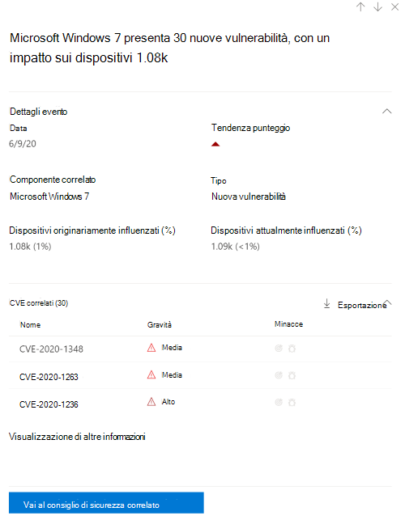

# Sequenza temporale evento - gestione di minacce e vulnerabilità

[!INCLUDE [Microsoft 365 Defender rebranding](../../includes/microsoft-defender.md)]

**Si applica a:**
- [Microsoft Defender per endpoint](https://go.microsoft.com/fwlink/?linkid=2154037)
- [Microsoft 365 Defender](https://go.microsoft.com/fwlink/?linkid=2118804)

>Vuoi provare Microsoft Defender per Endpoint? [Iscriversi per una versione di valutazione gratuita.](https://www.microsoft.com/microsoft-365/windows/microsoft-defender-atp?ocid=docs-wdatp-portaloverview-abovefoldlink)

La sequenza temporale degli eventi è un feed di notizie sui rischi che consente di interpretare il modo in cui i rischi vengono introdotti nell'organizzazione attraverso nuove vulnerabilità o exploit. È possibile visualizzare gli eventi che possono influire sui rischi dell'organizzazione. Ad esempio, è possibile trovare nuove vulnerabilità introdotte, vulnerabilità che sono diventate sfruttabili, exploit che è stato aggiunto a un exploit kit e altro ancora.

La sequenza temporale dell'evento illustra anche la storia del punteggio di esposizione e [del punteggio microsoft sicuro](tvm-microsoft-secure-score-devices.md) per i dispositivi, in modo da poter determinare la causa di modifiche di grandi dimensioni.  Gli eventi possono influire sui dispositivi o sul punteggio per i dispositivi. Riduci l'esposizione affrontando gli elementi da correggere in base alle raccomandazioni sulla [sicurezza con priorità.](tvm-security-recommendation.md)

>[!TIP]
>Per ricevere messaggi di posta elettronica sui nuovi eventi di vulnerabilità, vedere Configurare le notifiche di posta elettronica relative alla vulnerabilità [in Microsoft Defender for Endpoint](configure-vulnerability-email-notifications.md)

## Passare alla pagina Sequenza temporale eventi

Ci sono anche tre punti di ingresso dal [dashboard gestione di minacce e vulnerabilità:](tvm-dashboard-insights.md)

- **Scheda punteggio di esposizione** dell'organizzazione : passa il mouse sui punti dell'evento nel grafico "Punteggio di esposizione nel tempo" e seleziona "Vedi tutti gli eventi di questo giorno". Gli eventi rappresentano vulnerabilità software.
- **Microsoft Secure Score for Devices**: passa il mouse sui punti dell'evento nel grafico "Il punteggio per i dispositivi nel tempo" e seleziona "Vedi tutti gli eventi di questo giorno". Gli eventi rappresentano nuove valutazioni della configurazione.
- **Scheda Eventi principali:** seleziona "Mostra altro" nella parte inferiore della tabella degli eventi principali. La scheda visualizza i tre eventi più importanti degli ultimi 7 giorni. Gli eventi di impatto possono includere se l'evento interessa un numero elevato di dispositivi o se si tratta di una vulnerabilità critica.

### Punteggio di esposizione e Microsoft Secure Score per i dispositivi grafici

Nel dashboard gestione di minacce e vulnerabilità, posizionare il puntatore del mouse sul grafico del punteggio di esposizione per visualizzare gli eventi di vulnerabilità software principali di quel giorno che hanno interessato i dispositivi. Passa il puntatore del mouse sul grafico Microsoft Secure Score for Devices per visualizzare le nuove valutazioni della configurazione della sicurezza che influiscono sul punteggio.

Se non sono presenti eventi che influiscono sui dispositivi o sul punteggio per i dispositivi, non verrà visualizzato alcun evento.

 
 

### Drill-down per gli eventi di quel giorno

Selezionando **Mostra tutti gli eventi di questo giorno,** si visualizza la pagina Sequenza temporale eventi con un intervallo di date personalizzato per quel giorno.

Selezionare **Intervallo personalizzato** per modificare l'intervallo di date in un altro intervallo personalizzato o in un intervallo di tempo pre-impostato.

## Panoramica della sequenza temporale degli eventi

Nella pagina Sequenza temporale evento puoi visualizzare tutte le informazioni necessarie relative a un evento. 

Caratteristiche:

- Personalizzare le colonne
- Filtrare in base al tipo di evento o alla percentuale dei dispositivi a cui è stato applicato l'impatto
- Visualizzare 30, 50 o 100 elementi per pagina

I due numeri grandi nella parte superiore della pagina mostrano il numero di nuove vulnerabilità e vulnerabilità sfruttabili, non eventi. Alcuni eventi possono avere più vulnerabilità e altre possono avere più eventi.

### Colonne

- **Data**: mese, giorno, anno
- **Evento:** evento di impatto, inclusi componenti, tipo e numero di dispositivi influenzati
- **Componente correlato**: software
- **Dispositivi originariamente influenzati:** il numero e la percentuale dei dispositivi a cui si è verificato l'evento in origine. Puoi anche filtrare in base alla percentuale di dispositivi originariamente influenzati, in base al numero totale di dispositivi.
- **Dispositivi attualmente influenzati:** il numero corrente e la percentuale di dispositivi attualmente influenzati da questo evento. È possibile trovare questo campo selezionando **Personalizza colonne.**
- **Tipi**: riflettono gli eventi con timestamp che influiscono sul punteggio. Possono essere filtrati.
    - Exploit aggiunto a un exploit kit
    - Exploit verificato
    - Nuovo exploit pubblico
    - Nuova vulnerabilità
    - Nuova valutazione della configurazione
- **Tendenza del punteggio**: tendenza del punteggio di esposizione

### Icone

Accanto agli eventi vengono visualizzate le icone seguenti:

-  Nuovo exploit pubblico
-  È stata pubblicata una nuova vulnerabilità
-  Exploit trovato in exploit kit
-  Exploit verificato

### Eseguire il drill-down a un evento specifico

Dopo aver selezionato un evento, verrà visualizzato un riquadro a comparsa con un elenco dei dettagli e dei CVE correnti che interessano i dispositivi. È possibile visualizzare più CVE o visualizzare il suggerimento correlato.

La freccia sotto "tendenza del punteggio" consente di determinare se questo evento ha generato o abbassato il punteggio di esposizione dell'organizzazione. Un punteggio di esposizione più elevato indica che i dispositivi sono più vulnerabili allo sfruttamento.

Da qui, selezionare **Vai a suggerimenti** sulla sicurezza correlati visualizzare il suggerimento che risolve la nuova vulnerabilità software nella pagina suggerimenti per la [sicurezza.](tvm-security-recommendation.md) Dopo aver letto la descrizione e i dettagli della vulnerabilità nel suggerimento per la sicurezza, è possibile inviare una richiesta di correzione e tenere traccia della richiesta nella pagina [di correzione.](tvm-remediation.md)  

## Visualizzazione delle sequenze temporali degli eventi nelle pagine software

Per aprire una pagina software, selezionare un evento > selezionare il nome del software con collegamento ipertestuale (ad esempio Visual Studio 2017) nella sezione denominata "Componente correlato" nel riquadro a comparsa. [Altre informazioni sulle pagine software](tvm-software-inventory.md#software-pages)

Verrà visualizzata una pagina intera con tutti i dettagli di un software specifico. Passa il mouse sul grafico per visualizzare la sequenza temporale degli eventi per quel software specifico.

Passare alla scheda sequenza temporale dell'evento per visualizzare tutti gli eventi correlati a tale software. Puoi anche visualizzare consigli sulla sicurezza, vulnerabilità individuate, dispositivi installati e distribuzione delle versioni.

## Argomenti correlati

- [Panoramica delle minacce gestione delle vulnerabilità sicurezza](next-gen-threat-and-vuln-mgt.md)
- [Dashboard](tvm-dashboard-insights.md)
- [Punteggio di esposizione.](tvm-exposure-score.md)
- [Consigli sulla sicurezza](tvm-security-recommendation.md)
- [Correggere le vulnerabilità](tvm-remediation.md)
- [Inventario software](tvm-software-inventory.md)

