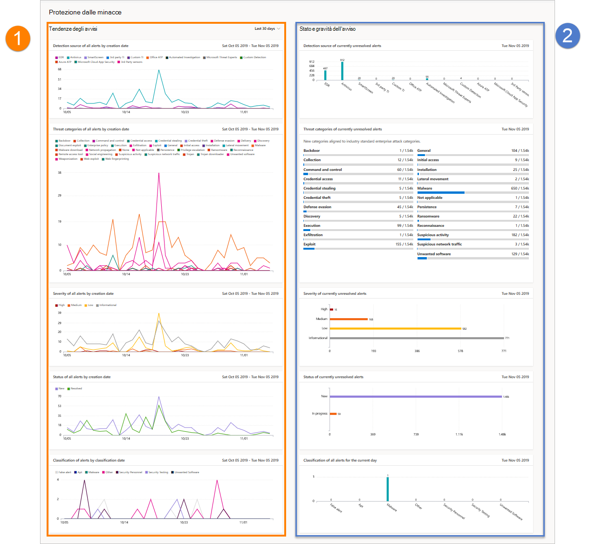

# Report di protezione dalle minacce in Microsoft Defender for EndpointThreat protection report in Microsoft Defender for Endpoint

[!INCLUDE [Microsoft 365 Defender rebranding](../../includes/microsoft-defender.md)]

**Si applica a:****Applies to:**
- [Microsoft Defender per endpointMicrosoft Defender for Endpoint](https://go.microsoft.com/fwlink/p/?linkid=2154037)
- [Microsoft 365 DefenderMicrosoft 365 Defender](https://go.microsoft.com/fwlink/?linkid=2118804)

> Vuoi provare Defender per Endpoint?Want to experience Defender for Endpoint? [Iscriversi per una versione di valutazione gratuita.Sign up for a free trial.](https://www.microsoft.com/microsoft-365/windows/microsoft-defender-atp?ocid=docs-wdatp-pullalerts-abovefoldlink) 

Il report sulla protezione dalle minacce fornisce informazioni di alto livello sugli avvisi generati nell'organizzazione.The threat protection report provides high-level information about alerts generated in your organization. Il report include informazioni sulle tendenze che mostrano le origini di rilevamento, le categorie, le gravità, gli stati, le classificazioni e le determinazioni degli avvisi nel tempo.The report includes trending information showing the detection sources, categories, severities, statuses, classifications, and determinations of alerts across time.

Il dashboard è strutturato in due sezioni:The dashboard is structured into two sections:

SezioneSection | DescrizioneDescription 
:---|:---
11 | Tendenze degli avvisiAlerts trends
2 2 | Riepilogo degli avvisiAlert summary

## Tendenze degli avvisiAlert trends
Per impostazione predefinita, le tendenze degli avvisi visualizzano le informazioni sugli avvisi del periodo di 30 giorni che terminano con l'ultimo giorno completo.By default, the alert trends display alert information from the 30-day period ending in the latest full day. Per ottenere una prospettiva migliore sulle tendenze che si verificano nell'organizzazione, è possibile ottimizzare il periodo di reporting modificando il periodo di tempo visualizzato.To gain better perspective on trends occurring in your organization, you can fine-tune the reporting period by adjusting the time period shown. Per regolare il periodo di tempo, selezionare un intervallo di tempo dalle opzioni a discesa:To adjust the time period, select a time range from the drop-down options:

- 30 giorni30 days
- 3 mesi3 months
- 6 mesi6 months
- PersonalizzatoCustom

>[!NOTE]
>Questi filtri vengono applicati solo nella sezione tendenze degli avvisi.These filters are only applied on the alert trends section. Non influisce sulla sezione di riepilogo degli avvisi.It doesn't affect the alert summary section.

## Riepilogo degli avvisiAlert summary
Mentre le tendenze degli avvisi mostrano informazioni sugli avvisi di tendenza, il riepilogo dell'avviso mostra le informazioni sugli avvisi nell'ambito del giorno corrente.While the alert trends shows trending alert information, the alert summary shows alert information scoped to the current day.

 Il riepilogo degli avvisi consente di eseguire il drill-down in una particolare coda di avvisi a cui è applicato il filtro corrispondente.The alert summary allows you to drill down to a particular alert queue with the corresponding filter applied to it. Ad esempio, facendo clic sulla barra EDR nella scheda Origini di rilevamento verrà visualizzata la coda degli avvisi con i risultati che mostrano solo gli avvisi generati dai rilevamenti EDR.For example, clicking on the EDR bar in the Detection sources card will bring you the alerts queue with results showing only alerts generated from EDR detections. 

>[!NOTE]
>L'ambito dei dati visualizzati nella sezione di riepilogo è 180 giorni prima della data corrente.The data reflected in the summary section is scoped to 180 days prior to the current date. Ad esempio, se la data odierna è il 5 novembre 2019, i dati nella sezione di riepilogo rifletteranno i numeri a partire dal 5 maggio 2019 al 5 novembre 2019.For example if today's date is November 5, 2019, the data on the summary section will reflect numbers starting from May 5, 2019 to November 5, 2019. 
> Il filtro applicato alla sezione tendenze non viene applicato alla sezione di riepilogo.The filter applied on the trends section is not applied on the summary section. 

## Attributi degli avvisiAlert attributes
Il report è costituito da schede che visualizzano gli attributi di avviso seguenti:The report is made up of cards that display the following alert attributes:

- **Origini di** rilevamento: mostra informazioni sui sensori e sulle tecnologie di rilevamento che forniscono i dati utilizzati da Microsoft Defender for Endpoint per attivare gli avvisi.**Detection sources**: shows information about the sensors and detection technologies that provide the data used by Microsoft Defender for Endpoint to trigger alerts.

- **Categorie di minacce**: mostra i tipi di attività di minaccia o di attacco che hanno attivato gli avvisi, indicando le possibili aree di interesse per le operazioni di sicurezza.**Threat categories**: shows the types of threat or attack activity that triggered alerts, indicating possible focus areas for your security operations.

- **Gravità**: mostra il livello di gravità degli avvisi, che indica l'impatto potenziale collettivo delle minacce per l'organizzazione e il livello di risposta necessario per affrontarli.**Severity**: shows the severity level of alerts, indicating the collective potential impact of threats to your organization and the level of response needed to address them.

- **Status**: mostra lo stato di risoluzione degli avvisi, che indica l'efficienza delle risposte agli avvisi manuali e della correzione automatica (se abilitata).**Status**: shows the resolution status of alerts, indicating the efficiency of your manual alert responses and of automated remediation (if enabled). 

- **Classificazione & determinazione**: mostra come sono stati classificati gli avvisi in base alla risoluzione, se sono stati classificati come minacce effettive (avvisi reali) o come rilevamenti non corretti (falsi avvisi).**Classification & determination**: shows how you have classified alerts upon resolution, whether you have classified them as actual threats (true alerts) or as incorrect detections (false alerts). Queste schede mostrano anche la determinazione degli avvisi risolti, fornendo informazioni aggiuntive come i tipi di minacce effettive trovate o le attività legittime rilevate in modo errato.These cards also show the determination of resolved alerts, providing additional insight like the types of actual threats found or the legitimate activities that were incorrectly detected.

 

## Filtrare i datiFilter data

Utilizzare i filtri forniti per includere o escludere avvisi con determinati attributi.Use the provided filters to include or exclude alerts with certain attributes.

>[!NOTE]
>Questi filtri si **applicano a** tutte le schede del report.These filters apply to **all** the cards in the report.

Ad esempio, per visualizzare solo i dati relativi agli avvisi di gravità elevata:For example, to show data about high-severity alerts only:

1. In **Filtri > Gravità** selezionare **Alta**Under **Filters > Severity**, select **High**
2. Assicurati che tutte le altre opzioni in **Gravità** siano deselezionate.Ensure that all other options under **Severity** are deselected.
3. Selezionare **Applica**.Select **Apply**. 

## Argomento correlatoRelated topic
- [Report integrità e conformità dei dispositiviDevice health and compliance report](machine-reports.md)
