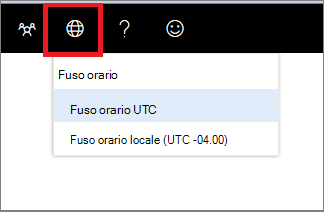

# Impostazioni del fuso orario di Microsoft Defender Security Center

[!INCLUDE [Microsoft 365 Defender rebranding](../../includes/microsoft-defender.md)]

**Si applica a:**
- [Microsoft Defender per endpoint](https://go.microsoft.com/fwlink/p/?linkid=2154037)
- [Microsoft 365 Defender](https://go.microsoft.com/fwlink/?linkid=2118804)

>Vuoi provare Microsoft Defender per Endpoint? [Iscriversi per una versione di valutazione gratuita.](https://www.microsoft.com/microsoft-365/windows/microsoft-defender-atp?ocid=docs-wdatp-settings-abovefoldlink)

Usa il menu **Fuso orario** Impostazioni fuso orario icon1 per configurare il fuso orario e visualizzare le informazioni  licenza.

## Impostazioni fuso orario
L'aspetto del tempo è importante nella valutazione e nell'analisi degli attacchi informatici percepiti ed effettivi.

Le indagini cyberforensiche spesso si basano su indicatori di data e ora per riunire la sequenza di eventi. È importante che il sistema rifletta le impostazioni corrette del fuso orario.

Microsoft Defender for Endpoint può visualizzare l'ora UTC (Coordinated Universal Time) o l'ora locale.

L'impostazione del fuso orario corrente viene visualizzata nel menu Microsoft Defender for Endpoint. È possibile modificare il fuso orario visualizzato nel menu **Fuso** orario.

.

### Fuso orario UTC
Microsoft Defender for Endpoint usa l'ora UTC per impostazione predefinita.

Se si imposta il fuso orario di Microsoft Defender per Endpoint su UTC, verranno visualizzati tutti i timestamp di sistema (avvisi, eventi e altri) in formato UTC per tutti gli utenti. Questo può aiutare gli analisti della sicurezza che lavorano in diverse località in tutto il mondo a usare gli stessi indicatori di data e ora durante l'analisi degli eventi.

### Fuso orario locale
Puoi scegliere di fare in modo che Microsoft Defender for Endpoint usi le impostazioni del fuso orario locale. Tutti gli avvisi e gli eventi verranno visualizzati utilizzando il fuso orario locale.

Il fuso orario locale viene preso dalle impostazioni internazionali del dispositivo. Se si modificano le impostazioni internazionali, verrà modificato anche il fuso orario di Microsoft Defender for Endpoint. Se si sceglie questa impostazione, i timestamp visualizzati in Microsoft Defender for Endpoint verranno allineati all'ora locale per tutti gli utenti di Microsoft Defender for Endpoint. Gli analisti che si trovano in diverse posizioni globali ora visualizzano gli avvisi di Microsoft Defender for Endpoint in base alle impostazioni internazionali.

La scelta di utilizzare l'ora locale può essere utile se gli analisti si trovano in un'unica posizione. In questo caso potrebbe essere più facile correlare gli eventi all'ora locale, ad esempio quando un utente locale fa clic su un collegamento di posta elettronica sospetto.

### Impostare il fuso orario
Il fuso orario di Microsoft Defender for Endpoint è impostato per impostazione predefinita su UTC.
L'impostazione del fuso orario cambia anche gli orari per tutte le visualizzazioni di Microsoft Defender per endpoint.
Per impostare il fuso orario:

1. Fare clic sul menu **Fuso orario** Icona Impostazioni  orario3.
2. Selezionare **l'indicatore UTC fuso orario.**
3. Selezionare **Fuso orario UTC** o il fuso orario locale, ad esempio -7:00.

### Impostazioni internazionali
Per applicare formati di data diversi per Microsoft Defender for Endpoint, usa le impostazioni internazionali per Internet Explorer (IE) e Microsoft Edge (Edge). Se si usa un altro browser, ad esempio Google Chrome, seguire i passaggi necessari per modificare le impostazioni di data e ora per tale browser. 

**Internet Explorer (IE) e Microsoft Edge**

IE e Microsoft Edge usano **le impostazioni area** geografica configurate nell'opzione **Orologi,** lingua e area geografica nel Pannello di controllo. 

#### Problemi noti con i formati regionali

**Formati di data e ora** 
Esistono alcuni problemi noti relativi ai formati di data e ora. Se si configurano le impostazioni internazionali in un formato diverso dai formati supportati, il portale potrebbe non riflettere correttamente le impostazioni.

Sono supportati i formati di data e ora seguenti:
- Formato data MM/gg/aaaa
- Formato data gg/MM/aaaa
- Formato ora hh:mm:ss (formato 12 ore)

I formati di data e ora seguenti non sono attualmente supportati:
- Formato data aaaa-MM-gg
- Formato data d-MMM-aa
- Formato data gg/MM/aa
- Formato data MM/gg/aa
- Formato data con yy. Mostrerà solo aaaa.
- Formato ora HH:mm:ss (formato 24 ore)

**Simbolo decimale utilizzato nei numeri** 
Il simbolo decimale utilizzato è sempre un punto, anche se è selezionata una virgola nelle **impostazioni** formato numeri in **Impostazioni** area geografica. Ad esempio, 15,5K viene visualizzato come 15,5K.

