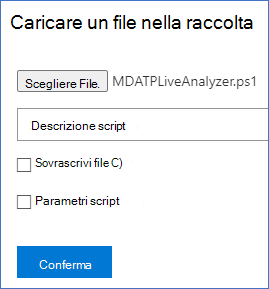
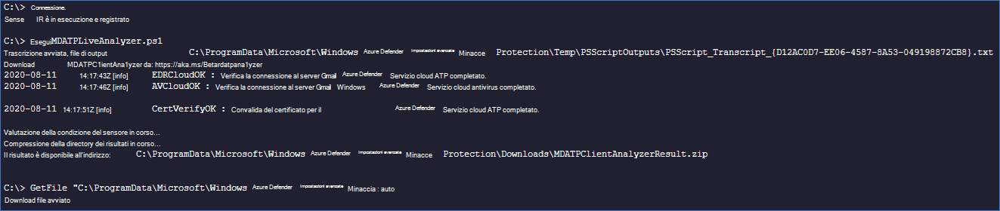

# <a name="collect-support-logs-in-microsoft-defender-for-endpoint-using-live-response"></a>Raccogliere i log di supporto in Microsoft Defender for Endpoint usando la risposta in tempo reale 


**Si applica a:**
- [Microsoft Defender per endpoint](https://go.microsoft.com/fwlink/p/?linkid=2154037)
- [Microsoft 365 Defender](https://go.microsoft.com/fwlink/?linkid=2118804)

> Vuoi provare Defender per Endpoint? [Iscriversi per una versione di valutazione gratuita.](https://www.microsoft.com/microsoft-365/windows/microsoft-defender-atp?ocid=docs-wdatp-pullalerts-abovefoldlink) 


Quando si contatta il supporto, potrebbe essere richiesto di fornire il pacchetto di output dello strumento Microsoft Defender for Endpoint Client Analyzer.

In questo argomento vengono fornite istruzioni su come eseguire lo strumento tramite Live Response.

1. Scaricare lo script appropriato
    * Solo i registri del sensore client di Microsoft Defender per Endpoint: [LiveAnalyzer.ps1 script](https://aka.ms/MDELiveAnalyzer).
      - Dimensioni approssimative del pacchetto dei risultati: ~100Kb 
    *  Microsoft Defender for Endpoint client sensor and Antivirus logs: [LiveAnalyzer+MDAV.ps1 script](https://aka.ms/MDELiveAnalyzerAV).
       - Dimensioni approssimative del pacchetto dei risultati: ~10Mb 
 
2.  Avviare una [sessione di Risposta](live-response.md#initiate-a-live-response-session-on-a-device) in tempo reale nel computer che è necessario analizzare.

3.  Selezionare **Upload file da raccolta.**

    

4. Selezionare **Scegli file**.

    

5. Selezionare il file scaricato denominato MDELiveAnalyzer.ps1 e quindi fare clic su **Conferma**


   


6. Durante la sessione LiveResponse, utilizzare i comandi seguenti per eseguire l'analizzatore e raccogliere il file dei risultati:

    ```console
    Run MDELiveAnalyzer.ps1
    GetFile "C:\ProgramData\Microsoft\Windows Defender Advanced Threat Protection\Downloads\MDEClientAnalyzerResult.zip"
    ```

    [](images/analyzer-commands.png#lightbox)


>[!NOTE]
> - La versione di anteprima più recente di MDEClientAnalyzer può essere scaricata qui: [https://aka.ms/Betamdeanalyzer](https://aka.ms/Betamdeanalyzer) .
> 
> - Lo script LiveAnalyzer scarica il pacchetto di risoluzione dei problemi nel computer di destinazione da: https://mdatpclientanalyzer.blob.core.windows.net .
> 
>   Se non è possibile consentire al computer di raggiungere l'URL precedente, caricare MDEClientAnalyzerPreview.zip file nella raccolta prima di eseguire lo script LiveAnalyzer:
>
>   ```console
>   PutFile MDEClientAnalyzerPreview.zip -overwrite
>   Run MDELiveAnalyzer.ps1
>   GetFile "C:\ProgramData\Microsoft\Windows Defender Advanced Threat Protection\Downloads\MDEClientAnalyzerResult.zip" 
>   ```
> 
> - Per ulteriori informazioni sulla raccolta di dati in locale in un computer nel caso in cui il computer non comunichi con i servizi cloud di Microsoft Defender for Endpoint o non venga visualizzato nel portale di Microsoft Defender per endpoint come previsto, vedere Verificare la connettività client a Microsoft Defender per gli URL del servizio [endpoint.](configure-proxy-internet.md#verify-client-connectivity-to-microsoft-defender-for-endpoint-service-urls)
