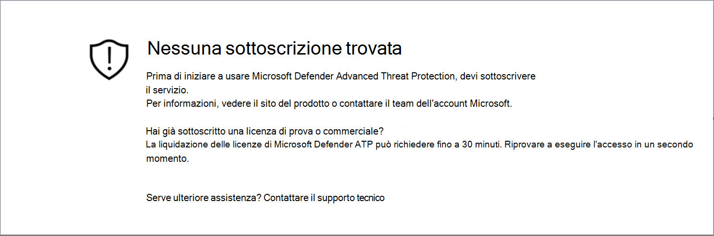
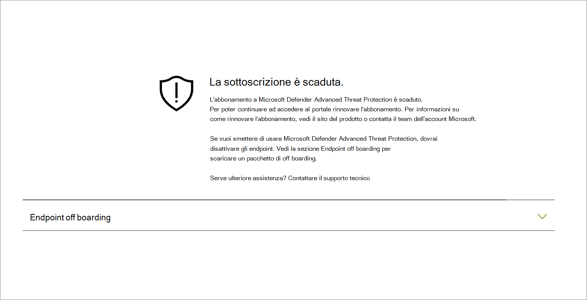
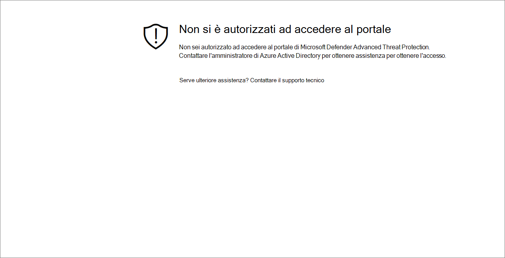
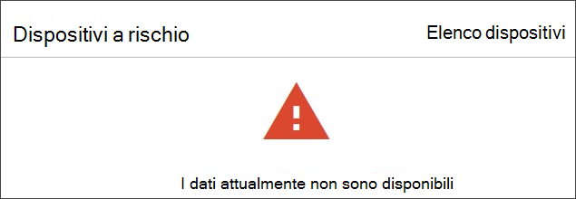

# Risolvere i problemi di accesso a sottoscrizioni e portali

[!INCLUDE [Microsoft 365 Defender rebranding](../../includes/microsoft-defender.md)]

**Si applica a:**
- [Microsoft Defender per endpoint](https://go.microsoft.com/fwlink/p/?linkid=2154037)
- [Microsoft 365 Defender](https://go.microsoft.com/fwlink/?linkid=2118804)

>Vuoi provare Microsoft Defender per Endpoint? [Iscriversi per una versione di valutazione gratuita.](https://www.microsoft.com/microsoft-365/windows/microsoft-defender-atp?ocid=docs-wdatp-troublshootonboarding-abovefoldlink)

Questa pagina fornisce la procedura dettagliata per risolvere i problemi che potrebbero verificarsi durante la configurazione del servizio Microsoft Defender for Endpoint.

Se ricevi un messaggio di errore, Microsoft Defender Security Center fornirà una spiegazione dettagliata sul problema e verranno forniti collegamenti pertinenti.

## Nessuna sottoscrizione trovata

Se durante l'accesso **a** Microsoft Defender Security Center viene visualizzato il messaggio Nessuna sottoscrizione trovata, significa che Azure Active Directory (Azure AD) utilizzato per accedere all'utente al portale non dispone di una licenza di Microsoft Defender for Endpoint.

Possibili motivi:
- Le licenze di Windows E5 e Office E5 sono licenze distinte.
- La licenza è stata acquistata ma non ne è stato eseguito il provisioning in questa istanza di Azure AD.
    - Potrebbe trattarsi di un problema di provisioning delle licenze.
    - Potrebbe essere stato inavvertitamente effettuato il provisioning della licenza a un Microsoft Azure AD diverso da quello utilizzato per l'autenticazione nel servizio.

Per entrambi i casi, è consigliabile contattare il supporto Microsoft [all'indirizzo General Microsoft Defender for Endpoint Support](https://support.microsoft.com/getsupport?wf=0&tenant=ClassicCommercial&oaspworkflow=start_1.0.0.0&locale=en-us&supportregion=en-us&pesid=16055&ccsid=636419533611396913) o Volume license [support](https://www.microsoft.com/licensing/servicecenter/Help/Contact.aspx).

## L'abbonamento è scaduto

Se durante l'accesso a Microsoft Defender Security Center viene visualizzato un messaggio **L'abbonamento** è scaduto, l'abbonamento al servizio online è scaduto. L'abbonamento a Microsoft Defender for Endpoint, come qualsiasi altro abbonamento al servizio online, ha una data di scadenza. 

Puoi scegliere di rinnovare o estendere la licenza in qualsiasi momento. Quando si accede al portale  dopo la data di scadenza, verrà visualizzata un'opzione per scaricare il pacchetto di offboarding del dispositivo se si sceglie di non rinnovare la licenza.

> [!NOTE]
> Per motivi di sicurezza, il pacchetto usato per i dispositivi offboard scadrà 30 giorni dopo la data di download. I pacchetti di offboarding scaduti inviati a un dispositivo verranno rifiutati. Durante il download di un pacchetto di offboarding, ti verrà notificata la data di scadenza dei pacchetti e verrà incluso anche nel nome del pacchetto.

## Non si è autorizzati ad accedere al portale

Se si riceve un Messaggio Non si è autorizzati ad accedere al **portale,** tenere presente che Microsoft Defender for Endpoint è un prodotto di monitoraggio della sicurezza, analisi degli incidenti e risposta e, di conseguenza, l'accesso ad esso è limitato e controllato dall'utente.
Per ulteriori informazioni, vedere [**Assegnare l'accesso utente al portale.**](https://docs.microsoft.com/windows/threat-protection/windows-defender-atp/assign-portal-access-windows-defender-advanced-threat-protection)

## I dati attualmente non sono disponibili in alcune sezioni del portale
Se nel dashboard del portale e in altre sezioni viene visualizzato un messaggio di errore, ad esempio "I dati attualmente non sono disponibili":

Dovrai consentire il sottodominio e tutti `securitycenter.windows.com` i sottodomini. Ad esempio, `*.securitycenter.windows.com`.

## Problemi di comunicazione del portale
Se si verificano problemi di accesso al portale, dati mancanti o accesso limitato a parti del portale, è necessario verificare che gli URL seguenti siano consentiti e aperti per la comunicazione.

- `*.blob.core.windows.net`
- `crl.microsoft.com`
- `https://*.microsoftonline-p.com`
- `https://*.securitycenter.windows.com` 
- `https://automatediracs-eus-prd.securitycenter.windows.com`
- `https://login.microsoftonline.com`
- `https://login.windows.net`
- `https://onboardingpackagescusprd.blob.core.windows.net`
- `https://secure.aadcdn.microsoftonline-p.com` 
- `https://securitycenter.windows.com` 
- `https://static2.sharepointonline.com` 

