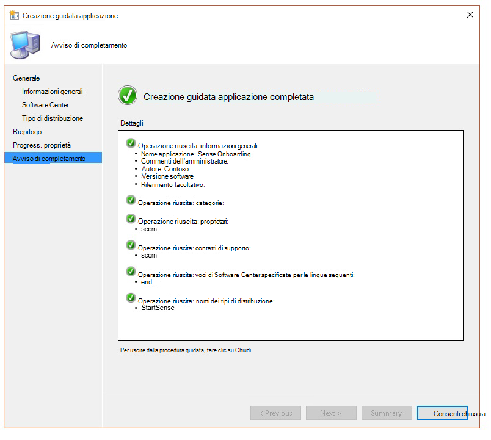

# <a name="troubleshoot-microsoft-defender-for-endpoint-onboarding-issues"></a>Risolvere i problemi di onboarding di Microsoft Defender per endpoint

[!INCLUDE [Microsoft 365 Defender rebranding](../../includes/microsoft-defender.md)]


**Si applica a:**

- [Microsoft Defender per endpoint](https://go.microsoft.com/fwlink/?linkid=2154037)
- Windows Server 2012 R2
- Windows Server 2016
- [Microsoft 365 Defender](https://go.microsoft.com/fwlink/?linkid=2118804)

> Vuoi provare Defender per Endpoint? [Iscriversi per una versione di valutazione gratuita.](https://www.microsoft.com/microsoft-365/windows/microsoft-defender-atp?ocid=docs-wdatp-pullalerts-abovefoldlink) 

In caso di problemi, potrebbe essere necessario risolvere i problemi relativi al processo di onboarding di Microsoft Defender for Endpoint.
Questa pagina fornisce la procedura dettagliata per risolvere i problemi di onboarding che potrebbero verificarsi durante la distribuzione con uno degli strumenti di distribuzione e gli errori comuni che potrebbero verificarsi nei dispositivi.

## <a name="troubleshoot-issues-with-onboarding-tools"></a>Risolvere i problemi relativi agli strumenti di onboarding

Se hai completato il processo di onboarding e [](investigate-machines.md) non vedi i dispositivi nell'elenco Dispositivi dopo un'ora, potrebbe indicare un problema di onboarding o connettività.

### <a name="troubleshoot-onboarding-when-deploying-with-group-policy"></a>Risolvere i problemi di onboarding durante la distribuzione con Criteri di gruppo

La distribuzione con Criteri di gruppo viene eseguita eseguendo lo script di onboarding nei dispositivi. La console Criteri di gruppo non indica se la distribuzione è riuscita o meno.

Se hai completato il processo di onboarding e [](investigate-machines.md) non vedi i dispositivi nell'elenco Dispositivi dopo un'ora, puoi controllare l'output dello script nei dispositivi. Per ulteriori informazioni, vedere [Risoluzione dei problemi di onboarding durante la distribuzione con uno script.](#troubleshoot-onboarding-when-deploying-with-a-script)

Se lo script viene completato correttamente, vedi Risolvere i problemi di [onboarding](#troubleshoot-onboarding-issues-on-the-device) nei dispositivi per ulteriori errori che potrebbero verificarsi.

### <a name="troubleshoot-onboarding-issues-when-deploying-with-microsoft-endpoint-configuration-manager"></a>Risolvere i problemi di onboarding durante la distribuzione con Microsoft Endpoint Configuration Manager

Quando si esegue l'onboarding dei dispositivi con le versioni seguenti di Configuration Manager:

- Microsoft Endpoint Configuration Manager
- System Center 2012 Configuration Manager
- System Center Configuration Manager 2012 R2

La distribuzione con le versioni precedenti di Configuration Manager viene eseguita eseguendo lo script di onboarding nei dispositivi. È possibile tenere traccia della distribuzione nella console di Configuration Manager.

Se la distribuzione ha esito negativo, puoi controllare l'output dello script nei dispositivi.

Se l'onboarding è stato completato correttamente  ma i dispositivi non vengono visualizzati nell'elenco Dispositivi dopo un'ora, vedi Risolvere i problemi di [onboarding](#troubleshoot-onboarding-issues-on-the-device) nel dispositivo per ulteriori errori che potrebbero verificarsi.

### <a name="troubleshoot-onboarding-when-deploying-with-a-script"></a>Risolvere i problemi di onboarding durante la distribuzione con uno script

**Controlla il risultato dello script nel dispositivo:**

1. Fare **clic sul pulsante Start,** digitare **Visualizzatore** eventi e premere **INVIO.**

2. Passare a **Applicazione registri di Windows**  >  .

3. Cercare un evento dall'origine evento **WDATPOnboarding.**

Se lo script ha esito negativo e l'evento è un errore, è possibile controllare l'ID evento nella tabella seguente per risolvere il problema.

> [!NOTE]
> Gli ID evento seguenti sono specifici solo per lo script di onboarding.

ID evento | Tipo di errore | Passaggi di risoluzione
:---:|:---|:---
 `5` | I dati di offboarding sono stati trovati ma non è stato possibile eliminare | Controllare le autorizzazioni nel Registro di sistema, in particolare<br> `HKLM\SOFTWARE\Policies\Microsoft\Windows Advanced Threat Protection`.
`10` | Impossibile scrivere i dati di onboarding nel Registro di sistema |  Controllare le autorizzazioni nel Registro di sistema, in particolare<br> `HKLM\SOFTWARE\Policies\Microsoft\Windows Advanced Threat Protection`.<br>Verificare che lo script sia stato eseguito come amministratore.
`15` |  Impossibile avviare il servizio SENSE |Controllare l'integrità del servizio ( `sc query sense` comando). Assicurati che non sia in uno stato intermedio (*'Pending_Stopped'*, *'Pending_Running'*) e prova a eseguire di nuovo lo script (con diritti di amministratore). <br> <br> Se il dispositivo esegue Windows 10, versione 1607 e il comando restituisce `sc query sense` `START_PENDING` , riavviare il dispositivo. Se il riavvio del dispositivo non consente di risolvere il problema, eseguire l'aggiornamento a KB4015217 e provare di nuovo l'onboarding.
`15` | Impossibile avviare il servizio SENSE | Se il messaggio dell'errore è: Errore di sistema 577 o errore 1058, è necessario abilitare il driver ELAM di Microsoft Defender Antivirus, vedere Verificare che [Microsoft Defender Antivirus](#ensure-that-microsoft-defender-antivirus-is-not-disabled-by-a-policy) non sia disabilitato da un criterio per istruzioni.
`30` |  Lo script non è riuscito ad attendere l'avvio dell'esecuzione del servizio | L'avvio del servizio potrebbe aver impiegato più tempo oppure si sono verificati errori durante il tentativo di avvio. Per ulteriori informazioni sugli eventi e sugli errori correlati a SENSE, vedi [Esaminare gli eventi e gli errori tramite visualizzatore eventi.](event-error-codes.md)
`35` |  Lo script non è riuscito a trovare il valore del Registro di sistema relativo allo stato di onboarding necessario | Quando il servizio SENSE viene avviato per la prima volta, scrive lo stato di onboarding nel percorso del Registro di sistema<br>`HKLM\SOFTWARE\Microsoft\Windows Advanced Threat Protection\Status`.<br> Lo script non è riuscito a trovarlo dopo alcuni secondi. Puoi testarlo manualmente e verificare se è presente. Per ulteriori informazioni sugli eventi e sugli errori correlati a SENSE, vedi [Esaminare gli eventi e gli errori tramite visualizzatore eventi.](event-error-codes.md)
`40` | Lo stato di onboarding del servizio SENSE non è impostato su **1** | L'onboard del servizio SENSE non è stato eseguito correttamente. Per ulteriori informazioni sugli eventi e sugli errori correlati a SENSE, vedi [Esaminare gli eventi e gli errori tramite visualizzatore eventi.](event-error-codes.md)
`65` | Privilegi insufficienti| Eseguire di nuovo lo script con privilegi di amministratore.

### <a name="troubleshoot-onboarding-issues-using-microsoft-intune"></a>Risolvere i problemi di onboarding con Microsoft Intune

È possibile utilizzare Microsoft Intune per controllare i codici di errore e tentare di risolvere la causa del problema.

Se sono stati configurati criteri in Intune e non vengono propagati nei dispositivi, potrebbe essere necessario configurare la registrazione MDM automatica.

Utilizzare le tabelle seguenti per comprendere le possibili cause dei problemi durante l'onboarding:

- Codici di errore di Microsoft Intune e OMA-URIs tabella
- Tabella problemi noti relativi alla non conformità
- Tabella dei registri eventi di Gestione dispositivi mobili (MDM)

Se nessuno dei registri eventi e dei passaggi per la risoluzione dei problemi funziona, scarica lo script locale dalla sezione **Gestione** dispositivi del portale ed eseguilo in un prompt dei comandi con privilegi elevati.

#### <a name="microsoft-intune-error-codes-and-oma-uris"></a>Codici di errore e codici di errore di Microsoft Intune OMA-URIs

Codice di errore Hex | Codice di errore Dec | Description | URI OMA | Possibili cause e procedure di risoluzione dei problemi
:---:|:---|:---|:---|:---
0x87D1FDE8 | -2016281112 | Correzione non riuscita | Onboarding <br> Offboarding | **Causa possibile:** Onboarding o offboarding non riuscito in un BLOB errato: firma errata o campi PreviousOrgIds mancanti. <br><br> **Passaggi per la risoluzione dei problemi:** <br> Controlla gli ID evento nella sezione Visualizzare gli errori [di onboarding](#view-agent-onboarding-errors-in-the-device-event-log) dell'agente nel registro eventi del dispositivo. <br><br> Controlla i registri eventi MDM nella tabella seguente o segui le istruzioni in Diagnosticare gli errori [MDM in Windows 10.](https://docs.microsoft.com/windows/client-management/mdm/diagnose-mdm-failures-in-windows-10)
 | | | | Onboarding <br> Offboarding <br> SampleSharing | **Causa possibile:** La chiave del Registro di sistema di Microsoft Defender for Endpoint Policy non esiste o il client OMA DM non dispone delle autorizzazioni per scriverlo. <br><br> **Passaggi per la risoluzione dei problemi:** Verificare che esista la seguente chiave del Registro di sistema: `HKEY_LOCAL_MACHINE\SOFTWARE\Policies\Microsoft\Windows Advanced Threat Protection` <br> <br> Se non esiste, aprire un comando con privilegi elevati e aggiungere la chiave.
 | | | | SenseIsRunning <br> OnboardingState <br> OrgId |  **Causa possibile:** Tentativo di correzione tramite proprietà di sola lettura. Onboarding non riuscito. <br><br> **Passaggi per la risoluzione dei problemi:** Controlla la procedura di risoluzione dei problemi in [Risolvere i problemi di onboarding nel dispositivo](#troubleshoot-onboarding-issues-on-the-device). <br><br> Controlla i registri eventi MDM nella tabella seguente o segui le istruzioni in Diagnosticare gli errori [MDM in Windows 10.](https://docs.microsoft.com/windows/client-management/mdm/diagnose-mdm-failures-in-windows-10)
 | | | | Tutti | **Causa possibile:** Tenta di distribuire Microsoft Defender per Endpoint su SKU/Piattaforma non supportati, in particolare SKU olografico. <br><br> Piattaforme attualmente supportate:<br> Enterprise, Education e Professional.<br> Server non supportato.
 0x87D101A9 | -2016345687 |SyncML(425): il comando richiesto non è riuscito perché il mittente non dispone di autorizzazioni di controllo di accesso (ACL) adeguate per il destinatario. | Tutti |  **Causa possibile:** Tenta di distribuire Microsoft Defender per Endpoint su SKU/Piattaforma non supportati, in particolare SKU olografico.<br><br> Piattaforme attualmente supportate:<br>  Enterprise, Education e Professional.

#### <a name="known-issues-with-non-compliance"></a>Problemi noti relativi alla non conformità

Nella tabella seguente vengono fornite informazioni sui problemi relativi alla non conformità e su come è possibile risolvere i problemi.

Caso | Sintomi | Possibili cause e procedure di risoluzione dei problemi
:---:|:---|:---
 `1` | Il dispositivo è conforme all'URI OMA SenseIsRunning. Ma non è conforme agli URI OMA orgId, Onboarding e OnboardingState. | **Causa possibile:** Verificare che l'utente ha superato la Configurazione guidata dopo l'installazione o l'aggiornamento di Windows. Durante l'onboarding della Configurazione guidata non è stato possibile completare l'onboarding, ma SENSE è già in esecuzione.<br><br> **Passaggi per la risoluzione dei problemi:** Attendere il completamento della Procedura guidata.
 `2` |  Device is compliant by OrgId, Onboarding, and OnboardingState OMA-URIs, but is non-compliant by SenseIsRunning OMA-URI. |  **Causa possibile:** Il tipo di avvio del servizio Sense è impostato su "Avvio ritardato". In alcuni casi, il server Microsoft Intune segnala il dispositivo come non conforme da SenseIsRunning quando si verifica una sessione DM all'avvio del sistema. <br><br> **Passaggi per la risoluzione dei problemi:** Il problema dovrebbe essere risolto automaticamente entro 24 ore.
 `3` | Il dispositivo non è conforme | **Passaggi per la risoluzione dei problemi:** Assicurati che i criteri di onboarding e offboarding non siano distribuiti nello stesso dispositivo contemporaneamente.

#### <a name="mobile-device-management-mdm-event-logs"></a>Log eventi di Gestione dispositivi mobili (MDM)

Visualizzare i registri eventi MDM per risolvere i problemi che potrebbero verificarsi durante l'onboarding:

Nome registro: Microsoft\Windows\DeviceManagement-EnterpriseDiagnostics-Provider

Nome canale: Amministratore

ID | Gravità | Descrizione dell'evento | Procedura di risoluzione dei problemi
:---|:---|:---|:---
1819 | Error | CSP Di Microsoft Defender per endpoint: impossibile impostare il valore del nodo. NodeId: (%1), TokenName: (%2), Risultato: (%3). | Scaricare [l'aggiornamento cumulativo per Windows 10, 1607](https://go.microsoft.com/fwlink/?linkid=829760).

## <a name="troubleshoot-onboarding-issues-on-the-device"></a>Risolvere i problemi di onboarding nel dispositivo

Se gli strumenti di distribuzione usati non indicano un errore nel processo di onboarding, ma i dispositivi non vengono ancora visualizzati nell'elenco dei dispositivi tra un'ora, passare attraverso gli argomenti di verifica seguenti per verificare se si è verificato un errore con l'agente Microsoft Defender for Endpoint.

- [Visualizzare gli errori di onboarding degli agenti nel registro eventi del dispositivo](#view-agent-onboarding-errors-in-the-device-event-log)
- [Verificare che il servizio dati di diagnostica sia abilitato](#ensure-the-diagnostics-service-is-enabled)
- [Verificare che il servizio sia impostato per l'avvio](#ensure-the-service-is-set-to-start)
- [Verificare che il dispositivo abbia una connessione Internet](#ensure-the-device-has-an-internet-connection)
- [Verificare che Microsoft Defender Antivirus non sia disabilitato da un criterio](#ensure-that-microsoft-defender-antivirus-is-not-disabled-by-a-policy)

### <a name="view-agent-onboarding-errors-in-the-device-event-log"></a>Visualizzare gli errori di onboarding degli agenti nel registro eventi del dispositivo

1. Fare **clic sul pulsante Start,** digitare **Visualizzatore** eventi e premere **INVIO.**

2. Nel riquadro **Visualizzatore eventi (locale)** espandere **Registri applicazioni** e servizi  >  **Microsoft**  >  **Windows**  >  **SENSE.**

   > [!NOTE]
   > SENSE è il nome interno usato per fare riferimento al sensore comportamentale che alimenta Microsoft Defender per Endpoint.

3. Selezionare **Operativo** per caricare il registro.

4. Nel riquadro **Azioni** fare clic su **Filtra registro corrente.**

5. Nella scheda **Filtro,** in **Livello evento:** selezionare **Critico,** **Avviso** ed **Errore** e fare clic su **OK.**

   

6. Gli eventi che possono indicare problemi verranno visualizzati nel **riquadro** Operativo. È possibile tentare di risolverli in base alle soluzioni nella tabella seguente:

ID evento | Messaggio | Passaggi di risoluzione
:---:|:---|:---
 `5` | Microsoft Defender for Endpoint service failed to connect to the server at _variable_ | [Verificare che il dispositivo abbia accesso a Internet](#ensure-the-device-has-an-internet-connection).
 `6` | Il servizio Microsoft Defender for Endpoint non è stato onboarding e non sono stati trovati parametri di onboarding. Codice errore: _variabile_ | [Eseguire di nuovo lo script di onboarding.](configure-endpoints-script.md)
 `7` | Microsoft Defender for Endpoint service failed to read the onboarding parameters. Codice errore: _variabile_ | [Assicurati che il dispositivo abbia accesso a Internet,](#ensure-the-device-has-an-internet-connection)quindi esegui di nuovo l'intero processo di onboarding.
 `9` | Microsoft Defender for Endpoint service failed to change its start type. Codice errore: variabile | Se l'evento si è verificato durante l'onboarding, riavviare e riprovare a eseguire lo script di onboarding. Per ulteriori informazioni, vedere Eseguire di nuovo lo [script di onboarding.](configure-endpoints-script.md) <br><br>Se l'evento si è verificato durante l'offboarding, contattare il supporto tecnico.
`10` | Microsoft Defender for Endpoint service failed to persist the onboarding information. Codice errore: variabile | Se l'evento si è verificato durante l'onboarding, riprovare a eseguire lo script di onboarding. Per ulteriori informazioni, vedere Eseguire di nuovo lo [script di onboarding.](configure-endpoints-script.md) <br><br>Se il problema persiste, contattare il supporto tecnico.
`15` | Microsoft Defender for Endpoint non può avviare il canale di comando con URL: _variabile_ | [Verificare che il dispositivo abbia accesso a Internet](#ensure-the-device-has-an-internet-connection).
`17` | Microsoft Defender for Endpoint service failed to change the Connected User Experiences and Telemetry service location. Codice errore: variabile | [Eseguire di nuovo lo script di onboarding.](configure-endpoints-script.md) Se il problema persiste, contattare il supporto tecnico.
`25` | Il servizio Microsoft Defender for Endpoint non è riuscito a reimpostare lo stato di integrità nel Registro di sistema. Codice errore: _variabile_ | Contattare il supporto.
`27` | Impossibile abilitare la modalità Microsoft Defender for Endpoint in Windows Defender. Processo di onboarding non riuscito. Codice errore: variabile | Contattare il supporto.
`29` | Impossibile leggere i parametri di offboarding. Tipo di errore: %1, Codice errore: %2, Descrizione: %3 | Assicurati che il dispositivo abbia accesso a Internet, quindi esegui di nuovo l'intero processo di offboarding.
`30` | Impossibile disabilitare la modalità $(build.sense.productDisplayName) in Microsoft Defender per Endpoint. Codice errore: %1 | Contattare il supporto.
`32` | $(build.sense.productDisplayName) service failed to request to stop itself after offboarding process. Codice errore: %1 | Verificare che il tipo di avvio del servizio sia manuale e riavviare il dispositivo.
`55` | Impossibile creare l'autologger Secure ETW. Codice errore: %1 | Riavviare il dispositivo.
`63` | Aggiornamento del tipo di avvio del servizio esterno. Nome: %1, tipo di avvio effettivo: %2, tipo di avvio previsto: %3, codice di uscita: %4 | Identificare la causa delle modifiche nel tipo di avvio del servizio menzionato. Se il codice di uscita non è 0, correggere manualmente il tipo di avvio al tipo di avvio previsto.
`64` | Avvio del servizio esterno arrestato. Nome: %1, codice di uscita: %2 | Contattare il supporto se l'evento continua a comparire.
`68` | Il tipo di avvio del servizio è imprevisto. Nome servizio: %1, tipo di avvio effettivo: %2, tipo di avvio previsto: %3 | Identificare la causa delle modifiche nel tipo di avvio. Correggere il tipo di avvio del servizio menzionato.
`69` | Il servizio è stato arrestato. Nome servizio: %1 | Avviare il servizio menzionato. Contattare il supporto se persiste.

<br />

Nel dispositivo sono presenti componenti aggiuntivi da cui dipende il corretto funzionamento dell'agente di Microsoft Defender for Endpoint. Se nel registro eventi dell'agente di Microsoft Defender for Endpoint non sono presenti errori correlati all'onboarding, procedere con la procedura seguente per verificare che i componenti aggiuntivi siano configurati correttamente.

<span id="ensure-the-diagnostics-service-is-enabled" />

### <a name="ensure-the-diagnostic-data-service-is-enabled"></a>Verificare che il servizio dati di diagnostica sia abilitato

Se i dispositivi non segnalano correttamente, potrebbe essere necessario verificare che il servizio dati di diagnostica di Windows 10 sia impostato per l'avvio automatico e sia in esecuzione nel dispositivo. Il servizio potrebbe essere stato disabilitato da altri programmi o modifiche alla configurazione utente.

Prima di tutto, devi verificare che il servizio sia impostato per l'avvio automatico all'avvio di Windows, quindi dovresti verificare che il servizio sia attualmente in esecuzione (e avviarlo in caso contrario).

### <a name="ensure-the-service-is-set-to-start"></a>Verificare che il servizio sia impostato per l'avvio

Usa la riga di comando per controllare il tipo di avvio del servizio dati di diagnostica **di Windows 10:**

1. Apri un prompt della riga di comando con privilegi elevati nel dispositivo:

   a. Fare **clic sul pulsante Start,** digitare **cmd** e premere **INVIO.**

   b. Fare clic con il pulsante destro del mouse su **Prompt dei comandi** e scegliere **Esegui come amministratore**.

2. Immettere il comando seguente e premere **INVIO**:

   ```text
   sc qc diagtrack
   ```

   Se il servizio è abilitato, il risultato dovrebbe essere simile allo screenshot seguente:

   

   Se la proprietà non è impostata su , sarà necessario impostare `START_TYPE` `AUTO_START` l'avvio automatico del servizio.

**Usa la riga di comando per impostare il servizio dati di diagnostica di Windows 10 per l'avvio automatico:**

1. Apri un prompt della riga di comando con privilegi elevati nel dispositivo:

   a. Fare **clic sul pulsante Start,** digitare **cmd** e premere **INVIO.**

   b. Fare clic con il pulsante destro del mouse su **Prompt dei comandi** e scegliere **Esegui come amministratore**.

2. Immettere il comando seguente e premere **INVIO**:

   ```text
   sc config diagtrack start=auto
   ```

3. Viene visualizzato un messaggio di esito positivo. Verificare la modifica immettendo il comando seguente e premere **INVIO:**

   ```text
   sc qc diagtrack
   ```

4. Avviare il servizio.

   a. Al prompt dei comandi digitare il comando seguente e premere **INVIO:**

   ```text
   sc start diagtrack
   ```

### <a name="ensure-the-device-has-an-internet-connection"></a>Verificare che il dispositivo abbia una connessione Internet

Il sensore Window Defender ATP richiede Microsoft Windows HTTP (WinHTTP) per segnalare i dati del sensore e comunicare con il servizio Microsoft Defender for Endpoint.

WinHTTP è indipendente dalle impostazioni del proxy di esplorazione Internet e da altre applicazioni di contesto utente e deve essere in grado di rilevare i server proxy disponibili nell'ambiente specifico.

Per verificare che il sensore abbia la connettività del servizio, seguire i passaggi descritti nell'argomento [Verify client connectivity to Microsoft Defender for Endpoint service URLs.](configure-proxy-internet.md#verify-client-connectivity-to-microsoft-defender-atp-service-urls)

Se la verifica ha esito negativo e l'ambiente utilizza un proxy per connettersi a Internet, seguire i passaggi descritti nell'argomento [Configure proxy and Internet connectivity settings.](configure-proxy-internet.md)

### <a name="ensure-that-microsoft-defender-antivirus-is-not-disabled-by-a-policy"></a>Verificare che Microsoft Defender Antivirus non sia disabilitato da un criterio

> [!IMPORTANT]
> Quanto segue si applica  solo ai dispositivi che non hanno ancora ricevuto l'aggiornamento di agosto 2020 (versione 4.18.2007.8) a Microsoft Defender Antivirus.
>
> L'aggiornamento garantisce che Microsoft Defender Antivirus non possa essere disattivato nei dispositivi client tramite i criteri di sistema.

**Problema:** Il servizio Microsoft Defender for Endpoint non viene avviato dopo l'onboarding.

**Sintomo:** l'onboarding viene completato correttamente, ma viene visualizzato l'errore 577 o l'errore 1058 quando si tenta di avviare il servizio.

**Soluzione:** se i dispositivi eseguono un client antimalware di terze parti, l'agente Microsoft Defender for Endpoint deve essere abilitato con il driver Antimalware ad avvio anticipato (ELAM). È necessario assicurarsi che non sia disattivato da un criterio di sistema.

- A seconda dello strumento utilizzato per implementare i criteri, è necessario verificare che i criteri Windows Defender seguenti siano deselezionati:

  - DisableAntiSpyware
  - DisableAntiVirus

  Ad esempio, in Criteri di gruppo non dovrebbero essere presenti voci come i seguenti valori:

  - `<Key Path="SOFTWARE\Policies\Microsoft\Windows Defender"><KeyValue Value="0" ValueKind="DWord" Name="DisableAntiSpyware"/></Key>`
  - `<Key Path="SOFTWARE\Policies\Microsoft\Windows Defender"><KeyValue Value="0" ValueKind="DWord" Name="DisableAntiVirus"/></Key>`

> [!IMPORTANT]
> L'impostazione non è più disponibile e verrà ignorata in tutti i dispositivi client, a partire dall'aggiornamento di agosto `disableAntiSpyware` 2020 (versione 4.18.2007.8) a Microsoft Defender Antivirus.

- Dopo aver deselezionato il criterio, eseguire di nuovo i passaggi di onboarding.

- È inoltre possibile controllare i valori precedenti della chiave del Registro di sistema per verificare che il criterio sia disabilitato aprendo la chiave del Registro di sistema `HKEY_LOCAL_MACHINE\SOFTWARE\Policies\Microsoft\Windows Defender` .

    

   > [!NOTE]
   > Tutti Windows Defender servizi (wdboot, wdfilter, wdnisdrv, wdnissvc e windefend) devono essere nello stato predefinito. La modifica dell'avvio di questi servizi non è supportata e potrebbe forzare l'immagine del sistema.
   >
   > Configurazioni predefinite di esempio per WdBoot e WdFilter:
   > - `<Key Path="SYSTEM\CurrentControlSet\Services\WdBoot"><KeyValue Value="0" ValueKind="DWord" Name="Start"/></Key>`
   > - `<Key Path="SYSTEM\CurrentControlSet\Services\WdFilter"><KeyValue Value="0" ValueKind="DWord" Name="Start"/></Key>`

## <a name="troubleshoot-onboarding-issues-on-a-server"></a>Risolvere i problemi di onboarding in un server

Se si verificano problemi durante l'onboarding di un server, eseguire la procedura di verifica seguente per risolvere i possibili problemi.

- [Verificare che Microsoft Monitoring Agent (MMA) sia installato e configurato per segnalare i dati del sensore al servizio](configure-server-endpoints.md)
- [Verificare che le impostazioni del proxy del server e della connettività Internet siano configurate correttamente](configure-server-endpoints.md)

Potrebbe inoltre essere necessario controllare quanto segue:

- Verificare che sia in esecuzione Microsoft Defender for Endpoint Service nella **scheda Processi** in **Task Manager.** Ad esempio:

    

- Controllare **Gestione operazioni** applicazioni e registri servizi del Visualizzatore eventi per verificare se sono presenti  >    >   errori.

- In **Servizi** verificare se **Microsoft Monitoring Agent** è in esecuzione nel server. Ad esempio,

    

- In **Microsoft Monitoring Agent** Azure Log Analytics  >  **(OMS)** controllare le aree di lavoro e verificare che lo stato sia in esecuzione.

    

- Verifica che i dispositivi si riflettano **nell'elenco Dispositivi** nel portale.

## <a name="confirming-onboarding-of-newly-built-devices"></a>Conferma dell'onboarding dei dispositivi appena creati

Possono verificarsi casi in cui l'onboarding viene distribuito in un dispositivo appena creato ma non completato.

I passaggi seguenti forniscono indicazioni per lo scenario seguente:

- Il pacchetto di onboarding viene distribuito ai dispositivi appena creati
- Sensor does not start because the Out-of-box experience (OOBE) or first user logon has not been completed
- Il dispositivo viene disattivato o riavviato prima che l'utente finale esegua il primo accesso
- In questo scenario, il servizio SENSE non verrà avviato automaticamente anche se il pacchetto di onboarding è stato distribuito

> [!NOTE]
> I passaggi seguenti sono rilevanti solo quando si usa Microsoft Endpoint Configuration Manager. Per altri dettagli sull'onboarding con Microsoft Endpoint Configuration Manager, vedi [Microsoft Defender for Endpoint.](https://docs.microsoft.com/mem/configmgr/protect/deploy-use/windows-defender-advanced-threat-protection)

1. Creare un'applicazione in Microsoft Endpoint Configuration Manager.

    

2. Selezionare **Specificare manualmente le informazioni sull'applicazione.**

    

3. Specificare le informazioni sull'applicazione, quindi selezionare **Avanti.**

    

4. Specificare le informazioni sul Software Center, quindi selezionare **Avanti.**

    

5. In **Tipi di distribuzione** selezionare **Aggiungi**.

    

6. Selezionare **Specificare manualmente le informazioni sul tipo di distribuzione,** quindi selezionare **Avanti.**

    

7. Specificare le informazioni sul tipo di distribuzione, quindi selezionare **Avanti.**

    

8. In **Programma**  >  **di installazione contenuto** specificare il comando: `net start sense` .

    

9. In **Metodo di rilevamento** selezionare Configura regole per rilevare la presenza di questo tipo di **distribuzione,** quindi selezionare Aggiungi **clausola**.

    

10. Specificare i dettagli della regola di rilevamento seguenti, quindi selezionare **OK:**

    

11. In **Metodo di rilevamento** selezionare **Avanti**.

    

12. In **Esperienza utente** specificare le informazioni seguenti, quindi selezionare **Avanti:**

    

13. In **Requisiti** selezionare **Avanti.**

    

14. In **Dipendenze** selezionare **Avanti.**

    

15. In **Riepilogo** selezionare **Avanti.**

    

16. In **Completamento** selezionare **Chiudi.**

    

17. In **Tipi di distribuzione** selezionare **Avanti.**

    

18. In **Riepilogo** selezionare **Avanti.**

    

    Viene quindi visualizzato lo stato: 

19. In **Completamento** selezionare **Chiudi.**

    

20. È ora possibile distribuire l'applicazione facendo clic con il pulsante destro del mouse sull'app e scegliendo **Distribuisci**.

    

21. In **Generale seleziona** **Distribuisci automaticamente il contenuto per le dipendenze e** **Sfoglia.**

    

22. In **Contenuto** selezionare **Avanti.**

    

23. In **Impostazioni di distribuzione** selezionare **Avanti.**

    

24. In **Pianificazione selezionare** Il prima possibile dopo il tempo **disponibile,** quindi selezionare **Avanti.**

    

25. In **Esperienza utente** seleziona Conferma modifiche alla scadenza o durante una finestra di manutenzione (richiede riavvii) e quindi seleziona **Avanti.** 

    

26. In **Avvisi selezionare** **Avanti**.

    

27. In **Riepilogo** selezionare **Avanti.**

    

    Lo stato viene quindi visualizzato 

28. In **Completamento** selezionare **Chiudi.**

    


## <a name="related-topics"></a>Argomenti correlati

- [Risolvere i problemi di Microsoft Defender per endpoint](troubleshoot-mdatp.md)
- [Dispositivi onboard](onboard-configure.md)
- [Configurare le impostazioni del proxy del dispositivo e della connettività Internet](configure-proxy-internet.md)
