# <a name="troubleshoot-performance-issues-related-to-real-time-protection"></a><span data-ttu-id="4d6cb-104">Risolvere i problemi di prestazioni correlati alla protezione in tempo reale</span><span class="sxs-lookup"><span data-stu-id="4d6cb-104">Troubleshoot performance issues related to real-time protection</span></span>


[!INCLUDE [Microsoft 365 Defender rebranding](../../includes/microsoft-defender.md)]


<span data-ttu-id="4d6cb-105">**Si applica a:**</span><span class="sxs-lookup"><span data-stu-id="4d6cb-105">**Applies to:**</span></span>

- [<span data-ttu-id="4d6cb-106">Microsoft Defender per endpoint</span><span class="sxs-lookup"><span data-stu-id="4d6cb-106">Microsoft Defender for Endpoint</span></span>](https://go.microsoft.com/fwlink/p/?linkid=2146631)
 
<span data-ttu-id="4d6cb-107">Se il sistema presenta un utilizzo elevato della CPU o problemi di prestazioni correlati al servizio di protezione in tempo reale in Microsoft Defender for Endpoint, è possibile inviare un ticket al supporto Tecnico Microsoft.</span><span class="sxs-lookup"><span data-stu-id="4d6cb-107">If your system is having high CPU usage or performance issues related to the real-time protection service in Microsoft Defender for Endpoint, you can submit a ticket to Microsoft support.</span></span> <span data-ttu-id="4d6cb-108">Seguire i passaggi descritti in [Collect Antivirus Microsoft Defender diagnostic data](collect-diagnostic-data.md).</span><span class="sxs-lookup"><span data-stu-id="4d6cb-108">Follow the steps in [Collect Microsoft Defender Antivirus diagnostic data](collect-diagnostic-data.md).</span></span>

<span data-ttu-id="4d6cb-109">In quanto amministratore, puoi anche risolvere questi problemi da solo.</span><span class="sxs-lookup"><span data-stu-id="4d6cb-109">As an admin, you can also troubleshoot these issues on your own.</span></span> 

<span data-ttu-id="4d6cb-110">Prima di tutto, potresti voler controllare se il problema è causato da un altro software.</span><span class="sxs-lookup"><span data-stu-id="4d6cb-110">First, you might want to check if the issue is being caused by another software.</span></span> <span data-ttu-id="4d6cb-111">Leggere [Controlla con il fornitore per le esclusioni antivirus](#check-with-vendor-for-antivirus-exclusions).</span><span class="sxs-lookup"><span data-stu-id="4d6cb-111">Read [Check with vendor for antivirus exclusions](#check-with-vendor-for-antivirus-exclusions).</span></span>

<span data-ttu-id="4d6cb-112">In caso contrario, è possibile identificare il software correlato al problema di prestazioni identificato seguendo la procedura descritta in [Analyze the Microsoft Protection Log](#analyze-the-microsoft-protection-log).</span><span class="sxs-lookup"><span data-stu-id="4d6cb-112">Otherwise, you can identify which software is related to the identified performance issue by following the steps in [Analyze the Microsoft Protection Log](#analyze-the-microsoft-protection-log).</span></span> 

<span data-ttu-id="4d6cb-113">Puoi anche fornire ulteriori log per l'invio al supporto Microsoft seguendo la procedura descritta in:</span><span class="sxs-lookup"><span data-stu-id="4d6cb-113">You can also provide additional logs to your submission to Microsoft support by following the steps in:</span></span>
- [<span data-ttu-id="4d6cb-114">Acquisire i registri dei processi con Process Monitor</span><span class="sxs-lookup"><span data-stu-id="4d6cb-114">Capture process logs using Process Monitor</span></span>](#capture-process-logs-using-process-monitor)
- [<span data-ttu-id="4d6cb-115">Acquisire i registri delle prestazioni Windows Performance Recorder</span><span class="sxs-lookup"><span data-stu-id="4d6cb-115">Capture performance logs using Windows Performance Recorder</span></span>](#capture-performance-logs-using-windows-performance-recorder) 

## <a name="check-with-vendor-for-antivirus-exclusions"></a><span data-ttu-id="4d6cb-116">Rivolgersi al fornitore per le esclusioni antivirus</span><span class="sxs-lookup"><span data-stu-id="4d6cb-116">Check with vendor for antivirus exclusions</span></span>

<span data-ttu-id="4d6cb-117">Se è possibile identificare rapidamente il software che influisce sulle prestazioni del sistema, passare alla Knowledge Base o al Centro supporto tecnico del fornitore del software.</span><span class="sxs-lookup"><span data-stu-id="4d6cb-117">If you can readily identify the software affecting system performance, go to the software vendor's knowledge base or support center.</span></span> <span data-ttu-id="4d6cb-118">Cerca se hanno suggerimenti sulle esclusioni antivirus.</span><span class="sxs-lookup"><span data-stu-id="4d6cb-118">Search if they have recommendations about antivirus exclusions.</span></span> <span data-ttu-id="4d6cb-119">Se il sito Web del fornitore non li ha, è possibile aprire un ticket di supporto con loro e chiedere loro di pubblicarne uno.</span><span class="sxs-lookup"><span data-stu-id="4d6cb-119">If the vendor's website does not have them, you can open a support ticket with them and ask them to publish one.</span></span> 

<span data-ttu-id="4d6cb-120">È consigliabile che i fornitori di software seguano le varie linee guida in [Partnership con il settore per ridurre al minimo i falsi positivi.](https://www.microsoft.com/security/blog/2018/08/16/partnering-with-the-industry-to-minimize-false-positives/)</span><span class="sxs-lookup"><span data-stu-id="4d6cb-120">We recommend that software vendors follow the various guidelines in [Partnering with the industry to minimize false positives](https://www.microsoft.com/security/blog/2018/08/16/partnering-with-the-industry-to-minimize-false-positives/).</span></span> <span data-ttu-id="4d6cb-121">Il fornitore può inviare il proprio software tramite il portale [MDSI (Microsoft Defender Security Intelligence).](https://www.microsoft.com/wdsi/filesubmission?persona=SoftwareDeveloper)</span><span class="sxs-lookup"><span data-stu-id="4d6cb-121">The vendor can submit their software through the [Microsoft Defender Security Intelligence portal (MDSI)](https://www.microsoft.com/wdsi/filesubmission?persona=SoftwareDeveloper).</span></span>


## <a name="analyze-the-microsoft-protection-log"></a><span data-ttu-id="4d6cb-122">Analizzare il registro di protezione Microsoft</span><span class="sxs-lookup"><span data-stu-id="4d6cb-122">Analyze the Microsoft Protection Log</span></span>

<span data-ttu-id="4d6cb-123">In **MPLog-xxxxxxxx-xxxxxx.log** è possibile trovare le informazioni stimate sull'impatto sulle prestazioni del software in esecuzione come *EstimatedImpact*:</span><span class="sxs-lookup"><span data-stu-id="4d6cb-123">In **MPLog-xxxxxxxx-xxxxxx.log**, you can find the estimated performance impact information of running software as *EstimatedImpact*:</span></span>
    
`Per-process counts:ProcessImageName: smsswd.exe, TotalTime: 6597, Count: 1406, MaxTime: 609, MaxTimeFile: \Device\HarddiskVolume3\_SMSTaskSequence\Packages\WQ1008E9\Files\FramePkg.exe, EstimatedImpact: 65%`

| <span data-ttu-id="4d6cb-124">Nome del campo</span><span class="sxs-lookup"><span data-stu-id="4d6cb-124">Field name</span></span> | <span data-ttu-id="4d6cb-125">Descrizione</span><span class="sxs-lookup"><span data-stu-id="4d6cb-125">Description</span></span> |
|---|---|
|<span data-ttu-id="4d6cb-126">ProcessImageName</span><span class="sxs-lookup"><span data-stu-id="4d6cb-126">ProcessImageName</span></span> | <span data-ttu-id="4d6cb-127">Nome immagine processo</span><span class="sxs-lookup"><span data-stu-id="4d6cb-127">Process image name</span></span> |
| <span data-ttu-id="4d6cb-128">TotalTime</span><span class="sxs-lookup"><span data-stu-id="4d6cb-128">TotalTime</span></span> | <span data-ttu-id="4d6cb-129">Durata cumulativa in millisecondi trascorsa nelle analisi dei file a cui accede questo processo</span><span class="sxs-lookup"><span data-stu-id="4d6cb-129">The cumulative duration in milliseconds spent in scans of files accessed by this process</span></span> |
|<span data-ttu-id="4d6cb-130">Count</span><span class="sxs-lookup"><span data-stu-id="4d6cb-130">Count</span></span> | <span data-ttu-id="4d6cb-131">Numero di file analizzati a cui accede questo processo</span><span class="sxs-lookup"><span data-stu-id="4d6cb-131">The number of scanned files accessed by this process</span></span> |
|<span data-ttu-id="4d6cb-132">MaxTime</span><span class="sxs-lookup"><span data-stu-id="4d6cb-132">MaxTime</span></span> |  <span data-ttu-id="4d6cb-133">Durata in millisecondi nella singola analisi più lunga di un file a cui si accede da questo processo</span><span class="sxs-lookup"><span data-stu-id="4d6cb-133">The duration in milliseconds in the longest single scan of a file accessed by this process</span></span> |
| <span data-ttu-id="4d6cb-134">MaxTimeFile</span><span class="sxs-lookup"><span data-stu-id="4d6cb-134">MaxTimeFile</span></span> | <span data-ttu-id="4d6cb-135">Percorso del file a cui accede questo processo per il quale è stata registrata l'analisi più `MaxTime` lunga della durata</span><span class="sxs-lookup"><span data-stu-id="4d6cb-135">The path of the file accessed by this process for which the longest scan of `MaxTime` duration was recorded</span></span> |
| <span data-ttu-id="4d6cb-136">EstimatedImpact</span><span class="sxs-lookup"><span data-stu-id="4d6cb-136">EstimatedImpact</span></span> | <span data-ttu-id="4d6cb-137">Percentuale di tempo impiegato nelle analisi per i file a cui accede questo processo al di fuori del periodo in cui questo processo ha riscontrato l'attività di analisi</span><span class="sxs-lookup"><span data-stu-id="4d6cb-137">The percentage of time spent in scans for files accessed by this process out of the period in which this process experienced scan activity</span></span> |

<span data-ttu-id="4d6cb-138">Se l'impatto sulle prestazioni è elevato, provare ad aggiungere il processo alle esclusioni percorso/processo seguendo la procedura descritta in [Configure and validate exclusions for Antivirus Microsoft Defender scans](collect-diagnostic-data.md).</span><span class="sxs-lookup"><span data-stu-id="4d6cb-138">If the performance impact is high, try adding the process to the Path/Process exclusions by following the steps in [Configure and validate exclusions for Microsoft Defender Antivirus scans](collect-diagnostic-data.md).</span></span>

<span data-ttu-id="4d6cb-139">Se il passaggio precedente non risolve il problema, è possibile raccogliere ulteriori informazioni tramite [Process Monitor](#capture-process-logs-using-process-monitor) o Windows [Performance Recorder](#capture-performance-logs-using-windows-performance-recorder) nelle sezioni seguenti.</span><span class="sxs-lookup"><span data-stu-id="4d6cb-139">If the previous step doesn't solve the problem, you can collect more information through the [Process Monitor](#capture-process-logs-using-process-monitor) or the [Windows Performance Recorder](#capture-performance-logs-using-windows-performance-recorder) in the following sections.</span></span>
     
## <a name="capture-process-logs-using-process-monitor"></a><span data-ttu-id="4d6cb-140">Acquisire i registri dei processi con Process Monitor</span><span class="sxs-lookup"><span data-stu-id="4d6cb-140">Capture process logs using Process Monitor</span></span>

<span data-ttu-id="4d6cb-141">Process Monitor (ProcMon) è uno strumento di monitoraggio avanzato che può mostrare processi in tempo reale.</span><span class="sxs-lookup"><span data-stu-id="4d6cb-141">Process Monitor (ProcMon) is an advanced monitoring tool that can show real-time processes.</span></span> <span data-ttu-id="4d6cb-142">Puoi usarlo per acquisire il problema di prestazioni in corso.</span><span class="sxs-lookup"><span data-stu-id="4d6cb-142">You can use this to capture the performance issue as it is occurring.</span></span>

1. <span data-ttu-id="4d6cb-143">Scaricare [Process Monitor v3.60](/sysinternals/downloads/procmon) in una cartella come `C:\temp` .</span><span class="sxs-lookup"><span data-stu-id="4d6cb-143">Download [Process Monitor v3.60](/sysinternals/downloads/procmon) to a folder like `C:\temp`.</span></span>

2. <span data-ttu-id="4d6cb-144">Per rimuovere il contrassegno del file dal Web:</span><span class="sxs-lookup"><span data-stu-id="4d6cb-144">To remove the file's mark of the web:</span></span>
    1. <span data-ttu-id="4d6cb-145">Fare clic con il **pulsante destroProcessMonitor.zip** e scegliere **Proprietà.**</span><span class="sxs-lookup"><span data-stu-id="4d6cb-145">Right-click **ProcessMonitor.zip** and select **Properties**.</span></span>
    1. <span data-ttu-id="4d6cb-146">Nella scheda *Generale* cercare *Sicurezza*.</span><span class="sxs-lookup"><span data-stu-id="4d6cb-146">Under the *General* tab, look for *Security*.</span></span>
    1. <span data-ttu-id="4d6cb-147">Seleziona la casella accanto **a Sblocca**.</span><span class="sxs-lookup"><span data-stu-id="4d6cb-147">Check the box beside **Unblock**.</span></span>
    1. <span data-ttu-id="4d6cb-148">Selezionare **Applica**.</span><span class="sxs-lookup"><span data-stu-id="4d6cb-148">Select **Apply**.</span></span>
    
    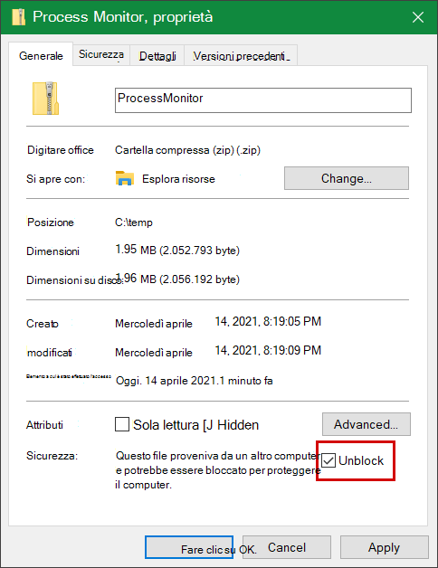 

3. <span data-ttu-id="4d6cb-150">Decomprimere il file in in `C:\temp` modo che il percorso della cartella sia `C:\temp\ProcessMonitor` .</span><span class="sxs-lookup"><span data-stu-id="4d6cb-150">Unzip the file in `C:\temp` so that the folder path will be `C:\temp\ProcessMonitor`.</span></span> 

4. <span data-ttu-id="4d6cb-151">Copiare **ProcMon.exe** nel client Windows o Windows server che si sta risoluzione dei problemi.</span><span class="sxs-lookup"><span data-stu-id="4d6cb-151">Copy **ProcMon.exe**  to the Windows client or Windows server you're troubleshooting.</span></span>  

5. <span data-ttu-id="4d6cb-152">Prima di eseguire ProcMon, assicurati che tutte le altre applicazioni non correlate al problema di utilizzo elevato della CPU siano chiuse.</span><span class="sxs-lookup"><span data-stu-id="4d6cb-152">Before running ProcMon, make sure all other applications not related to the high CPU usage issue are closed.</span></span> <span data-ttu-id="4d6cb-153">In questo modo si riduce al minimo il numero di processi da controllare.</span><span class="sxs-lookup"><span data-stu-id="4d6cb-153">Doing this will minimize the number of processes to check.</span></span>

6. <span data-ttu-id="4d6cb-154">Puoi avviare ProcMon in due modi.</span><span class="sxs-lookup"><span data-stu-id="4d6cb-154">You can launch ProcMon in two ways.</span></span>
    1. <span data-ttu-id="4d6cb-155">Fare clic con il **ProcMon.exe** e selezionare **Esegui come amministratore.**</span><span class="sxs-lookup"><span data-stu-id="4d6cb-155">Right-click **ProcMon.exe** and select **Run as administrator**.</span></span> 
    

        <span data-ttu-id="4d6cb-156">Poiché la registrazione viene avviata automaticamente, selezionare l'icona della lente di ingrandimento per interrompere l'acquisizione corrente o utilizzare i tasti **di scelta rapida CTRL+E.**</span><span class="sxs-lookup"><span data-stu-id="4d6cb-156">Since logging starts automatically, select the magnifying glass icon  to stop the current capture or use the keyboard shortcut **Ctrl+E**.</span></span>
 
        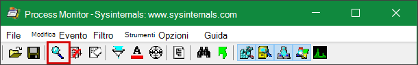

        <span data-ttu-id="4d6cb-158">Per verificare di aver interrotto l'acquisizione, verifica se l'icona della lente di ingrandimento viene visualizzata con una X rossa.</span><span class="sxs-lookup"><span data-stu-id="4d6cb-158">To verify that you have stopped the capture, check if the magnifying glass icon now appears with a red X.</span></span>

        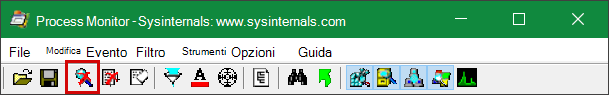         

        <span data-ttu-id="4d6cb-160">Quindi, per cancellare l'acquisizione precedente, seleziona l'icona della gomma.</span><span class="sxs-lookup"><span data-stu-id="4d6cb-160">Next, to clear the earlier capture, select the eraser icon.</span></span>

        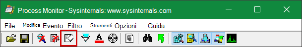

        <span data-ttu-id="4d6cb-162">Oppure usa i tasti di **scelta rapida CTRL+X.**</span><span class="sxs-lookup"><span data-stu-id="4d6cb-162">Or use the keyboard shortcut **Ctrl+X**.</span></span>

    2. <span data-ttu-id="4d6cb-163">Il secondo modo è eseguire la riga **di comando** come amministratore, quindi dal percorso Process Monitor eseguire:</span><span class="sxs-lookup"><span data-stu-id="4d6cb-163">The second way is to run the **command line** as admin, then from the Process Monitor path, run:</span></span>

        
 
        ```console
        Procmon.exe /AcceptEula /Noconnect /Profiling
        ```
        
        >[!TIP] 
        ><span data-ttu-id="4d6cb-165">Rendi la finestra ProcMon il più piccola possibile durante l'acquisizione dei dati in modo da poter avviare e arrestare facilmente la traccia.</span><span class="sxs-lookup"><span data-stu-id="4d6cb-165">Make the ProcMon window as small as possible when capturing data so you can easily start and stop the trace.</span></span>
        > 
        >
    
7. <span data-ttu-id="4d6cb-167">Dopo aver seguito una delle procedure del passaggio 6, verrà visualizzata un'opzione per impostare i filtri.</span><span class="sxs-lookup"><span data-stu-id="4d6cb-167">After following one of the procedures in step 6, you'll next see an option to set filters.</span></span> <span data-ttu-id="4d6cb-168">Selezionare **OK**.</span><span class="sxs-lookup"><span data-stu-id="4d6cb-168">Select **OK**.</span></span> <span data-ttu-id="4d6cb-169">Puoi sempre filtrare i risultati al termine dell'acquisizione.</span><span class="sxs-lookup"><span data-stu-id="4d6cb-169">You can always filter the results after the capture is completed.</span></span>
 
    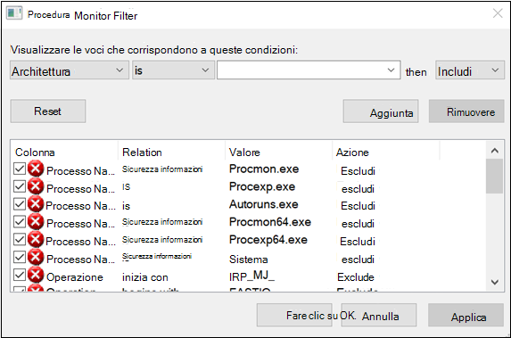 

8. <span data-ttu-id="4d6cb-171">Per avviare l'acquisizione, seleziona di nuovo l'icona della lente di ingrandimento.</span><span class="sxs-lookup"><span data-stu-id="4d6cb-171">To start the capture, select the magnifying glass icon again.</span></span>
     
9. <span data-ttu-id="4d6cb-172">Riprodurre il problema.</span><span class="sxs-lookup"><span data-stu-id="4d6cb-172">Reproduce the problem.</span></span>
 
    >[!TIP] 
    ><span data-ttu-id="4d6cb-173">Attendere che il problema sia riprodotto completamente, quindi prendere nota del timestamp all'avvio della traccia.</span><span class="sxs-lookup"><span data-stu-id="4d6cb-173">Wait for the problem to be fully reproduced, then take note of the timestamp when the trace started.</span></span>

10. <span data-ttu-id="4d6cb-174">Una volta che hai da due a quattro minuti di attività di processo durante la condizione di utilizzo elevato della CPU, interrompi l'acquisizione selezionando l'icona della lente di ingrandimento.</span><span class="sxs-lookup"><span data-stu-id="4d6cb-174">Once you have two to four minutes of process activity during the high CPU usage condition, stop the capture by selecting the magnifying glass icon.</span></span>

11. <span data-ttu-id="4d6cb-175">Per salvare l'acquisizione con un nome univoco e con il formato pml, selezionare **File** e quindi **Salva...**. Assicurati di selezionare i pulsanti di opzione **Tutti gli eventi** e **PML (Native Process Monitor Format).**</span><span class="sxs-lookup"><span data-stu-id="4d6cb-175">To save the capture with a unique name and with the .pml format, select **File** then select **Save...**. Make sure to select the radio buttons **All events** and **Native Process Monitor Format (PML)**.</span></span>

    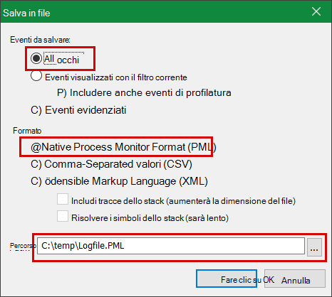

12. <span data-ttu-id="4d6cb-177">Per un migliore monitoraggio, modificare il percorso predefinito `C:\temp\ProcessMonitor\LogFile.PML` da a `C:\temp\ProcessMonitor\%ComputerName%_LogFile_MMDDYEAR_Repro_of_issue.PML` dove:</span><span class="sxs-lookup"><span data-stu-id="4d6cb-177">For better tracking, change the default path from `C:\temp\ProcessMonitor\LogFile.PML` to `C:\temp\ProcessMonitor\%ComputerName%_LogFile_MMDDYEAR_Repro_of_issue.PML` where:</span></span>
    - <span data-ttu-id="4d6cb-178">`%ComputerName%` è il nome del dispositivo</span><span class="sxs-lookup"><span data-stu-id="4d6cb-178">`%ComputerName%` is the device name</span></span>
    - <span data-ttu-id="4d6cb-179">`MMDDYEAR` è il mese, il giorno e l'anno</span><span class="sxs-lookup"><span data-stu-id="4d6cb-179">`MMDDYEAR` is the month, day, and year</span></span>
    -  <span data-ttu-id="4d6cb-180">`Repro_of_issue` è il nome del problema che si sta tentando di riprodurre</span><span class="sxs-lookup"><span data-stu-id="4d6cb-180">`Repro_of_issue` is the name of the issue you're trying to reproduce</span></span>

    >[!TIP] 
    > <span data-ttu-id="4d6cb-181">Se si dispone di un sistema funzionante, è consigliabile ottenere un log di esempio da confrontare.</span><span class="sxs-lookup"><span data-stu-id="4d6cb-181">If you have a working system, you might want to get a sample log to compare.</span></span>

13. <span data-ttu-id="4d6cb-182">Comprimere il file pml e inviarlo al supporto tecnico Microsoft.</span><span class="sxs-lookup"><span data-stu-id="4d6cb-182">Zip the .pml file and submit it to Microsoft support.</span></span>


## <a name="capture-performance-logs-using-windows-performance-recorder"></a><span data-ttu-id="4d6cb-183">Acquisire i registri delle prestazioni Windows Performance Recorder</span><span class="sxs-lookup"><span data-stu-id="4d6cb-183">Capture performance logs using Windows Performance Recorder</span></span>

<span data-ttu-id="4d6cb-184">Puoi usare Windows Performance Recorder (WPR) per includere informazioni aggiuntive nell'invio al supporto Microsoft.</span><span class="sxs-lookup"><span data-stu-id="4d6cb-184">You can use Windows Performance Recorder (WPR) to include additional information in your submission to Microsoft support.</span></span> <span data-ttu-id="4d6cb-185">WPR è un potente strumento di registrazione che crea Event Tracing per Windows registrazioni.</span><span class="sxs-lookup"><span data-stu-id="4d6cb-185">WPR is a powerful recording tool that creates Event Tracing for Windows recordings.</span></span> 

<span data-ttu-id="4d6cb-186">WPR fa parte di Windows Assessment and Deployment Kit (Windows ADK) e può essere scaricato da [Download and install the Windows ADK](/windows-hardware/get-started/adk-install).</span><span class="sxs-lookup"><span data-stu-id="4d6cb-186">WPR is part of the Windows Assessment and Deployment Kit (Windows ADK) and can be downloaded from [Download and install the Windows ADK](/windows-hardware/get-started/adk-install).</span></span> <span data-ttu-id="4d6cb-187">Puoi anche scaricarlo come parte di Windows 10 Software Development Kit [all'indirizzo Windows 10 SDK](https://developer.microsoft.com/windows/downloads/windows-10-sdk/).</span><span class="sxs-lookup"><span data-stu-id="4d6cb-187">You can also download it as part of the Windows 10 Software Development Kit at [Windows 10 SDK](https://developer.microsoft.com/windows/downloads/windows-10-sdk/).</span></span>

<span data-ttu-id="4d6cb-188">Puoi usare l'interfaccia utente WPR seguendo la procedura descritta in Acquisire i log [delle prestazioni usando l'interfaccia utente WPR.](#capture-performance-logs-using-the-wpr-ui)</span><span class="sxs-lookup"><span data-stu-id="4d6cb-188">You can use the WPR user interface by following the steps in [Capture performance logs using the WPR UI](#capture-performance-logs-using-the-wpr-ui).</span></span> 

<span data-ttu-id="4d6cb-189">In alternativa, è anche possibile utilizzare lo strumento da riga di comando *wpr.exe*, disponibile in Windows 8 e versioni successive seguendo la procedura descritta in [Capture performance logs using the WPR CLI.](#capture-performance-logs-using-the-wpr-cli)</span><span class="sxs-lookup"><span data-stu-id="4d6cb-189">Alternatively, you can also use the command-line tool *wpr.exe*, which is available in Windows 8 and later versions  by following the steps in [Capture performance logs using the WPR CLI](#capture-performance-logs-using-the-wpr-cli).</span></span>


### <a name="capture-performance-logs-using-the-wpr-ui"></a><span data-ttu-id="4d6cb-190">Acquisire i log delle prestazioni con l'interfaccia utente WPR</span><span class="sxs-lookup"><span data-stu-id="4d6cb-190">Capture performance logs using the WPR UI</span></span>

>[!TIP]
><span data-ttu-id="4d6cb-191">Se si dispone di più dispositivi in cui si verifica il problema, usa quello con la maggior quantità di RAM.</span><span class="sxs-lookup"><span data-stu-id="4d6cb-191">If you have multiple devices where the issue is occurring, use the one which has the most amount of RAM.</span></span>

1. <span data-ttu-id="4d6cb-192">Scaricare e installare WPR.</span><span class="sxs-lookup"><span data-stu-id="4d6cb-192">Download and install WPR.</span></span>

2. <span data-ttu-id="4d6cb-193">In *Windows kit fare* clic con il pulsante destro del mouse su Windows Performance **Recorder.**</span><span class="sxs-lookup"><span data-stu-id="4d6cb-193">Under *Windows Kits*, right-click **Windows Performance Recorder**.</span></span> 

    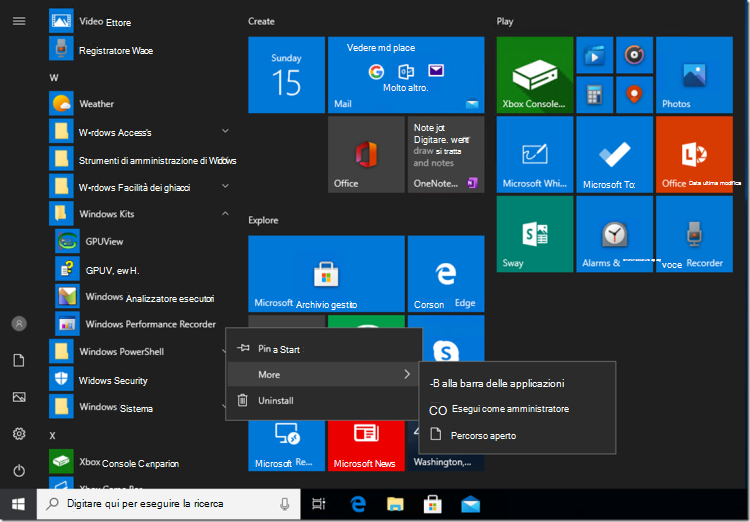

    <span data-ttu-id="4d6cb-195">Selezionare **Altro**.</span><span class="sxs-lookup"><span data-stu-id="4d6cb-195">Select **More**.</span></span> <span data-ttu-id="4d6cb-196">Selezionare **Esegui come amministratore**.</span><span class="sxs-lookup"><span data-stu-id="4d6cb-196">Select **Run as administrator**.</span></span>

3. <span data-ttu-id="4d6cb-197">Quando viene visualizzata la finestra di dialogo Controllo account utente, selezionare **Sì**.</span><span class="sxs-lookup"><span data-stu-id="4d6cb-197">When the User Account Control dialog box appears, select **Yes**.</span></span>

    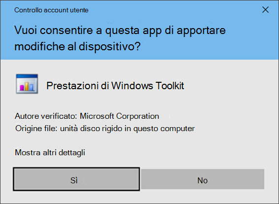

4. <span data-ttu-id="4d6cb-199">Scarica quindi il profilo [di analisi di Microsoft Defender for Endpoint](https://github.com/YongRhee-MDE/Scripts/blob/master/MDAV.wprp) e salva con nome in una cartella come `MDAV.wprp` `C:\temp` .</span><span class="sxs-lookup"><span data-stu-id="4d6cb-199">Next, download the [Microsoft Defender for Endpoint analysis](https://github.com/YongRhee-MDE/Scripts/blob/master/MDAV.wprp) profile and save as `MDAV.wprp` to a folder like `C:\temp`.</span></span> 
     
5. <span data-ttu-id="4d6cb-200">Nella finestra di dialogo WPR selezionare **Altre opzioni.**</span><span class="sxs-lookup"><span data-stu-id="4d6cb-200">On the WPR dialog box, select **More options**.</span></span>

    

6. <span data-ttu-id="4d6cb-202">Seleziona **Aggiungi profili...** e seleziona il percorso del `MDAV.wprp` file.</span><span class="sxs-lookup"><span data-stu-id="4d6cb-202">Select **Add Profiles...** and browse to the path of the `MDAV.wprp` file.</span></span>

7. <span data-ttu-id="4d6cb-203">Dopo di che, dovresti vedere un nuovo set di profili in *Misurazioni* personalizzate denominato *Microsoft Defender per l'analisi endpoint* sotto di esso.</span><span class="sxs-lookup"><span data-stu-id="4d6cb-203">After that, you should see a new profile set under *Custom measurements* named *Microsoft Defender for Endpoint analysis* underneath it.</span></span>

    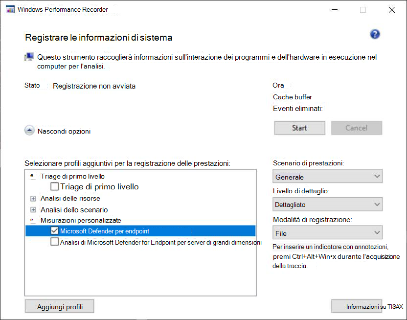

    >[!WARNING]
    ><span data-ttu-id="4d6cb-205">Se il Windows Server dispone di almeno 64 GB di RAM, utilizzare la misura personalizzata `Microsoft Defender for Endpoint analysis for large servers` anziché `Microsoft Defender for Endpoint analysis` .</span><span class="sxs-lookup"><span data-stu-id="4d6cb-205">If your Windows Server has 64 GB of RAM or more, use the custom measurement `Microsoft Defender for Endpoint analysis for large servers` instead of `Microsoft Defender for Endpoint analysis`.</span></span> <span data-ttu-id="4d6cb-206">In caso contrario, il sistema potrebbe consumare una quantità elevata di memoria o buffer del pool non di paging che può causare instabilità del sistema.</span><span class="sxs-lookup"><span data-stu-id="4d6cb-206">Otherwise, your system could consume a high amount of non-paged pool memory or buffers which can lead to system instability.</span></span> <span data-ttu-id="4d6cb-207">È possibile scegliere i profili da aggiungere espandendo **Analisi risorse.**</span><span class="sxs-lookup"><span data-stu-id="4d6cb-207">You can choose which profiles to add by expanding **Resource Analysis**.</span></span> <span data-ttu-id="4d6cb-208">Questo profilo personalizzato fornisce il contesto necessario per un'analisi approfondita delle prestazioni.</span><span class="sxs-lookup"><span data-stu-id="4d6cb-208">This custom profile provides the necessary context for in-depth performance analysis.</span></span>
 
8. <span data-ttu-id="4d6cb-209">Per usare il profilo di analisi dettagliata di Microsoft Defender for Endpoint per la misurazione personalizzata nell'interfaccia utente WPR:</span><span class="sxs-lookup"><span data-stu-id="4d6cb-209">To use the custom measurement Microsoft Defender for Endpoint verbose analysis profile in the WPR UI:</span></span>

    1. <span data-ttu-id="4d6cb-210">Verificare che non sia selezionato alcun profilo nei gruppi Di *triage* di primo livello, *Analisi risorse* *e Analisi scenario.*</span><span class="sxs-lookup"><span data-stu-id="4d6cb-210">Ensure no profiles are selected under the *First-level triage*, *Resource Analysis* and *Scenario Analysis* groups.</span></span>
    2. <span data-ttu-id="4d6cb-211">Selezionare **Misurazioni personalizzate.**</span><span class="sxs-lookup"><span data-stu-id="4d6cb-211">Select **Custom measurements**.</span></span>
    3. <span data-ttu-id="4d6cb-212">Selezionare **Microsoft Defender per l'analisi degli endpoint.**</span><span class="sxs-lookup"><span data-stu-id="4d6cb-212">Select **Microsoft Defender for Endpoint analysis**.</span></span>
    4. <span data-ttu-id="4d6cb-213">Selezionare **Dettagliato in** *Livello* di dettaglio.</span><span class="sxs-lookup"><span data-stu-id="4d6cb-213">Select **Verbose** under *Detail* level.</span></span>
    1. <span data-ttu-id="4d6cb-214">Selezionare **File** o **Memoria in** Modalità di registrazione.</span><span class="sxs-lookup"><span data-stu-id="4d6cb-214">Select **File** or **Memory** under Logging mode.</span></span> 

    >[!important]
    ><span data-ttu-id="4d6cb-215">È consigliabile selezionare *File* per utilizzare la modalità di registrazione dei file se il problema di prestazioni può essere riprodotto direttamente dall'utente.</span><span class="sxs-lookup"><span data-stu-id="4d6cb-215">You should select *File* to use the file logging mode if the performance issue can be reproduced directly by the user.</span></span> <span data-ttu-id="4d6cb-216">La maggior parte dei problemi rientra in questa categoria.</span><span class="sxs-lookup"><span data-stu-id="4d6cb-216">Most issues fall under this category.</span></span> <span data-ttu-id="4d6cb-217">Tuttavia, se l'utente non può riprodurre direttamente il problema, ma può facilmente notarlo quando si verifica il problema, l'utente deve selezionare *Memoria* per usare la modalità di registrazione della memoria.</span><span class="sxs-lookup"><span data-stu-id="4d6cb-217">However, if the user cannot directly reproduce the issue but can easily notice it once the issue occurs, the user should select *Memory* to use the memory logging mode.</span></span> <span data-ttu-id="4d6cb-218">In questo modo il registro di traccia non si gonfierà eccessivamente a causa del tempo di esecuzione lungo.</span><span class="sxs-lookup"><span data-stu-id="4d6cb-218">This ensures that the trace log will not inflate excessively due to the long run time.</span></span>

9. <span data-ttu-id="4d6cb-219">Ora sei pronto per raccogliere i dati.</span><span class="sxs-lookup"><span data-stu-id="4d6cb-219">Now you're ready to collect data.</span></span> <span data-ttu-id="4d6cb-220">Chiudere tutte le applicazioni non rilevanti per riprodurre il problema di prestazioni.</span><span class="sxs-lookup"><span data-stu-id="4d6cb-220">Exit all the applications that are not relevant to reproducing the performance issue.</span></span> <span data-ttu-id="4d6cb-221">È possibile selezionare **Opzioni nascondi** per mantenere piccolo lo spazio occupato dalla finestra WPR.</span><span class="sxs-lookup"><span data-stu-id="4d6cb-221">You can select **Hide options** to keep the space occupied by the WPR window small.</span></span>

    

    >[!TIP]
    ><span data-ttu-id="4d6cb-223">Provare ad avviare la traccia con un numero intero di secondi.</span><span class="sxs-lookup"><span data-stu-id="4d6cb-223">Try starting the trace at whole number seconds.</span></span> <span data-ttu-id="4d6cb-224">Ad esempio, 01:30:00.</span><span class="sxs-lookup"><span data-stu-id="4d6cb-224">For instance, 01:30:00.</span></span> <span data-ttu-id="4d6cb-225">In questo modo sarà più semplice analizzare i dati.</span><span class="sxs-lookup"><span data-stu-id="4d6cb-225">This will make it easier to analyze the data.</span></span> <span data-ttu-id="4d6cb-226">Prova anche a tenere traccia del timestamp esattamente quando il problema viene riprodotto.</span><span class="sxs-lookup"><span data-stu-id="4d6cb-226">Also try to keep track of the timestamp of exactly when the issue is reproduced.</span></span>

10. <span data-ttu-id="4d6cb-227">Selezionare **Start**.</span><span class="sxs-lookup"><span data-stu-id="4d6cb-227">Select **Start**.</span></span>

    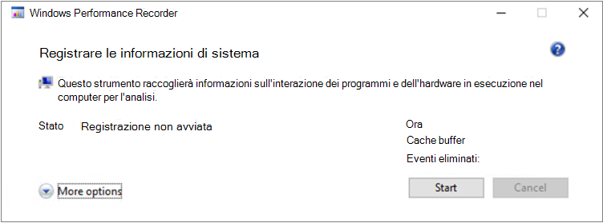

11. <span data-ttu-id="4d6cb-229">Riprodurre il problema.</span><span class="sxs-lookup"><span data-stu-id="4d6cb-229">Reproduce the issue.</span></span>

    >[!TIP]
    ><span data-ttu-id="4d6cb-230">Mantenere la raccolta dati non più di cinque minuti.</span><span class="sxs-lookup"><span data-stu-id="4d6cb-230">Keep the data collection to no more than five minutes.</span></span> <span data-ttu-id="4d6cb-231">Da due a tre minuti è un intervallo valido poiché viene raccolta una grande quantità di dati.</span><span class="sxs-lookup"><span data-stu-id="4d6cb-231">Two to three minutes is a good range since a lot of data is being collected.</span></span>

12. <span data-ttu-id="4d6cb-232">Selezionare **Salva**.</span><span class="sxs-lookup"><span data-stu-id="4d6cb-232">Select **Save**.</span></span>

    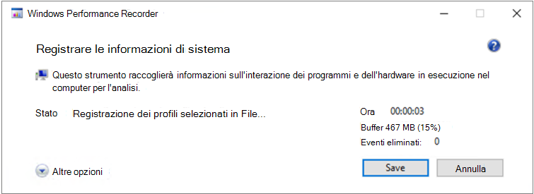

13. <span data-ttu-id="4d6cb-234">Compilare **Digitare una descrizione dettagliata del problema:** con informazioni sul problema e su come è stato riprodotto il problema.</span><span class="sxs-lookup"><span data-stu-id="4d6cb-234">Fill up **Type in a detailed description of the problem:** with information about the problem and how you reproduced the issue.</span></span>

    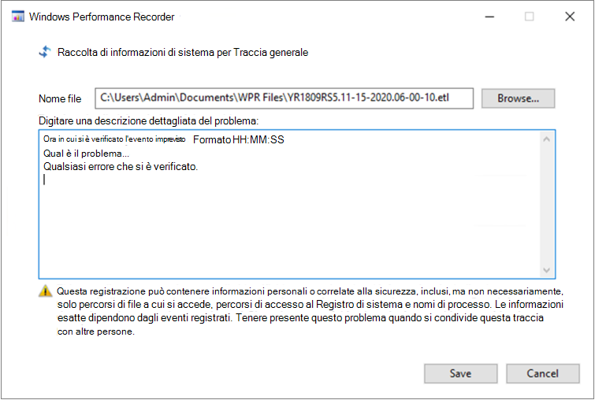

    1. <span data-ttu-id="4d6cb-236">Selezionare **Nome file:** per determinare dove verrà salvato il file di traccia.</span><span class="sxs-lookup"><span data-stu-id="4d6cb-236">Select **File Name:** to determine where your trace file will be saved.</span></span> <span data-ttu-id="4d6cb-237">Per impostazione predefinita, 1.is salvato in `%user%\Documents\WPR Files\` .</span><span class="sxs-lookup"><span data-stu-id="4d6cb-237">By default, it 1.is saved to `%user%\Documents\WPR Files\`.</span></span>
    1. <span data-ttu-id="4d6cb-238">Selezionare **Salva**.</span><span class="sxs-lookup"><span data-stu-id="4d6cb-238">Select **Save**.</span></span>

14. <span data-ttu-id="4d6cb-239">Attendere durante l'unione della traccia.</span><span class="sxs-lookup"><span data-stu-id="4d6cb-239">Wait while the trace is being merged.</span></span>

    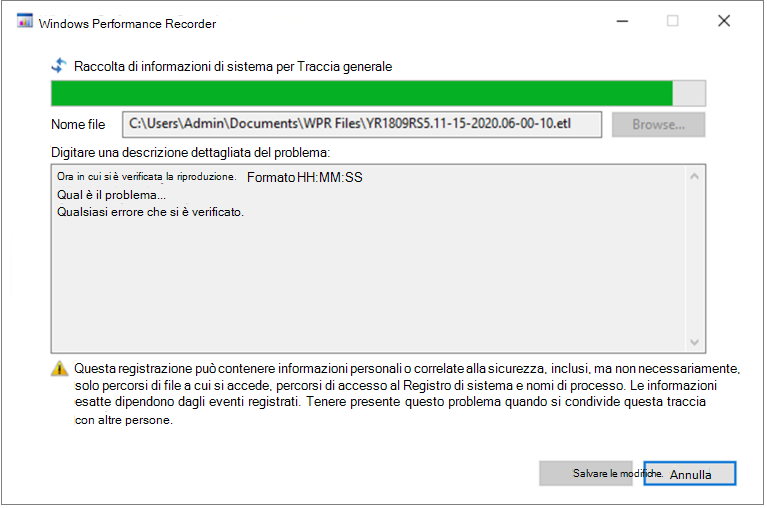

15. <span data-ttu-id="4d6cb-241">Dopo aver salvato la traccia, selezionare **Apri cartella.**</span><span class="sxs-lookup"><span data-stu-id="4d6cb-241">Once the trace is saved, select **Open folder**.</span></span>

    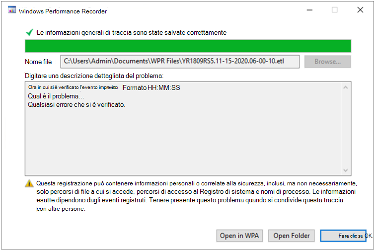

    <span data-ttu-id="4d6cb-243">Includi sia il file che la cartella nell'invio al supporto Tecnico Microsoft.</span><span class="sxs-lookup"><span data-stu-id="4d6cb-243">Include both the file and the folder in your submission to Microsoft support.</span></span>

    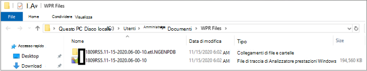

### <a name="capture-performance-logs-using-the-wpr-cli"></a><span data-ttu-id="4d6cb-245">Acquisire i registri delle prestazioni tramite l'interfaccia della riga di comando WPR</span><span class="sxs-lookup"><span data-stu-id="4d6cb-245">Capture performance logs using the WPR CLI</span></span>

<span data-ttu-id="4d6cb-246">Lo strumento da riga di *comandowpr.exe* parte del sistema operativo a partire da Windows 8.</span><span class="sxs-lookup"><span data-stu-id="4d6cb-246">The command-line tool *wpr.exe* is part of the operating system starting with Windows 8.</span></span> <span data-ttu-id="4d6cb-247">Per raccogliere una traccia WPR tramite lo strumento da riga di comando wpr.exe:</span><span class="sxs-lookup"><span data-stu-id="4d6cb-247">To collect a WPR trace using the command-line tool wpr.exe:</span></span>

1. <span data-ttu-id="4d6cb-248">Scaricare **[il profilo di analisi di Microsoft Defender for Endpoint](https://github.com/YongRhee-MDE/Scripts/blob/master/MDAV.wprp)** per le tracce delle prestazioni in un file denominato in una directory `MDAV.wprp` locale, ad esempio `C:\traces` .</span><span class="sxs-lookup"><span data-stu-id="4d6cb-248">Download **[Microsoft Defender for Endpoint analysis](https://github.com/YongRhee-MDE/Scripts/blob/master/MDAV.wprp)** profile for performance traces to a file named `MDAV.wprp` in a local directory such as `C:\traces`.</span></span>

3. <span data-ttu-id="4d6cb-249">Fai clic con il pulsante **destro del mouse** sull'icona Del menu Start e scegli Windows PowerShell **(Amministratore)** o Prompt dei comandi **(amministratore)** per aprire una finestra del prompt dei comandi dell'amministratore.</span><span class="sxs-lookup"><span data-stu-id="4d6cb-249">Right-click the **Start Menu** icon and select **Windows PowerShell (Admin)** or **Command Prompt (Admin)** to open an Admin command prompt window.</span></span>

4. <span data-ttu-id="4d6cb-250">Quando viene visualizzata la finestra di dialogo Controllo account utente, selezionare **Sì**.</span><span class="sxs-lookup"><span data-stu-id="4d6cb-250">When the User Account Control dialog box appears, select **Yes**.</span></span>

5. <span data-ttu-id="4d6cb-251">Al prompt con privilegi elevati, eseguire il comando seguente per avviare una traccia delle prestazioni di Microsoft Defender for Endpoint:</span><span class="sxs-lookup"><span data-stu-id="4d6cb-251">At the elevated prompt, run the following command to start a Microsoft Defender for Endpoint performance trace:</span></span>

    ```console
    wpr.exe -start C:\traces\MDAV.wprp!WD.Verbose -filemode
    ```
    
    >[!WARNING]
    ><span data-ttu-id="4d6cb-252">Se il Windows Server dispone di almeno 64 GB di RAM, utilizzare rispettivamente i profili e anziché `WDForLargeServers.Light` `WDForLargeServers.Verbose` i profili e `WD.Light` `WD.Verbose` .</span><span class="sxs-lookup"><span data-stu-id="4d6cb-252">If your Windows Server has 64 GB or RAM or more, use profiles `WDForLargeServers.Light` and `WDForLargeServers.Verbose` instead of profiles `WD.Light` and `WD.Verbose`, respectively.</span></span> <span data-ttu-id="4d6cb-253">In caso contrario, il sistema potrebbe consumare una quantità elevata di memoria o buffer del pool non di paging che può causare instabilità del sistema.</span><span class="sxs-lookup"><span data-stu-id="4d6cb-253">Otherwise, your system could consume a high amount of non-paged pool memory or buffers which can lead to system instability.</span></span>

6. <span data-ttu-id="4d6cb-254">Riprodurre il problema.</span><span class="sxs-lookup"><span data-stu-id="4d6cb-254">Reproduce the issue.</span></span>

    >[!TIP]
    ><span data-ttu-id="4d6cb-255">Mantenere la raccolta dati non più di cinque minuti.</span><span class="sxs-lookup"><span data-stu-id="4d6cb-255">Keep the data collection no to more than five minutes.</span></span>  <span data-ttu-id="4d6cb-256">A seconda dello scenario, da due a tre minuti è un intervallo valido poiché viene raccolta una grande quantità di dati.</span><span class="sxs-lookup"><span data-stu-id="4d6cb-256">Depending on the scenario, two to three minutes is a good range since a lot of data is being collected.</span></span>

7. <span data-ttu-id="4d6cb-257">Al prompt dei comandi con privilegi elevati, eseguire il comando seguente per arrestare l'analisi delle prestazioni, assicurandoti di fornire informazioni sul problema e su come è stato riprodotto il problema:</span><span class="sxs-lookup"><span data-stu-id="4d6cb-257">At the elevated prompt, run the following command to stop the performance trace, making sure to provide information about the problem and how you reproduced the issue:</span></span>

    ```console
    wpr.exe -stop merged.etl "Timestamp when the issue was reproduced, in HH:MM:SS format" "Description of the issue" "Any error that popped up"
    ```

8. <span data-ttu-id="4d6cb-258">Attendere che la traccia sia unita.</span><span class="sxs-lookup"><span data-stu-id="4d6cb-258">Wait until the trace is merged.</span></span> 

9. <span data-ttu-id="4d6cb-259">Includi sia il file che la cartella nell'invio al supporto Tecnico Microsoft.</span><span class="sxs-lookup"><span data-stu-id="4d6cb-259">Include both the file and the folder in your submission to Microsoft support.</span></span>

## <a name="see-also"></a><span data-ttu-id="4d6cb-260">Vedere anche</span><span class="sxs-lookup"><span data-stu-id="4d6cb-260">See also</span></span>

- [<span data-ttu-id="4d6cb-261">Raccogliere Antivirus Microsoft Defender di diagnostica</span><span class="sxs-lookup"><span data-stu-id="4d6cb-261">Collect Microsoft Defender Antivirus diagnostic data</span></span>](collect-diagnostic-data.md)
- [<span data-ttu-id="4d6cb-262">Configurare e convalidare le esclusioni per Antivirus Microsoft Defender analisi</span><span class="sxs-lookup"><span data-stu-id="4d6cb-262">Configure and validate exclusions for Microsoft Defender Antivirus scans</span></span>](configure-exclusions-microsoft-defender-antivirus.md)
