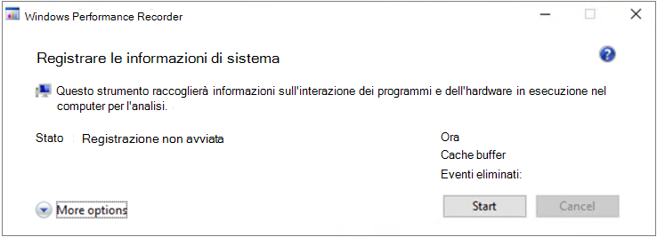

# <a name="troubleshoot-performance-issues-related-to-real-time-protection"></a>Risolvere i problemi di prestazioni correlati alla protezione in tempo reale


[!INCLUDE [Microsoft 365 Defender rebranding](../../includes/microsoft-defender.md)]


**Si applica a:**

- [Microsoft Defender per endpoint](https://go.microsoft.com/fwlink/p/?linkid=2146631)
 
Se il sistema presenta un utilizzo elevato della CPU o problemi di prestazioni correlati al servizio di protezione in tempo reale in Microsoft Defender for Endpoint, è possibile inviare un ticket al supporto Tecnico Microsoft. Seguire i passaggi descritti in [Collect Microsoft Defender AV diagnostic data](/collect-diagnostic-data.md).

In quanto amministratore, puoi anche risolvere questi problemi da solo. 

Prima di tutto, potresti voler controllare se il problema è causato da un altro software. Leggere [Controlla con il fornitore per le esclusioni antivirus](#check-with-vendor-for-antivirus-exclusions).

In caso contrario, è possibile identificare il software correlato al problema di prestazioni identificato seguendo la procedura descritta in [Analyze the Microsoft Protection Log](#analyze-the-microsoft-protection-log). 

Puoi anche fornire ulteriori log per l'invio al supporto Microsoft seguendo la procedura descritta in:
- [Acquisire i registri dei processi con Process Monitor](#capture-process-logs-using-process-monitor)
- [Acquisire i registri delle prestazioni con Windows Performance Recorder](#capture-performance-logs-using-windows-performance-recorder) 

## <a name="check-with-vendor-for-antivirus-exclusions"></a>Rivolgersi al fornitore per le esclusioni antivirus

Se è possibile identificare rapidamente il software che influisce sulle prestazioni del sistema, passare alla Knowledge Base o al Centro supporto tecnico del fornitore del software. Cerca se hanno suggerimenti sulle esclusioni antivirus. Se il sito Web del fornitore non li ha, è possibile aprire un ticket di supporto con loro e chiedere loro di pubblicarne uno. 

È consigliabile che i fornitori di software seguano le varie linee guida in [Partnership con il settore per ridurre al minimo i falsi positivi.](https://www.microsoft.com/security/blog/2018/08/16/partnering-with-the-industry-to-minimize-false-positives/) Il fornitore può inviare il proprio software tramite il portale [MDSI (Microsoft Defender Security Intelligence).](https://www.microsoft.com/wdsi/filesubmission?persona=SoftwareDeveloper)


## <a name="analyze-the-microsoft-protection-log"></a>Analizzare il registro di protezione Microsoft

In **MPLog-xxxxxxxx-xxxxxx.log** è possibile trovare le informazioni stimate sull'impatto sulle prestazioni del software in esecuzione come *EstimatedImpact*:
    
`Per-process counts:ProcessImageName: smsswd.exe, TotalTime: 6597, Count: 1406, MaxTime: 609, MaxTimeFile: \Device\HarddiskVolume3\_SMSTaskSequence\Packages\WQ1008E9\Files\FramePkg.exe, EstimatedImpact: 65%`

| Nome del campo | Descrizione |
|---|---|
|ProcessImageName   | Nome immagine processo |
| TotalTime | Durata cumulativa in millisecondi trascorsa nelle analisi dei file a cui accede questo processo |
|Count | Numero di file analizzati a cui accede questo processo |
|MaxTime |  Durata in millisecondi nella singola analisi più lunga di un file a cui si accede da questo processo |
| MaxTimeFile | Percorso del file a cui accede questo processo per il quale è stata registrata l'analisi più `MaxTime` lunga della durata |
| EstimatedImpact | Percentuale di tempo impiegato nelle analisi per i file a cui accede questo processo al di fuori del periodo in cui questo processo ha riscontrato l'attività di analisi |

Se l'impatto sulle prestazioni è elevato, provare ad aggiungere il processo alle esclusioni percorso/processo seguendo la procedura descritta in Configurare e convalidare le esclusioni per le analisi di [Microsoft Defender Antivirus.](collect-diagnostic-data.md)

Se il passaggio precedente non risolve il problema, puoi raccogliere ulteriori informazioni tramite [Process Monitor](#capture-process-logs-using-process-monitor) o Windows [Performance Recorder](#capture-performance-logs-using-windows-performance-recorder) nelle sezioni seguenti. 
     
## <a name="capture-process-logs-using-process-monitor"></a>Acquisire i registri dei processi con Process Monitor

Process Monitor (ProcMon) è uno strumento di monitoraggio avanzato che può mostrare processi in tempo reale. Puoi usarlo per acquisire il problema di prestazioni in corso. 

1. Scaricare [Process Monitor v3.60](/sysinternals/downloads/procmon) in una cartella come `C:\temp` . 

2. Per rimuovere il contrassegno del file dal Web:
    1. Fare clic con il **pulsante destroProcessMonitor.zip** e scegliere **Proprietà.**
    1. Nella scheda *Generale* cercare *Sicurezza*.
    1. Seleziona la casella accanto **a Sblocca**.
    1. Selezionare **Applica**.
    
     

3. Decomprimere il file in in `C:\temp` modo che il percorso della cartella sia `C:\temp\ProcessMonitor` . 

4. Copia **ProcMon.exe**  nel client Windows o nel server Windows che stai risoluzione dei problemi.  

5. Prima di eseguire ProcMon, assicurati che tutte le altre applicazioni non correlate al problema di utilizzo elevato della CPU siano chiuse. In questo modo si riduce al minimo il numero di processi da controllare.

6. Puoi avviare ProcMon in due modi.
    1. Fare clic con il **ProcMon.exe** e selezionare **Esegui come amministratore.** 
    

        Poiché la registrazione viene avviata automaticamente, selezionare l'icona della lente di ingrandimento per interrompere l'acquisizione corrente o utilizzare i tasti **di scelta rapida CTRL+E.**
 
        

        Per verificare di aver interrotto l'acquisizione, verifica se l'icona della lente di ingrandimento viene visualizzata con una X rossa.

                 

        Quindi, per cancellare l'acquisizione precedente, seleziona l'icona della gomma.

        

        Oppure usa i tasti di **scelta rapida CTRL+X.**

    2. Il secondo modo è eseguire la riga **di comando** come amministratore, quindi dal percorso Process Monitor eseguire:

        
 
        ```console
        Procmon.exe /AcceptEula /Noconnect /Profiling
        ```
        
        >[!TIP] 
        >Rendi la finestra ProcMon il più piccola possibile durante l'acquisizione dei dati in modo da poter avviare e arrestare facilmente la traccia.
        > 
        >
    
7. Dopo aver seguito una delle procedure del passaggio 6, verrà visualizzata un'opzione per impostare i filtri. Seleziona **OK**. Puoi sempre filtrare i risultati al termine dell'acquisizione.
 
     

8. Per avviare l'acquisizione, seleziona di nuovo l'icona della lente di ingrandimento.
     
9. Riprodurre il problema.
 
    >[!TIP] 
    >Attendere che il problema sia riprodotto completamente, quindi prendere nota del timestamp all'avvio della traccia.
    

10. Una volta che hai da due a quattro minuti di attività di processo durante la condizione di utilizzo elevato della CPU, interrompi l'acquisizione selezionando l'icona della lente di ingrandimento.

11. Per salvare l'acquisizione con un nome univoco e con il formato pml, selezionare **File** e quindi **Salva...**. Assicurati di selezionare i pulsanti di opzione **Tutti gli eventi** e **PML (Native Process Monitor Format).**

    

12. Per un migliore monitoraggio, modificare il percorso predefinito `C:\temp\ProcessMonitor\LogFile.PML` da a `C:\temp\ProcessMonitor\%ComputerName%_LogFile_MMDDYEAR_Repro_of_issue.PML` dove:
    - `%ComputerName%` è il nome del dispositivo
    - `MMDDYEAR` è il mese, il giorno e l'anno
    -  `Repro_of_issue` è il nome del problema che si sta tentando di riprodurre

    >[!TIP] 
    > Se si dispone di un sistema funzionante, è consigliabile ottenere un log di esempio da confrontare.

13. Comprimere il file pml e inviarlo al supporto tecnico Microsoft.


## <a name="capture-performance-logs-using-windows-performance-recorder"></a>Acquisire i registri delle prestazioni con Windows Performance Recorder

Puoi usare Windows Performance Recorder (WPR) per includere informazioni aggiuntive nell'invio al supporto Microsoft. WPR è un potente strumento di registrazione che crea Traccia eventi per le registrazioni di Windows. 

WPR fa parte di Windows Assessment and Deployment Kit (Windows ADK) e può essere scaricato da Scaricare e [installare Windows ADK.](/windows-hardware/get-started/adk-install) Puoi anche scaricarlo come parte di Windows 10 Software Development Kit in [Windows 10 SDK.](https://developer.microsoft.com/windows/downloads/windows-10-sdk/)

Puoi usare l'interfaccia utente WPR seguendo la procedura descritta in Acquisire i log [delle prestazioni usando l'interfaccia utente WPR.](#capture-performance-logs-using-the-wpr-ui) 

In alternativa, puoi anche usare lo strumento da riga di comando *wpr.exe*, disponibile in Windows 8 e versioni successive seguendo la procedura descritta in [Capture performance logs using the WPR CLI.](#capture-performance-logs-using-the-wpr-cli)


### <a name="capture-performance-logs-using-the-wpr-ui"></a>Acquisire i log delle prestazioni con l'interfaccia utente WPR

>[!TIP]
>Se si dispone di più dispositivi in cui si verifica il problema, usa quello con la maggior quantità di RAM.

1. Scaricare e installare WPR.

2. In *Windows Kit fare* clic con il pulsante destro del mouse su **Registratore prestazioni Windows.** 

    

    Selezionare **Altro**. Selezionare **Esegui come amministratore**.

3. Quando viene visualizzata la finestra di dialogo Controllo account utente, selezionare **Sì**.

    

4. Scarica quindi il profilo [di analisi di Microsoft Defender for Endpoint](https://github.com/YongRhee-MDE/Scripts/blob/master/MDAV.wprp) e salva con nome in una cartella come `WD.wprp` `C:\temp` . 
     
5. Nella finestra di dialogo WPR selezionare **Altre opzioni.**

    

6. Seleziona **Aggiungi profili...** e seleziona il percorso del `WD.wprp` file.

7. Dopo di che, dovresti vedere un nuovo set di profili in *Misurazioni* personalizzate denominato *Microsoft Defender per l'analisi endpoint* sotto di esso.
    
    >[!WARNING]
    >Se windows Server dispone di almeno 64 GB di RAM, usa la misura personalizzata `Microsoft Defender for Endpoint analysis for large servers` invece di `Microsoft Defender for Endpoint analysis` . In caso contrario, il sistema potrebbe consumare una quantità elevata di memoria o buffer del pool non di paging che può causare instabilità del sistema. È possibile scegliere i profili da aggiungere espandendo **Analisi risorse.** Questo profilo personalizzato fornisce il contesto necessario per un'analisi approfondita delle prestazioni.
 
8. Per usare il profilo di analisi dettagliata di Microsoft Defender for Endpoint per la misurazione personalizzata nell'interfaccia utente WPR:

    1. Verificare che non sia selezionato alcun profilo nei gruppi Di *triage* di primo livello, *Analisi risorse* *e Analisi scenario.*
    2. Selezionare **Misurazioni personalizzate.**
    3. Selezionare **Microsoft Defender per l'analisi degli endpoint.**
    4. Selezionare **Dettagliato in** *Livello* di dettaglio.
    1. Selezionare **File** o **Memoria in** Modalità di registrazione. 

    >[!important]
    >È consigliabile selezionare *File* per utilizzare la modalità di registrazione dei file se il problema di prestazioni può essere riprodotto direttamente dall'utente. La maggior parte dei problemi rientra in questa categoria. Tuttavia, se l'utente non può riprodurre direttamente il problema, ma può facilmente notarlo quando si verifica il problema, l'utente deve selezionare *Memoria* per usare la modalità di registrazione della memoria. In questo modo il registro di traccia non si gonfierà eccessivamente a causa del tempo di esecuzione lungo.

9. Ora sei pronto per raccogliere i dati. Chiudere tutte le applicazioni non rilevanti per riprodurre il problema di prestazioni. È possibile selezionare **Opzioni nascondi** per mantenere piccolo lo spazio occupato dalla finestra WPR.

    

    >[!TIP]
    >Provare ad avviare la traccia con un numero intero di secondi. Ad esempio, 01:30:00. In questo modo sarà più semplice analizzare i dati. Prova anche a tenere traccia del timestamp esattamente quando il problema viene riprodotto.

10. Selezionare **Start**.

    

11. Riprodurre il problema.

    >[!TIP]
    >Mantenere la raccolta dati non più di cinque minuti. Da due a tre minuti è un intervallo valido poiché viene raccolta una grande quantità di dati.

12. Selezionare **Salva**.

    

13. Compilare **Digitare una descrizione dettagliata del problema:** con informazioni sul problema e su come è stato riprodotto il problema.

    

    1. Selezionare **Nome file:** per determinare dove verrà salvato il file di traccia. Per impostazione predefinita, 1.is salvato in `%user%\Documents\WPR Files\` . 
    1. Selezionare **Salva**. 

14. Attendere durante l'unione della traccia.

    

15. Dopo aver salvato la traccia, selezionare **Apri cartella.**

    

    Includi sia il file che la cartella nell'invio al supporto Tecnico Microsoft.

    

### <a name="capture-performance-logs-using-the-wpr-cli"></a>Acquisire i registri delle prestazioni tramite l'interfaccia della riga di comando WPR

Lo strumento da riga di *comandowpr.exe* parte del sistema operativo a partire da Windows 8. Per raccogliere una traccia WPR tramite lo strumento da riga di comando wpr.exe:

1. Scaricare **[il profilo di analisi di Microsoft Defender for Endpoint](https://github.com/YongRhee-MDE/Scripts/blob/master/MDAV.wprp)** per le tracce delle prestazioni in un file denominato in una directory `WD.wprp` locale, ad esempio `C:\traces` .

3. Fai clic con il pulsante destro del mouse sull'icona **del menu Start** e scegli Windows **Powershell (amministratore)** o Prompt dei comandi **(amministratore)** per aprire una finestra del prompt dei comandi dell'amministratore.

4. Quando viene visualizzata la finestra di dialogo Controllo account utente, selezionare **Sì**.

5. Al prompt con privilegi elevati, eseguire il comando seguente per avviare una traccia delle prestazioni di Microsoft Defender for Endpoint:

    ```console
    wpr.exe -start C:\traces\WD.wprp!WD.Verbose -filemode
    ```
    
    >[!WARNING]
    >Se windows Server dispone di almeno 64 GB di RAM, usa i profili e invece `WDForLargeServers.Light` di profili e , `WDForLargeServers.Verbose` `WD.Light` `WD.Verbose` rispettivamente. In caso contrario, il sistema potrebbe consumare una quantità elevata di memoria o buffer del pool non di paging che può causare instabilità del sistema.

6. Riprodurre il problema.

    >[!TIP]
    >Mantenere la raccolta dati non più di cinque minuti.  A seconda dello scenario, da due a tre minuti è un intervallo valido poiché viene raccolta una grande quantità di dati.

7. Al prompt dei comandi con privilegi elevati, eseguire il comando seguente per arrestare l'analisi delle prestazioni, assicurandoti di fornire informazioni sul problema e su come è stato riprodotto il problema:

    ```console
    wpr.exe -stop merged.etl "Timestamp when the issue was reproduced, in HH:MM:SS format" "Description of the issue" "Any error that popped up"
    ```

8. Attendere che la traccia sia unita. 

9. Includi sia il file che la cartella nell'invio al supporto Tecnico Microsoft.

## <a name="see-also"></a>Vedere anche

- [Raccogliere i dati di diagnostica di Microsoft Defender AV](collect-diagnostic-data.md)
- [Configurare e convalidare le esclusioni per le analisi di Microsoft Defender Antivirus](configure-exclusions-microsoft-defender-antivirus.md)