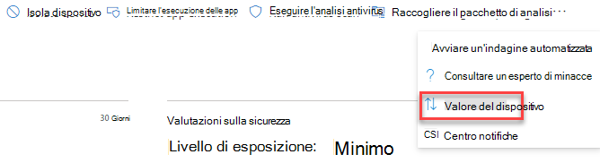
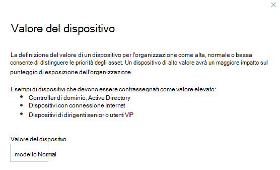

# Assegna valore dispositivo - gestione di minacce e vulnerabilità

[!INCLUDE [Microsoft 365 Defender rebranding](../../includes/microsoft-defender.md)]

**Si applica a:**

- [Microsoft Defender per endpoint](https://go.microsoft.com/fwlink/?linkid=2154037)
- [Minaccia e gestione delle vulnerabilità](next-gen-threat-and-vuln-mgt.md)
- [Microsoft 365 Defender](https://go.microsoft.com/fwlink/?linkid=2118804)

> Vuoi provare Microsoft Defender per Endpoint? [Iscriversi per una versione di valutazione gratuita.](https://www.microsoft.com/microsoft-365/windows/microsoft-defender-atp?ocid=docs-wdatp-portaloverview-abovefoldlink)

[!include[Prerelease information](../../includes/prerelease.md)]

La definizione del valore di un dispositivo consente di distinguere le priorità degli asset. Il valore del dispositivo viene usato per incorporare la propensione al rischio di un singolo asset nel calcolo gestione di minacce e vulnerabilità del punteggio di esposizione. I dispositivi assegnati come "valore elevato" riceveranno più peso.

Puoi anche usare [l'API set device value](set-device-value.md).

Opzioni valore dispositivo:

- Bassa
- Normale (impostazione predefinita)
- Fortemente

Esempi di dispositivi a cui assegnare un valore elevato:

- Controller di dominio, Active Directory
- Dispositivi con connessione Internet
- Dispositivi VIP
- Dispositivi che ospitano servizi di produzione interni/esterni

## Scegliere il valore del dispositivo

1. Passare a qualsiasi pagina del dispositivo, il posto più semplice è dall'inventario dei dispositivi.

2. Seleziona **Valore dispositivo** da tre punti accanto alla barra delle azioni nella parte superiore della pagina.

    

3. Verrà visualizzato un riquadro a comparsa con il valore corrente del dispositivo e il relativo significato. Esamina il valore del dispositivo e scegli quello più adatto al tuo dispositivo.

## Impatto del valore del dispositivo sul punteggio di esposizione

Il punteggio di esposizione è una media ponderata in tutti i dispositivi. Se hai gruppi di dispositivi, puoi anche filtrare il punteggio in base al gruppo di dispositivi.

- I dispositivi normali hanno un peso di 1
- I dispositivi a basso valore hanno un peso di 0,75
- I dispositivi ad alto valore hanno un peso di NumberOfAssets / 10.
    - Se hai 100 dispositivi, ogni dispositivo ad alto valore avrà un peso di 10 (100/10)

## Argomenti correlati

- [Panoramica delle minacce gestione delle vulnerabilità sicurezza](next-gen-threat-and-vuln-mgt.md)
- [Punteggio di esposizione](tvm-exposure-score.md)
- [API](next-gen-threat-and-vuln-mgt.md#apis)