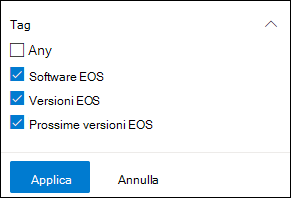
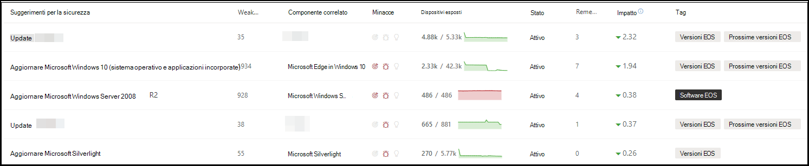
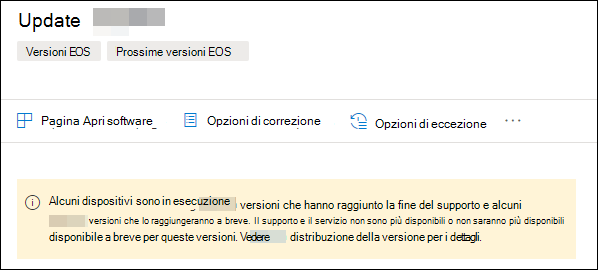
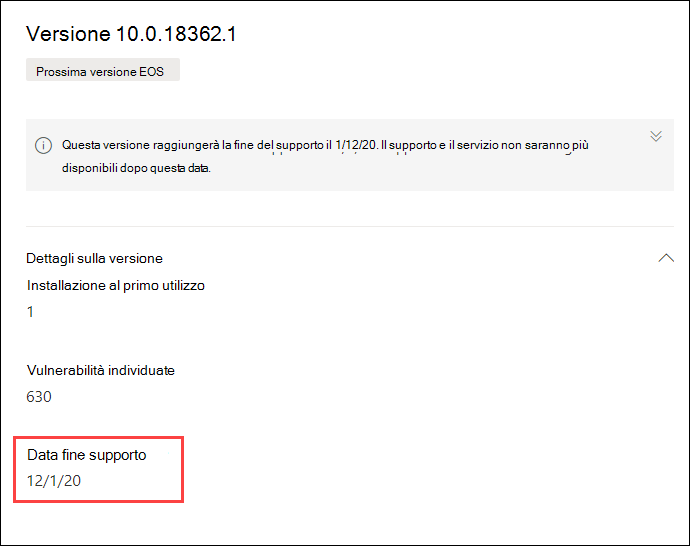

# Pianificare le versioni software e software di fine supporto con gestione di minacce e vulnerabilità

[!INCLUDE [Microsoft 365 Defender rebranding](../../includes/microsoft-defender.md)]

**Si applica a:**

- [Microsoft Defender per endpoint](https://go.microsoft.com/fwlink/?linkid=2154037)
- [Minaccia e gestione delle vulnerabilità](next-gen-threat-and-vuln-mgt.md)
- [Microsoft 365 Defender](https://go.microsoft.com/fwlink/?linkid=2118804)

>Vuoi provare Microsoft Defender per Endpoint? [Iscriversi per una versione di valutazione gratuita.](https://www.microsoft.com/microsoft-365/windows/microsoft-defender-atp?ocid=docs-wdatp-portaloverview-abovefoldlink)

End-of-support (EOS), altrimenti noto come end-of-life (EOL), per le versioni software o software significa che non saranno più supportati o serviced e non riceveranno aggiornamenti della sicurezza. Quando si utilizzano versioni software o software con supporto terminato, si espone l'organizzazione a vulnerabilità della sicurezza, rischi legali e finanziari.

È fondamentale che gli amministratori IT e della sicurezza lavorino insieme e assicurino che l'inventario software dell'organizzazione sia configurato per ottenere risultati ottimali, conformità e un ecosistema di rete sano. Devono esaminare le opzioni per rimuovere o sostituire le app che hanno raggiunto la fine del supporto e aggiornano le versioni non più supportate. È meglio creare e implementare un piano prima **della** fine delle date di supporto.

>[!NOTE]
> La funzionalità end-of-support è attualmente disponibile solo per Windows prodotti.

## Trovare versioni software o software non più supportate

1. Dal menu gestione di minacce e vulnerabilità, passare a [**Suggerimenti per la sicurezza.**](tvm-security-recommendation.md)
2. Vai al pannello **Filtri** e cerca la sezione tag. Selezionare una o più opzioni di tag EOS. Quindi **applica**.

    

3. Verrà visualizzato un elenco di suggerimenti relativi al software con supporto terminato, alle versioni software che terminano il supporto o alle versioni con fine del supporto imminente. Questi tag sono visibili anche nella pagina [dell'inventario software.](tvm-software-inventory.md)

    

## Elenco di versioni e date

Per visualizzare un elenco delle versioni che hanno raggiunto la fine del supporto, o la fine o il supporto a breve e tali date, seguire i passaggi seguenti:

1. Un messaggio verrà visualizzato nel riquadro a comparsa dei suggerimenti per la sicurezza per il software con versioni che hanno raggiunto la fine del supporto o raggiungeranno la fine del supporto a breve.

    

2. Selezionare il **collegamento di distribuzione** della versione per passare alla pagina di drill-down del software. È possibile visualizzare un elenco filtrato di versioni con tag che le identificano come fine del supporto o fine imminente del supporto.

    

3. Selezionare una delle versioni della tabella da aprire. Ad esempio, versione 10.0.18362.1. Verrà visualizzato un riquadro a comparsa con la data di fine del supporto.

    

Dopo aver identificato le versioni software e software vulnerabili a causa del loro stato di fine supporto, è necessario decidere se aggiornarle o rimuoverle dall'organizzazione. In questo modo si riduce l'esposizione delle organizzazioni a vulnerabilità e minacce persistenti avanzate.

## Argomenti correlati

- [Panoramica delle minacce gestione delle vulnerabilità sicurezza](next-gen-threat-and-vuln-mgt.md)
- [Consigli sulla sicurezza](tvm-security-recommendation.md)
- [Inventario software](tvm-software-inventory.md)
