# Creare e visualizzare le eccezioni per i suggerimenti per la sicurezza - gestione delle minacce e delle vulnerabilitàCreate and view exceptions for security recommendations - threat and vulnerability management

[!INCLUDE [Microsoft 365 Defender rebranding](../../includes/microsoft-defender.md)]

**Si applica a:****Applies to:**

- [Microsoft Defender per endpointMicrosoft Defender for Endpoint](https://go.microsoft.com/fwlink/?linkid=2154037)
- [Gestione di minacce e vulnerabilitàThreat and vulnerability management](next-gen-threat-and-vuln-mgt.md)
- [Microsoft 365 DefenderMicrosoft 365 Defender](https://go.microsoft.com/fwlink/?linkid=2118804)

>Vuoi provare Microsoft Defender per Endpoint?Want to experience Microsoft Defender for Endpoint? [Iscriversi per una versione di valutazione gratuita.Sign up for a free trial.](https://www.microsoft.com/microsoft-365/windows/microsoft-defender-atp?ocid=docs-wdatp-portaloverview-abovefoldlink)

In alternativa a una richiesta di correzione quando al momento un suggerimento non è rilevante, è possibile creare eccezioni per i suggerimenti.As an alternative to a remediation request when a recommendation is not relevant at the moment, you can create exceptions for recommendations. Se l'organizzazione dispone di gruppi di dispositivi, sarà possibile impostare l'ambito dell'eccezione a gruppi di dispositivi specifici.If your organization has device groups, you will be able to scope the exception to specific device groups. Le eccezioni possono essere create per i gruppi di dispositivi selezionati o per tutti i gruppi di dispositivi passati e presenti.Exceptions can either be created for selected device groups, or for all device groups past and present.  

Quando viene creata un'eccezione per un suggerimento, il suggerimento sarà attivo solo alla fine della durata dell'eccezione.When an exception is created for a recommendation, the recommendation will not be active until the end of the exception duration. Lo stato del suggerimento verrà modificato in **Eccezione completa** o **Eccezione parziale** (per gruppo di dispositivi).The recommendation state will change to **Full exception** or **Partial exception** (by device group).

## AutorizzazioniPermissions

Solo gli utenti con autorizzazioni di "gestione delle eccezioni" possono gestire le eccezioni (inclusa la creazione o l'annullamento).Only users with “exceptions handling” permissions can manage exceptions (including creating or canceling). [Ulteriori informazioni sui ruoli RBAC.](user-roles.md)[Learn more about RBAC roles](user-roles.md).

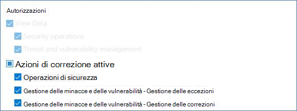

## Creare un'eccezioneCreate an exception

Selezionare un suggerimento per la sicurezza per cui si desidera creare un'eccezione, quindi selezionare **Opzioni eccezione** e compilare il modulo.Select a security recommendation you would like create an exception for, and then select **Exception options** and fill out the form.  

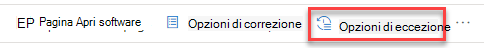

### Eccezione per gruppo di dispositiviException by device group

Applica l'eccezione a tutti i gruppi di dispositivi correnti o scegli gruppi di dispositivi specifici.Apply the exception to all current device groups or choose specific device groups. I gruppi di dispositivi futuri non verranno inclusi nell'eccezione.Future device groups won't be included in the exception. I gruppi di dispositivi che hanno già un'eccezione non verranno visualizzati nell'elenco.Device groups that already have an exception will not be displayed in the list. Se si selezionano solo determinati gruppi di dispositivi, lo stato di raccomandazione cambierà da "attivo" a "eccezione parziale".If you only select certain device groups, the recommendation state will change from “active” to “partial exception.” Lo stato verrà modificato in "eccezione completa" se si selezionano tutti i gruppi di dispositivi.The state will change to “full exception” if you select all the device groups.

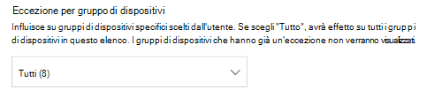

#### Visualizzazioni filtrateFiltered views

Se hai filtrato per gruppo di dispositivi in una qualsiasi delle pagine di gestione delle minacce e delle vulnerabilità, solo i gruppi di dispositivi filtrati verranno visualizzati come opzioni.If you have filtered by device group on any of the threat and vulnerability management pages, only your filtered device groups will appear as options.

Questo è il pulsante per filtrare in base al gruppo di dispositivi in una delle pagine di gestione delle minacce e delle vulnerabilità:This is the button to filter by device group on any of the threat and vulnerability management pages: 

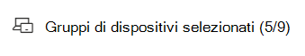

Visualizzazione eccezioni con gruppi di dispositivi filtrati:Exception view with filtered device groups:

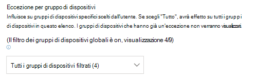

#### Numero elevato di gruppi di dispositiviLarge number of device groups

Se l'organizzazione ha più di 20 gruppi di dispositivi, seleziona **Modifica** accanto all'opzione gruppo di dispositivi filtrato.If your organization has more than 20 device groups, select **Edit** next to the filtered device group option.

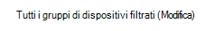

Verrà visualizzato un riquadro a comparsa in cui è possibile cercare e scegliere i gruppi di dispositivi che si desidera includere.A flyout will appear where you can search and choose device groups you want included. Seleziona l'icona del segno di spunta sotto Cerca per selezionare/deselezionare tutto.Select the check mark icon below Search to check/uncheck all.

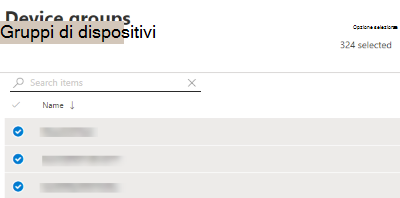

### Eccezioni globaliGlobal exceptions

Se si dispone delle autorizzazioni di amministratore globale (denominato amministratore di Microsoft Defender ATP), sarà possibile creare e annullare un'eccezione globale.If you have global administrator permissions (called Microsoft Defender ATP administrator), you will be able to create and cancel a global exception. Influisce **su tutti** i gruppi di dispositivi correnti e futuri nell'organizzazione e solo un utente con autorizzazioni simili sarà in grado di modificarlo.It affects **all** current and future device groups in your organization, and only a user with similar permission would be able to change it. Lo stato di raccomandazione cambierà da "attivo" a "eccezione completa".The recommendation state will change from “active” to “full exception.”

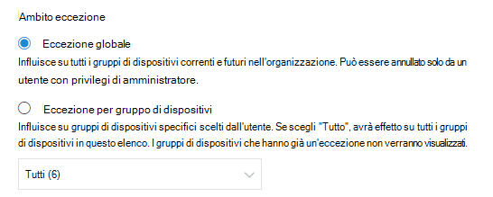

Alcuni aspetti da tenere presenti:Some things to keep in mind:

- Se un suggerimento è in un'eccezione globale, le nuove eccezioni create per i gruppi di dispositivi verranno sospese fino alla scadenza o all'annullamento dell'eccezione globale.If a recommendation is under global exception, then newly created exceptions for device groups will be suspended until the global exception has expired or been cancelled. Dopo questo punto, le nuove eccezioni del gruppo di dispositivi saranno effettive fino alla scadenza.After that point, the new device group exceptions will go into effect until they expire.
- Se un suggerimento contiene già eccezioni per gruppi di dispositivi specifici e viene creata un'eccezione globale, l'eccezione del gruppo di dispositivi verrà sospesa fino alla scadenza o all'annullamento dell'eccezione globale prima della scadenza.If a recommendation already has exceptions for specific device groups and a global exception is created, then the device group exception will be suspended until it expires or the global exception is cancelled before it expires.

### GiustificazioneJustification

Seleziona la giustificazione per l'eccezione che devi creare invece di correggere il suggerimento per la sicurezza in questione.Select your justification for the exception you need to file instead of remediating the security recommendation in question. Compila il contesto di giustificazione, quindi imposta la durata dell'eccezione.Fill out the justification context, then set the exception duration.

L'elenco seguente elenca in dettaglio le giustificazioni alla base delle opzioni di eccezione:The following list details the justifications behind the exception options:

- **Controllo di terze parti** - Un prodotto o un software di terze parti già si rivolge a questa raccomandazione- La scelta di questo tipo di giustificazione ridurrà il punteggio di esposizione e aumenterà il punteggio sicuro perché il rischio è ridotto**Third party control** - A third party product or software already addresses this recommendation       - Choosing this justification type will lower your exposure score and increase your secure score because your risk is reduced
- **Mitigazione alternativa** - Uno strumento interno è già in grado di risolvere questo consiglio: la scelta di questo tipo di giustificazione ridurrà il punteggio di esposizione e aumenterà il punteggio sicuro perché il rischio è ridotto**Alternate mitigation** - An internal tool already addresses this recommendation       - Choosing this justification type will lower your exposure score and increase your secure score because your risk is reduced
- **Rischio accettato** - Pone un rischio basso e/o l'implementazione della raccomandazione è troppo costosa**Risk accepted** - Poses low risk and/or implementing the recommendation is too expensive
- **Correzione pianificata (tolleranza):** già pianificata ma in attesa di esecuzione o autorizzazione**Planned remediation (grace)** - Already planned but is awaiting execution or authorization

## Visualizzare tutte le eccezioniView all exceptions

Passare alla **scheda Eccezioni** nella **pagina Correzione.**Navigate to the **Exceptions** tab in the **Remediation** page. È possibile filtrare in base a giustificazione, tipo e stato.You can filter by justification, type, and status.

 Seleziona un'eccezione per aprire un riquadro a comparsa con altri dettagli.Select an exception to open a flyout with more details. Le eccezioni per gruppo di dispositivi includeranno un elenco di tutti i gruppi di dispositivi trattati dall'eccezione, che puoi esportare.Exceptions per devices group will have a list of every device group the exception covers, which you can export. È inoltre possibile visualizzare il suggerimento correlato o annullare l'eccezione.You can also view the related recommendation or cancel the exception.

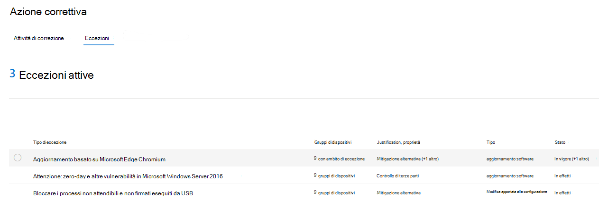

## Come annullare un'eccezioneHow to cancel an exception

Per annullare un'eccezione, passare alla **scheda Eccezioni** nella **pagina Correzione.**To cancel an exception, navigate to the **Exceptions** tab in the **Remediation** page. Selezionare l'eccezione.Select the exception.

Per annullare l'eccezione per tutti i gruppi di dispositivi o per un'eccezione globale, seleziona il **pulsante Annulla eccezione per tutti i gruppi di** dispositivi.To cancel the exception for all device groups or for a global exception, select the **Cancel exception for all device groups** button. Potrai annullare solo le eccezioni per i gruppi di dispositivi per cui hai le autorizzazioni.You will only be able to cancel exceptions for device groups you have permissions for.

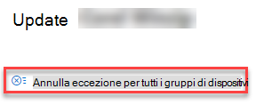

### Annullare l'eccezione per un gruppo di dispositivi specificoCancel the exception for a specific device group

Seleziona il gruppo di dispositivi specifico per annullare l'eccezione.Select the specific device group to cancel the exception for it. Verrà visualizzato un riquadro a comparsa per il gruppo di dispositivi ed è possibile selezionare **Annulla eccezione.**A flyout will appear for the device group, and you can select **Cancel exception**.

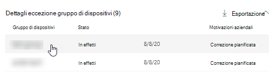

## Impatto della visualizzazione dopo l'applicazione delle eccezioniView impact after exceptions are applied

Nella pagina Suggerimenti per la sicurezza seleziona **Personalizza** colonne e seleziona le caselle dispositivi esposti **(dopo** le eccezioni) e **Impatto (dopo le eccezioni).**In the Security Recommendations page, select **Customize columns** and check the boxes for **Exposed devices (after exceptions)** and **Impact (after exceptions)**.

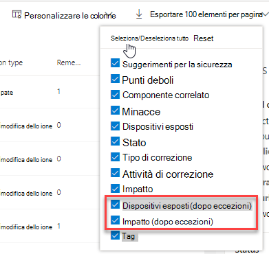

La colonna dispositivi esposti (dopo le eccezioni) mostra i dispositivi rimanenti che sono ancora esposti alle vulnerabilità dopo l'applicazione delle eccezioni.The exposed devices (after exceptions) column shows the remaining devices that are still exposed to vulnerabilities after exceptions are applied. Le giustificazioni di eccezione che influiscono sull'esposizione includono "controllo di terze parti" e "mitigazione alternativa".Exception justifications that affect the exposure include ‘third party control’ and ‘alternate mitigation’. Altre giustificazioni non riducono l'esposizione di un dispositivo e vengono comunque considerate esposte.Other justifications do not reduce the exposure of a device, and they are still considered exposed.

L'impatto (dopo le eccezioni) mostra l'impatto rimanente sul punteggio di esposizione o sul punteggio sicuro dopo l'applicazione delle eccezioni.The impact (after exceptions) shows remaining impact to exposure score or secure score after exceptions are applied. Le giustificazioni delle eccezioni che influiscono sui punteggi includono "controllo di terze parti" e "mitigazione alternativa".Exception justifications that affect the scores include ‘third party control’ and ‘alternate mitigation.’ Altre giustificazioni non riducono l'esposizione di un dispositivo e quindi il punteggio di esposizione e il punteggio sicuro non cambiano.Other justifications do not reduce the exposure of a device, and so the exposure score and secure score do not change.

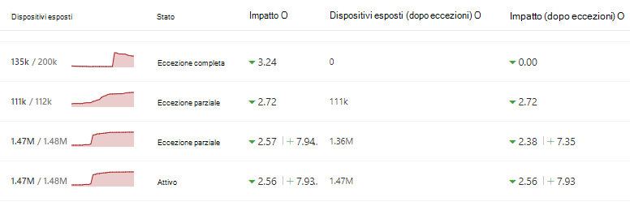

## Argomenti correlatiRelated topics

- [Panoramica della gestione delle minacce e delle vulnerabilitàThreat and vulnerability management overview](next-gen-threat-and-vuln-mgt.md)
- [Correggere le vulnerabilitàRemediate vulnerabilities](tvm-remediation.md)
- [Consigli sulla sicurezzaSecurity recommendations](tvm-security-recommendation.md)
- [Punteggio di esposizione.Exposure score](tvm-exposure-score.md)
- [Punteggio di sicurezza Microsoft per dispositiviMicrosoft Secure Score for Devices](tvm-microsoft-secure-score-devices.md)
