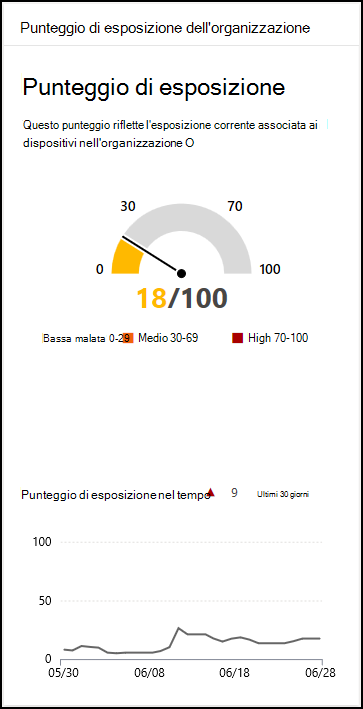

# Punteggio di esposizione - Gestione delle minacce e delle vulnerabilitàExposure score - threat and vulnerability management

[!INCLUDE [Microsoft 365 Defender rebranding](../../includes/microsoft-defender.md)]

**Si applica a:****Applies to:**

- [Microsoft Defender per endpointMicrosoft Defender for Endpoint](https://go.microsoft.com/fwlink/?linkid=2154037)
- [Gestione di minacce e vulnerabilitàThreat and vulnerability management](next-gen-threat-and-vuln-mgt.md)
- [Microsoft 365 DefenderMicrosoft 365 Defender](https://go.microsoft.com/fwlink/?linkid=2118804)

>Vuoi provare Microsoft Defender per Endpoint?Want to experience Microsoft Defender for Endpoint? [Iscriversi per una versione di valutazione gratuita.Sign up for a free trial.](https://www.microsoft.com/microsoft-365/windows/microsoft-defender-atp?ocid=docs-wdatp-portaloverview-abovefoldlink)

Il punteggio di esposizione è visibile nel [dashboard di gestione](tvm-dashboard-insights.md) delle minacce e delle vulnerabilità di Microsoft Defender Security Center.Your exposure score is visible in the [Threat and vulnerability management dashboard](tvm-dashboard-insights.md) of the Microsoft Defender Security Center. Riflette la vulnerabilità dell'organizzazione alle minacce alla cybersecurity.It reflects how vulnerable your organization is to cybersecurity threats. Il punteggio di esposizione basso indica che i dispositivi sono meno vulnerabili dallo sfruttamento.Low exposure score means your devices are less vulnerable from exploitation.

- Comprendere e identificare rapidamente le informazioni di alto livello sullo stato di sicurezza nell'organizzazione.Quickly understand and identify high-level takeaways about the state of security in your organization.
- Rilevare e rispondere alle aree che richiedono indagini o azioni per migliorare lo stato corrente.Detect and respond to areas that require investigation or action to improve the current state.
- Comunicare con i peer e la gestione sull'impatto degli sforzi di sicurezza.Communicate with peers and management about the impact of security efforts.

La scheda offre una visualizzazione di alto livello della tendenza del punteggio di esposizione nel tempo.The card gives you a high-level view of your exposure score trend over time. Eventuali picchi nel grafico offrono un'indicazione visiva di un'elevata esposizione alle minacce di cybersecurity che è possibile analizzare ulteriormente.Any spikes in the chart give you a visual indication of a high cybersecurity threat exposure that you can investigate further.

## FunzionamentoHow it works

Il punteggio di esposizione è suddiviso nei livelli seguenti:The exposure score is broken down into the following levels:

- 0-29: punteggio di esposizione basso0–29: low exposure score
- 30-69: punteggio di esposizione medio30–69: medium exposure score
- 70-100: punteggio di esposizione elevata70–100: high exposure score

È possibile correggere i problemi in base ai consigli di sicurezza con priorità [per](tvm-security-recommendation.md) ridurre il punteggio di esposizione.You can remediate the issues based on prioritized [security recommendations](tvm-security-recommendation.md) to reduce the exposure score. Ogni software presenta punti deboli che vengono trasformati in consigli e classificati in ordine di priorità in base ai rischi per l'organizzazione.Each software has weaknesses that are transformed into recommendations and prioritized based on risk to the organization.

## Ridurre la minaccia e l'esposizione alle vulnerabilitàReduce your threat and vulnerability exposure

Ridurre l'esposizione alle minacce e alle vulnerabilità corredando i [suggerimenti per la sicurezza.](tvm-security-recommendation.md)Lower your threat and vulnerability exposure by remediating [security recommendations](tvm-security-recommendation.md). Per ottenere il massimo impatto sul punteggio di esposizione, correggere i principali suggerimenti per la sicurezza, che possono essere visualizzati nel dashboard di gestione delle minacce [e delle vulnerabilità.](tvm-dashboard-insights.md)Make the most impact to your exposure score by remediating the top security recommendations, which can be viewed in the [threat and vulnerability management dashboard](tvm-dashboard-insights.md).

## Argomenti correlatiRelated topics

- [Panoramica della gestione delle minacce e delle vulnerabilitàThreat and vulnerability management overview](next-gen-threat-and-vuln-mgt.md)
- [Punteggio di sicurezza Microsoft per dispositiviMicrosoft Secure Score for Devices](tvm-microsoft-secure-score-devices.md)
- [Consigli sulla sicurezzaSecurity recommendations](tvm-security-recommendation.md)
- [Sequenza temporale eventiEvent timeline](threat-and-vuln-mgt-event-timeline.md)
