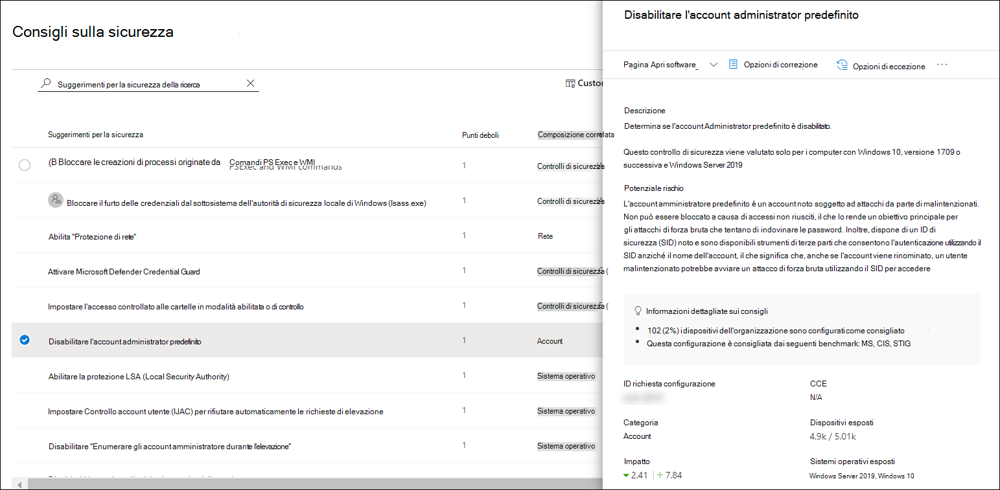
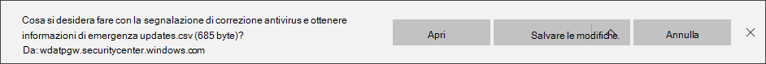

# Punteggio di sicurezza Microsoft per dispositivi

[!INCLUDE [Microsoft 365 Defender rebranding](../../includes/microsoft-defender.md)]

**Si applica a:**

- [Microsoft Defender per endpoint](https://go.microsoft.com/fwlink/?linkid=2154037)
- [Minaccia e gestione delle vulnerabilità](next-gen-threat-and-vuln-mgt.md)
- [Microsoft 365 Defender](https://go.microsoft.com/fwlink/?linkid=2118804)

> Vuoi provare Defender per Endpoint? [Iscriversi per una versione di valutazione gratuita.](https://www.microsoft.com/microsoft-365/windows/microsoft-defender-atp?ocid=docs-wdatp-pullalerts-abovefoldlink) 

>[!NOTE]
> Il punteggio di configurazione fa ora parte gestione di minacce e vulnerabilità microsoft secure score per i dispositivi.

Il punteggio per i dispositivi è visibile [nel dashboard gestione di minacce e vulnerabilità della](tvm-dashboard-insights.md) Microsoft Defender Security Center. Un punteggio microsoft sicuro più alto per i dispositivi significa che gli endpoint sono più resilienti dagli attacchi di minacce alla cybersecurity. Riflette lo stato di configurazione della sicurezza collettiva dei dispositivi nelle categorie seguenti:

- Applicazione
- Sistema operativo
- Rete
- Account
- Controlli di sicurezza

Selezionare una categoria per passare alla pagina [**Suggerimenti per**](tvm-security-recommendation.md) la sicurezza e visualizzare i suggerimenti pertinenti.

## Attivare il connettore Microsoft Secure Score

Inoltra i segnali di Microsoft Defender for Endpoint, offrendo a Microsoft Secure Score visibilità sulla posizione di sicurezza del dispositivo. I dati inoltrati vengono archiviati ed elaborati nella stessa posizione dei dati di Microsoft Secure Score.

Le modifiche potrebbero richiedere fino a poche ore per riflettere nel dashboard.

1. Nel riquadro di spostamento passare a **Impostazioni**  >  **funzionalità avanzate** 

2. Scorrere verso il basso **fino a Microsoft Secure Score** e attivare o disattivare l'impostazione su **Attivato.**

3. Selezionare **Salva preferenze.**

## Come funziona

>[!NOTE]
> Microsoft Secure Score per i dispositivi attualmente supporta le configurazioni impostate tramite Criteri di gruppo. A causa dell'attuale supporto parziale di Intune, le configurazioni che potrebbero essere state impostate tramite Intune potrebbero risultare non configurate correttamente. Contattare l'amministratore IT per verificare lo stato di configurazione effettivo nel caso in cui l'organizzazione utilizzi Intune per la gestione sicura della configurazione.

I dati nella scheda Microsoft Secure Score for Devices sono il prodotto di un processo di individuazione delle vulnerabilità meticoloso e continuo. Viene aggregato con valutazioni di individuazione della configurazione che continuamente:

- Confrontare le configurazioni raccolte con i benchmark raccolti per individuare asset non configurati correttamente
- Mappare le configurazioni a vulnerabilità che possono essere corretti o parzialmente corretti (riduzione dei rischi)
- Raccogliere e gestire benchmark di configurazione delle procedure consigliate (fornitori, feed di sicurezza, team di ricerca interni)
- Raccogliere e monitorare le modifiche dello stato di configurazione del controllo di sicurezza da tutti gli asset

## Migliorare la configurazione della sicurezza

Migliorare la configurazione della sicurezza corredando i problemi dall'elenco dei suggerimenti per la sicurezza. In questo modo, microsoft Secure Score for Devices migliora e l'organizzazione diventa più resiliente alle minacce e alle vulnerabilità di cybersecurity.

1. Nella scheda Microsoft Secure Score for Devices nel dashboard gestione di minacce e vulnerabilità selezionare una delle categorie. Verrà visualizzato l'elenco dei suggerimenti relativi a tale categoria. Verrà visualizzata la pagina [**Suggerimenti per la**](tvm-security-recommendation.md) sicurezza. Se si desidera visualizzare tutti i suggerimenti per la sicurezza, una volta visualizzata la pagina Suggerimenti per la sicurezza, deselezionare il campo di ricerca.

2. Selezionare un elemento nell'elenco. Il riquadro a comparsa si aprirà con i dettagli relativi al suggerimento. Selezionare **Opzioni di correzione.**

   

3. Leggere la descrizione per comprendere il contesto del problema e le operazioni da eseguire. Selezionare una data di scadenza, aggiungere note e selezionare Esporta tutti i dati **dell'attività** di correzione in CSV in modo da poterli allegare a un messaggio di posta elettronica per il follow-up.

4. **Invia richiesta**. Verrà visualizzato un messaggio di conferma che l'attività di correzione è stata creata.
   

5. Salvare il file CSV.
   

6. Inviare un messaggio di posta elettronica di follow-up all'amministratore IT e consentire la propagazione nel sistema del tempo assegnato per la correzione.

7. Rivedere di **nuovo la scheda Microsoft Secure Score for Devices** nel dashboard. Il numero di elementi consigliati per i controlli di sicurezza diminuisce. Quando si seleziona **Controlli** di  sicurezza per tornare alla pagina Suggerimenti per la sicurezza, l'elemento che è stato indirizzato non sarà più presente nell'elenco. Il punteggio microsoft secure per i dispositivi dovrebbe aumentare.

>[!IMPORTANT]
>Per aumentare la frequenza di rilevamento della valutazione delle vulnerabilità, scaricare i seguenti aggiornamenti obbligatori per la sicurezza e distribuirli nella rete:
>- 19H1 clienti | [KB 4512941](https://support.microsoft.com/help/4512941/windows-10-update-kb4512941)
>- Clienti RS5 | [KB 4516077](https://support.microsoft.com/help/4516077/windows-10-update-kb4516077)
>- Clienti RS4 | [KB 4516045](https://support.microsoft.com/help/4516045/windows-10-update-kb4516045)
>- Clienti RS3 | [KB 4516071](https://support.microsoft.com/help/4516071/windows-10-update-kb4516071)
>
>Per scaricare gli aggiornamenti della sicurezza:
>1. Passare a [Microsoft Update Catalog](https://www.catalog.update.microsoft.com/home.aspx).
>2. Immettere il numero KB dell'aggiornamento della sicurezza da scaricare, quindi fare clic su **Cerca.**  

## Argomenti correlati

- [Panoramica delle minacce gestione delle vulnerabilità sicurezza](next-gen-threat-and-vuln-mgt.md)
- [Dashboard](tvm-dashboard-insights.md)
- [Punteggio di esposizione.](tvm-exposure-score.md)
- [Consigli sulla sicurezza](tvm-security-recommendation.md)
