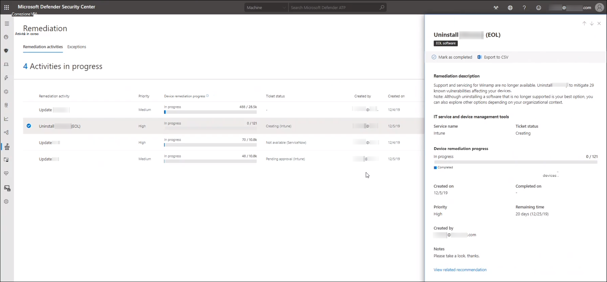
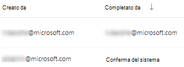
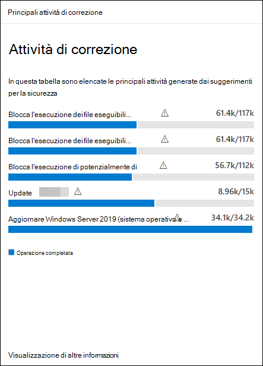

# Risolvere le vulnerabilità con la gestione delle minacce e delle vulnerabilitàRemediate vulnerabilities with threat and vulnerability management

[!INCLUDE [Microsoft 365 Defender rebranding](../../includes/microsoft-defender.md)]

**Si applica a:****Applies to:**
- [Microsoft Defender ATPMicrosoft Defender for Endpoint](https://go.microsoft.com/fwlink/?linkid=2154037)
- [Gestione di minacce e vulnerabilitàThreat and vulnerability management](next-gen-threat-and-vuln-mgt.md)
- [Microsoft 365 DefenderMicrosoft 365 Defender](https://go.microsoft.com/fwlink/?linkid=2118804)

>Vuoi provare Microsoft Defender per Endpoint?Want to experience Microsoft Defender for Endpoint? [Iscriversi per una versione di valutazione gratuita.Sign up for a free trial.](https://www.microsoft.com/microsoft-365/windows/microsoft-defender-atp?ocid=docs-wdatp-portaloverview-abovefoldlink)

## Richiesta di correzioneRequest remediation

La funzionalità di gestione delle minacce e delle vulnerabilità in Microsoft Defender for Endpoint colma il divario tra amministratori IT e sicurezza attraverso il flusso di lavoro delle richieste di correzione.The threat and vulnerability management capability in Microsoft Defender for Endpoint bridges the gap between Security and IT administrators through the remediation request workflow. Gli amministratori della sicurezza come te possono richiedere all'amministratore IT di correggere una vulnerabilità dalle pagine **dei** suggerimenti per la sicurezza a Intune.Security admins like you can request for the IT Administrator to remediate a vulnerability from the **Security recommendation** pages to Intune.

### Abilitare la connessione a Microsoft IntuneEnable Microsoft Intune connection

Per usare questa funzionalità, abilitare le connessioni di Microsoft Intune.To use this capability, enable your Microsoft Intune connections. In Microsoft Defender Security Center, passare a **Impostazioni**  >  **Generali**  >  **Funzionalità avanzate.**In the Microsoft Defender Security Center, navigate to **Settings** > **General** > **Advanced features**. Scorrere verso il basso e cercare **La connessione a Microsoft Intune**.Scroll down and look for **Microsoft Intune connection**. Per impostazione predefinita, l'interruttore è disattivato.By default, the toggle is turned off. Attivare la connessione  **di Microsoft Intune.**Turn your **Microsoft Intune connection** toggle **On**.

**Nota:** se la connessione intune è abilitata, si ottiene un'opzione per creare un'attività di sicurezza di Intune durante la creazione di una richiesta di correzione.**Note**: If you have the Intune connection enabled, you get an option to create an Intune security task when creating a remediation request. Questa opzione non viene visualizzata se la connessione non è impostata.This option does not appear if the connection is not set.

Per informazioni dettagliate, vedere Usare Intune per correggere [le vulnerabilità identificate da Microsoft Defender for Endpoint.](https://docs.microsoft.com/intune/atp-manage-vulnerabilities)See [Use Intune to remediate vulnerabilities identified by Microsoft Defender for Endpoint](https://docs.microsoft.com/intune/atp-manage-vulnerabilities) for details.

### Passaggi della richiesta di correzioneRemediation request steps

1. Vai al menu di spostamento per la gestione delle minacce e delle vulnerabilità in Microsoft Defender Security Center e seleziona [**Suggerimenti per la sicurezza.**](tvm-security-recommendation.md)Go to the threat and vulnerability management navigation menu in the Microsoft Defender Security Center, and select [**Security recommendations**](tvm-security-recommendation.md).

2. Selezionare un suggerimento per la sicurezza per cui si desidera richiedere la correzione e quindi selezionare **Opzioni di correzione.**Select a security recommendation you would like to request remediation for, and then select **Remediation options**.

3. Compila il modulo, inclusi gli elementi per cui stai richiedendo la correzione, i gruppi di dispositivi applicabili, la priorità, la data di scadenza e le note facoltative.Fill out the form, including what you are requesting remediation for, applicable device groups, priority, due date, and optional notes.
    1. Se si sceglie l'opzione di correzione "attenzione necessaria", la selezione di una data di scadenza non sarà disponibile perché non è disponibile alcuna azione specifica.If you choose the "attention required" remediation option, selecting a due date will not be available since there is no specific action.

4. Selezionare **Invia richiesta**.Select **Submit request**. L'invio di una richiesta di correzione crea un elemento dell'attività di correzione all'interno della gestione delle minacce e delle vulnerabilità, che può essere utilizzato per monitorare lo stato di avanzamento della correzione per questo suggerimento.Submitting a remediation request creates a remediation activity item within threat and vulnerability management, which can be used for monitoring the remediation progress for this recommendation. In questo modo non verrà attivata una correzione o non verranno applicate modifiche ai dispositivi.This will not trigger a remediation or apply any changes to devices.

5. Informare l'amministratore IT della nuova richiesta e chiedere loro di accedere a Intune per approvare o rifiutare la richiesta e avviare la distribuzione di un pacchetto.Notify your IT Administrator about the new request and have them log into Intune to approve or reject the request and start a package deployment.

6. Passare alla [**pagina Correzione**](tvm-remediation.md) per visualizzare lo stato della richiesta di correzione.Go to the [**Remediation**](tvm-remediation.md) page to view the status of your remediation request.

Se vuoi controllare come viene visualizzato il ticket in Intune, vedi Usare Intune per correggere le vulnerabilità identificate [da Microsoft Defender for Endpoint](https://docs.microsoft.com/intune/atp-manage-vulnerabilities) per informazioni dettagliate.If you want to check how the ticket shows up in Intune, see [Use Intune to remediate vulnerabilities identified by Microsoft Defender for Endpoint](https://docs.microsoft.com/intune/atp-manage-vulnerabilities) for details.

>[!NOTE]
>Se la richiesta prevede la correzione di più di 10.000 dispositivi, possiamo inviare solo 10.000 dispositivi per la correzione a Intune.If your request involves remediating more than 10,000 devices, we can only send 10,000 devices for remediation to Intune.

Dopo che i punti deboli della sicurezza informatica dell'organizzazione sono stati identificati e mappati a consigli sulla sicurezza utilizzabili, iniziare a creare attività di sicurezza.After your organization's cybersecurity weaknesses are identified and mapped to actionable [security recommendations](tvm-security-recommendation.md), start creating security tasks. È possibile creare attività tramite l'integrazione con Microsoft Intune in cui vengono creati i ticket di correzione.You can create tasks through the integration with Microsoft Intune where remediation tickets are created.

Ridurre l'esposizione dell'organizzazione dalle vulnerabilità e aumentare la configurazione della sicurezza corredando i suggerimenti per la sicurezza.Lower your organization's exposure from vulnerabilities and increase your security configuration by remediating the security recommendations.

## Visualizzare le attività di correzioneView your remediation activities

Quando invii una richiesta di correzione dalla pagina Suggerimenti per la sicurezza, avvia un'attività di correzione.When you submit a remediation request from the Security recommendations page, it kicks-off a remediation activity. Viene creata un'attività di sicurezza che può essere  monitorata nella pagina di correzione della gestione delle minacce e delle vulnerabilità e viene creato un ticket di correzione in Microsoft Intune.A security task is created that can be tracked in the threat and vulnerability management **Remediation** page, and a remediation ticket is created in Microsoft Intune.

Se hai scelto l'opzione di correzione "attenzione necessaria", non ci saranno barre di avanzamento, stato del ticket o data di scadenza poiché non è possibile monitorare alcuna azione effettiva.If you chose the "attention required" remediation option, there will be no progress bar, ticket status, or due date since there is no actual action we can monitor.

Una volta visualizzata la pagina Correzione, selezionare l'attività di correzione che si desidera visualizzare.Once you are in the Remediation page, select the remediation activity that you want to view. È possibile seguire i passaggi di correzione, tenere traccia dello stato, visualizzare il suggerimento correlato, esportare in CSV o contrassegnare come completato.You can follow the remediation steps, track progress, view the related recommendation, export to CSV, or mark as complete.

>[!NOTE]
> Esiste un periodo di conservazione di 180 giorni per le attività di correzione completate.There is a 180 day retention period for completed remediation activities. Per mantenere le prestazioni ottimali della pagina di correzione, l'attività di correzione verrà rimossa 6 mesi dopo il completamento.To keep the Remediation page performing optimally, the remediation activity will be removed 6 months after its completion.

### Completato per colonnaCompleted by column

Tenere traccia di chi ha chiuso l'attività di correzione con la colonna "Completato da" nella pagina Correzione.Track who closed the remediation activity with the "Completed by" column on the Remediation page.

- **Indirizzo di posta** elettronica : Il messaggio di posta elettronica della persona che ha completato manualmente l'attività**Email address**: The email of the person who manually completed the task
- **Conferma del sistema:** l'attività è stata completata automaticamente (tutti i dispositivi corretti)**System confirmation**: The task was automatically completed (all devices remediated)
- **N/D:** le informazioni non sono disponibili perché non si sa come è stata completata questa attività precedente**N/A**: Information is not available because we don't know how this older task was completed

### Principali attività di correzione nel dashboardTop remediation activities in the dashboard

Visualizzare **le principali attività di correzione** nel dashboard di gestione delle minacce e delle [vulnerabilità.](tvm-dashboard-insights.md)View **Top remediation activities** in the [threat and vulnerability management dashboard](tvm-dashboard-insights.md). Selezionare una delle voci per passare alla **pagina Correzione.**Select any of the entries to go to the **Remediation** page. È possibile contrassegnare l'attività di correzione come completata dopo la correzione dell'attività da parte del team di amministrazione IT.You can mark the remediation activity as completed after the IT admin team remediates the task.

## Articoli correlatiRelated articles

- [Panoramica della gestione delle minacce e delle vulnerabilitàThreat and vulnerability management overview](next-gen-threat-and-vuln-mgt.md)
- [DashboardDashboard](tvm-dashboard-insights.md)
- [Consigli sulla sicurezzaSecurity recommendations](tvm-security-recommendation.md)