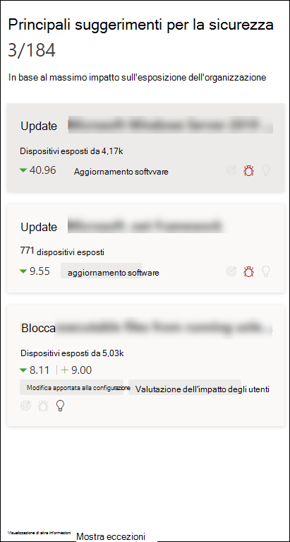
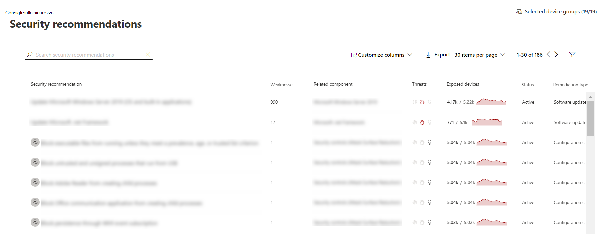
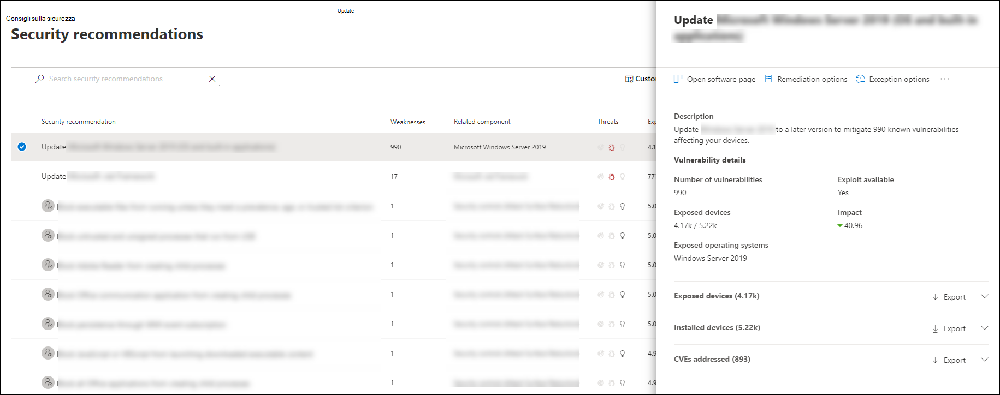
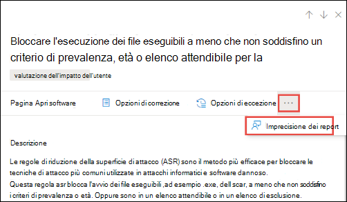

# Suggerimenti per la sicurezza - Gestione delle minacce e delle vulnerabilità

[!INCLUDE [Microsoft 365 Defender rebranding](../../includes/microsoft-defender.md)]

**Si applica a:**

- [Microsoft Defender per endpoint](https://go.microsoft.com/fwlink/?linkid=2154037)
- [Gestione di minacce e vulnerabilità](next-gen-threat-and-vuln-mgt.md)
- [Microsoft 365 Defender](https://go.microsoft.com/fwlink/?linkid=2118804)

>Vuoi provare Microsoft Defender per Endpoint? [Iscriversi per una versione di valutazione gratuita.](https://www.microsoft.com/microsoft-365/windows/microsoft-defender-atp?ocid=docs-wdatp-portaloverview-abovefoldlink)

I punti deboli della cybersecurity identificati nell'organizzazione sono mappati a consigli sulla sicurezza utilizzabili e classificati in ordine di priorità in base al loro impatto. I consigli con priorità consentono di ridurre il tempo necessario per ridurre o correggere le vulnerabilità e migliorare la conformità.

Ogni suggerimento per la sicurezza include passaggi correttivi utilizzabili. Per facilitare la gestione delle attività, il consiglio può essere inviato anche tramite Microsoft Intune e Microsoft Endpoint Configuration Manager. Quando cambia il panorama delle minacce, il consiglio cambia anche quando raccoglie continuamente informazioni dall'ambiente.

>[!TIP]
>Per ricevere messaggi di posta elettronica sui nuovi eventi di vulnerabilità, vedere Configurare le notifiche di posta elettronica relative alla vulnerabilità [in Microsoft Defender for Endpoint](configure-vulnerability-email-notifications.md)

## Funzionamento

Ogni dispositivo dell'organizzazione viene ottenuto in base a tre fattori importanti per aiutare i clienti a concentrarsi sulle cose giuste al momento giusto.

- **Minaccia:** caratteristiche delle vulnerabilità e degli exploit nei dispositivi dell'organizzazione e cronologia delle violazioni. In base a questi fattori, i suggerimenti per la sicurezza mostrano i collegamenti corrispondenti agli avvisi attivi, alle campagne di minacce in corso e ai report analitici relativi alle minacce corrispondenti.

- **Probabilità di violazione** - La posizione di sicurezza e la resilienza dell'organizzazione contro le minacce

- **Valore aziendale** - Asset dell'organizzazione, processi critici e proprietà intellettuali

## Passare alla pagina Suggerimenti per la sicurezza

Accedere alla pagina Suggerimenti per la sicurezza in diversi modi:

- Menu di spostamento per la gestione delle minacce e delle vulnerabilità in [Microsoft Defender Security Center](portal-overview.md)
- Principali suggerimenti per la sicurezza nel [dashboard di gestione delle minacce e delle vulnerabilità](tvm-dashboard-insights.md)

Visualizzare i suggerimenti sulla sicurezza correlati nelle posizioni seguenti:

- Pagina Software
- Pagina Dispositivo

### Menu di spostamento

Vai al menu di spostamento per la gestione delle minacce e delle vulnerabilità e seleziona **Suggerimenti per la sicurezza.** La pagina contiene un elenco di consigli sulla sicurezza per le minacce e le vulnerabilità presenti nell'organizzazione.

### Principali suggerimenti per la sicurezza nel dashboard di gestione delle minacce e delle vulnerabilità

In un determinato giorno come amministratore della sicurezza, è possibile esaminare il  [dashboard](tvm-dashboard-insights.md) di gestione delle minacce e delle vulnerabilità per visualizzare il punteggio di esposizione affiancato al punteggio [microsoft secure per i dispositivi](tvm-microsoft-secure-score-devices.md). L'obiettivo è ridurre **l'esposizione** dell'organizzazione  dalle vulnerabilità e aumentare la sicurezza dei dispositivi dell'organizzazione per essere più resiliente contro gli attacchi di minacce alla cybersecurity. L'elenco dei principali suggerimenti per la sicurezza consente di raggiungere questo obiettivo.

I principali suggerimenti per la sicurezza elencano le opportunità di miglioramento con priorità in base ai fattori importanti menzionati nella sezione precedente: minaccia, probabilità di violazione e valore. La selezione di un suggerimento consente di accedere alla pagina degli elementi consigliati per la sicurezza con ulteriori dettagli.

## Panoramica degli elementi consigliati per la sicurezza

Visualizza i suggerimenti, il numero di punti deboli trovati, i componenti correlati, le informazioni dettagliate sulle minacce, il numero di dispositivi esposti, lo stato, il tipo di correzione, le attività di correzione, l'impatto sul punteggio di esposizione e microsoft Secure Score per i dispositivi e i tag associati.

Il colore del grafico **Dei dispositivi esposti** cambia quando cambia la tendenza. Se il numero di dispositivi esposti è in aumento, il colore viene modificato in rosso. In caso di diminuzione del numero di dispositivi esposti, il colore del grafico verrà modificato in verde.

>[!NOTE]
>La gestione delle minacce e delle vulnerabilità mostra i dispositivi in uso fino a **30 giorni** fa. Questo è diverso dal resto di Microsoft Defender per Endpoint, dove se un dispositivo non è in uso da più di 7 giorni ha lo stato "Inattivo".

### Icone

Anche le icone utili richiamano rapidamente l'attenzione su:
-  possibili avvisi attivi
-  exploit pubblici associati
-  informazioni dettagliate sulle raccomandazioni

### Esplorare le opzioni di suggerimento per la sicurezza

Selezionare il suggerimento per la sicurezza che si desidera analizzare o elaborare.

Dal riquadro a comparsa è possibile scegliere una delle opzioni seguenti:

- **Pagina Apri software:** aprire la pagina del software per ottenere più contesto sul software e su come viene distribuito. Le informazioni possono includere il contesto delle minacce, i suggerimenti associati, i punti deboli rilevati, il numero di dispositivi esposti, le vulnerabilità individuate, i nomi e i dettagli dei dispositivi con il software installato e la distribuzione delle versioni.

- [**Opzioni di correzione-**](tvm-remediation.md) Inviare una richiesta di correzione per aprire un ticket in Microsoft Intune per l'amministratore IT da ritirare e inviare. Tenere traccia dell'attività di correzione nella pagina Correzione.

- [**Opzioni di eccezione:**](tvm-exception.md) invia un'eccezione, fornisci giustificazione e imposta la durata dell'eccezione se non riesci ancora a risolvere il problema.

>[!NOTE]
>Quando viene apportata una modifica software in un dispositivo, in genere sono necessari 2 ore prima che i dati si riflettano nel portale di sicurezza. Tuttavia, a volte può richiedere più tempo. Le modifiche alla configurazione possono richiedere da 4 a 24 ore.

### Analizzare le modifiche nell'esposizione o nell'impatto del dispositivo

Se c'è un notevole aumento del numero di dispositivi esposti o un forte aumento dell'impatto sul punteggio di esposizione dell'organizzazione e microsoft Secure Score per i dispositivi, vale la pena analizzare il suggerimento per la sicurezza.

1. Selezionare la pagina dei suggerimenti **e del software aperto**
2. Seleziona la **scheda Sequenza temporale** eventi per visualizzare tutti gli eventi di impatto correlati a tale software, ad esempio nuove vulnerabilità o nuovi exploit pubblici. [Altre informazioni sulla sequenza temporale degli eventi](threat-and-vuln-mgt-event-timeline.md)
3. Decidere come affrontare l'aumento o l'esposizione dell'organizzazione, ad esempio l'invio di una richiesta di correzione

## Richiesta di correzione

La funzionalità di correzione della gestione delle minacce e delle vulnerabilità colma il distacco tra gli amministratori IT e la sicurezza attraverso il flusso di lavoro delle richieste di correzione. Gli amministratori della sicurezza come te possono richiedere all'amministratore IT di correggere una vulnerabilità dalla pagina **Dei** suggerimenti per la sicurezza a Intune. [Ulteriori informazioni sulle opzioni di correzione](tvm-remediation.md)

### Come richiedere la correzione

Selezionare un suggerimento per la sicurezza per cui si desidera richiedere la correzione e quindi selezionare **Opzioni di correzione.** Compila il modulo e seleziona **Invia richiesta.** Passare alla [**pagina Correzione**](tvm-remediation.md) per visualizzare lo stato della richiesta di correzione. [Ulteriori informazioni su come richiedere la correzione](tvm-remediation.md#request-remediation)

## File per l'eccezione

In alternativa a una richiesta di correzione quando al momento un suggerimento non è rilevante, è possibile creare eccezioni per i suggerimenti. [Ulteriori informazioni sulle eccezioni](tvm-exception.md)

Solo gli utenti con autorizzazioni di "gestione delle eccezioni" possono aggiungere un'eccezione. [Ulteriori informazioni sui ruoli RBAC.](user-roles.md)

Quando viene creata un'eccezione per un suggerimento, il suggerimento non è più attivo. Lo stato del suggerimento verrà modificato in **Eccezione completa** o **Eccezione parziale** (per gruppo di dispositivi).

### Come creare un'eccezione

Selezionare un suggerimento per la sicurezza per cui si desidera creare un'eccezione e quindi selezionare **Opzioni eccezione.**  

Compilare il modulo e inviarlo. Per visualizzare tutte le eccezioni (correnti  e passate), passare alla pagina Correzione nel menu  Gestione vulnerabilità di **Threat &** e selezionare la scheda Eccezioni. Ulteriori informazioni su come creare un'eccezione 

## Imprecisione dei report

È possibile segnalare un falso positivo quando vengono visualizzate informazioni di suggerimento sulla sicurezza vaghe, imprecise, incomplete o già corretti.

1. Aprire il suggerimento Sicurezza.

2. Selezionare i tre punti accanto al suggerimento di sicurezza che si desidera segnalare, quindi selezionare **Segnala imprecisione.**

    

3. Nel riquadro a comparsa selezionare la categoria di imprecisione dal menu a discesa, immettere l'indirizzo di posta elettronica e i dettagli relativi all'imprecisione.

4. Selezionare **Invia**. Il feedback viene inviato immediatamente agli esperti di gestione delle minacce e delle vulnerabilità.

## Articoli correlati

- [Panoramica della gestione delle minacce e delle vulnerabilità](next-gen-threat-and-vuln-mgt.md)
- [Dashboard](tvm-dashboard-insights.md)
- [Punteggio di esposizione.](tvm-exposure-score.md)
- [Punteggio di sicurezza Microsoft per dispositivi](tvm-microsoft-secure-score-devices.md)
- [Correggere le vulnerabilità](tvm-remediation.md)
- [Creare e visualizzare le eccezioni per i suggerimenti sulla sicurezza](tvm-exception.md)
- [Sequenza temporale eventi](threat-and-vuln-mgt-event-timeline.md)
