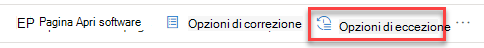

# Suggerimenti per la sicurezza - gestione di minacce e vulnerabilitàSecurity recommendations - threat and vulnerability management

[!INCLUDE [Microsoft 365 Defender rebranding](../../includes/microsoft-defender.md)]

**Si applica a:****Applies to:**

- [Microsoft Defender per endpointMicrosoft Defender for Endpoint](https://go.microsoft.com/fwlink/?linkid=2154037)
- [Minaccia e gestione delle vulnerabilitàThreat and vulnerability management](next-gen-threat-and-vuln-mgt.md)
- [Microsoft 365 DefenderMicrosoft 365 Defender](https://go.microsoft.com/fwlink/?linkid=2118804)

>Vuoi provare Microsoft Defender per Endpoint?Want to experience Microsoft Defender for Endpoint? [Iscriversi per una versione di valutazione gratuita.Sign up for a free trial.](https://www.microsoft.com/microsoft-365/windows/microsoft-defender-atp?ocid=docs-wdatp-portaloverview-abovefoldlink)

I punti deboli della cybersecurity identificati nell'organizzazione sono mappati a consigli sulla sicurezza utilizzabili e classificati in ordine di priorità in base al loro impatto.Cybersecurity weaknesses identified in your organization are mapped to actionable security recommendations and prioritized by their impact. I consigli con priorità consentono di ridurre il tempo necessario per ridurre o correggere le vulnerabilità e migliorare la conformità.Prioritized recommendations help shorten the time to mitigate or remediate vulnerabilities and drive compliance.

Ogni suggerimento per la sicurezza include passaggi correttivi utilizzabili.Each security recommendation includes actionable remediation steps. Per facilitare la gestione delle attività, è inoltre possibile inviare il suggerimento Microsoft Intune e Microsoft Endpoint Configuration Manager.To help with task management, the recommendation can also be sent using Microsoft Intune and Microsoft Endpoint Configuration Manager. Quando cambia il panorama delle minacce, il consiglio cambia anche quando raccoglie continuamente informazioni dall'ambiente.When the threat landscape changes, the recommendation also changes as it continuously collects information from your environment.

>[!TIP]
>Per ricevere messaggi di posta elettronica sui nuovi eventi di vulnerabilità, vedere Configurare le notifiche di posta elettronica relative alla vulnerabilità [in Microsoft Defender for Endpoint](configure-vulnerability-email-notifications.md)To get emails about new vulnerability events, see [Configure vulnerability email notifications in Microsoft Defender for Endpoint](configure-vulnerability-email-notifications.md)

## Come funzionaHow it works

Ogni dispositivo dell'organizzazione viene ottenuto in base a tre fattori importanti per aiutare i clienti a concentrarsi sulle cose giuste al momento giusto.Each device in the organization is scored based on three important factors to help customers to focus on the right things at the right time.

- **Minaccia:** caratteristiche delle vulnerabilità e degli exploit nei dispositivi dell'organizzazione e cronologia delle violazioni.**Threat** - Characteristics of the vulnerabilities and exploits in your organizations' devices and breach history. In base a questi fattori, i suggerimenti per la sicurezza mostrano i collegamenti corrispondenti agli avvisi attivi, alle campagne di minacce in corso e ai report analitici relativi alle minacce corrispondenti.Based on these factors, the security recommendations show the corresponding links to active alerts, ongoing threat campaigns, and their corresponding threat analytic reports.

- **Probabilità di violazione** - La posizione di sicurezza e la resilienza dell'organizzazione contro le minacce**Breach likelihood** - Your organization's security posture and resilience against threats

- **Valore aziendale** - Asset dell'organizzazione, processi critici e proprietà intellettuali**Business value** - Your organization's assets, critical processes, and intellectual properties

## Passare alla pagina Suggerimenti per la sicurezzaNavigate to the Security recommendations page

Accedere alla pagina Suggerimenti per la sicurezza in diversi modi:Access the Security recommendations page a few different ways:

- Minaccia e gestione delle vulnerabilità di spostamento nella [Microsoft Defender Security Center](portal-overview.md)Threat and vulnerability management navigation menu in the [Microsoft Defender Security Center](portal-overview.md)
- Principali suggerimenti per la sicurezza [nel dashboard gestione di minacce e vulnerabilità sicurezza](tvm-dashboard-insights.md)Top security recommendations in the [threat and vulnerability management dashboard](tvm-dashboard-insights.md)

Visualizzare i suggerimenti sulla sicurezza correlati nelle posizioni seguenti:View related security recommendations in the following places:

- Pagina SoftwareSoftware page
- Pagina DispositivoDevice page

### Menu di spostamentoNavigation menu

Vai al menu di gestione di minacce e vulnerabilità navigazione e seleziona **Suggerimenti per la sicurezza.**Go to the threat and vulnerability management navigation menu and select **Security recommendations**. La pagina contiene un elenco di consigli sulla sicurezza per le minacce e le vulnerabilità presenti nell'organizzazione.The page contains a list of security recommendations for the threats and vulnerabilities found in your organization.

### Suggerimenti per la sicurezza principali nel dashboard gestione di minacce e vulnerabilità sicurezzaTop security recommendations in the threat and vulnerability management dashboard

In un determinato giorno come amministratore della sicurezza, puoi dare un'occhiata  al [dashboard di gestione di minacce e vulnerabilità](tvm-dashboard-insights.md) per visualizzare il punteggio di esposizione affiancato al punteggio microsoft secure per [i dispositivi](tvm-microsoft-secure-score-devices.md).In a given day as a Security Administrator, you can take a look at the [threat and vulnerability management dashboard](tvm-dashboard-insights.md) to see your [exposure score](tvm-exposure-score.md) side by side with your [Microsoft Secure Score for Devices](tvm-microsoft-secure-score-devices.md). L'obiettivo è ridurre **l'esposizione** dell'organizzazione  dalle vulnerabilità e aumentare la sicurezza dei dispositivi dell'organizzazione per essere più resiliente contro gli attacchi di minacce alla cybersecurity.The goal is to **lower** your organization's exposure from vulnerabilities, and **increase** your organization's device security to be more resilient against cybersecurity threat attacks. L'elenco dei principali suggerimenti per la sicurezza consente di raggiungere questo obiettivo.The top security recommendations list can help you achieve that goal.

I principali suggerimenti per la sicurezza elencano le opportunità di miglioramento con priorità in base ai fattori importanti menzionati nella sezione precedente: minaccia, probabilità di violazione e valore.The top security recommendations list the improvement opportunities prioritized based on the important factors mentioned in the previous section - threat, likelihood to be breached, and value. La selezione di un suggerimento consente di accedere alla pagina degli elementi consigliati per la sicurezza con ulteriori dettagli.Selecting a recommendation will take you to the security recommendations page with more details.

## Panoramica degli elementi consigliati per la sicurezzaSecurity recommendations overview

Visualizza i suggerimenti, il numero di punti deboli trovati, i componenti correlati, le informazioni dettagliate sulle minacce, il numero di dispositivi esposti, lo stato, il tipo di correzione, le attività di correzione, l'impatto sul punteggio di esposizione e microsoft Secure Score per i dispositivi e i tag associati.View recommendations, the number of weaknesses found, related components, threat insights, number of exposed devices, status, remediation type, remediation activities, impact to your exposure score and Microsoft Secure Score for Devices, and associated tags.

Il colore del grafico **Dei dispositivi esposti** cambia quando cambia la tendenza.The color of the **Exposed devices** graph changes as the trend changes. Se il numero di dispositivi esposti è in aumento, il colore viene modificato in rosso.If the number of exposed devices is on the rise, the color changes into red. In caso di diminuzione del numero di dispositivi esposti, il colore del grafico verrà modificato in verde.If there's a decrease in the number of exposed devices, the color of the graph will change into green.

>[!NOTE]
>Minacce e gestione delle vulnerabilità mostra i dispositivi che erano in uso fino a **30 giorni** fa.Threat and vulnerability management shows devices that were in use up to **30 days** ago. Questo è diverso dal resto di Microsoft Defender per Endpoint, dove se un dispositivo non è in uso da più di 7 giorni ha lo stato "Inattivo".This is different from the rest of Microsoft Defender for Endpoint, where if a device has not been in use for more than 7 days it has in an ‘Inactive’ status.

### IconeIcons

Anche le icone utili richiamano rapidamente l'attenzione su:Useful icons also quickly call your attention to:
-  possibili avvisi attivipossible active alerts
-  exploit pubblici associatiassociated public exploits
-  informazioni dettagliate sulle raccomandazionirecommendation insights

### Esplorare le opzioni di suggerimento per la sicurezzaExplore security recommendation options

Selezionare il suggerimento per la sicurezza che si desidera analizzare o elaborare.Select the security recommendation that you want to investigate or process.

Dal riquadro a comparsa è possibile scegliere una delle opzioni seguenti:From the flyout, you can choose any of the following options:

- **Pagina Apri software:** aprire la pagina del software per ottenere più contesto sul software e su come viene distribuito.**Open software page** - Open the software page to get more context on the software and how it's distributed. Le informazioni possono includere il contesto delle minacce, i suggerimenti associati, i punti deboli rilevati, il numero di dispositivi esposti, le vulnerabilità individuate, i nomi e i dettagli dei dispositivi con il software installato e la distribuzione delle versioni.The information can include threat context, associated recommendations, weaknesses discovered, number of exposed devices, discovered vulnerabilities, names and detailed of devices with the software installed, and version distribution.

- [**Opzioni di correzione-**](tvm-remediation.md) Inviare una richiesta di correzione per aprire un ticket in Microsoft Intune che l'amministratore IT può prelevare e inviare.[**Remediation options**](tvm-remediation.md) - Submit a remediation request to open a ticket in Microsoft Intune for your IT administrator to pick up and address. Tenere traccia dell'attività di correzione nella pagina Correzione.Track the remediation activity in the Remediation page.

- [**Opzioni di eccezione:**](tvm-exception.md) invia un'eccezione, fornisci giustificazione e imposta la durata dell'eccezione se non riesci ancora a risolvere il problema.[**Exception options**](tvm-exception.md) - Submit an exception, provide justification, and set exception duration if you can't remediate the issue yet.

>[!NOTE]
>Quando viene apportata una modifica software in un dispositivo, in genere sono necessari 2 ore prima che i dati si riflettano nel portale di sicurezza.When a software change is made on a device, it typically takes 2 hours for the data to be reflected in the security portal. A volte, tuttavia, può essere necessario più tempo.However, it may sometimes take longer. Le modifiche alla configurazione possono richiedere da 4 a 24 ore.Configuration changes can take anywhere from 4 to 24 hours.

### Analizzare le modifiche nell'esposizione o nell'impatto del dispositivoInvestigate changes in device exposure or impact

Se c'è un notevole aumento del numero di dispositivi esposti o un forte aumento dell'impatto sul punteggio di esposizione dell'organizzazione e microsoft Secure Score per i dispositivi, vale la pena analizzare il suggerimento per la sicurezza.If there is a large jump in the number of exposed devices, or a sharp increase in the impact on your organization exposure score and Microsoft Secure Score for Devices, then that security recommendation is worth investigating.

1. Selezionare la pagina dei suggerimenti **e del software aperto**Select the recommendation and **Open software page**
2. Seleziona la **scheda Sequenza temporale** eventi per visualizzare tutti gli eventi di impatto correlati a tale software, ad esempio nuove vulnerabilità o nuovi exploit pubblici.Select the **Event timeline** tab to view all the impactful events related to that software, such as new vulnerabilities or new public exploits. [Altre informazioni sulla sequenza temporale degli eventiLearn more about event timeline](threat-and-vuln-mgt-event-timeline.md)
3. Decidere come affrontare l'aumento o l'esposizione dell'organizzazione, ad esempio l'invio di una richiesta di correzioneDecide how to address the increase or your organization's exposure, such as submitting a remediation request

## Richiesta di correzioneRequest remediation

La gestione di minacce e vulnerabilità di correzione consente di colmare il distacco tra gli amministratori IT e la sicurezza attraverso il flusso di lavoro delle richieste di correzione.The threat and vulnerability management remediation capability bridges the gap between Security and IT administrators through the remediation request workflow. Gli amministratori della sicurezza come te possono richiedere all'amministratore IT di correggere una vulnerabilità dalla pagina **Dei** suggerimenti per la sicurezza a Intune.Security admins like you can request for the IT Administrator to remediate a vulnerability from the **Security recommendation** page to Intune. [Ulteriori informazioni sulle opzioni di correzioneLearn more about remediation options](tvm-remediation.md)

### Come richiedere la correzioneHow to request remediation

Selezionare un suggerimento per la sicurezza per cui si desidera richiedere la correzione e quindi selezionare **Opzioni di correzione.**Select a security recommendation you would like to request remediation for, and then select **Remediation options**. Compila il modulo e seleziona **Invia richiesta.**Fill out the form and select **Submit request**. Passare alla [**pagina Correzione**](tvm-remediation.md) per visualizzare lo stato della richiesta di correzione.Go to the [**Remediation**](tvm-remediation.md) page to view the status of your remediation request. [Ulteriori informazioni su come richiedere la correzioneLearn more about how to request remediation](tvm-remediation.md#request-remediation)

## File per l'eccezioneFile for exception

In alternativa a una richiesta di correzione quando al momento un suggerimento non è rilevante, è possibile creare eccezioni per i suggerimenti.As an alternative to a remediation request when a recommendation is not relevant at the moment, you can create exceptions for recommendations. [Ulteriori informazioni sulle eccezioniLearn more about exceptions](tvm-exception.md)

Solo gli utenti con autorizzazioni di "gestione delle eccezioni" possono aggiungere un'eccezione.Only users with “exceptions handling” permissions can add exception. [Ulteriori informazioni sui ruoli RBAC.](user-roles.md)[Learn more about RBAC roles](user-roles.md).

Quando viene creata un'eccezione per un suggerimento, il suggerimento non è più attivo.When an exception is created for a recommendation, the recommendation is no longer active. Lo stato del suggerimento verrà modificato in **Eccezione completa** o **Eccezione parziale** (per gruppo di dispositivi).The recommendation state will change to **Full exception** or **Partial exception** (by device group).

### Come creare un'eccezioneHow to create an exception

Selezionare un suggerimento per la sicurezza per cui si desidera creare un'eccezione e quindi selezionare **Opzioni eccezione.**Select a security recommendation you would like create an exception for, and then select **Exception options**.  

Compilare il modulo e inviarlo.Fill out the form and submit. Per visualizzare tutte le eccezioni (correnti  e passate), passare alla pagina Correzione nel menu  Gestione vulnerabilità di **Threat &** e selezionare la scheda Eccezioni. Ulteriori informazioni su come creare un'eccezione To view all your exceptions (current and past), navigate to the [Remediation](tvm-remediation.md) page under the **Threat & Vulnerability Management** menu and select the **Exceptions** tab. [Learn more about how to create an exception](tvm-exception.md#create-an-exception)

## Imprecisione dei reportReport inaccuracy

È possibile segnalare un falso positivo quando vengono visualizzate informazioni di suggerimento sulla sicurezza vaghe, imprecise, incomplete o già corretti.You can report a false positive when you see any vague, inaccurate, incomplete, or already remediated security recommendation information.

1. Aprire il suggerimento Sicurezza.Open the Security recommendation.

2. Selezionare i tre punti accanto al suggerimento di sicurezza che si desidera segnalare, quindi selezionare **Segnala imprecisione.**Select the three dots beside the security recommendation that you want to report,  then select **Report inaccuracy**.

    

3. Nel riquadro a comparsa selezionare la categoria di imprecisione dal menu a discesa, immettere l'indirizzo di posta elettronica e i dettagli relativi all'imprecisione.From the flyout pane, select the inaccuracy category from the drop-down menu, fill in your email address, and details regarding the inaccuracy.

4. Selezionare **Invia**.Select **Submit**. Il feedback viene inviato immediatamente agli gestione di minacce e vulnerabilità esperti.Your feedback is immediately sent to the threat and vulnerability management experts.

## Articoli correlatiRelated articles

- [Panoramica delle minacce gestione delle vulnerabilità sicurezzaThreat and vulnerability management overview](next-gen-threat-and-vuln-mgt.md)
- [DashboardDashboard](tvm-dashboard-insights.md)
- [Punteggio di esposizione.Exposure score](tvm-exposure-score.md)
- [Punteggio di sicurezza Microsoft per dispositiviMicrosoft Secure Score for Devices](tvm-microsoft-secure-score-devices.md)
- [Correggere le vulnerabilitàRemediate vulnerabilities](tvm-remediation.md)
- [Creare e visualizzare le eccezioni per i suggerimenti sulla sicurezzaCreate and view exceptions for security recommendations](tvm-exception.md)
- [Sequenza temporale eventiEvent timeline](threat-and-vuln-mgt-event-timeline.md)
