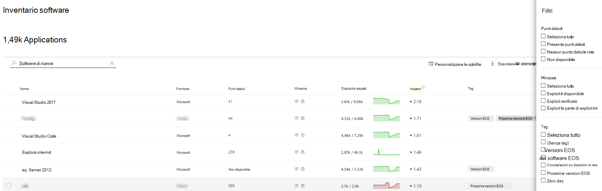
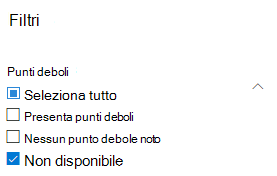
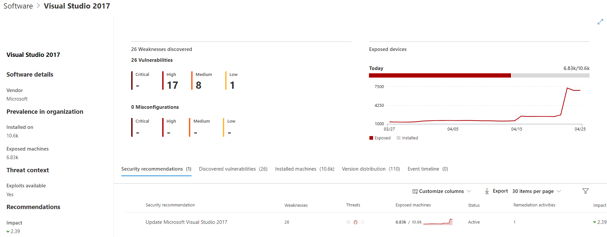

# Inventario software - gestione di minacce e vulnerabilità

[!INCLUDE [Microsoft 365 Defender rebranding](../../includes/microsoft-defender.md)]

**Si applica a:**
- [Microsoft Defender per endpoint](https://go.microsoft.com/fwlink/?linkid=2154037)
- [Minaccia e gestione delle vulnerabilità](next-gen-threat-and-vuln-mgt.md)
- [Microsoft 365 Defender](https://go.microsoft.com/fwlink/?linkid=2118804)

>Vuoi provare Defender per Endpoint? [Iscriversi per una versione di valutazione gratuita.](https://www.microsoft.com/microsoft-365/windows/microsoft-defender-atp?ocid=docs-wdatp-portaloverview-abovefoldlink)

L'inventario software in gestione di minacce e vulnerabilità è un elenco di software noto nell'organizzazione con le enumerazioni ufficiali della piattaforma comune [(CPE)](https://nvd.nist.gov/products/cpe). I prodotti software senza CPE ufficiale non hanno vulnerabilità pubblicate. Include inoltre dettagli quali il nome del fornitore, il numero di punti deboli, le minacce e il numero di dispositivi esposti.

## Come funziona

Nel campo dell'individuazione, stiamo sfruttando lo stesso set di segnali responsabile del rilevamento e della valutazione delle vulnerabilità in Microsoft Defender per le funzionalità di rilevamento e risposta degli [endpoint.](overview-endpoint-detection-response.md)

Dal momento che è in tempo reale, in pochi minuti, vedrai le informazioni sulla vulnerabilità quando vengono individuate. Il motore afferra automaticamente le informazioni da più feed di sicurezza. Infatti, vedrai se un particolare software è connesso a una campagna di minacce in tempo reale. Fornisce inoltre un collegamento a un report di Threat Analytics non appena disponibile.

## Passare alla pagina Inventario software

Accedere alla pagina Inventario software selezionando **Inventario software** dal menu gestione di minacce e vulnerabilità di spostamento nella Microsoft Defender Security Center [.](portal-overview.md)

Visualizzare il software in dispositivi specifici nelle pagine dei singoli dispositivi [dall'elenco dei dispositivi.](machines-view-overview.md)

>[!NOTE]
>Se si cerca software utilizzando la ricerca globale di Microsoft Defender for Endpoint, assicurarsi di inserire un carattere di sottolineatura anziché uno spazio. Ad esempio, per i risultati di ricerca migliori devi scrivere "windows_10" anziché "Windows 10".

## Panoramica dell'inventario software

La **pagina Inventario software** si apre con un elenco di software installato nella rete, inclusi il nome del fornitore, i punti deboli trovati, le minacce ad essi associate, i dispositivi esposti, l'impatto sul punteggio di esposizione e i tag.

È possibile filtrare la visualizzazione elenco in base ai punti deboli rilevati nel software, alle minacce associate e ai tag, ad esempio se il software ha raggiunto la fine del supporto.

Selezionare il software che si desidera analizzare. Verrà aperto un riquadro a comparsa con una visualizzazione più compatta delle informazioni nella pagina. È possibile approfondire l'indagine e selezionare Apri pagina **software** oppure contrassegnare eventuali incoerenze tecniche selezionando Segnala **inaccurabilità.**

### Software non supportato

Il software attualmente non supportato dalle minacce & gestione delle vulnerabilità essere presente nella pagina Inventario software. Poiché non è supportato, saranno disponibili solo dati limitati. Filtra in base al software non supportato con l'opzione "Non disponibile" nella sezione "Debolezza".

Di seguito viene indicato che un software non è supportato:

- Il campo Punti deboli mostra "Non disponibile"
- Il campo Dispositivi esposti mostra un trattino
- Testo informativo aggiunto nel pannello laterale e nella pagina software
- Nella pagina del software non sono disponibili i suggerimenti per la sicurezza, le vulnerabilità individuate o le sezioni relative alla sequenza temporale degli eventi

Attualmente, i prodotti senza CPE non vengono visualizzati nella pagina dell'inventario software, solo nell'inventario software a livello di dispositivo.

## Inventario software nei dispositivi

Dal riquadro Microsoft Defender Security Center di spostamento vai **[all'elenco Dispositivi.](machines-view-overview.md)** Seleziona il nome di un dispositivo per aprire la pagina del dispositivo (ad esempio Computer1), quindi seleziona la scheda **Inventario** software per visualizzare un elenco di tutti i software noti presenti nel dispositivo. Selezionare una voce software specifica per aprire il riquadro a comparsa con ulteriori informazioni.

Il software potrebbe essere visibile a livello di dispositivo anche se attualmente non è supportato da gestione di minacce e vulnerabilità. Tuttavia, saranno disponibili solo dati limitati. Saprai se il software non è supportato perché nella colonna "Debolezza" verrà visualizzato "Non disponibile".

Il software senza CPE può anche essere visualizzato in questo inventario software specifico del dispositivo.

### Prove software

Vedi la prova della posizione in cui è stato rilevato un software specifico in un dispositivo dal Registro di sistema, dal disco o da entrambi. Puoi trovarlo in qualsiasi dispositivo nell'inventario software del dispositivo.

Selezionare un nome software per aprire il riquadro a comparsa e cercare la sezione "Software Evidence".

## Pagine software

È possibile visualizzare le pagine software in diversi modi:

- Pagina Inventario software > Selezionare un nome software > Seleziona **la pagina Apri software** nel riquadro a comparsa
- [Pagina Suggerimenti per la](tvm-security-recommendation.md) sicurezza > Selezionare un suggerimento > Selezionare la pagina **Apri software** nel riquadro a comparsa
- [Pagina Sequenza temporale evento](threat-and-vuln-mgt-event-timeline.md) > Selezionare un > Selezionare il nome del software con collegamento ipertestuale (ad esempio Visual Studio 2017) nella sezione denominata "Componente correlato" nel riquadro a comparsa

 Verrà visualizzata una pagina intera con tutti i dettagli di un software specifico e le informazioni seguenti:

- Pannello laterale con informazioni sul fornitore, prevalenza del software nell'organizzazione (incluso il numero di dispositivi in cui è installato e dispositivi esposti che non sono patchati), se è disponibile e exploit e impatto sul punteggio di esposizione.
- Visualizzazioni dei dati che mostrano il numero e la gravità delle vulnerabilità e delle configurazioni erre. Inoltre, grafici con il numero di dispositivi esposti.
- Schede che mostrano informazioni quali:
    - Suggerimenti per la sicurezza corrispondenti per i punti deboli e le vulnerabilità identificati.
    - CVE denominati delle vulnerabilità individuate.
    - Dispositivi in cui è installato il software (insieme al nome del dispositivo, al dominio, al sistema operativo e altro ancora).
    - Elenco delle versioni software (incluso il numero di dispositivi in cui è installata la versione, il numero di vulnerabilità individuate e i nomi dei dispositivi installati).

    

## Imprecisione dei report

Segnalare un falso positivo quando vengono visualizzate informazioni vaghe, imprecise o incomplete. È inoltre possibile segnalare suggerimenti sulla sicurezza che sono già stati corretti.

1. Aprire il riquadro a comparsa software nella pagina Inventario software.
2. Selezionare **Report inaccuracy**.
3. Nel riquadro a comparsa selezionare la categoria di imprecisione dal menu a discesa, immettere l'indirizzo di posta elettronica e i dettagli sull'imprecisione.
4. Selezionare **Invia**. Il feedback viene inviato immediatamente agli gestione di minacce e vulnerabilità esperti.

## Articoli correlati

- [Panoramica delle minacce gestione delle vulnerabilità sicurezza](next-gen-threat-and-vuln-mgt.md)
- [Consigli sulla sicurezza](tvm-security-recommendation.md)
- [Sequenza temporale eventi](threat-and-vuln-mgt-event-timeline.md)
- [Visualizzare e organizzare l'elenco di Microsoft Defender per dispositivi endpoint](machines-view-overview.md)
