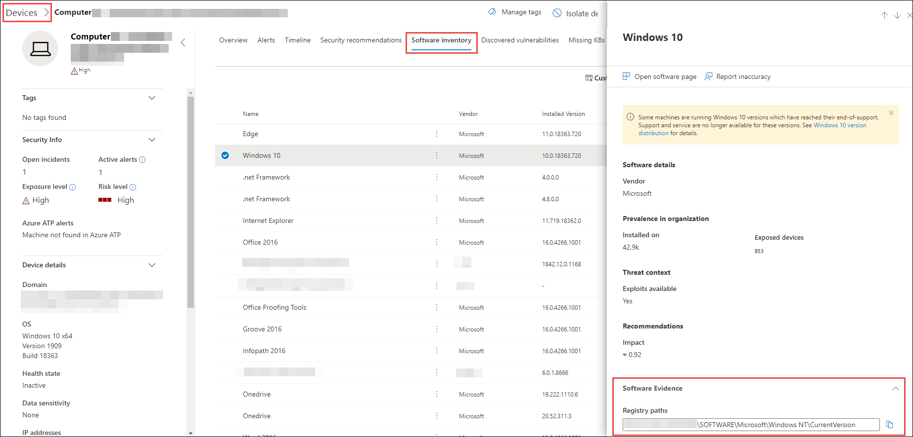

# Inventario software - Gestione delle minacce e delle vulnerabilitàSoftware inventory - threat and vulnerability management

[!INCLUDE [Microsoft 365 Defender rebranding](../../includes/microsoft-defender.md)]

**Si applica a:****Applies to:**
- [Microsoft Defender per endpointMicrosoft Defender for Endpoint](https://go.microsoft.com/fwlink/?linkid=2154037)
- [Gestione di minacce e vulnerabilitàThreat and vulnerability management](next-gen-threat-and-vuln-mgt.md)
- [Microsoft 365 DefenderMicrosoft 365 Defender](https://go.microsoft.com/fwlink/?linkid=2118804)

>Vuoi provare Defender per Endpoint?Want to experience Defender for Endpoint? [Iscriversi per una versione di valutazione gratuita.Sign up for a free trial.](https://www.microsoft.com/microsoft-365/windows/microsoft-defender-atp?ocid=docs-wdatp-portaloverview-abovefoldlink)

L'inventario software nella gestione delle minacce e delle vulnerabilità è un elenco di software noto nell'organizzazione con le enumerazioni ufficiali della piattaforma comune [(CPE).](https://nvd.nist.gov/products/cpe)The software inventory in threat and vulnerability management is a list of known software in your organization with official [Common Platform Enumerations (CPE)](https://nvd.nist.gov/products/cpe). I prodotti software senza un CPE ufficiale non hanno vulnerabilità pubblicate.Software products without an official CPE don’t have vulnerabilities published. Include inoltre dettagli quali il nome del fornitore, il numero di punti deboli, le minacce e il numero di dispositivi esposti.It also includes details such as the name of the vendor, number of weaknesses, threats, and number of exposed devices.

## FunzionamentoHow it works

Nel campo dell'individuazione, stiamo sfruttando lo stesso set di segnali responsabile del rilevamento e della valutazione delle vulnerabilità in Microsoft Defender per le funzionalità di rilevamento e risposta degli [endpoint.](overview-endpoint-detection-response.md)In the field of discovery, we're leveraging the same set of signals that is responsible for detection and vulnerability assessment in [Microsoft Defender for Endpoint detection and response capabilities](overview-endpoint-detection-response.md).

Dal momento che è in tempo reale, in pochi minuti, vedrai le informazioni sulla vulnerabilità quando vengono individuate.Since it's real time, in a matter of minutes, you'll see vulnerability information as they get discovered. Il motore afferra automaticamente le informazioni da più feed di sicurezza.The engine automatically grabs information from multiple security feeds. Infatti, vedrai se un particolare software è connesso a una campagna di minacce in tempo reale.In fact, you'll see if a particular software is connected to a live threat campaign. Fornisce inoltre un collegamento a un report di Threat Analytics non appena disponibile.It also provides a link to a Threat Analytics report soon as it's available.

## Passare alla pagina Inventario softwareNavigate to the Software inventory page

Accedere alla pagina Inventario software selezionando **Inventario software** dal menu di spostamento per la gestione delle minacce e delle vulnerabilità in Microsoft Defender [Security Center.](portal-overview.md)Access the Software inventory page by selecting **Software inventory** from the threat and vulnerability management navigation menu in the [Microsoft Defender Security Center](portal-overview.md).

Visualizzare il software in dispositivi specifici nelle pagine dei singoli dispositivi [dall'elenco dei dispositivi.](machines-view-overview.md)View software on specific devices in the individual devices pages from the [devices list](machines-view-overview.md).

>[!NOTE]
>Se si cerca software utilizzando la ricerca globale di Microsoft Defender for Endpoint, assicurarsi di inserire un carattere di sottolineatura anziché uno spazio.If you search for software using the Microsoft Defender for Endpoint global search, make sure to put an underscore instead of a space. Ad esempio, per i risultati di ricerca migliori devi scrivere "windows_10" anziché "Windows 10".For example, for the best search results you'd write "windows_10" instead of "Windows 10".

## Panoramica dell'inventario softwareSoftware inventory overview

La **pagina Inventario software** si apre con un elenco di software installato nella rete, inclusi il nome del fornitore, i punti deboli trovati, le minacce ad essi associate, i dispositivi esposti, l'impatto sul punteggio di esposizione e i tag.The **Software inventory** page opens with a list of software installed in your network, including the vendor name, weaknesses found, threats associated with them, exposed devices, impact to exposure score, and tags.

È possibile filtrare la visualizzazione elenco in base ai punti deboli rilevati nel software, alle minacce associate e ai tag, ad esempio se il software ha raggiunto la fine del supporto.You can filter the list view based on weaknesses found in the software, threats associated with them, and tags like whether the software has reached end-of-support.

Selezionare il software che si desidera analizzare.Select the software that you want to investigate. Verrà aperto un riquadro a comparsa con una visualizzazione più compatta delle informazioni nella pagina.A flyout panel will open with a more compact view of the information on the page. È possibile approfondire l'indagine e selezionare Apri pagina **software** oppure contrassegnare eventuali incoerenze tecniche selezionando Segnala **inaccurabilità.**You can either dive deeper into the investigation and select **Open software page**, or flag any technical inconsistencies by selecting **Report inaccuracy**.

### Software non supportatoSoftware that isn't supported

Software attualmente non supportato dalle minacce & la gestione delle vulnerabilità potrebbe essere presente nella pagina Inventario software.Software that isn't currently supported by threat & vulnerability management may be present in the Software inventory page. Poiché non è supportato, saranno disponibili solo dati limitati.Because it is not supported, only limited data will be available. Filtra in base al software non supportato con l'opzione "Non disponibile" nella sezione "Debolezza".Filter by unsupported software with the "Not available" option in the "Weakness" section.

Di seguito viene indicato che un software non è supportato:The following indicates that a software is not supported:

- Il campo Punti deboli mostra "Non disponibile"Weaknesses field shows "Not available"
- Il campo Dispositivi esposti mostra un trattinoExposed devices field shows a dash
- Testo informativo aggiunto nel pannello laterale e nella pagina softwareInformational text added in side panel and in software page
- Nella pagina del software non sono disponibili i suggerimenti per la sicurezza, le vulnerabilità individuate o le sezioni relative alla sequenza temporale degli eventiThe software page won't have the security recommendations, discovered vulnerabilities, or event timeline sections

Attualmente, i prodotti senza CPE non vengono visualizzati nella pagina dell'inventario software, solo nell'inventario software a livello di dispositivo.Currently, products without a CPE are not shown in the software inventory page, only in the device level software inventory.

## Inventario software nei dispositiviSoftware inventory on devices

Dal riquadro di spostamento di Microsoft Defender Security Center vai **[all'elenco Dispositivi.](machines-view-overview.md)**From the Microsoft Defender Security Center navigation panel, go to the **[Devices list](machines-view-overview.md)**. Seleziona il nome di un dispositivo per aprire la pagina del dispositivo (ad esempio Computer1), quindi seleziona la scheda **Inventario** software per visualizzare un elenco di tutti i software noti presenti nel dispositivo.Select the name of a device to open the device page (like Computer1), then select the **Software inventory** tab to see a list of all the known software present on the device. Selezionare una voce software specifica per aprire il riquadro a comparsa con ulteriori informazioni.Select a specific software entry to open the flyout with more information.

Il software potrebbe essere visibile a livello di dispositivo anche se attualmente non è supportato dalla gestione delle minacce e delle vulnerabilità.Software may be visible at the device level even if it is currently not supported by threat and vulnerability management. Tuttavia, saranno disponibili solo dati limitati.However, only limited data will be available. Saprai se il software non è supportato perché nella colonna "Debolezza" verrà visualizzato "Non disponibile".You'll know if software is unsupported because it will say "Not available" in the "Weakness" column.

Il software senza CPE può anche essere visualizzato in questo inventario software specifico del dispositivo.Software with no CPE can also show up under this device specific software inventory.

### Prove softwareSoftware evidence

Vedi la prova della posizione in cui è stato rilevato un software specifico in un dispositivo dal Registro di sistema, dal disco o da entrambi. Puoi trovarlo in qualsiasi dispositivo nell'inventario software del dispositivo.See evidence of where we detected a specific software on a device from the registry, disk, or both.You can find it on any device in the device software inventory.

Selezionare un nome software per aprire il riquadro a comparsa e cercare la sezione "Software Evidence".Select a software name to open the flyout, and look for the section called "Software Evidence."

## Pagine softwareSoftware pages

È possibile visualizzare le pagine software in diversi modi:You can view software pages a few different ways:

- Pagina Inventario software > Selezionare un nome software > Seleziona **la pagina Apri software** nel riquadro a comparsaSoftware inventory page > Select a software name > Select **Open software page** in the flyout
- [Pagina Suggerimenti per la](tvm-security-recommendation.md) sicurezza > Selezionare un suggerimento > Selezionare la pagina **Apri software** nel riquadro a comparsa[Security recommendations page](tvm-security-recommendation.md) > Select a recommendation > Select **Open software page** in the flyout
- [Pagina Sequenza temporale](threat-and-vuln-mgt-event-timeline.md) evento > Seleziona un evento > Seleziona il nome del software con collegamento ipertestuale (ad esempio Visual Studio 2017) nella sezione denominata "Componente correlato" nel riquadro a comparsa[Event timeline page](threat-and-vuln-mgt-event-timeline.md) > Select an event > Select the hyperlinked software name (like Visual Studio 2017) in the section called "Related component" in the flyout

 Verrà visualizzata una pagina intera con tutti i dettagli di un software specifico e le informazioni seguenti:A full page will appear with all the details of a specific software and the following information:

- Pannello laterale con informazioni sul fornitore, prevalenza del software nell'organizzazione (incluso il numero di dispositivi in cui è installato e dispositivi esposti che non sono patchati), se è disponibile e exploit e impatto sul punteggio di esposizione.Side panel with vendor information, prevalence of the software in the organization (including number of devices it's installed on, and exposed devices that aren't patched), whether and exploit is available, and impact to your exposure score.
- Visualizzazioni dei dati che mostrano il numero e la gravità delle vulnerabilità e delle configurazioni erre.Data visualizations showing the number of, and severity of, vulnerabilities and misconfigurations. Inoltre, grafici con il numero di dispositivi esposti.Also, graphs with the number of exposed devices.
- Schede che mostrano informazioni quali:Tabs showing information such as:
    - Suggerimenti per la sicurezza corrispondenti per i punti deboli e le vulnerabilità identificati.Corresponding security recommendations for the weaknesses and vulnerabilities identified.
    - CVE denominati delle vulnerabilità individuate.Named CVEs of discovered vulnerabilities.
    - Dispositivi in cui è installato il software (insieme al nome del dispositivo, al dominio, al sistema operativo e altro ancora).Devices that have the software installed (along with device name, domain, OS, and more).
    - Elenco delle versioni software (incluso il numero di dispositivi in cui è installata la versione, il numero di vulnerabilità individuate e i nomi dei dispositivi installati).Software version list (including number of devices the version is installed on, the number of discovered vulnerabilities, and the names of the installed devices).

    

## Imprecisione dei reportReport inaccuracy

Segnalare un falso positivo quando vengono visualizzate informazioni vaghe, imprecise o incomplete.Report a false positive when you see any vague, inaccurate, or incomplete information. È inoltre possibile segnalare suggerimenti sulla sicurezza che sono già stati corretti.You can also report on security recommendations that have already been remediated.

1. Aprire il riquadro a comparsa software nella pagina Inventario software.Open the software flyout on the Software inventory page.
2. Selezionare **Report inaccuracy**.Select **Report inaccuracy**.
3. Nel riquadro a comparsa selezionare la categoria di imprecisione dal menu a discesa, immettere l'indirizzo di posta elettronica e i dettagli sull'imprecisione.From the flyout pane, select the inaccuracy category from the drop-down menu, fill in your email address, and details about the inaccuracy.
4. Selezionare **Invia**.Select **Submit**. Il feedback viene inviato immediatamente agli esperti di gestione delle minacce e delle vulnerabilità.Your feedback is immediately sent to the threat and vulnerability management experts.

## Articoli correlatiRelated articles

- [Panoramica della gestione delle minacce e delle vulnerabilitàThreat and vulnerability management overview](next-gen-threat-and-vuln-mgt.md)
- [Consigli sulla sicurezzaSecurity recommendations](tvm-security-recommendation.md)
- [Sequenza temporale eventiEvent timeline](threat-and-vuln-mgt-event-timeline.md)
- [Visualizzare e organizzare l'elenco di Microsoft Defender per dispositivi endpointView and organize the Microsoft Defender for Endpoint Devices list](machines-view-overview.md)
