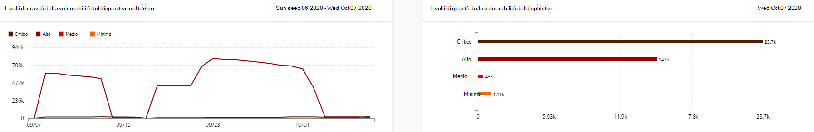
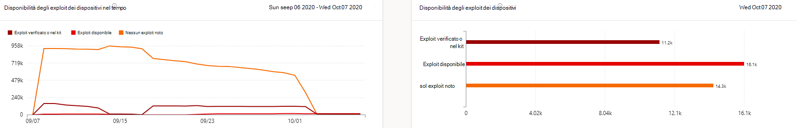
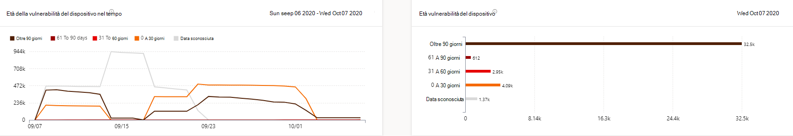
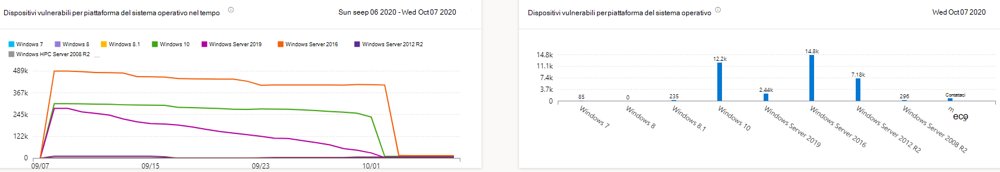
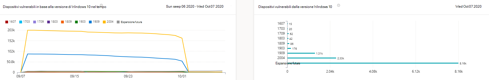

# Report sui dispositivi vulnerabili - Gestione delle minacce e delle vulnerabilitàVulnerable devices report - threat and vulnerability management

[!INCLUDE [Microsoft 365 Defender rebranding](../../includes/microsoft-defender.md)]

**Si applica a:****Applies to:**

- [Microsoft Defender per endpointMicrosoft Defender for Endpoint](https://go.microsoft.com/fwlink/?linkid=2154037)
- [Gestione di minacce e vulnerabilitàThreat and vulnerability management](next-gen-threat-and-vuln-mgt.md)
- [Microsoft 365 DefenderMicrosoft 365 Defender](https://go.microsoft.com/fwlink/?linkid=2118804)

>Vuoi provare Microsoft Defender per Endpoint?Want to experience Microsoft Defender for Endpoint? [Iscriversi per una versione di valutazione gratuita.Sign up for a free trial.](https://www.microsoft.com/microsoft-365/windows/microsoft-defender-atp?ocid=docs-wdatp-portaloverview-abovefoldlink)

Il report mostra grafici e grafici a barre con tendenze dei dispositivi vulnerabili e statistiche correnti.The report shows graphs and bar charts with vulnerable device trends and current statistics. L'obiettivo è comprendere il respiro e l'ambito dell'esposizione del dispositivo.The goal is for you to understand the breath and scope of your device exposure. 

Accedere al report in Microsoft Defender Security Center accedendo a **Report > dispositivi vulnerabili**Access the report in the Microsoft Defender Security Center by going to **Reports > Vulnerable devices**

Sono disponibili due colonne:There are two columns:

- Tendenze (nel tempo).Trends (over time). Può mostrare gli ultimi 30 giorni, 3 mesi, 6 mesi o un intervallo di date personalizzato.Can show the past 30 days, 3 months, 6 months, or a custom date range.
- Oggi (informazioni correnti)Today (current information)

**Filtro:** è possibile filtrare i dati in base ai livelli di gravità della vulnerabilità, alla disponibilità degli exploit, al periodo di validità della vulnerabilità, alla piattaforma del sistema operativo, alla versione di Windows 10 o al gruppo di dispositivi.**Filter**: You can filter the data by vulnerability severity levels, exploit availability, vulnerability age, operating system platform, Windows 10 version, or device group.

**Drill-down:** se sono disponibili informazioni approfondite che si desidera esplorare ulteriormente, selezionare il grafico a barre pertinente per visualizzare un elenco filtrato di dispositivi nella pagina Inventario dispositivi.**Drill down**: If there is an insight you want to explore further, select the relevant bar chart to view a filtered list of devices in the Device inventory page. Da qui è possibile esportare l'elenco.From there, you can export the list.

## Grafici del livello di gravitàSeverity level graphs

Ogni dispositivo viene conteggiato una sola volta in base alla vulnerabilità più grave riscontrata in tale dispositivo.Each device is counted only once according to the most severe vulnerability found on that device.

## Grafici sulla disponibilità degli exploitExploit availability graphs

Ogni dispositivo viene conteggiato una sola volta in base al livello più alto di exploit noto.Each device is counted only once based on the highest level of known exploit.

## Grafici dell'età delle vulnerabilitàVulnerability age graphs

Ogni dispositivo viene conteggiato una sola volta alla data di pubblicazione della vulnerabilità meno recente.Each device is counted only once under the oldest vulnerability publication date. Le vulnerabilità precedenti hanno maggiori probabilità di essere sfruttate.Older vulnerabilities have a higher chance of being exploited.

## Dispositivi vulnerabili in base ai grafici della piattaforma del sistema operativoVulnerable devices by operating system platform graphs

Numero di dispositivi in ogni sistema operativo esposti a causa di vulnerabilità software.The number of devices on each operating system that are exposed due to software vulnerabilities.

## Dispositivi vulnerabili tramite grafici della versione di Windows 10Vulnerable devices by Windows 10 version graphs

Numero di dispositivi in ogni versione di Windows 10 esposti a causa di applicazioni vulnerabili o del sistema operativo.The number of devices on each Windows 10 version that are exposed due to vulnerable applications or OS.

## Argomenti correlatiRelated topics

- [Panoramica della gestione delle minacce e delle vulnerabilitàThreat and vulnerability management overview](next-gen-threat-and-vuln-mgt.md)
- [Consigli sulla sicurezzaSecurity recommendations](tvm-security-recommendation.md)
