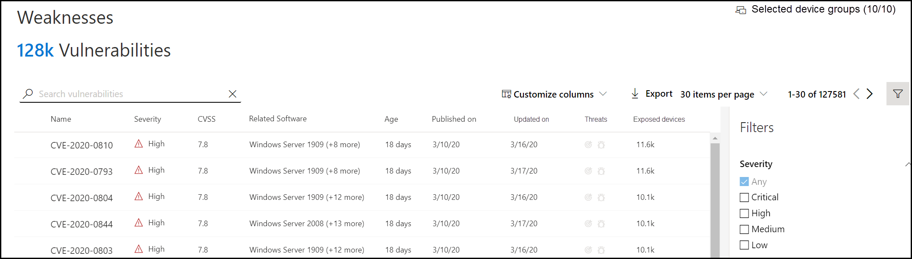

# Vulnerabilità nell'organizzazione - gestione delle minacce e delle vulnerabilitàVulnerabilities in my organization - threat and vulnerability management

[!INCLUDE [Microsoft 365 Defender rebranding](../../includes/microsoft-defender.md)]

**Si applica a:****Applies to:**
- [Microsoft Defender per endpointMicrosoft Defender for Endpoint](https://go.microsoft.com/fwlink/?linkid=2154037)
- [Gestione di minacce e vulnerabilitàThreat and vulnerability management](next-gen-threat-and-vuln-mgt.md)
- [Microsoft 365 DefenderMicrosoft 365 Defender](https://go.microsoft.com/fwlink/?linkid=2118804)

>Vuoi provare Microsoft Defender per Endpoint?Want to experience Microsoft Defender for Endpoint? [Iscriversi per una versione di valutazione gratuita.Sign up for a free trial.](https://www.microsoft.com/microsoft-365/windows/microsoft-defender-atp?ocid=docs-wdatp-portaloverview-abovefoldlink)

La gestione delle minacce e delle vulnerabilità usa gli stessi segnali in Defender per la protezione degli endpoint per analizzare e rilevare le vulnerabilità.Threat and vulnerability management uses the same signals in Defender for Endpoint's endpoint protection to scan and detect vulnerabilities.

Nella **pagina Punti** deboli sono elencate le vulnerabilità software a cui sono esposti i dispositivi elencando l'ID CVE (Common Vulnerabilities and Exposures).The **Weaknesses** page lists the software vulnerabilities your devices are exposed to by listing the Common Vulnerabilities and Exposures (CVE) ID. È inoltre possibile visualizzare la gravità, il sistema di valutazione delle vulnerabilità comuni (CVSS, Common Vulnerability Scoring System), la diffusione nell'organizzazione, la violazione corrispondente, le informazioni dettagliate sulle minacce e altro ancora.You can also view the severity, Common Vulnerability Scoring System (CVSS) rating, prevalence in your organization, corresponding breach, threat insights, and more.

>[!NOTE]
>Se non esiste un CVE-ID ufficiale assegnato a una vulnerabilità, il nome della vulnerabilità viene assegnato dalla gestione delle minacce e delle vulnerabilità.If there is no official CVE-ID assigned to a vulnerability, the vulnerability name is assigned by threat and vulnerability management.

>[!TIP]
>Per ricevere messaggi di posta elettronica sui nuovi eventi di vulnerabilità, vedere Configurare le notifiche di posta elettronica relative alla vulnerabilità [in Microsoft Defender for Endpoint](configure-vulnerability-email-notifications.md)To get emails about new vulnerability events, see [Configure vulnerability email notifications in Microsoft Defender for Endpoint](configure-vulnerability-email-notifications.md)

## Passare alla pagina Punti deboliNavigate to the Weaknesses page

Accedere alla pagina Punti deboli in diversi modi:Access the Weaknesses page a few different ways:

- Selezione **di punti** di debolezza dal menu di spostamento per la gestione delle minacce e delle vulnerabilità in Microsoft Defender Security [Center](portal-overview.md)Selecting **Weaknesses** from the threat and vulnerability management navigation menu in the [Microsoft Defender Security Center](portal-overview.md)
- Ricerca globaleGlobal search

### Menu di spostamentoNavigation menu

Vai al menu di spostamento per la gestione delle minacce e delle vulnerabilità e seleziona **Debolezze** per aprire l'elenco di CVE.Go to the threat and vulnerability management navigation menu and select **Weaknesses** to open the list of CVEs.

### Vulnerabilità nella ricerca globaleVulnerabilities in global search

1. Vai al menu a discesa ricerca globale.Go to the global search drop-down menu.
2. Seleziona **Vulnerabilità e** chiave nell'ID CVE (Common Vulnerabilities and Exposures) che stai cercando, quindi seleziona l'icona di ricerca.Select **Vulnerability** and key-in the Common Vulnerabilities and Exposures (CVE) ID that you're looking for, then select the search icon. Viene **visualizzata** la pagina Punti deboli con le informazioni CVE che si sta cercando.The **Weaknesses** page opens with the CVE information that you're looking for.

3. Seleziona il CVE per aprire un riquadro a comparsa con altre informazioni, tra cui la descrizione della vulnerabilità, i dettagli, le informazioni dettagliate sulle minacce e i dispositivi esposti.Select the CVE to open a flyout panel with more information, including the vulnerability description, details, threat insights, and exposed devices.

Per visualizzare il resto delle vulnerabilità nella pagina **Punti deboli,** digitare CVE, quindi selezionare cerca.To see the rest of the vulnerabilities in the **Weaknesses** page, type CVE, then select search.

## Panoramica dei punti deboliWeaknesses overview

Correggere le vulnerabilità nei dispositivi esposti per ridurre il rischio per le risorse e l'organizzazione.Remediate the vulnerabilities in exposed devices to reduce the risk to your assets and organization. Se la **colonna Dispositivi esposti** mostra 0, significa che non sei a rischio.If the **Exposed Devices** column shows 0, that means you aren't at risk.

### Informazioni dettagliate su violazioni e minacceBreach and threat insights

Visualizzare eventuali informazioni dettagliate sulle violazioni e sulle minacce correlate nella **colonna Minaccia** quando le icone sono di colore rosso.View any related breach and threat insights in the **Threat** column when the icons are colored red.

 >[!NOTE]
 > Assegnare sempre la priorità ai suggerimenti associati alle minacce in corso.Always prioritize recommendations that are associated with ongoing threats. Questi suggerimenti sono contrassegnati con l'icona di analisi delle minacce These recommendations are marked with the threat insight icon  e icona informazioni di violazione and breach insight icon .  

L'icona informazioni dettagliate sulle violazioni è evidenziata se nell'organizzazione è presente una vulnerabilità.The breach insights icon is highlighted if there's a vulnerability found in your organization.

L'icona informazioni dettagliate sulle minacce è evidenziata se sono presenti exploit associati nella vulnerabilità rilevata nell'organizzazione.The threat insights icon is highlighted if there are associated exploits in the vulnerability found in your organization. Il passaggio del mouse sull'icona indica se la minaccia fa parte di un exploit kit o è connessa a campagne o gruppi di attività persistenti avanzati specifici.Hovering over the icon shows whether the threat is a part of an exploit kit, or connected to specific advanced persistent campaigns or activity groups. Se disponibile, è disponibile un collegamento a un report di Threat Analytics con notizie, divulgazioni o avvisi di sicurezza correlati allo sfruttamento zero-day.When available, there's a link to a Threat Analytics report with zero-day exploitation news, disclosures, or related security advisories.  

### Acquisire informazioni dettagliate sulla vulnerabilitàGain vulnerability insights

Se si seleziona un CVE, verrà aperto un riquadro a comparsa con ulteriori informazioni, ad esempio la descrizione della vulnerabilità, i dettagli, le informazioni dettagliate sulle minacce e i dispositivi esposti.If you select a CVE, a flyout panel will open with more information such as the vulnerability description, details, threat insights, and exposed devices.

- La categoria "Funzionalità del sistema operativo" viene visualizzata negli scenari pertinentiThe "OS Feature" category is shown in relevant scenarios
- Puoi passare alla raccomandazione di sicurezza correlata per ogni CVE con dispositivo espostoYou can go to the related security recommendation for every CVE with exposed device

 

### Software non supportatoSoftware that isn't supported

CvEs per software attualmente non supportato dalle minacce & la gestione delle vulnerabilità è ancora presente nella pagina Punti deboli.CVEs for software that isn't currently supported by threat & vulnerability management is still present in the Weaknesses page. Poiché il software non è supportato, saranno disponibili solo dati limitati.Because the software is not supported, only limited data will be available.

Le informazioni sui dispositivi esposti non saranno disponibili per i CVE con software non supportato.Exposed device information will not be available for CVEs with unsupported software. Filtra per software non supportato selezionando l'opzione "Non disponibile" nella sezione "Dispositivi esposti".Filter by unsupported software by selecting the "Not available" option in the "Exposed devices" section.

 

## Visualizzare le voci CVE (Common Vulnerabilities and Exposures) in altre posizioniView Common Vulnerabilities and Exposures (CVE) entries in other places

### Software più vulnerabile nel dashboardTop vulnerable software in the dashboard

1. Vai al [dashboard di gestione delle minacce e delle](tvm-dashboard-insights.md) vulnerabilità e scorri verso il basso fino al widget Software più **vulnerabile.**Go to the [threat and vulnerability management dashboard](tvm-dashboard-insights.md) and scroll down to the **Top vulnerable software** widget. Verrà visualizzato il numero di vulnerabilità riscontrate in ogni software, insieme alle informazioni sulle minacce e a una visualizzazione di alto livello dell'esposizione dei dispositivi nel tempo.You will see the number of vulnerabilities found in each software, along with threat information and a high-level view of device exposure over time.

    

2. Selezionare il software che si desidera analizzare per passare a una pagina di drill-down.Select the software you want to investigate to go to a drilldown page.
3. Selezionare la **scheda Vulnerabilità individuate.**Select the **Discovered vulnerabilities** tab.
4. Selezionare la vulnerabilità che si desidera analizzare per ulteriori informazioni sui dettagli della vulnerabilitàSelect the vulnerability you want to investigate for more information on vulnerability details

    

### Individuare le vulnerabilità nella pagina del dispositivoDiscover vulnerabilities in the device page

Visualizza le informazioni sui punti deboli correlati nella pagina del dispositivo.View related weaknesses information in the device page.

1. Vai alla barra dei menu di spostamento di Microsoft Defender Security Center, quindi seleziona l'icona del dispositivo.Go to the Microsoft Defender Security Center navigation menu bar, then select the device icon. Verrà **visualizzata la pagina elenco** Dispositivi.The **Devices list** page opens.
2. Nella pagina **elenco Dispositivi** seleziona il nome del dispositivo che vuoi analizzare.In the **Devices list** page, select the device name that you want to investigate.

    

3. La pagina del dispositivo si aprirà con i dettagli e le opzioni di risposta per il dispositivo che vuoi analizzare.The device page will open with details and response options for the device you want to investigate.
4. Selezionare **Vulnerabilità individuate.**Select **Discovered vulnerabilities**.

    

5. Seleziona la vulnerabilità che vuoi analizzare per aprire un riquadro a comparsa con i dettagli CVE, ad esempio: descrizione della vulnerabilità, informazioni dettagliate sulle minacce e logica di rilevamento.Select the vulnerability that you want to investigate to open up a flyout panel with the CVE details, such as: vulnerability description, threat insights, and detection logic.

#### Logica di rilevamento CVECVE Detection logic

Analogamente alla prova software, ora mostriamo la logica di rilevamento applicata a un dispositivo per dimostrare che è vulnerabile.Similar to the software evidence, we now show the detection logic we applied on a device in order to state that it's vulnerable. La nuova sezione è denominata "Logica di rilevamento" (in qualsiasi vulnerabilità individuata nella pagina del dispositivo) e mostra la logica di rilevamento e l'origine.The new section is called "Detection Logic" (in any discovered vulnerability in the device page) and shows the detection logic and source.

La categoria "Funzionalità del sistema operativo" viene visualizzata anche negli scenari pertinenti.The "OS Feature" category is also shown in relevant scenarios. Un CVE influisce sui dispositivi che eseguono un sistema operativo vulnerabile solo se è abilitato uno specifico componente del sistema operativo.A CVE would affect devices that run a vulnerable OS only if a specific OS component is enabled. Supponiamo che Windows Server 2019 abbia una vulnerabilità nel suo componente DNS.Let's say Windows Server 2019 has vulnerability in its DNS component. Con questa nuova funzionalità, questo CVE verrà collegato solo ai dispositivi Windows Server 2019 con la funzionalità DNS abilitata nel sistema operativo.With this new capability, we’ll only attach this CVE to the Windows Server 2019 devices with the DNS capability enabled in their OS.

## Imprecisione dei reportReport inaccuracy

Segnalare un falso positivo quando vengono visualizzate informazioni vaghe, imprecise o incomplete.Report a false positive when you see any vague, inaccurate, or incomplete information. È inoltre possibile segnalare suggerimenti sulla sicurezza che sono già stati corretti.You can also report on security recommendations that have already been remediated.

1. Aprire CVE nella pagina Punti deboli.Open the CVE on the Weaknesses page.
2. Selezionare **Report inaccuracy e** verrà aperto un riquadro a comparsa.Select **Report inaccuracy** and a flyout pane will open.
3. Seleziona la categoria di imprecisione dal menu a discesa e inserisci l'indirizzo di posta elettronica e i dettagli dell'imprecisione.Select the inaccuracy category from the drop-down menu and fill in your email address and inaccuracy details.
4. Selezionare **Invia**.Select **Submit**. Il feedback viene inviato immediatamente agli esperti di gestione delle minacce e delle vulnerabilità.Your feedback is immediately sent to the threat and vulnerability management experts.

## Articoli correlatiRelated articles

- [Panoramica della gestione delle minacce e delle vulnerabilitàThreat and vulnerability management overview](next-gen-threat-and-vuln-mgt.md)
- [Consigli sulla sicurezzaSecurity recommendations](tvm-security-recommendation.md)
- [Inventario softwareSoftware inventory](tvm-software-inventory.md)
- [Dashboard Dati analiticiDashboard insights](tvm-dashboard-insights.md)
- [Visualizzare e organizzare l'elenco di Microsoft Defender per dispositivi endpointView and organize the Microsoft Defender for Endpoint Devices list](machines-view-overview.md)
