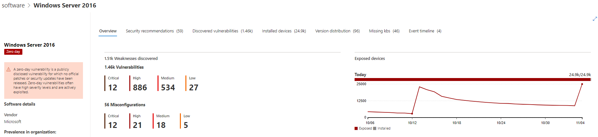

# Ridurre le vulnerabilità zero-day - gestione di minacce e vulnerabilitàMitigate zero-day vulnerabilities - threat and vulnerability management

[!INCLUDE [Microsoft 365 Defender rebranding](../../includes/microsoft-defender.md)]

**Si applica a:****Applies to:**

- [Microsoft Defender per endpointMicrosoft Defender for Endpoint](https://go.microsoft.com/fwlink/?linkid=2154037)
- [Minaccia e gestione delle vulnerabilitàThreat and vulnerability management](next-gen-threat-and-vuln-mgt.md)
- [Microsoft 365 DefenderMicrosoft 365 Defender](https://go.microsoft.com/fwlink/?linkid=2118804)

>Vuoi provare Microsoft Defender per Endpoint?Want to experience Microsoft Defender for Endpoint? [Iscriversi per una versione di valutazione gratuita.Sign up for a free trial.](https://www.microsoft.com/microsoft-365/windows/microsoft-defender-atp?ocid=docs-wdatp-portaloverview-abovefoldlink)

Una vulnerabilità zero-day è una vulnerabilità divulgata pubblicamente per la quale non sono state rilasciate patch ufficiali o aggiornamenti della sicurezza.A zero-day vulnerability is a publicly disclosed vulnerability for which no official patches or security updates have been released. Le vulnerabilità zero-day spesso hanno livelli di gravità elevati e vengono attivamente sfruttate.Zero-day vulnerabilities often have high severity levels and are actively exploited.

Minacce e gestione delle vulnerabilità verranno visualizzate solo vulnerabilità zero-day su cui sono disponibili informazioni.Threat and vulnerability management will only display zero-day vulnerabilities it has information about.

## Informazioni sulle vulnerabilità zero-dayFind information about zero-day vulnerabilities

Una volta trovata una vulnerabilità zero-day, le informazioni su di essa verranno trasmesse tramite le esperienze seguenti nel Microsoft Defender Security Center.Once a zero-day vulnerability has been found, information about it will be conveyed through the following experiences in the Microsoft Defender Security Center.

>[!NOTE]
> La funzionalità di 0 giorni non è attualmente disponibile per i prodotti non Windows (Mac, Linux); verrà tuttavia aggiunto in futuro.0-day capability is not currently available for non-Windows products (Mac, Linux); it will, however, be added in the future.

### Dashboard delle minacce gestione delle vulnerabilità sicurezzaThreat and vulnerability management dashboard

Cerca i suggerimenti con un tag zero-day nella scheda "Suggerimenti per la sicurezza principali".Look for recommendations with a zero-day tag in the “Top security recommendations” card.

Trova il software principale con il tag zero-day nella scheda "Software più vulnerabile".Find top software with the zero-day tag in the "Top vulnerable software" card.

### Pagina Punti deboliWeaknesses page

Cercare la vulnerabilità denominata zero-day insieme a una descrizione e dettagli.Look for the named zero-day vulnerability along with a description and details.

- Se a questa vulnerabilità è assegnato un ID CVE, verrà visualizzata l'etichetta zero-day accanto al nome CVE.If this vulnerability has a CVE-ID assigned, you’ll see the zero-day label next to the CVE name.

- Se a questa vulnerabilità non è assegnato un CVE-ID, si troverà sotto un nome temporaneo interno simile a "TVM-XXXX-XXXX".If this vulnerability has no CVE-ID assigned, you'll find it under an internal, temporary name that looks like “TVM-XXXX-XXXX”. Il nome verrà aggiornato dopo l'assegnazione di un CVE-ID ufficiale, ma il nome interno precedente sarà comunque disponibile per la ricerca e verrà trovato nel pannello laterale.The name will be updated once an official CVE-ID has been assigned, but the previous internal name will still be searchable and found in the side-panel.

### Pagina Inventario softwareSoftware inventory page

Cercare software con il tag zero-day.Look for software with the zero-day tag. Filtrare in base al tag "zero day" per visualizzare solo il software con vulnerabilità zero-day.Filter by the "zero day" tag to only see software with zero-day vulnerabilities.

### Pagina SoftwareSoftware page

Cercare un tag zero-day per ogni software interessato dalla vulnerabilità zero-day.Look for a zero-day tag for each software that has been affected by the zero–day vulnerability.

### Pagina Suggerimenti per la sicurezzaSecurity recommendations page

Visualizzare suggerimenti chiari sulle opzioni di correzione e mitigazione, incluse le soluzioni alternative, se esistenti.View clear suggestions about remediation and mitigation options, including workarounds if they exist. Filtrare in base al tag "zero day" per visualizzare solo i suggerimenti per la sicurezza che affrontano le vulnerabilità zero-day.Filter by the "zero day" tag to only see security recommendations addressing zero-day vulnerabilities.

Se è presente un software con una vulnerabilità zero-day e vulnerabilità aggiuntive da risolvere, si otterrà un consiglio su tutte le vulnerabilità.If there's software with a zero-day vulnerability and additional vulnerabilities to address, you'll get one recommendation about all vulnerabilities.

## Affrontare le vulnerabilità zero-dayAddressing zero-day vulnerabilities

Vai alla pagina dei suggerimenti per la sicurezza e seleziona un suggerimento con zero-day.Go to the security recommendation page and select a recommendation with a zero-day. Verrà aperto un riquadro a comparsa con informazioni sulla zero-day e altre vulnerabilità per tale software.A flyout will open with information about the zero-day and other vulnerabilities for that software.

Se disponibili, sarà disponibile un collegamento alle opzioni di mitigazione e alle soluzioni alternative.There will be a link to mitigation options and workarounds if they are available. Le soluzioni alternative possono contribuire a ridurre il rischio rappresentato da questa vulnerabilità zero-day fino a quando non è possibile distribuire una patch o un aggiornamento della sicurezza.Workarounds may help reduce the risk posed by this zero-day vulnerability until a patch or security update can be deployed.

Apri le opzioni di correzione e scegli il tipo di attenzione.Open remediation options and choose the attention type. È consigliabile un'opzione di correzione "attenzione necessaria" per le vulnerabilità zero-day, poiché un aggiornamento non è stato ancora rilasciato.An "attention required" remediation option is recommended for the zero-day vulnerabilities, since an update hasn't been released yet. Non sarà possibile selezionare una data di scadenza, poiché non è disponibile alcuna azione specifica da eseguire.You won't be able to select a due date, since there's no specific action to perform. Se sono presenti vulnerabilità meno recenti per questo software che si desidera correggere, è possibile ignorare l'opzione di correzione "attenzione necessaria" e scegliere "aggiorna".If there are older vulnerabilities for this software you wish to remediation, you can override the "attention required" remediation option and choose “update.”

## Tenere traccia delle attività di correzione zero-dayTrack zero-day remediation activities

Passare alla pagina gestione di minacce e vulnerabilità [correzione per](tvm-remediation.md) visualizzare l'elemento attività di correzione.Go to the threat and vulnerability management [Remediation](tvm-remediation.md) page to view the remediation activity item. Se hai scelto l'opzione di correzione "attenzione necessaria", non ci saranno barre di avanzamento, stato del ticket o data di scadenza poiché non è possibile monitorare alcuna azione effettiva.If you chose the "attention required" remediation option, there will be no progress bar, ticket status, or due date since there's no actual action we can monitor. È possibile filtrare in base al tipo di correzione, ad esempio "aggiornamento software" o "attenzione necessaria", per visualizzare tutti gli elementi attività nella stessa categoria.You can filter by remediation type, such as "software update" or "attention required," to see all activity items in the same category.

## Applicazione di patch alle vulnerabilità zero-dayPatching zero-day vulnerabilities

Quando viene rilasciata una patch per il giorno zero, il suggerimento verrà modificato in "Aggiornamento" e accanto a essa verrà visualizzato un'etichetta blu che indica "Nuovo aggiornamento della sicurezza per zero giorno".When a patch is released for the zero-day, the recommendation will be changed to “Update” and a blue label next to it that says “New security update for zero day.” Non verrà più utilizzato come zero-day, il tag zero-day verrà rimosso da tutte le pagine.It will no longer consider as a zero-day, the zero-day tag will be removed from all pages.

## Articoli correlatiRelated articles

- [Panoramica delle minacce gestione delle vulnerabilità sicurezzaThreat and vulnerability management overview](next-gen-threat-and-vuln-mgt.md)
- [DashboardDashboard](tvm-dashboard-insights.md)
- [Consigli sulla sicurezzaSecurity recommendations](tvm-security-recommendation.md)
- [Inventario softwareSoftware inventory](tvm-software-inventory.md)
- [Vulnerabilità nell'organizzazioneVulnerabilities in my organization](tvm-weaknesses.md)
