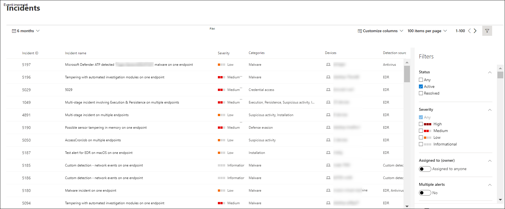

# Visualizzare e organizzare la coda eventi imprevisti di Microsoft Defender per endpointView and organize the Microsoft Defender for Endpoint Incidents queue

[!INCLUDE [Microsoft 365 Defender rebranding](../../includes/microsoft-defender.md)]

**Si applica a:****Applies to:**
- [Microsoft Defender per endpointMicrosoft Defender for Endpoint](https://go.microsoft.com/fwlink/?linkid=2154037)
- [Microsoft 365 DefenderMicrosoft 365 Defender](https://go.microsoft.com/fwlink/?linkid=2118804)

> Vuoi provare Defender per Endpoint?Want to experience Defender for Endpoint? [Iscriversi per una versione di valutazione gratuita.Sign up for a free trial.](https://www.microsoft.com/microsoft-365/windows/microsoft-defender-atp?ocid=docs-wdatp-pullalerts-abovefoldlink) 

La **coda Eventi imprevisti** mostra una raccolta di eventi imprevisti contrassegnati dai dispositivi della rete.The **Incidents queue** shows a collection of incidents that were flagged from devices in your network. Ti aiuta a ordinare gli eventi imprevisti in base alla loro priorità e a definire una risposta di cybersecurity mirata.It helps you sort through incidents to prioritize and create an informed cybersecurity response decision.

Per impostazione predefinita, nella coda vengono visualizzati gli eventi imprevisti visualizzati negli ultimi 30 giorni, con l'evento imprevisto più recente visualizzato all'inizio dell'elenco, consentendo di visualizzare prima gli eventi imprevisti più recenti.By default, the queue displays incidents seen in the last 30 days, with the most recent incident showing at the top of the list, helping you see the most recent incidents first.

Sono disponibili diverse opzioni tra cui scegliere per personalizzare la visualizzazione della coda eventi imprevisti.There are several options you can choose from to customize the Incidents queue view. 

Nella barra di spostamento superiore è possibile:On the top navigation you can:
- Personalizzare le colonne per aggiungere o rimuovere colonneCustomize columns to add or remove columns 
- Modificare il numero di elementi da visualizzare per paginaModify the number of items to view per page
- Selezionare gli elementi da visualizzare per paginaSelect the items to show per page
- Selezionare in batch gli eventi imprevisti da assegnareBatch-select the incidents to assign 
- Spostarsi tra le pagineNavigate between pages
- Applicazione di filtriApply filters

## Ordinare e filtrare la coda degli eventi imprevistiSort and filter the incidents queue
È possibile applicare i filtri seguenti per limitare l'elenco degli eventi imprevisti e ottenere una visualizzazione più mirata.You can apply the following filters to limit the list of incidents and get a more focused view.

### GravitàSeverity

Gravità evento imprevistoIncident severity | DescrizioneDescription
:---|:---
AltaHigh  (Rosso)(Red) | Minacce spesso associate a minacce persistenti avanzate (APT).Threats often associated with advanced persistent threats (APT). Questi eventi imprevisti indicano un rischio elevato a causa della gravità dei danni che possono infliggere ai dispositivi.These incidents indicate a high risk due to the severity of damage they can inflict on devices.
MedioMedium  (Arancione)(Orange) | Minacce raramente osservate nell'organizzazione, ad esempio modifiche anomali del Registro di sistema, esecuzione di file sospetti e comportamenti osservati tipici delle fasi di attacco.Threats rarely observed in the organization, such as anomalous registry change, execution of suspicious files, and observed behaviors typical of attack stages.
BassaLow  (Giallo)(Yellow) | Minacce associate a malware e strumenti di hacking prevalenti che non indicano necessariamente una minaccia avanzata per l'organizzazione.Threats associated with prevalent malware and hack-tools that do not necessarily indicate an advanced threat targeting the organization.
InformativoInformational  (Grigio)(Grey) | Gli incidenti in informazioni potrebbero non essere considerati dannosi per la rete, ma potrebbero essere utili da tenere traccia.Informational incidents might not be considered harmful to the network but might be good to keep track of.

## Assegnata aAssigned to
Puoi scegliere di filtrare l'elenco selezionando gli eventi assegnati a un altro utente o quelli assegnati a te.You can choose to filter the list by selecting assigned to anyone or ones that are assigned to you.

### CategoriaCategory
Gli incidenti vengono categorizzati in base alla descrizione della fase in cui si trova la catena di kill chain della sicurezza informatica.Incidents are categorized based on the description of the stage by which the cybersecurity kill chain is in. Questa visualizzazione consente all'analista delle minacce di determinare la priorità, l'urgenza e la strategia di risposta corrispondente da distribuire in base al contesto.This view helps the threat analyst to determine priority, urgency, and corresponding response strategy to deploy based on context.

### StatoStatus
Puoi scegliere di limitare l'elenco degli eventi imprevisti visualizzati in base al loro stato per vedere quali sono attivi o risolti.You can choose to limit the list of incidents shown based on their status to see which ones are active or resolved.

### Riservatezza dei datiData sensitivity
Utilizzare questo filtro per visualizzare gli eventi imprevisti che contengono etichette di riservatezza.Use this filter to show incidents that contain sensitivity labels.

## Denominazione degli eventi imprevistiIncident naming

Per comprendere a colpo d'occhio l'ambito dell'evento imprevisto, i nomi degli eventi imprevisti vengono generati automaticamente in base agli attributi di avviso, ad esempio il numero di endpoint interessati, gli utenti interessati, le origini di rilevamento o le categorie.To understand the incident's scope at a glance, incident names are automatically generated based on alert attributes such as the number of endpoints affected, users affected, detection sources or categories.

Ad esempio: *evento imprevisto a più fasi in più endpoint segnalati da più origini.*For example: *Multi-stage incident on multiple endpoints reported by multiple sources.*

> [!NOTE]
> Gli eventi imprevisti esistenti prima dell'implementazione della denominazione automatica degli eventi imprevisti manterranno il nome.Incidents that existed prior the rollout of automatic incident naming will retain their name.

## Vedere ancheSee also
- [Coda incidentiIncidents queue](https://docs.microsoft.com/microsoft-365/security/defender-endpoint/view-incidents-queue)
- [Gestire gli incidentiManage incidents](manage-incidents.md)
- [Indagare sugli incidentiInvestigate incidents](investigate-incidents.md)

