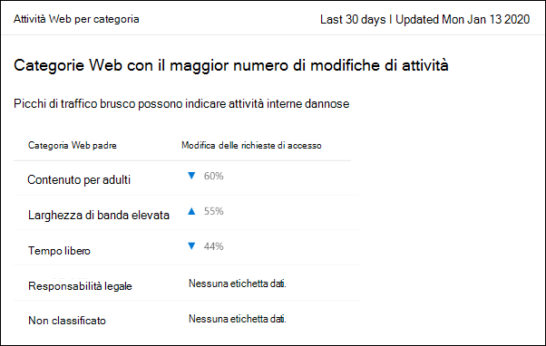
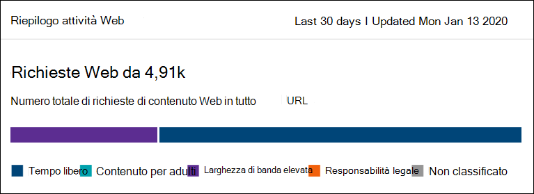

# Filtro contenuti WebWeb content filtering

[!INCLUDE [Microsoft 365 Defender rebranding](../../includes/microsoft-defender.md)]

**Si applica a:****Applies to:**
- [Microsoft Defender per endpointMicrosoft Defender for Endpoint](https://go.microsoft.com/fwlink/p/?linkid=2154037)
- [Microsoft 365 DefenderMicrosoft 365 Defender](https://go.microsoft.com/fwlink/?linkid=2118804)

> [!IMPORTANT]
> **Il filtro contenuto Web è attualmente in anteprima pubblica****Web content filtering is currently in public preview** 
> Questa versione di anteprima viene fornita senza un contratto di servizio e non è consigliata per i carichi di lavoro di produzione.This preview version is provided without a service level agreement, and it's not recommended for production workloads. Alcune funzionalità potrebbero non essere supportate o avere funzionalità vincolate.Certain features might not be supported or might have constrained capabilities.
> Per altre informazioni, vedi [Funzionalità di anteprima di Microsoft Defender per Endpoint.](preview.md)For more information, see [Microsoft Defender for Endpoint preview features](preview.md).

>Vuoi provare Microsoft Defender per Endpoint?Want to experience Microsoft Defender for Endpoint? [Iscriversi per una versione di valutazione gratuita.Sign up for a free trial.](https://www.microsoft.com/microsoft-365/windows/microsoft-defender-atp?ocid=docs-wdatp-main-abovefoldlink&rtc=1)

Il filtro contenuto Web fa parte [delle funzionalità di protezione Web](web-protection-overview.md) in Microsoft Defender for Endpoint.Web content filtering is part of [Web protection](web-protection-overview.md) capabilities in Microsoft Defender for Endpoint. Consente all'organizzazione di tenere traccia e regolare l'accesso ai siti Web in base alle categorie di contenuto.It enables your organization to track and regulate access to websites based on their content categories. Molti di questi siti Web, sebbene non dannosi, potrebbero essere problematici a causa delle normative di conformità, dell'utilizzo della larghezza di banda o di altri problemi.Many of these websites, while not malicious, might be problematic because of compliance regulations, bandwidth usage, or other concerns.

Configura i criteri tra i gruppi di dispositivi per bloccare determinate categorie.Configure policies across your device groups to block certain categories. Il blocco di una categoria impedisce agli utenti all'interno di gruppi di dispositivi specificati di accedere agli URL associati alla categoria.Blocking a category prevents users within specified device groups from accessing URLs associated with the category. Per qualsiasi categoria non bloccata, gli URL vengono controllati automaticamente.For any category that's not blocked, the URLs are automatically audited. Gli utenti possono accedere agli URL senza interruzioni e verranno raccolte statistiche di accesso per creare una decisione di criteri più personalizzata.Your users can access the URLs without disruption, and you'll gather access statistics to help create a more custom policy decision. Gli utenti visualizzeranno una notifica di blocco se un elemento nella pagina che sta visualizzando sta effettuando chiamate a una risorsa bloccata.Your users will see a block notification if an element on the page they're viewing is making calls to a blocked resource.

Il filtro contenuto Web è disponibile nei principali Web browser, con blocchi eseguiti da Windows Defender SmartScreen (Microsoft Edge) e Network Protection (Chrome, Firefox, Brave e Opera).Web content filtering is available on the major web browsers, with blocks performed by Windows Defender SmartScreen (Microsoft Edge) and Network Protection (Chrome, Firefox, Brave and Opera). Per ulteriori informazioni sul supporto dei browser, vedere la sezione prerequisiti.For more information about browser support, see the prerequisites section.

Riepilogo dei vantaggi:Summarizing the benefits:

- Agli utenti viene impedito l'accesso a siti Web in categorie bloccate, indipendentemente dal fatto che si esezionino in locale o fuori sedeUsers are prevented from accessing websites in blocked categories, whether they're browsing on-premises or away
- Distribuire comodamente i criteri a gruppi di utenti usando i gruppi di dispositivi definiti in [Microsoft Defender per le impostazioni di](https://docs.microsoft.com/microsoft-365/security/defender-endpoint/rbac) controllo di accesso basato sui ruoli di EndpointConveniently deploy policies to groups of users using device groups defined in [Microsoft Defender for Endpoint role-based access control settings](https://docs.microsoft.com/microsoft-365/security/defender-endpoint/rbac)
- Accedere ai report Web nella stessa posizione centrale, con visibilità sui blocchi effettivi e sull'utilizzo webAccess web reports in the same central location, with visibility over actual blocks and web usage

## Esperienza utenteUser experience

L'esperienza di blocco per i browser supportati da terze parti è fornita da Protezione di rete, che fornisce un avviso popup a livello di sistema che informa l'utente di una connessione bloccata.The blocking experience for 3rd party supported browsers is provided by Network Protection, which provides a system-level toast notifying the user of a blocked connection. 

Per un'esperienza più facile da usare nel browser, prendi in considerazione l'uso di Microsoft Edge.For a more user-friendly in-browser experience, consider using Microsoft Edge.

## PrerequisitiPrerequisites

Prima di provare questa funzionalità, verificare di disporre dei requisiti seguenti:Before trying out this feature, make sure you have the following requirements:

- Windows 10 Enterprise E5, Microsoft 365 E5, Microsoft 365 E5 Security, Microsoft 365 E3 + Componente aggiuntivo Microsoft 365 E5 Security o la licenza autonoma di Microsoft Defender for Endpoint.Windows 10 Enterprise E5, Microsoft 365 E5, Microsoft 365 E5 Security, Microsoft 365 E3 + Microsoft 365 E5 Security add-on or the Microsoft Defender for Endpoint standalone license. 
- Accesso al portale di Microsoft Defender Security CenterAccess to Microsoft Defender Security Center portal
- Dispositivi che eseguono l'aggiornamento dell'anniversario di Windows 10 (versione 1607) o successiva con l'aggiornamento MoCAMP più recente.Devices running Windows 10 Anniversary Update (version 1607) or later with the latest MoCAMP update.

Se Windows Defender SmartScreen non è attivato, Protezione di rete prenderà il controllo del blocco.If Windows Defender SmartScreen isn't turned on, Network Protection will take over the blocking. Richiede [l'abilitazione di Protezione](enable-network-protection.md) di rete nel dispositivo.It requires [enabling Network Protection](enable-network-protection.md) on the device. Chrome, Firefox, Brave e Opera sono attualmente browser di terze parti in cui questa funzionalità è abilitata.Chrome, Firefox, Brave, and Opera are currently 3rd party browsers in which this feature is enabled.

## Gestione dei datiData handling

Seguiremo qualsiasi area geografica hai scelto di usare come parte delle impostazioni di gestione dei dati di [Microsoft Defender for Endpoint.](https://docs.microsoft.com/microsoft-365/security/defender-endpoint/data-storage-privacy)We will follow whichever region you have elected to use as part of your [Microsoft Defender for Endpoint data handling settings](https://docs.microsoft.com/microsoft-365/security/defender-endpoint/data-storage-privacy). I dati non lasceranno il data center in tale area.Your data will not leave the data center in that region. Inoltre, i dati non verranno condivisi con terze parti, inclusi i provider di dati.In addition, your data will not be shared with any third-parties, including our data providers.

## Attivare il filtro contenuto WebTurn on web content filtering

Dal menu di spostamento a sinistra, selezionare **Impostazioni > generale > funzionalità avanzate**.From the left-hand navigation menu, select **Settings > General > Advanced Features**. Scorrere verso il basso fino a visualizzare la voce relativa al filtro **contenuto Web.**Scroll down until you see the entry for **Web content filtering**. Imposta l'interruttore **su Attivato** **e Salva preferenze.**Switch the toggle to **On** and **Save preferences**.

### Configurare i criteri di filtro contenuto WebConfigure web content filtering policies

I criteri di filtro del contenuto Web specificano quali categorie di siti sono bloccate in quali gruppi di dispositivi.Web content filtering policies specify which site categories are blocked on which device groups. Per gestire i criteri, passare a **Impostazioni > Regole > filtro contenuto Web**.To manage the policies, go to **Settings > Rules > Web content filtering**.

Usa il filtro per individuare i criteri che contengono determinate categorie bloccate o che vengono applicati a gruppi di dispositivi specifici.Use the filter to locate policies that contain certain blocked categories or are applied to specific device groups.

### Creare un criterioCreate a policy

Per aggiungere un nuovo criterio:To add a new policy:

1. Selezionare **Aggiungi criterio** nella pagina Filtro contenuto **Web** in **Impostazioni**.Select **Add policy** on the **Web content filtering** page in **Settings**.
2. Specificare un nome.Specify a name.
3. Selezionare le categorie da bloccare.Select the categories to block. Utilizzare l'icona espandi per espandere completamente ogni categoria padre e selezionare categorie di contenuto Web specifiche.Use the expand icon to fully expand each parent category and select specific web content categories.
4. Specificare l'ambito dei criteri.Specify the policy scope. Seleziona i gruppi di dispositivi per specificare dove applicare il criterio.Select the device groups to specify where to apply the policy. Solo i dispositivi nei gruppi di dispositivi selezionati non potranno accedere ai siti Web nelle categorie selezionate.Only devices in the selected device groups will be prevented from accessing websites in the selected categories.
5. Esaminare il riepilogo e salvare il criterio.Review the summary and save the policy. L'aggiornamento dei criteri può richiedere fino a 2 ore per l'applicazione ai dispositivi selezionati.The policy refresh may take up to 2 hours to apply to your selected devices.

Suggerimento: puoi distribuire un criterio senza selezionare alcuna categoria in un gruppo di dispositivi.Tip: You can deploy a policy without selecting any category on a device group. Questa azione creerà un criterio solo di controllo, per aiutarti a comprendere il comportamento dell'utente prima di creare un criterio di blocco.This action will create an audit only policy, to help you understand user behavior before creating a block policy.

>[!NOTE]
>Se stai rimuovendo un criterio o modificando i gruppi di dispositivi contemporaneamente, questo potrebbe causare un ritardo nella distribuzione dei criteri.If you are removing a policy or changing device groups at the same time, this might cause a delay in policy deployment.

>[!IMPORTANT]
>Il blocco della categoria "Non classificato" può causare risultati imprevisti e indesiderati.Blocking the "Uncategorized" category may lead to unexpected and undesired results.  

### Consentire siti Web specificiAllow specific websites

È possibile ignorare la categoria bloccata nel filtro contenuto Web per consentire un singolo sito creando un criterio indicatore personalizzato.It's possible to override the blocked category in web content filtering to allow a single site by creating a custom indicator policy. Il criterio indicatore personalizzato sostituisce il criterio di filtro contenuto Web quando viene applicato al gruppo di dispositivi in questione.The custom indicator policy will supersede the web content filtering policy when it's applied to the device group in question.

1. Creare un indicatore personalizzato in Microsoft Defender Security Center andando a **Impostazioni**  >    >  **Indicatori URL/Elemento aggiunta**  >  **dominio**Create a custom indicator in the Microsoft Defender Security Center by going to **Settings** > **Indicators** > **URL/Domain** > **Add Item**
2. Immettere il dominio del sitoEnter the domain of the site
3. Impostare l'azione del criterio su **Consenti**.Set the policy action to **Allow**.  

### Segnalazione di imprecisioniReporting inaccuracies

Se si verifica un dominio categorizzato in modo errato, è possibile segnalare imprecisioni direttamente dalla pagina dei report filtro contenuto Web.If you encounter a domain that has been incorrectly categorized, you can report inaccuracies directly to us from the Web Content Filtering reports page. Questa funzionalità è disponibile solo nel nuovo Centro sicurezza Microsoft 365 (security.microsoft.com).This feature is available only in the new Microsoft 365 security center (security.microsoft.com).

Per segnalare un'imprecisione, passare a Report **> Protezione Web > Web Content Filtering Details > Domains**.To report an inaccuracy, navigate to **Reports > Web protection > Web Content Filtering Details > Domains**. Nella scheda domini dei report Filtro contenuto Web verrà visualizzato un pulsante con i puntini di sospensione accanto a ognuno dei domini.On the domains tab of our Web Content Filtering reports, you will see an ellipsis beside each of the domains. Posizionare il puntatore del mouse sui puntini di sospensione e selezionare **Segnala imprecisione.**Hover over this ellipsis and select **Report Inaccuracy**.

Verrà aperto un pannello in cui è possibile selezionare la priorità e aggiungere ulteriori dettagli, ad esempio la categoria suggerita per la ri categorizzazione.A panel will open where you can select the priority and add additional details such as the suggested category for re-categorization. Dopo aver completato il modulo, selezionare **Invia**.Once you complete the form, select **Submit**. Il team esamina la richiesta entro un giorno lavorativo.Our team will review the request within one business day. Per sbloccare immediatamente, crea un [indicatore consenti personalizzato.](indicator-ip-domain.md)For immediate unblocking, create a [custom allow indicator](indicator-ip-domain.md).

## Schede e dettagli del filtro contenuto WebWeb content filtering cards and details

Selezionare **Report > protezione Web** per visualizzare schede con informazioni sul filtro contenuto Web e sulla protezione dalle minacce Web.Select **Reports > Web protection** to view cards with information about web content filtering and web threat protection. Nelle schede seguenti vengono fornite informazioni di riepilogo sul filtro contenuto Web.The following cards provide summary information about web content filtering.

### Attività Web per categoriaWeb activity by category

In questa scheda sono elencate le categorie di contenuto Web padre con l'aumento o la riduzione maggiori del numero di tentativi di accesso.This card lists the parent web content categories with the largest increase or decrease in the number of access attempts. Comprendere i cambiamenti drastici dei modelli di attività Web nell'organizzazione degli ultimi 30 giorni, 3 mesi o 6 mesi.Understand drastic changes in web activity patterns in your organization from last 30 days, 3 months, or 6 months. Selezionare un nome di categoria per visualizzare ulteriori informazioni.Select a category name to view more information.

Nei primi 30 giorni di utilizzo di questa funzionalità, l'organizzazione potrebbe non disporre di dati sufficienti per visualizzare queste informazioni.In the first 30 days of using this feature, your organization might not have enough data to display this information.

### Scheda di riepilogo filtro contenuto WebWeb content filtering  summary card

Questa scheda visualizza la distribuzione dei tentativi di accesso bloccati tra le diverse categorie di contenuto Web padre.This card displays the distribution of blocked access attempts across the different parent web content categories. Selezionare una delle barre colorate per visualizzare ulteriori informazioni su una categoria Web padre specifica.Select one of the colored bars to view more information about a specific parent web category.

### Scheda riepilogativo attività WebWeb activity summary card

Questa scheda visualizza il numero totale di richieste di contenuto Web in tutti gli URL.This card displays the total number of requests for web content in all URLs.

### Visualizzare i dettagli della schedaView card details

È possibile accedere ai **dettagli del report** per ogni scheda selezionando una riga di tabella o una barra colorata dal grafico nella scheda.You can access the **Report details** for each card by selecting a table row or colored bar from the chart in the card. La pagina dei dettagli del report per ogni scheda contiene dati statistici dettagliati sulle categorie di contenuto Web, sui domini di siti Web e sui gruppi di dispositivi.The report details page for each card contains extensive statistical data about web content categories, website domains, and device groups.

- **Categorie Web**: elenca le categorie di contenuto Web che hanno avuto tentativi di accesso nell'organizzazione.**Web categories**: Lists the web content categories that have had access attempts in your organization. Selezionare una categoria specifica per aprire un riquadro a comparsa di riepilogo.Select a specific category to open a summary flyout.

- **Domini**: elenca i domini Web a cui è stato eseguito l'accesso o che sono stati bloccati nell'organizzazione.**Domains**: Lists the web domains that have been accessed or blocked in your organization. Selezionare un dominio specifico per visualizzare informazioni dettagliate su tale dominio.Select a specific domain to view detailed information about that domain.

- **Gruppi di dispositivi**: elenca tutti i gruppi di dispositivi che hanno generato attività Web nell'organizzazione**Device groups**: Lists all the device groups that have generated web activity in your organization

Usa il filtro dell'intervallo di tempo nella parte superiore sinistra della pagina per selezionare un periodo di tempo.Use the time range filter at the top left of the page to select a time period. È inoltre possibile filtrare le informazioni o personalizzare le colonne.You can also filter the information or customize the columns. Selezionare una riga per aprire un riquadro a comparsa con ulteriori informazioni sull'elemento selezionato.Select a row to open a flyout pane with even more information about the selected item.

## Errori e problemiErrors and issues

### Limitazioni e problemi noti in questa anteprimaLimitations and known issues in this preview

- Solo Microsoft Edge è supportato se la configurazione del sistema operativo del dispositivo è Server (cmd > Systeminfo > OS Configuration).Only Microsoft Edge is supported if your device's OS configuration is Server (cmd > Systeminfo > OS Configuration). Protezione di rete è supportata solo in modalità Inspect nei dispositivi server, responsabile della protezione del traffico tra i browser di terze parti supportati.Network Protection is only supported in Inspect mode on Server devices, which is responsible for securing traffic across supported 3rd party browsers.

- I dispositivi non assegnati avranno dati non corretti visualizzati nel report.Unassigned devices will have incorrect data shown within the report. Nel pivot Report details > Device groups, you may see a row with a blank Device Group field.In the Report details > Device groups pivot, you may see a row with a blank Device Group field. Questo gruppo contiene i dispositivi non assegnati prima di essere inseriti nel gruppo specificato.This group contains your unassigned devices before they get put into your specified group. Il report per questa riga potrebbe non contenere un conteggio accurato dei dispositivi o dei conteggi di accesso.The report for this row may not contain an accurate count of devices or access counts.

- I report filtro contenuto Web sono attualmente limitati alla visualizzazione dei primi 5.000 record.Web Content Filtering reports are currently limited to showing the top 5000 records. Ad esempio, il report "Domini" mostrerà solo un massimo di 5000 domini principali per una determinata query di filtro, se applicabile.For example, the ‘Domains’ report will only show a maximum of the top 5000 domains for a given filter query, if applicable. 

## Argomenti correlatiRelated topics

- [Panoramica protezione WebWeb protection overview](web-protection-overview.md)
- [Protezione dalle minacce sul WebWeb threat protection](web-threat-protection.md)
- [Monitorare la sicurezza sul WebMonitor web security](web-protection-monitoring.md)
- [Rispondere alle minacce sul WebRespond to web threats](web-protection-response.md)
