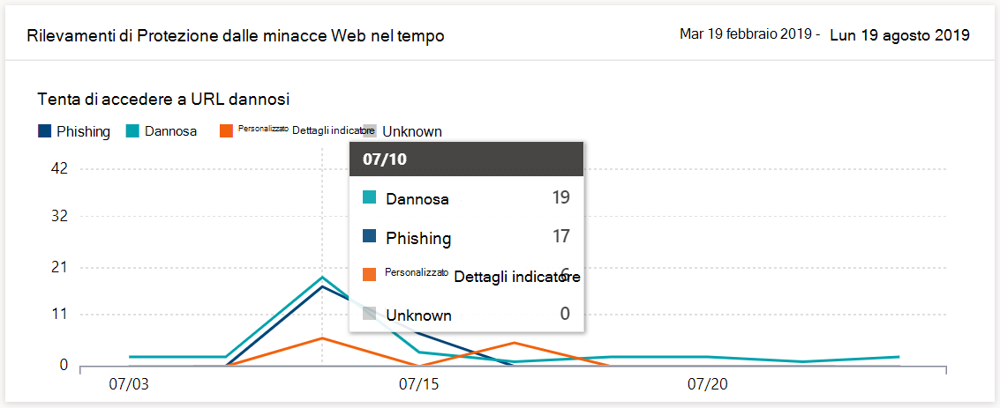
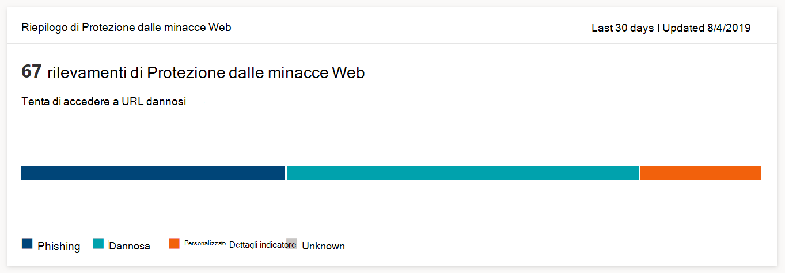

# Monitorare la sicurezza dell'esplorazione Web

[!INCLUDE [Microsoft 365 Defender rebranding](../../includes/microsoft-defender.md)]

**Si applica a:**
- [Microsoft Defender ATP](https://go.microsoft.com/fwlink/p/?linkid=2146631)
- [Microsoft 365 Defender](https://go.microsoft.com/fwlink/?linkid=2118804)

>Vuoi provare Microsoft Defender per Endpoint? [Iscriversi per una versione di valutazione gratuita.](https://www.microsoft.com/microsoft-365/windows/microsoft-defender-atp?ocid=docs-wdatp-main-abovefoldlink&rtc=1)

La protezione Web consente di monitorare la sicurezza dell'esplorazione Web dell'organizzazione tramite i report in Report **> protezione Web** in Microsoft Defender Security Center. Il report contiene schede che forniscono statistiche di rilevamento delle minacce Web.

- **Rilevamenti di** Protezione dalle minacce Web nel tempo - Questa scheda tendenze visualizza il numero di minacce Web rilevate per tipo durante il periodo di tempo selezionato (Ultimi 30 giorni, Ultimi 3 mesi, Ultimi 6 mesi)
 
    

- **Riepilogo di Protezione dalle** minacce Web: questa scheda visualizza i rilevamenti totali delle minacce Web negli ultimi 30 giorni, mostrando la distribuzione tra i diversi tipi di minacce Web. Selezionando una sezione viene aperto l'elenco dei domini trovati con siti Web dannosi o indesiderati.

    

>[!Note]
>Possono essere necessario fino a 12 ore prima che un blocco si rifletta nelle schede o nell'elenco dei domini.

## Tipi di minacce Web

La protezione Web classifica i siti Web dannosi e indesiderati come:

- **Phishing:** siti Web contenenti moduli Web contraffatti e altri meccanismi di phishing progettati per indurre gli utenti a divulgare credenziali e altre informazioni riservate
- **Dannoso:** siti Web che ospitano malware e codice di exploit
- **Indicatore personalizzato** : siti Web i cui URL o domini sono stati aggiunti all'elenco [di indicatori personalizzati](manage-indicators.md) per il blocco

## Visualizzare l'elenco dei domini

Selezionare una categoria specifica di minacce Web nella **scheda di riepilogo** protezione dalle minacce Web per aprire la **pagina** Domini. In questa pagina viene visualizzato l'elenco dei domini in tale categoria di minacce. La pagina fornisce le informazioni seguenti per ogni dominio:

- **Numero di** accessi - Numero di richieste di URL nel dominio
- **Blocchi** : numero di volte in cui le richieste sono state bloccate
- **Tendenza di accesso** - Modifica del numero di tentativi di accesso
- **Categoria di minacce** - Tipo di minaccia Web
- **Dispositivi** - Numero di dispositivi con tentativi di accesso

Seleziona un dominio per visualizzare l'elenco dei dispositivi che hanno tentato di accedere agli URL in tale dominio e l'elenco degli URL.

## Argomenti correlati

- [Panoramica della protezione Web](web-protection-overview.md)
- [Filtro contenuto Web](web-content-filtering.md)
- [Protezione dalle minacce Web](web-threat-protection.md)
- [Rispondere alle minacce Web](web-protection-response.md)
