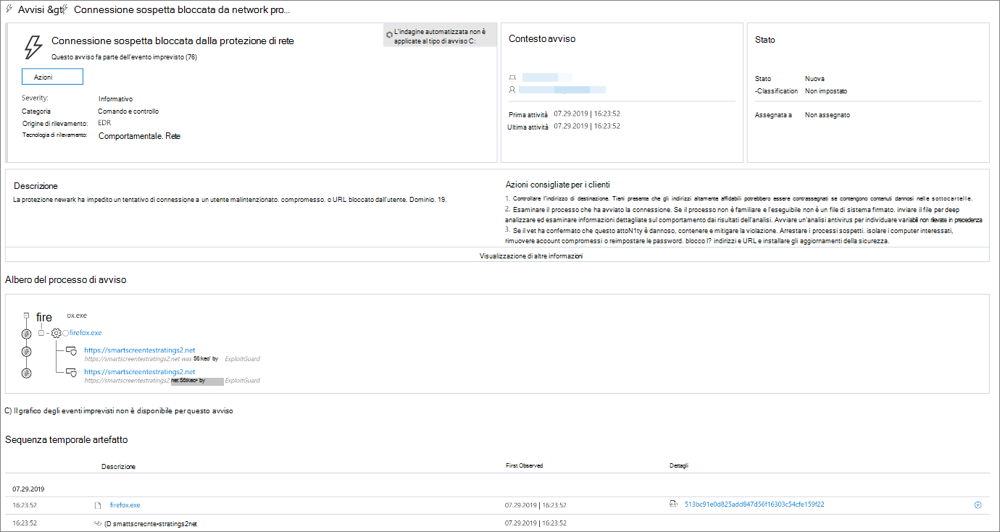
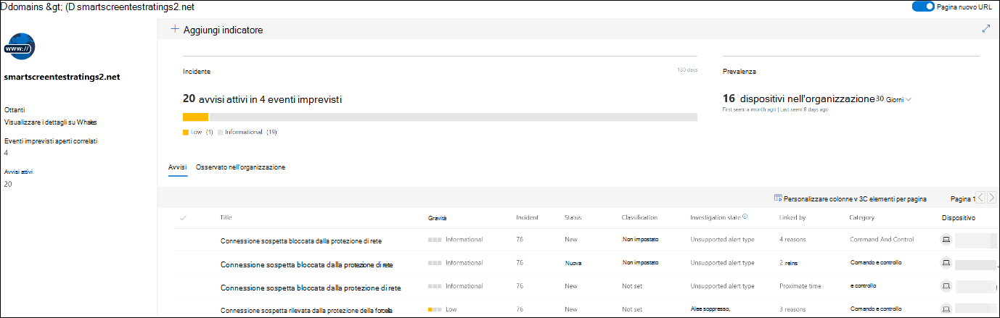
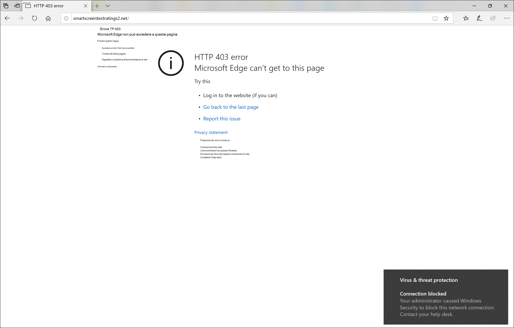
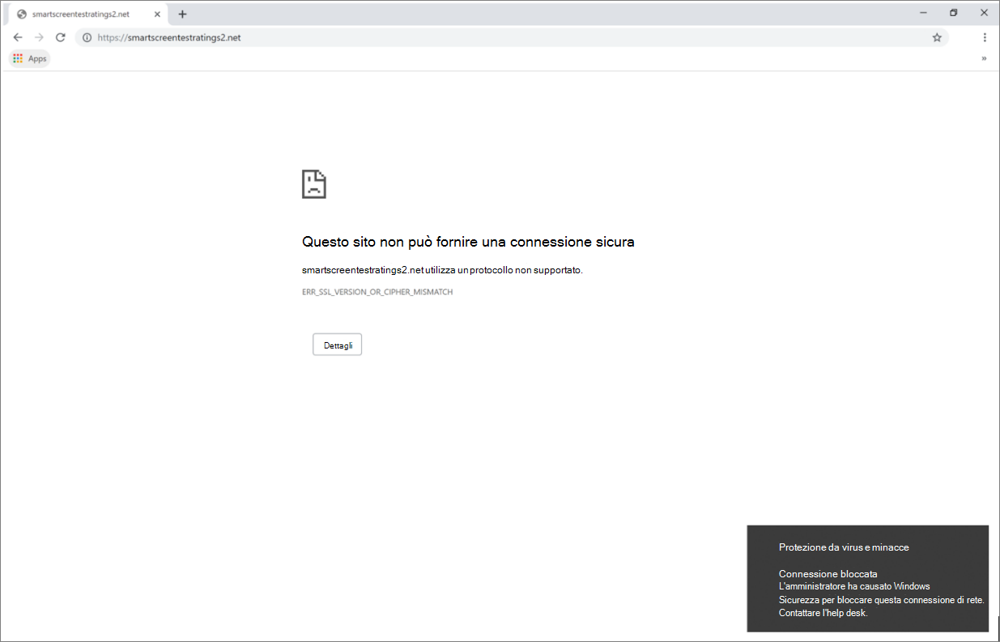

# Rispondere alle minacce WebRespond to web threats

[!INCLUDE [Microsoft 365 Defender rebranding](../../includes/microsoft-defender.md)]

**Si applica a:****Applies to:**
- [Microsoft Defender ATPMicrosoft Defender for Endpoint](https://go.microsoft.com/fwlink/p/?linkid=2146631)
- [Microsoft 365 DefenderMicrosoft 365 Defender](https://go.microsoft.com/fwlink/?linkid=2118804)

>Vuoi provare Microsoft Defender per Endpoint?Want to experience Microsoft Defender for Endpoint? [Iscriversi per una versione di valutazione gratuita.Sign up for a free trial.](https://www.microsoft.com/microsoft-365/windows/microsoft-defender-atp?ocid=docs-wdatp-main-abovefoldlink&rtc=1)

La protezione Web in Microsoft Defender for Endpoint consente di analizzare e rispondere in modo efficiente agli avvisi relativi a siti Web e siti Web dannosi nell'elenco di indicatori personalizzati.Web protection in Microsoft Defender for Endpoint lets you efficiently investigate and respond to alerts related to malicious websites and websites in your custom indicator list.

## Visualizzare gli avvisi relativi alle minacce WebView web threat alerts
Microsoft Defender for Endpoint genera gli avvisi [seguenti per](manage-alerts.md) attività Web dannose o sospette:Microsoft Defender for Endpoint generates the following [alerts](manage-alerts.md) for malicious or suspicious web activity:
- **Connessione sospetta bloccata dalla** protezione di rete: questo avviso viene generato quando un tentativo  di accedere a un sito Web dannoso o a un sito Web nell'elenco di indicatori personalizzati viene arrestato dalla protezione di rete in *modalità* blocco**Suspicious connection blocked by network protection** — this alert is generated when an attempt to access a malicious website or a website in your custom indicator list is *stopped* by network protection in *block* mode
- **Connessione sospetta rilevata** dalla protezione di rete: questo avviso viene generato quando un tentativo di accedere a un sito Web dannoso o a un sito Web nell'elenco di indicatori personalizzati viene rilevato dalla protezione di rete in *modalità solo* controllo**Suspicious connection detected by network protection** — this alert is generated when an attempt to access a malicious website or a website in your custom indicator list is detected by network protection in *audit only* mode

Ogni avviso fornisce le informazioni seguenti:Each alert provides the following information: 
- Dispositivo che ha tentato di accedere al sito Web bloccatoDevice that attempted to access the blocked website
- Applicazione o programma utilizzato per inviare la richiesta WebApplication or program used to send the web request
- URL o URL dannoso nell'elenco degli indicatori personalizzatiMalicious URL or URL in the custom indicator list
- Azioni consigliate per i risponditoriRecommended actions for responders

>[!Note]
>Per ridurre il volume di avvisi, Microsoft Defender for Endpoint consolida i rilevamenti di minacce Web per lo stesso dominio nello stesso dispositivo ogni giorno in un singolo avviso.To reduce the volume of alerts, Microsoft Defender for Endpoint consolidates web threat detections for the same domain on the same device each day to a single alert. Nel report di protezione Web viene generato e conteggiato [un solo avviso.](web-protection-monitoring.md)Only one alert is generated and counted into the [web protection report](web-protection-monitoring.md).

## Esaminare i dettagli del sito WebInspect website details
Puoi approfondire selezionando l'URL o il dominio del sito Web nell'avviso.You can dive deeper by selecting the URL or domain of the website in the alert. Verrà aperta una pagina sull'URL o sul dominio specifico con diverse informazioni, tra cui:This opens a page about that particular URL or domain with various information, including:
- Dispositivi che hanno tentato di accedere al sito WebDevices that attempted to access website
- Eventi imprevisti e avvisi correlati al sito WebIncidents and alerts related to the website
- Frequenza con cui il sito Web è stato visualizzato negli eventi dell'organizzazioneHow frequent the website was seen in events in your organization

    

[Altre informazioni sulle pagine dell'URL o dell'entità di dominioLearn more about URL or domain entity pages](investigate-domain.md)

## Esaminare il dispositivoInspect the device
Puoi anche controllare il dispositivo che ha tentato di accedere a un URL bloccato.You can also check the device that attempted to access a blocked URL. Selezionando il nome del dispositivo nella pagina di avviso si apre una pagina con informazioni complete sul dispositivo.Selecting the name of the device on the alert page opens a page with comprehensive information about the device.

[Altre informazioni sulle pagine dell'entità dispositivoLearn more about device entity pages](investigate-machines.md)

## Notifiche di Web browser e Windows per gli utenti finaliWeb browser and Windows notifications for end users

Con la protezione Web in Microsoft Defender for Endpoint, agli utenti finali verrà impedito di visitare siti Web dannosi o indesiderati utilizzando Microsoft Edge o altri browser.With web protection in Microsoft Defender for Endpoint, your end users will be prevented from visiting malicious or unwanted websites using Microsoft Edge or other browsers. Poiché il blocco viene eseguito dalla [protezione di](network-protection.md)rete, verrà visualizzato un errore generico dal Web browser.Because blocking is performed by [network protection](network-protection.md), they will see a generic error from the web browser. Verrà inoltre visualizzata una notifica da Windows.They will also see a notification from Windows.

 *bloccata in Microsoft Edge*
*Web threat blocked on Microsoft Edge*

 *bloccata in Chrome*
*Web threat blocked on Chrome*

## Argomenti correlatiRelated topics
- [Panoramica della protezione WebWeb protection overview](web-protection-overview.md)
- [Filtro contenuto WebWeb content filtering](web-content-filtering.md)
- [Protezione dalle minacce WebWeb threat protection](web-threat-protection.md)
- [Monitorare la sicurezza WebMonitor web security](web-protection-monitoring.md)
