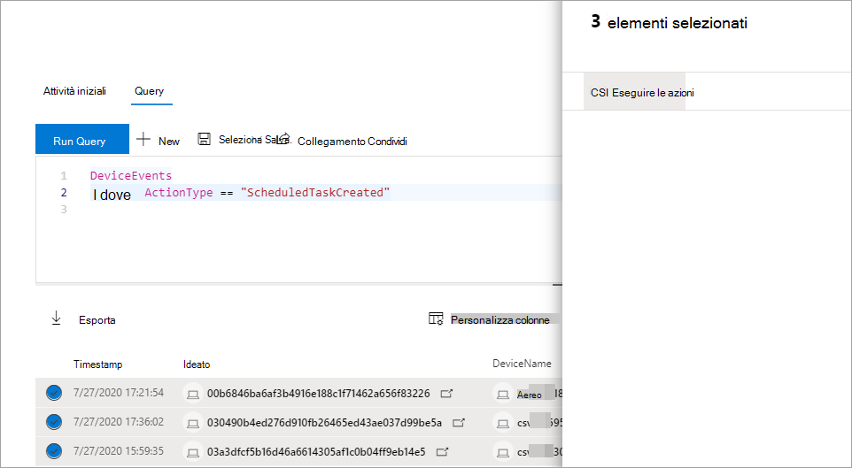

# Eseguire un'azione sui risultati delle query di ricerca avanzata

[!INCLUDE [Microsoft 365 Defender rebranding](../includes/microsoft-defender.md)]

**Si applica a:**
- Microsoft 365 Defender
- Microsoft Defender per endpoint

[!INCLUDE [Prerelease information](../includes/prerelease.md)]

Puoi contenere rapidamente minacce o affrontare asset compromessi che trovi nella ricerca [avanzata](advanced-hunting-overview.md) usando opzioni di azione potenti e complete. Con queste opzioni, è possibile:

- Eseguire varie azioni sui dispositivi
- File in quarantena

## Autorizzazioni necessarie
Per essere in grado di eseguire azioni tramite la ricerca avanzata, è necessario un ruolo in Microsoft Defender per Endpoint con autorizzazioni per inviare azioni di correzione [nei dispositivi](/windows/security/threat-protection/microsoft-defender-atp/user-roles#permission-options). Se non è possibile eseguire un'azione, contattare un amministratore globale per ottenere l'autorizzazione seguente:

*Azioni di correzione attive > minacce e gestione delle vulnerabilità - Gestione delle correzioni*

## Eseguire varie azioni sui dispositivi
Puoi eseguire le azioni seguenti nei dispositivi identificati dalla `DeviceId` colonna nei risultati delle query:

- Isolare i dispositivi interessati per contenere un'infezione o impedire lo spostamento laterale di attacchi
- Raccogliere un pacchetto di indagine per ottenere ulteriori informazioni forensi
- Eseguire un'analisi antivirus per trovare e rimuovere le minacce utilizzando gli ultimi aggiornamenti di security intelligence
- Avviare un'indagine automatizzata per controllare e correggere le minacce nel dispositivo e probabilmente in altri dispositivi interessati
- Limitare l'esecuzione dell'app solo ai file eseguibili firmati da Microsoft, impedendo attività di minacce successive tramite malware o altri file eseguibili non attendibili

Per altre informazioni su come vengono eseguite queste azioni di risposta tramite Microsoft Defender for Endpoint, [leggi azioni di risposta nei dispositivi](/windows/security/threat-protection/microsoft-defender-atp/respond-machine-alerts).
   
## File in quarantena
È possibile distribuire *l'azione di* quarantena sui file in modo che siano automaticamente messi in quarantena quando vengono rilevati. Quando si seleziona questa azione, è possibile scegliere tra le colonne seguenti per identificare i file nei risultati della query da mettere in quarantena:

- `SHA1` — Nella maggior parte delle tabelle di ricerca avanzate, si tratta dell'SHA-1 del file interessato dall'azione registrata. Ad esempio, se un file è stato copiato, si tratta del file copiato.
- `InitiatingProcessSHA1` — Nella maggior parte delle tabelle di ricerca avanzate, questo è il file responsabile dell'avvio dell'azione registrata. Ad esempio, se è stato avviato un processo figlio, si tratta del processo padre. 
- `SHA256` - Questo è l'equivalente SHA-256 del file identificato dalla `SHA1` colonna.
- `InitiatingProcessSHA256` - Questo è l'equivalente SHA-256 del file identificato dalla `InitiatingProcessSHA1` colonna.

Per ulteriori informazioni su come vengono eseguite le azioni di quarantena e su come è possibile ripristinare i file, [vedere Azioni di risposta nei file](/windows/security/threat-protection/microsoft-defender-atp/respond-file-alerts).

>[!NOTE]
>Per individuare i file e mettereli in quarantena, i risultati della query devono includere `DeviceId` anche valori come identificatori di dispositivo.  

## Entra in azione
Per eseguire una delle azioni descritte, selezionare uno o più record nei risultati della query e quindi fare clic **su Azioni.** Una procedura guidata ti guiderà nel processo di selezione e invio delle azioni preferite.

## Rivedere le azioni intraprese
Ogni azione viene registrata singolarmente nel centro notifiche [in](m365d-action-center.md) **Cronologia centro** notifiche (  >   [security.microsoft.com/action-center/history](https://security.microsoft.com/action-center/history)). Passare al centro notifiche per controllare lo stato di ogni azione.
 
>[!NOTE]
>Alcune tabelle di questo articolo potrebbero non essere disponibili in Microsoft Defender per Endpoint. [Attivare Microsoft 365 Defender per](m365d-enable.md) cercare minacce che usano più origini dati. Puoi spostare i flussi di lavoro di ricerca avanzata da Microsoft Defender per Endpoint a Microsoft 365 Defender seguendo la procedura descritta in Eseguire la migrazione di query di ricerca avanzate da [Microsoft Defender per Endpoint.](advanced-hunting-migrate-from-mde.md)

## Argomenti correlati
- [Panoramica della rilevazione avanzata](advanced-hunting-overview.md)
- [Capire il linguaggio delle query](advanced-hunting-query-language.md)
- [Usare i risultati delle query](advanced-hunting-query-results.md)
- [Comprendere lo schema](advanced-hunting-schema-tables.md)
- [Panoramica del centro notifiche](m365d-action-center.md)
