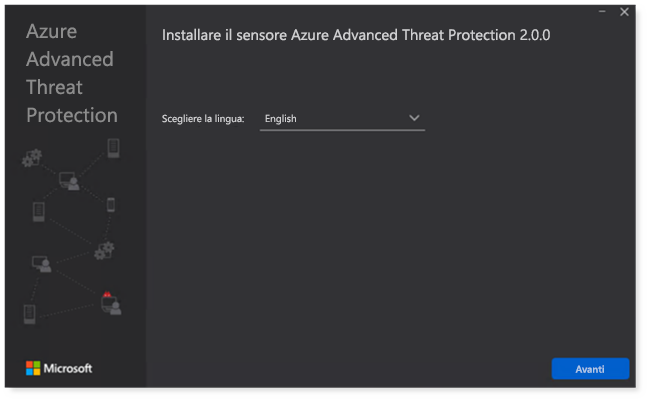
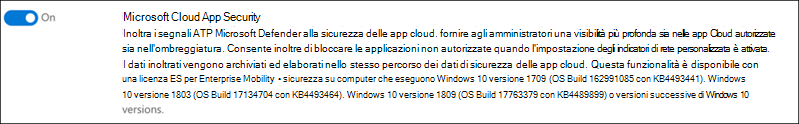

# Configurare i pilastri di Microsoft 365 Defender per il laboratorio di valutazione o l'ambiente pilotaConfigure Microsoft 365 Defender pillars for your trial lab or pilot environment

[!INCLUDE [Microsoft 365 Defender rebranding](../includes/microsoft-defender.md)]

**Si applica a:****Applies to:**
- Microsoft 365 DefenderMicrosoft 365 Defender

La creazione di un laboratorio di valutazione o di un ambiente pilota di Microsoft 365 Defender e la distribuzione è un processo in tre fasi:Creating a Microsoft 365 Defender trial lab or pilot environment and deploying it is a three-phase process:

| [Fase 1: preparazionePhase 1: Prepare](prepare-m365d-eval.md) | [Fase 2: configurazionePhase 2: Set up](setup-m365deval.md) | Fase 3: onboardingPhase 3: Onboard |  [Torna al playbook pilotaBack to pilot playbook](m365d-pilot.md) |
|--|--|--|--|
|| |*Sei qui!**You are here!* | |

Si è attualmente in fase di configurazione.You're currently in the configuration phase.

La preparazione è fondamentale per una distribuzione corretta.Preparation is key to any successful deployment. In questo articolo, sarai guidato sui punti da considerare durante la preparazione della distribuzione di Microsoft Defender per Endpoint.In this article, you'll be guided on the points you'll need to consider as you prepare to deploy Microsoft Defender for Endpoint.

## Pilastri di Microsoft 365 DefenderMicrosoft 365 Defender pillars
Microsoft 365 Defender è costituito da quattro pilastri.Microsoft 365 Defender consists of four pillars. Anche se un pilastro può già fornire valore alla sicurezza dell'organizzazione di rete, l'abilitazione dei quattro pilastri di Microsoft 365 Defender offrirà all'organizzazione il massimo valore.Although one pillar can already provide value to your network organization's security, enabling the four Microsoft 365 Defender pillars will give your organization the most value.

Questa sezione ti guiderà a configurare:This section will guide you to configure:
-   Microsoft Defender per Office 365Microsoft Defender for Office 365
-   Che cosa è Microsoft Defender per identità?Microsoft Defender for Identity 
-   Microsoft Cloud App SecurityMicrosoft Cloud App Security
-   Microsoft Defender per endpointMicrosoft Defender for Endpoint

## Configurare Microsoft Defender per Office 365Configure Microsoft Defender for Office 365

>[!NOTE]
>Ignorare questo passaggio se è già stato abilitato Defender per Office 365.Skip this step if you've already enabled Defender for Office 365. 

È presente un modulo di PowerShell denominato *Office 365 Advanced Threat Protection Recommended Configuration Analyzer (ORCA)* che consente di determinare alcune di queste impostazioni.There's a PowerShell Module called the *Office 365 Advanced Threat Protection Recommended Configuration Analyzer (ORCA)* that helps determine some of these settings. Quando viene eseguito come amministratore nel tenant, get-ORCAReport consente di generare una valutazione delle impostazioni di protezione da posta indesiderata, anti-phish e altre impostazioni di igiene dei messaggi.When run as an administrator in your tenant, get-ORCAReport will help generate an assessment of the anti-spam, anti-phish, and other message hygiene settings. È possibile scaricare questo modulo da https://www.powershellgallery.com/packages/ORCA/ .You can download this module from https://www.powershellgallery.com/packages/ORCA/. 

1. Passare a [Office 365 Security & Compliance Center Threat](https://protection.office.com/homepage)  >  **Management**  >  **Policy**.Navigate to [Office 365 Security & Compliance Center](https://protection.office.com/homepage) > **Threat management** > **Policy**.

   
 
2. Fare **clic su Anti-phishing,** selezionare **Crea** e compilare il nome e la descrizione del criterio.Click **Anti-phishing**, select **Create** and fill in the policy name and description. Fare clic su **Avanti**.Click **Next**.

   

   > [!NOTE]
   > Modificare i criteri anti-phishing avanzati in Microsoft Defender per Office 365.Edit your Advanced anti-phishing policy in Microsoft Defender for Office 365. Modificare **la soglia di phishing avanzato** su **2 - Aggressivo.**Change **Advanced Phishing Threshold** to **2 - Aggressive**.

3. Fai clic sul menu **a** discesa Aggiungi una condizione e seleziona i domini come dominio del destinatario.Click the **Add a condition** drop-down menu and select your domain(s) as recipient domain. Fare clic su **Avanti**.Click **Next**.

   
 
4. Rivedere le impostazioni.Review your settings. Fare **clic su Crea questo criterio** per confermare.Click **Create this policy** to confirm. 

   
 
5. Selezionare **Allegati sicuri** e selezionare **l'opzione Attiva ATP per SharePoint, OneDrive e Microsoft Teams.**Select **Safe Attachments** and select the **Turn on ATP for SharePoint, OneDrive, and Microsoft Teams** option.

   

6. Fare clic sull'icona + per creare un nuovo criterio degli allegati sicuri, applicarlo come dominio destinatario ai domini.Click the + icon to create a new safe attachment policy, apply it as recipient domain to your domains. Fare clic su **Salva**.Click **Save**.

   
 
7. Selezionare quindi il criterio **Collegamenti sicuri,** quindi fare clic sull'icona a forma di matita per modificare il criterio predefinito.Next, select the **Safe Links** policy, then click the pencil icon to edit the default policy.

8. Assicurarsi che **l'opzione Non tenere traccia** quando gli utenti fanno clic su collegamenti sicuri non sia selezionata, mentre le altre opzioni sono selezionate.Make sure that the **Do not track when users click safe links** option is not selected, while the rest of the options are selected. Per [informazioni dettagliate, vedere Safe Links settings.](/microsoft-365/security/office-365-security/recommended-settings-for-eop-and-office365)See [Safe Links settings](/microsoft-365/security/office-365-security/recommended-settings-for-eop-and-office365) for details. Fare clic su **Salva**.Click **Save**. 

   

9. Seleziona quindi il **criterio Antimalware,** seleziona il valore predefinito e scegli l'icona a forma di matita.Next select the **Anti-malware** policy, select the default, and choose the pencil icon.

10. Fai **clic su** Impostazioni e seleziona Sì e usa il testo di notifica **predefinito** per abilitare Risposta **rilevamento malware.**Click **Settings** and select **Yes and use the default notification text** to enable **Malware Detection Response**. Attivare il **filtro Tipi di allegati** comuni.Turn the **Common Attachment Types Filter** on. Fare clic su **Salva**.Click **Save**.

    
  
11. Passare a [Office 365 Security & Compliance Center](https://protection.office.com/homepage)Search  >  **Audit** log  >  **search** and turn Auditing on.Navigate to [Office 365 Security & Compliance Center](https://protection.office.com/homepage) > **Search** > **Audit log search** and turn Auditing on.

    

12. Integrare Microsoft Defender per Office 365 con Microsoft Defender for Endpoint.Integrate Microsoft Defender for Office 365 with Microsoft Defender for Endpoint. Passare a [Office 365 Security & Compliance Center](https://protection.office.com/homepage)Threat Management Explorer e selezionare Microsoft Defender for Endpoint Settings nell'angolo in alto  >    >   a destra dello schermo. Navigate to [Office 365 Security & Compliance Center](https://protection.office.com/homepage) > **Threat management** > **Explorer** and select **Microsoft Defender for Endpoint Settings** on the upper right corner of the screen. Nella finestra di dialogo Connessione defender per endpoint attiva Connetti **a Microsoft Defender per Endpoint**.In the Defender for Endpoint connection dialog box, turn on **Connect to Microsoft Defender for Endpoint**.

    

## Configurare Microsoft Defender per l'identitàConfigure Microsoft Defender for Identity

>[!NOTE]
>Ignora questo passaggio se hai già abilitato Microsoft Defender per l'identitàSkip this step if you've already enabled Microsoft Defender for Identity

1. Passare a [Centro sicurezza Microsoft 365](https://security.microsoft.com/info) > **selezionare Altre risorse** Microsoft Defender  >  **per l'identità**.Navigate to [Microsoft 365 Security Center](https://security.microsoft.com/info) > select **More Resources** > **Microsoft Defender for Identity**.

   

2. Fai **clic su** Crea per avviare la procedura guidata di Microsoft Defender for Identity.Click **Create** to start the Microsoft Defender for Identity wizard. 

   

3. Scegliere **Fornire un nome utente e una password per connettersi alla foresta di Active Directory.**Choose **Provide a username and password to connect to your Active Directory forest**.  

   

4. Immettere le credenziali di Active Directory locale.Enter your Active Directory on-premises credentials. Può trattarsi di qualsiasi account utente con accesso in lettura ad Active Directory.This can be any user account that has read access to Active Directory.

   

5. Successivamente, scegliere **Download Sensor Setup** and transfer file to your domain controller.Next, choose **Download Sensor Setup** and transfer file to your domain controller.

   

6. Eseguire l'installazione del sensore di identità di Microsoft Defender per e iniziare a seguire la procedura guidata.Execute the Microsoft Defender for Identity Sensor Setup and begin following the wizard.

   
 
7. Fare **clic su Avanti** nel tipo di distribuzione del sensore.Click **Next** at the sensor deployment type.

   
 
8. Copiare il tasto di scelta perché è necessario immetterlo successivamente nella procedura guidata.Copy the access key because you need to enter it next in the Wizard.

   
 
9. Copiare il tasto di scelta nella procedura guidata e fare clic su **Installa**.Copy the access key into the Wizard and click **Install**. 

   

10. Congratulazioni, Microsoft Defender è stato configurato correttamente per l'identità nel controller di dominio.Congratulations, you've successfully configured Microsoft Defender for Identity on your domain controller.

    
 
11. Nella sezione [Impostazioni di Microsoft Defender per l'identità](https://go.microsoft.com/fwlink/?linkid=2040449) seleziona \*\*Microsoft Defender per Endpoint \*\*, quindi attiva l'interruttore.Under the [Microsoft Defender for Identity](https://go.microsoft.com/fwlink/?linkid=2040449) settings section, select \*\*Microsoft Defender for Endpoint \*\*, then turn on the toggle. Fare clic su **Salva**.Click **Save**. 

    

> [!NOTE]
> Windows Defender ATP è stato rebranded come Microsoft Defender for Endpoint.Windows Defender ATP has been rebranded as Microsoft Defender for Endpoint. È in corso l'implementazione delle modifiche di rebranding in tutti i portali per garantire la coerenza.Rebranding changes across all of our portals are being rolled out the for consistency.

## Configurare Microsoft Cloud App SecurityConfigure Microsoft Cloud App Security

> [!NOTE]
> Ignora questo passaggio se hai già abilitato Microsoft Cloud App Security.Skip this step if you've already enabled Microsoft Cloud App Security. 

1. Passare a [Centro sicurezza Microsoft 365 Altre](https://security.microsoft.com/info)  >  **risorse** Microsoft Cloud  >  **App Security**.Navigate to [Microsoft 365 Security Center](https://security.microsoft.com/info) > **More Resources** > **Microsoft Cloud App Security**.

   

2. Al prompt delle informazioni per integrare Microsoft Defender for Identity, seleziona **Abilita Microsoft Defender per l'integrazione dei dati di identità.**At the information prompt to integrate Microsoft Defender for Identity, select **Enable Microsoft Defender for Identity data integration**.
  
   

   > [!NOTE]
   > Se non viene visualizzato questo prompt, potrebbe significare che l'integrazione dei dati di Microsoft Defender for Identity è già stata abilitata.If you don’t see this prompt, it might mean that your Microsoft Defender for Identity data integration has already been enabled. Tuttavia, se non si è sicuri, contattare l'amministratore IT per confermare.However, if you are not sure, contact your IT Administrator to confirm. 

3. Vai a **Impostazioni,** attiva l'interruttore **integrazione di Microsoft Defender per l'identità,** quindi fai clic su **Salva.**Go to **Settings**, turn on the **Microsoft Defender for Identity integration** toggle, then click **Save**. 

   
   
   > [!NOTE]
   > Per le nuove istanze di Microsoft Defender for Identity, questo interruttore di integrazione viene attivato automaticamente.For new Microsoft Defender for Identity instances, this integration toggle is automatically turned on. Verificare che l'integrazione di Microsoft Defender for Identity sia stata abilitata prima di procedere al passaggio successivo.Confirm that your Microsoft Defender for Identity integration has been enabled before you proceed to the next step.
 
4. Nelle impostazioni di individuazione cloud seleziona **Microsoft Defender per l'integrazione degli endpoint** e quindi abilita l'integrazione.Under the Cloud discovery settings, select **Microsoft Defender for Endpoint integration**, then enable the integration. Fare clic su **Salva**.Click **Save**.

   

5. In Impostazioni individuazione cloud seleziona **Arricchimento utente** e quindi abilita l'integrazione con Azure Active Directory.Under Cloud discovery settings, select **User enrichment**, then enable the integration with Azure Active Directory.

   

## Configurare Microsoft Defender per EndpointConfigure Microsoft Defender for Endpoint

>[!NOTE]
>Ignora questo passaggio se hai già abilitato Microsoft Defender per Endpoint.Skip this step if you've already enabled Microsoft Defender for Endpoint.

1. Passare a [Centro sicurezza Microsoft 365](https://security.microsoft.com/info)  >  **Altre risorse**  >  **Microsoft Defender Security Center.**Navigate to [Microsoft 365 Security Center](https://security.microsoft.com/info) > **More Resources** > **Microsoft Defender Security Center**. Fare clic su **Apri**. Click **Open**.

   
 
2. Segui la procedura guidata di Microsoft Defender for Endpoint.Follow the Microsoft Defender for Endpoint wizard. Fare clic su **Avanti**.Click **Next**. 

   

3. Scegli in base alla posizione di archiviazione dei dati preferita, ai criteri di conservazione dei dati, alle dimensioni dell'organizzazione e al consenso esplicito per le funzionalità di anteprima.Choose based on your preferred data storage location, data retention policy, organization size, and opt-in for preview features.

   
   
   > [!NOTE]
   > Non è possibile modificare alcune impostazioni, ad esempio la posizione di archiviazione dei dati, in seguito.You cannot change some of the settings, like data storage location, afterwards. 

   Fare clic su **Avanti**.Click **Next**. 

4. Fai **clic su Continua** e eseguirà il provisioning del tenant di Microsoft Defender for Endpoint.Click **Continue** and it will provision your Microsoft Defender for Endpoint tenant.

   

5. Onboard degli endpoint tramite Criteri di gruppo, Microsoft Endpoint Manager o eseguendo uno script locale in Microsoft Defender for Endpoint.Onboard your endpoints through Group Policies, Microsoft Endpoint Manager or by running a local script to Microsoft Defender for Endpoint. Per semplicità, in questa guida viene utilizzato lo script locale.For simplicity, this guide uses the local script.

6. Fai **clic su Scarica** pacchetto e copia lo script di onboarding nei tuoi endpoint.Click **Download package** and copy the onboarding script to your endpoint(s).

   

7. Nell'endpoint esegui lo script di onboarding come amministratore e scegli Y.On your endpoint, run the onboarding script as Administrator and choose Y. 

   

8. Congratulazioni, hai onboarded il primo endpoint.Congratulations, you've onboarded your first endpoint.

   

9. Copia e incolla il test di rilevamento dalla procedura guidata di Microsoft Defender for Endpoint.Copy-paste the detection test from the Microsoft Defender for Endpoint wizard.

   

10. Copiare lo script di PowerShell in un prompt dei comandi con privilegi elevati ed eseguirlo.Copy the PowerShell script to an elevated command prompt and run it. 

    

11. Seleziona **Inizia a usare Microsoft Defender per Endpoint** dalla procedura guidata.Select **Start using Microsoft Defender for Endpoint** from the Wizard.

    
 
12. Visitare [Microsoft Defender Security Center.](https://securitycenter.windows.com/)Visit the [Microsoft Defender Security Center](https://securitycenter.windows.com/). Vai a **Impostazioni** e quindi seleziona **Funzionalità avanzate.**Go to **Settings** and then select **Advanced features**. 

    

13. Attivare l'integrazione con **Microsoft Defender per l'identità**.Turn on the integration with **Microsoft Defender for Identity**.  

    

14. Attivare l'integrazione con **Office 365 Threat Intelligence.**Turn on the integration with **Office 365 Threat Intelligence**.

    

15. Attivare l'integrazione **con Microsoft Cloud App Security.**Turn on integration with **Microsoft Cloud App Security**.

    

16. Scorri verso il basso e fai **clic su Salva preferenze** per confermare le nuove integrazioni.Scroll down and click **Save preferences** to confirm the new integrations.

    

## Avviare il servizio Microsoft 365 DefenderStart the Microsoft 365 Defender service

>[!NOTE]
>A partire dal 1 giugno 2020, Microsoft abilita automaticamente le funzionalità di Microsoft 365 Defender per tutti i tenant idonei.Starting June 1, 2020, Microsoft automatically enables Microsoft 365 Defender features for all eligible tenants. Per informazioni [dettagliate, vedere](https://techcommunity.microsoft.com/t5/security-privacy-and-compliance/microsoft-threat-protection-will-automatically-turn-on-for/ba-p/1345426) questo articolo della Microsoft Tech Community sull'idoneità delle licenze.See this [Microsoft Tech Community article on license eligibility](https://techcommunity.microsoft.com/t5/security-privacy-and-compliance/microsoft-threat-protection-will-automatically-turn-on-for/ba-p/1345426) for details. 

Passare al Centro sicurezza [Microsoft 365](https://security.microsoft.com/homepage).Go to [Microsoft 365 Security Center](https://security.microsoft.com/homepage). Passare a **Impostazioni** e quindi selezionare **Microsoft 365 Defender.**Navigate to **Settings** and then select **Microsoft 365 Defender**.

  

Per una guida più completa, vedere [Attivare Microsoft 365 Defender.](m365d-enable.md)For a more comprehensive guidance, see [Turn on Microsoft 365 Defender](m365d-enable.md). 

Congratulazioni.Congratulations! Hai appena creato il lab di valutazione o l'ambiente pilota di Microsoft 365 Defender.You've just created your Microsoft 365 Defender trial lab or pilot environment! Ora è possibile acquisire familiarità con l'interfaccia utente di Microsoft 365 Defender.Now you can familiarize yourself with the Microsoft 365 Defender user interface! Scopri cosa puoi imparare dalla seguente guida interattiva di Microsoft 365 Defender e scopri come usare ogni dashboard per le attività quotidiane relative alle operazioni di sicurezza.See what you can learn from the following Microsoft 365 Defender interactive guide and know how to use each dashboard for your day-to-day security operation tasks.

[Consultare la guida interattivaCheck out the interactive guide](https://aka.ms/MTP-Interactive-Guide)

Successivamente, è possibile simulare un attacco e vedere come le funzionalità tra prodotti rilevano, creano avvisi e rispondono automaticamente a un attacco senza file su un endpoint.Next, you can simulate an attack and see how the cross product capabilities detect, create alerts, and automatically respond to a fileless attack on an endpoint.

## Passaggio successivoNext step

- [Generare un avviso di test:](generate-test-alert.md) eseguire una simulazione di attacco nel laboratorio di valutazione di Microsoft 365 Defender.[Generate a test alert](generate-test-alert.md) - Run an attack simulation in your Microsoft 365 Defender trial lab.