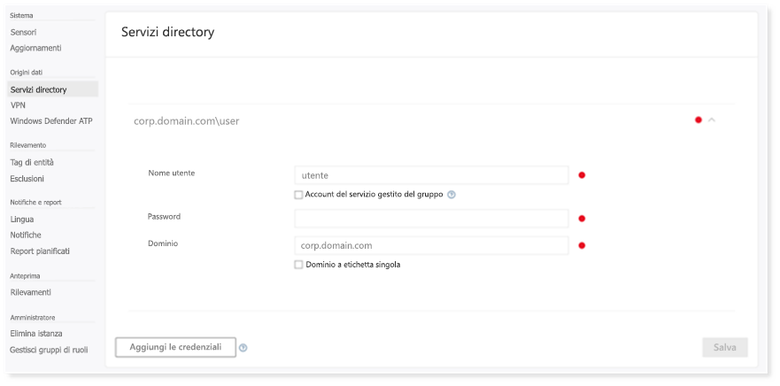
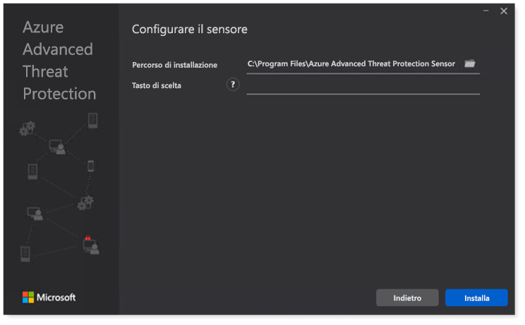

# Configurare Microsoft 365 Defender pilastri per il laboratorio di valutazione o l'ambiente pilota

[!INCLUDE [Microsoft 365 Defender rebranding](../includes/microsoft-defender.md)]

**Si applica a:**
- Microsoft 365 Defender

La creazione Microsoft 365 Defender laboratorio di valutazione o un ambiente pilota e la distribuzione è un processo in tre fasi:

| [Fase 1: preparazione](prepare-m365d-eval.md) | [Fase 2: configurazione](setup-m365deval.md) | Fase 3: onboarding |  [Torna al playbook pilota](m365d-pilot.md) |
|--|--|--|--|
|| |*Sei qui!* | |

Si è attualmente in fase di configurazione.

La preparazione è fondamentale per una distribuzione corretta. In questo articolo, sarai guidato sui punti da considerare durante la preparazione della distribuzione di Microsoft Defender per Endpoint.

## Microsoft 365 Defender pilastri
Microsoft 365 Defender è costituito da quattro pilastri. Anche se un pilastro può già fornire valore alla sicurezza dell'organizzazione di rete, l'abilitazione dei quattro pilastri Microsoft 365 Defender offrirà all'organizzazione il massimo valore.

Questa sezione ti guiderà a configurare:

- Microsoft Defender per Office 365
- Microsoft Defender per identità
- Microsoft Cloud App Security
- Microsoft Defender per endpoint

## Configurare Microsoft Defender per Office 365

> [!NOTE]
> Ignora questo passaggio se hai già abilitato Defender per Office 365.

Esiste un modulo di PowerShell denominato Office 365 *Advanced Threat Protection Recommended Configuration Analyzer (ORCA)* che consente di determinare alcune di queste impostazioni. Quando viene eseguito come amministratore nel tenant, get-ORCAReport consente di generare una valutazione delle impostazioni di protezione da posta indesiderata, anti-phish e altre impostazioni di igiene dei messaggi. È possibile scaricare questo modulo da https://www.powershellgallery.com/packages/ORCA/ .

1. Passare a Office 365 [sicurezza & criteri di](https://protection.office.com/homepage)gestione delle minacce del Centro  >  **conformità**  >  .

   

2. Fare **clic su Anti-phishing,** selezionare **Crea** e compilare il nome e la descrizione del criterio. Scegliere **Avanti**.

   

   > [!NOTE]
   > Modificare i criteri anti-phishing avanzati in Microsoft Defender per Office 365. Modificare **la soglia di phishing avanzato** su **2 - Aggressivo.**

3. Fai clic sul menu **a** discesa Aggiungi una condizione e seleziona i domini come dominio del destinatario. Scegliere **Avanti**.

   

4. Rivedere le impostazioni. Fare **clic su Crea questo criterio** per confermare.

   

5. Selezionare **Cassaforte allegati** e selezionare l'opzione Attiva **ATP per SharePoint, OneDrive e Microsoft Teams.**

   

6. Fare clic sull'icona + per creare un nuovo criterio degli allegati sicuri, applicarlo come dominio destinatario ai domini. Fare clic su **Salva**.

   

7. Successivamente, selezionare il criterio **Cassaforte collegamenti,** quindi fare clic sull'icona a forma di matita per modificare il criterio predefinito.

8. Assicurarsi che **l'opzione Non tenere traccia** quando gli utenti fanno clic su collegamenti sicuri non sia selezionata, mentre le altre opzioni sono selezionate. Per [informazioni dettagliate, Cassaforte impostazioni dei collegamenti.](/microsoft-365/security/office-365-security/recommended-settings-for-eop-and-office365) Fare clic su **Salva**.

   

9. Seleziona quindi il **criterio Antimalware,** seleziona il valore predefinito e scegli l'icona a forma di matita.

10. Fai **clic Impostazioni** e seleziona Sì e usa il testo di notifica **predefinito** per abilitare La risposta di **rilevamento malware.** Attivare il **filtro Tipi di allegati** comuni. Fare clic su **Salva**.

    

11. Passare a Office 365 [sicurezza &](https://protection.office.com/homepage)ricerca nel log di controllo di ricerca del Centro conformità e  >    >   attivare il controllo.

    

12. Integrare Microsoft Defender per Office 365 con Microsoft Defender per Endpoint. Passa a [Office 365 Sicurezza & Centro](https://protection.office.com/homepage)conformità Gestione minacce e seleziona Microsoft Defender per Endpoint  >    >   **Impostazioni** nell'angolo in alto a destra dello schermo. Nella finestra di dialogo Defender for Endpoint connection attiva **Connessione a Microsoft Defender for Endpoint.**

    

## Configurare Microsoft Defender per l'identità

> [!NOTE]
> Ignora questo passaggio se hai già abilitato Microsoft Defender per l'identità

1. Passare a [Microsoft 365 Centro sicurezza](https://security.microsoft.com/info) > selezionare Altre **risorse** Microsoft Defender  >  **per l'identità**.

   

2. Fai **clic su** Crea per avviare la procedura guidata di Microsoft Defender for Identity.

   

3. Scegliere **Fornire un nome utente e una password per connettersi alla foresta di Active Directory.**

   

4. Immettere le credenziali di Active Directory locale. Può trattarsi di qualsiasi account utente con accesso in lettura ad Active Directory.

   

5. Successivamente, scegliere **Download Sensor Setup** and transfer file to your domain controller.

   

6. Eseguire l'installazione del sensore di identità di Microsoft Defender per e iniziare a seguire la procedura guidata.

   

7. Fare **clic su Avanti** nel tipo di distribuzione del sensore.

   

8. Copiare il tasto di scelta perché è necessario immetterlo successivamente nella procedura guidata.

   

9. Copiare il tasto di scelta nella procedura guidata e fare clic su **Installa**.

   

10. Congratulazioni, Microsoft Defender è stato configurato correttamente per l'identità nel controller di dominio.

    

11. Nella sezione [Impostazioni di Microsoft Defender per l'identità](https://go.microsoft.com/fwlink/?linkid=2040449) seleziona **Microsoft Defender per Endpoint **, quindi attiva l'interruttore. Fare clic su **Salva**.

    

## Configurare Microsoft Cloud App Security

> [!NOTE]
> Ignorare questo passaggio se è già stato abilitato Microsoft Cloud App Security.

1. Passare a [Microsoft 365 Centro sicurezza](https://security.microsoft.com/info)e sicurezza  >  **altre** risorse  >  **Microsoft Cloud App Security**.

   

2. Al prompt delle informazioni per integrare Microsoft Defender for Identity, seleziona **Abilita Microsoft Defender per l'integrazione dei dati di identità.**

   

   > [!NOTE]
   > Se non viene visualizzato questo prompt, potrebbe significare che l'integrazione dei dati di Microsoft Defender for Identity è già stata abilitata. Tuttavia, se non si è sicuri, contattare l'amministratore IT per confermare.

3. Vai **a** Impostazioni , attiva l'interruttore **integrazione di Microsoft Defender per** l'identità, quindi fai clic su **Salva**.

   

   > [!NOTE]
   > Per le nuove istanze di Microsoft Defender for Identity, questo interruttore di integrazione viene attivato automaticamente. Verificare che l'integrazione di Microsoft Defender for Identity sia stata abilitata prima di procedere al passaggio successivo.

4. Nelle impostazioni di individuazione cloud seleziona **Microsoft Defender per l'integrazione degli endpoint** e quindi abilita l'integrazione. Fare clic su **Salva**.

   

5. In Impostazioni individuazione cloud seleziona **Arricchimento utente** e quindi abilita l'integrazione con Azure Active Directory.

   

## Configurare Microsoft Defender per Endpoint

> [!NOTE]
> Ignora questo passaggio se hai già abilitato Microsoft Defender per Endpoint.

1. Passare a [Microsoft 365 Centro sicurezza](https://security.microsoft.com/info)  >  **e** sicurezza Altre risorse  >  **Microsoft Defender Security Center**. Fare clic su **Apri**. 

   

2. Segui la procedura guidata di Microsoft Defender for Endpoint. Scegliere **Avanti**.

   

3. Scegli in base alla posizione di archiviazione dei dati preferita, ai criteri di conservazione dei dati, alle dimensioni dell'organizzazione e al consenso esplicito per le funzionalità di anteprima.

   

   > [!NOTE]
   > Non è possibile modificare alcune impostazioni, ad esempio la posizione di archiviazione dei dati, in seguito.

   Scegliere **Avanti**.

4. Fai **clic su Continua** e eseguirà il provisioning del tenant di Microsoft Defender for Endpoint.

   

5. Onboard degli endpoint tramite Criteri di gruppo, Microsoft Endpoint Manager o eseguendo uno script locale in Microsoft Defender per Endpoint. Per semplicità, in questa guida viene utilizzato lo script locale.

6. Fai **clic su Scarica** pacchetto e copia lo script di onboarding nei tuoi endpoint.

   

7. Nell'endpoint esegui lo script di onboarding come amministratore e scegli Y.

   

8. Congratulazioni, hai onboarded il primo endpoint.

   

9. Copia e incolla il test di rilevamento dalla procedura guidata di Microsoft Defender for Endpoint.

   

10. Copiare lo script di PowerShell in un prompt dei comandi con privilegi elevati ed eseguirlo.

    

11. Seleziona **Inizia a usare Microsoft Defender per Endpoint** dalla procedura guidata.

    

12. Visitare il [Microsoft Defender Security Center](https://securitycenter.windows.com/). Vai a **Impostazioni** e quindi seleziona **Funzionalità avanzate.**

    

13. Attivare l'integrazione con **Microsoft Defender per l'identità**.

    

14. Attivare l'integrazione con **Office 365 Threat Intelligence**.

    

15. Attivare l'integrazione **con Microsoft Cloud App Security**.

    

16. Scorri verso il basso e fai **clic su Salva preferenze** per confermare le nuove integrazioni.

    

## Avviare il servizio Microsoft 365 Defender

> [!NOTE]
> A partire dal 1 giugno 2020, Microsoft abilita automaticamente le Microsoft 365 Defender per tutti i tenant idonei. Per informazioni [dettagliate, vedere questo articolo di Microsoft Tech Community sull'idoneità delle](https://techcommunity.microsoft.com/t5/security-privacy-and-compliance/microsoft-threat-protection-will-automatically-turn-on-for/ba-p/1345426) licenze.

Passare a [Microsoft 365 Sicurezza](https://security.microsoft.com/homepage). Passare a **Impostazioni** e quindi selezionare **Microsoft 365 Defender**.

Per una guida più completa, vedere [Attivare Microsoft 365 Defender](m365d-enable.md).

Congratulazioni. Hai appena creato il laboratorio di Microsoft 365 Defender o l'ambiente pilota. Ora è possibile acquisire familiarità con l'Microsoft 365 Defender utente. Scopri cosa puoi imparare dalla seguente guida Microsoft 365 Defender interattiva e informazioni su come usare ogni dashboard per le attività quotidiane relative alle operazioni di sicurezza.

[Consulta la guida interattiva](https://aka.ms/MTP-Interactive-Guide)

Successivamente, è possibile simulare un attacco e vedere come le funzionalità tra prodotti rilevano, creano avvisi e rispondono automaticamente a un attacco senza file su un endpoint.

## Passaggio successivo

- [Generare un avviso di test:](generate-test-alert.md) eseguire una simulazione di attacco nel Microsoft 365 Defender di valutazione.
