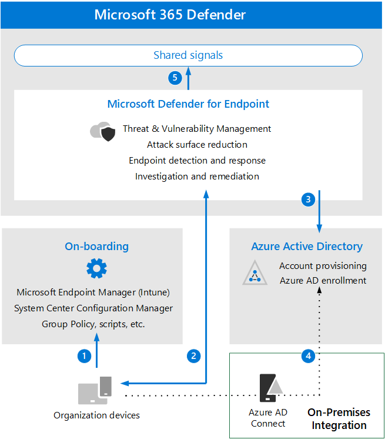

# Esaminare i requisiti e i concetti chiave dell'architettura di Microsoft Defender per endpointReview Microsoft Defender for Endpoint architecture requirements and key concepts

**Si applica a:** Microsoft 365 Defender**Applies to:** Microsoft 365 Defender

Questo articolo ti guiderà nel processo di configurazione della valutazione per Microsoft Defender per l'ambiente endpoint.This article will guide you in the process of setting up the evaluation for Microsoft Defender for Endpoint environment.

Per ulteriori informazioni su questo processo, vedere [l'articolo di panoramica](eval-defender-endpoint-overview.md).For more information about this process, see the [overview article](eval-defender-endpoint-overview.md).

Prima di abilitare Microsoft Defender per Endpoint, assicurati di aver compreso l'architettura e di poter soddisfare i requisiti.Before enabling Microsoft Defender for Endpoint, be sure you understand the architecture and can meet the requirements.

## Informazioni sull'architetturaUnderstand the architecture

Il diagramma seguente illustra l'architettura e le integrazioni di Microsoft Defender for Endpoint.The following diagram illustrates Microsoft Defender for Endpoint architecture and integrations. 

Nella tabella seguente viene descritta l'illustrazione.The following table describes the illustration.

Call-outCall-out | DescrizioneDescription
:---|:---|
11 | I dispositivi sono a bordo tramite uno degli strumenti di gestione supportati.Devices are on-boarded through one of the supported management tools. 
2 2 | I dispositivi a bordo forniscono e rispondono ai dati del segnale di Microsoft Defender for Endpoint.On-boarded devices provide and respond to Microsoft Defender for Endpoint signal data.
3 3 | I dispositivi gestiti vengono aggiunti e/o registrati in Azure Active Directory.Managed devices are joined and/or enrolled in Azure Active Directory.
4 4 | I dispositivi Windows 10 aggiunti a un dominio vengono sincronizzati con Azure Active Directory tramite Azure Active Directory Connessione.Domain-joined Windows 10 devices are synchronized to Azure Active Directory using Azure Active Directory Connect.
5 5 | Gli avvisi, le indagini e le risposte di Microsoft Defender per endpoint vengono gestiti in Microsoft 365 Defender.Microsoft Defender for Endpoint alerts, investigations, and responses are managed in Microsoft 365 Defender.

## Comprendere i concetti chiaveUnderstand key concepts

Nella tabella seguente sono stati identificati i concetti chiave importanti da comprendere durante la valutazione, la configurazione e la distribuzione di Microsoft Defender per Endpoint:The following table identified key concepts that are important to understand when evaluating, configuring, and deploying Microsoft Defender for Endpoint: 

ConcettiConcept | DescrizioneDescription | Ulteriori informazioniMore information
:---|:---|:---|
Portale di amministrazioneAdministration Portal | Microsoft 365 Defender portale per monitorare e aiutare a rispondere agli avvisi di potenziali attività avanzate di minacce persistenti o violazioni dei dati.Microsoft 365 Defender portal to monitor and assist in responding to alerts of potential advanced persistent threat activity or data breaches. | [Panoramica del portale di Microsoft Defender for EndpointMicrosoft Defender for Endpoint portal overview](/defender-endpoint/portal-overview)
Riduzione della superficie di attaccoAttack Surface Reduction | Aiuta a ridurre le superfici di attacco riducendo al minimo i luoghi in cui l'organizzazione è vulnerabile a minacce informatiche e attacchi.Help reduce your attack surfaces by minimizing the places where your organization is vulnerable to cyberthreats and attacks. | [Panoramica della riduzione della superficie di attaccoOverview of attack surface reduction](/defender-endpoint/overview-attack-surface-reduction)
Rilevamento e risposta degli endpointEndpoint Detection and Response | Le funzionalità di risposta e rilevamento degli endpoint offrono rilevamenti di attacchi avanzati quasi in tempo reale e utilizzabili.Endpoint detection and response capabilities provide advanced attack detections that are near real-time and actionable. | [Panoramica delle funzionalità di rilevamento e risposta degli endpointOverview of endpoint detection and response capabilities](/defender-endpoint/overview-endpoint-detection-response)
Blocco e contenimento comportamentaliBehavioral Blocking and Containment | Le funzionalità di blocco e contenimento comportamentali possono aiutare a identificare e arrestare le minacce, in base ai comportamenti e agli alberi di processo, anche quando la minaccia ha iniziato l'esecuzione.Behavioral blocking and containment capabilities can help identify and stop threats, based on their behaviors and process trees even when the threat has started execution. | [Blocco e contenimento comportamentaleBehavioral blocking and containment](/defender-endpoint/behavioral-blocking-containment)
Analisi e risposta automatizzateAutomated Investigation and Response | L'indagine automatizzata utilizza vari algoritmi di ispezione basati su processi utilizzati dagli analisti della sicurezza e progettati per esaminare gli avvisi e intervenire immediatamente per risolvere le violazioni.Automated investigation uses various inspection algorithms based on processes that are used by security analysts and designed to examine alerts and take immediate action to resolve breaches. | [Usare indagini automatizzate per analizzare e correggere le minacceUse automated investigations to investigate and remediate threats](/defender-endpoint/automated-investigations)
Rilevazione avanzataAdvanced Hunting | La ricerca avanzata è uno strumento di ricerca delle minacce basato su query che consente di esplorare fino a 30 giorni di dati non elaborati in modo da poter esaminare in modo proattivo gli eventi nella rete per individuare gli indicatori e le entità delle minacce.Advanced hunting is a query-based threat-hunting tool that lets you explore up to 30 days of raw data so that you can proactively inspect events in your network to locate threat indicators and entities. | [Panoramica della ricerca avanzataOverview of advanced hunting](/defender-endpoint/advanced-hunting-overview)
Analisi delle minacceThreat Analytics | L'analisi delle minacce è una serie di report di esperti ricercatori di sicurezza Microsoft che coprono le minacce più rilevanti.Threat analytics is a set of reports from expert Microsoft security researchers covering the most relevant threats. | [Monitorare e rispondere alle nuove minacceTrack and respond to emerging threats](/defender-endpoint/threat-analytics)

Per informazioni più dettagliate sulle funzionalità incluse in Microsoft Defender for Endpoint, vedi Che cos'è [Microsoft Defender per Endpoint](/defender-endpoint/microsoft-defender-endpoint).For more detailed information about the capabilities included with Microsoft Defender for Endpoint, see [What is Microsoft Defender for Endpoint](/defender-endpoint/microsoft-defender-endpoint).

## Integrazione SIEMSIEM integration

Puoi integrare Microsoft Defender for Endpoint con Azure Sentinel per analizzare in modo più completo gli eventi di sicurezza all'interno dell'organizzazione e creare playbook per una risposta efficace e immediata.You can integrate Microsoft Defender for Endpoint with Azure Sentinel to more comprehensively analyze security events across your organization and build playbooks for effective and immediate response. 

Microsoft Defender for Endpoint può anche essere integrato in altre soluzioni SIEM (Security Information and Event Management).Microsoft Defender for Endpoint can also be integrated into other Security Information and Event Management (SIEM) solutions. Per altre informazioni, vedi [Abilitare l'integrazione SIEM in Microsoft Defender per Endpoint.](/defender-endpoint/enable-siem-integration)For more information, see [Enable SIEM integration in Microsoft Defender for Endpoint](/defender-endpoint/enable-siem-integration).

## Passaggi successiviNext steps
[Abilitare la valutazioneEnable the evaluation](eval-defender-endpoint-enable-eval.md)

Torna alla panoramica per [valutare Microsoft Defender for Endpoint](eval-defender-endpoint-overview.md)Return to the overview for [Evaluate Microsoft Defender for Endpoint](eval-defender-endpoint-overview.md)

Tornare alla panoramica per [valutare e valutare Microsoft 365 Defender](eval-overview.md)Return to the overview for [Evaluate and pilot Microsoft 365 Defender](eval-overview.md)