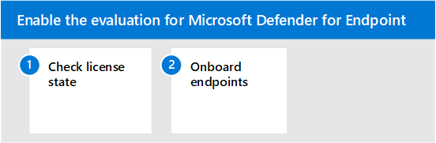

# Abilitare l'ambiente di valutazione di Microsoft Defender for EndpointEnable Microsoft Defender for Endpoint evaluation environment

Questo articolo illustra i passaggi per configurare l'ambiente di valutazione per Microsoft Defender for Endpoint usando i dispositivi di produzione.This article will guide you through the steps on setting up the evaluation environment for Microsoft Defender for Endpoint using production devices. 

>[!TIP]
>Microsoft Defender for Endpoint include anche un laboratorio di valutazione nel prodotto in cui puoi aggiungere dispositivi preconfigurato ed eseguire simulazioni per valutare le funzionalità della piattaforma.Microsoft Defender for Endpoint also comes with an in-product evaluation lab where you can add pre-configured devices and run simulations to evaluate the capabilities of the platform. Il laboratorio offre un'esperienza di configurazione semplificata che può aiutare a dimostrare rapidamente il valore di Microsoft Defender per Enpdoint, includendo indicazioni per molte funzionalità come la ricerca avanzata e l'analisi delle minacce.The lab comes with a simplified set-up experience that can help quickly demonstrate the value of Microsoft Defender for Enpdoint including guidance for many features like advanced hunting and threat analytics. Per ulteriori informazioni, vedere [Evaluate capabilities.](/defender-endpoint/evaluation-lab.md)For more information, see [Evaluate capabilities](/defender-endpoint/evaluation-lab.md).   La differenza principale tra le indicazioni fornite in questo articolo e il laboratorio di valutazione è che l'ambiente di valutazione usa dispositivi di produzione, mentre il laboratorio di valutazione usa dispositivi non di produzione.The main difference between the guidance provided in this article and the evaluation lab is the evaluation environment uses production devices whereas the evaluation lab uses non-production devices. 

Usa la procedura seguente per abilitare la valutazione per Microsoft Defender per Endpoint.Use the following steps to enable the evaluation for Microsoft Defender for Endpoint.

- [Passaggio 1. Controllare lo stato della licenzaStep 1. Check license state](#step-1-check-license-state)
- [Passaggio 2. Endpoint di onboardStep 2. Onboard endpoints](#step-2-onboard-endpoints-using-any-of-the-supported-management-tools)

## Passaggio 1.Step 1. Controllare lo stato della licenzaCheck license state

Dovrai prima controllare lo stato della licenza per verificare che sia stato eseguito correttamente il provisioning.You'll first need to check the license state to verify that it was properly provisioned. È possibile eseguire questa operazione tramite l'interfaccia di amministrazione o **tramite il Microsoft Azure portale.**You can do this through the admin center or through the **Microsoft Azure portal**.

1. Per visualizzare le licenze, passare al **portale di Microsoft Azure** e passare alla Microsoft Azure licenza del [portale.](https://portal.azure.com/#blade/Microsoft_AAD_IAM/LicensesMenuBlade/Products)To view your licenses, go to the **Microsoft Azure portal** and navigate to the [Microsoft Azure portal license section](https://portal.azure.com/#blade/Microsoft_AAD_IAM/LicensesMenuBlade/Products).

   

1. In alternativa, nell'interfaccia di amministrazione passare a **Fatturazione**  >  **Abbonamenti.**Alternately, in the admin center, navigate to **Billing** > **Subscriptions**.

    Sullo schermo verranno visualizzate tutte le licenze di cui è stato eseguito il provisioning e il relativo **stato corrente.**On the screen, you'll see all the provisioned licenses and their current **Status**.

    

## Passaggio 2.Step 2. Onboardare gli endpoint usando uno degli strumenti di gestione supportatiOnboard endpoints using any of the supported management tools

Dopo aver verificato che lo stato della licenza sia stato effettuato correttamente, puoi avviare l'onboarding dei dispositivi nel servizio.After verifying that the license state has been provisioned properly, you can start onboarding devices to the service. 

Ai fini della valutazione di Microsoft Defender for Endpoint, ti consigliamo di scegliere un paio di dispositivi Windows 10 su cui eseguire la valutazione.For the purpose of evaluating Microsoft Defender for Endpoint, we recommend choosing a couple of Windows 10 devices to conduct the evaluation on. 

[L'argomento Pianificare](../defender-endpoint/deployment-strategy.md) la distribuzione descrive i passaggi generali da eseguire per distribuire Defender for Endpoint.The [Plan deployment](../defender-endpoint/deployment-strategy.md) topic outlines the general steps you need to take to deploy Defender for Endpoint.  

Guarda questo video per una breve panoramica del processo di onboarding e scopri gli strumenti e i metodi disponibili.Watch this video for a quick overview of the onboarding process and learn about the available tools and methods.

> [!VIDEO https://www.microsoft.com/videoplayer/embed/RE4bGqr]

### Opzioni dello strumento di onboardingOnboarding tool options

Nella tabella seguente sono elencati gli strumenti disponibili in base all'endpoint da eseguire l'onboard.The following table lists the available tools based on the endpoint that you need to onboard.

EndpointEndpoint | Opzioni degli strumentiTool options
:---|:---
**Windows****Windows** | [Script locale (fino a 10 dispositivi),](../defender-endpoint/configure-endpoints-script.md)Criteri di [gruppo,](../defender-endpoint/configure-endpoints-gp.md) [Microsoft Endpoint Manager/ Gestione](../defender-endpoint/configure-endpoints-mdm.md)dispositivi mobili, [Microsoft Endpoint Configuration Manager](../defender-endpoint/configure-endpoints-sccm.md), [script VDI,](../defender-endpoint/configure-endpoints-vdi.md)integrazione [con Azure Defender](../defender-endpoint/configure-server-endpoints.md#integration-with-azure-defender)[Local script (up to 10 devices)](../defender-endpoint/configure-endpoints-script.md),  [Group Policy](../defender-endpoint/configure-endpoints-gp.md),  [Microsoft Endpoint Manager/ Mobile Device Manager](../defender-endpoint/configure-endpoints-mdm.md),  [Microsoft Endpoint Configuration Manager](../defender-endpoint/configure-endpoints-sccm.md),  [VDI scripts](../defender-endpoint/configure-endpoints-vdi.md),  [Integration with Azure Defender](../defender-endpoint/configure-server-endpoints.md#integration-with-azure-defender)
**macOS****macOS** | [Script locali](../defender-endpoint/mac-install-manually.md), [Microsoft Endpoint Manager](../defender-endpoint/mac-install-with-intune.md), [JAMF Pro](../defender-endpoint/mac-install-with-jamf.md), Gestione [dispositivi mobili](../defender-endpoint/mac-install-with-other-mdm.md)[Local scripts](../defender-endpoint/mac-install-manually.md),  [Microsoft Endpoint Manager](../defender-endpoint/mac-install-with-intune.md),  [JAMF Pro](../defender-endpoint/mac-install-with-jamf.md),  [Mobile Device Management](../defender-endpoint/mac-install-with-other-mdm.md)
**Linux Server****Linux Server** | [Script locale,](../defender-endpoint/linux-install-manually.md)  [Pupazzo,](../defender-endpoint/linux-install-with-puppet.md)  [Ansible](../defender-endpoint/linux-install-with-ansible.md)[Local script](../defender-endpoint/linux-install-manually.md),  [Puppet](../defender-endpoint/linux-install-with-puppet.md),  [Ansible](../defender-endpoint/linux-install-with-ansible.md)
**iOS****iOS** | [Basato su appApp-based](../defender-endpoint/ios-install.md)
**Android****Android** | [Microsoft Endpoint ManagerMicrosoft Endpoint Manager](../defender-endpoint/android-intune.md)

## Passaggio successivoNext step
[Configurare il progetto pilota per Microsoft Defender per EndpointSetup the pilot for Microsoft Defender for Endpoint](eval-defender-endpoint-pilot.md)
 
Torna alla panoramica per [valutare Microsoft Defender for Endpoint](eval-defender-endpoint-overview.md)Return to the overview for [Evaluate Microsoft Defender for Endpoint](eval-defender-endpoint-overview.md)

Tornare alla panoramica per [valutare e valutare Microsoft 365 Defender](eval-overview.md)Return to the overview for [Evaluate and pilot Microsoft 365 Defender](eval-overview.md)