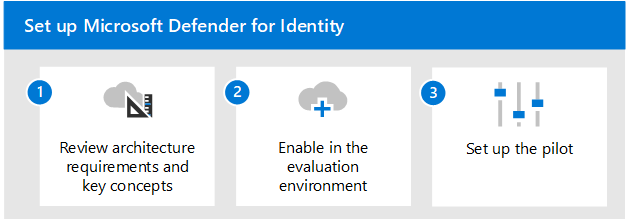

# Panoramica della valutazione di Microsoft Defender for IdentityEvaluate Microsoft Defender for Identity overview

**Si applica a:****Applies to:**
- Microsoft 365 DefenderMicrosoft 365 Defender

In questo articolo viene descritto il processo per abilitare e pilotare Microsoft Defender for Identity.This article outlines the process to enable and pilot Microsoft Defender for Identity. Prima di avviare questo processo, verificare di aver  esaminato il processo complessivo per la valutazione Microsoft 365 Defender e di aver creato l'Microsoft 365 Defender [di valutazione.](eval-create-eval-environment.md)Before starting this process, be sure you've reviewed the overall process for [evaluating Microsoft 365 Defender](eval-overview.md) and you have [created the Microsoft 365 Defender evaluation environment](eval-create-eval-environment.md). 
 

Usa la procedura seguente per abilitare e pilotare Microsoft Defender for Identity.Use the following steps to enable and pilot Microsoft Defender for Identity.

Nella tabella seguente vengono descritti i passaggi illustrati nell'illustrazione.The following table describes the steps in the illustration.

| |PassaggioStep  |DescrizioneDescription  |
|---------|---------|---------|
|11|[Esaminare i requisiti dell'architettura e i concetti chiaveReview architecture requirements and key concepts](eval-defender-identity-architecture.md)    | Comprendere l'architettura defender per l'identità e assicurarsi che l'ambiente soddisfi i prerequisiti dell'architettura.Understand the Defender for Identity architecture and be sure your environment meets the architecture prerequisites.       |
|2 2|[Abilitare l'ambiente di valutazioneEnable the evaluation environment](eval-defender-identity-enable-eval.md)     |   Seguire i passaggi per configurare l'ambiente di valutazione.Follow the steps to set up the evaluation environment.      |
|3 3|[Configurare il progetto pilotaSet up the pilot](eval-defender-identity-pilot.md)     |   Scopri le impostazioni di benchmark per il tuo ambiente di identità e prova le esercitazioni su Defender for Identity.Learn about benchmark settings for your identity environment and try out Defender for Identity tutorials.     |
||||

