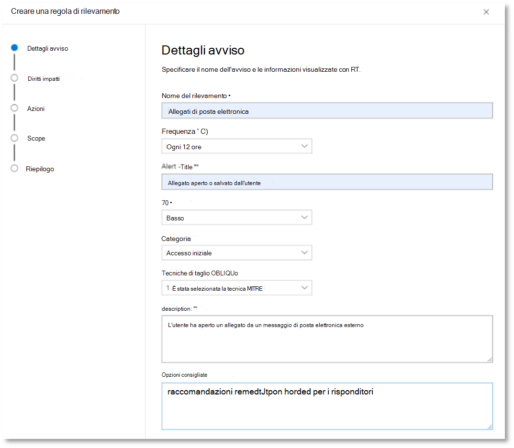
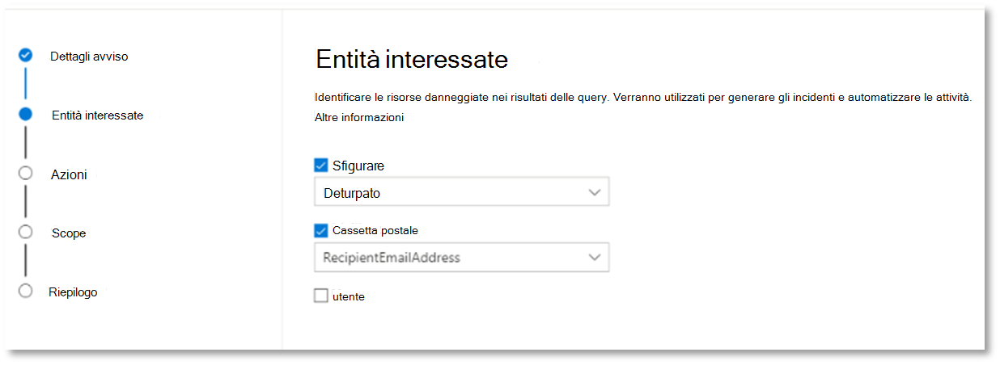
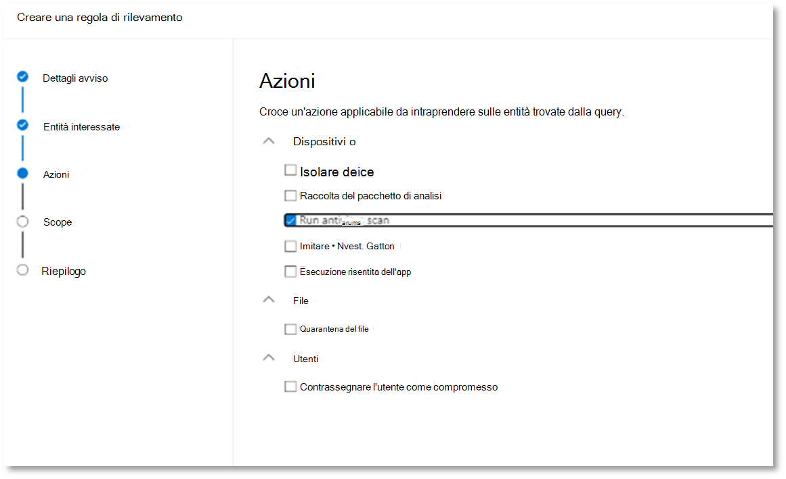
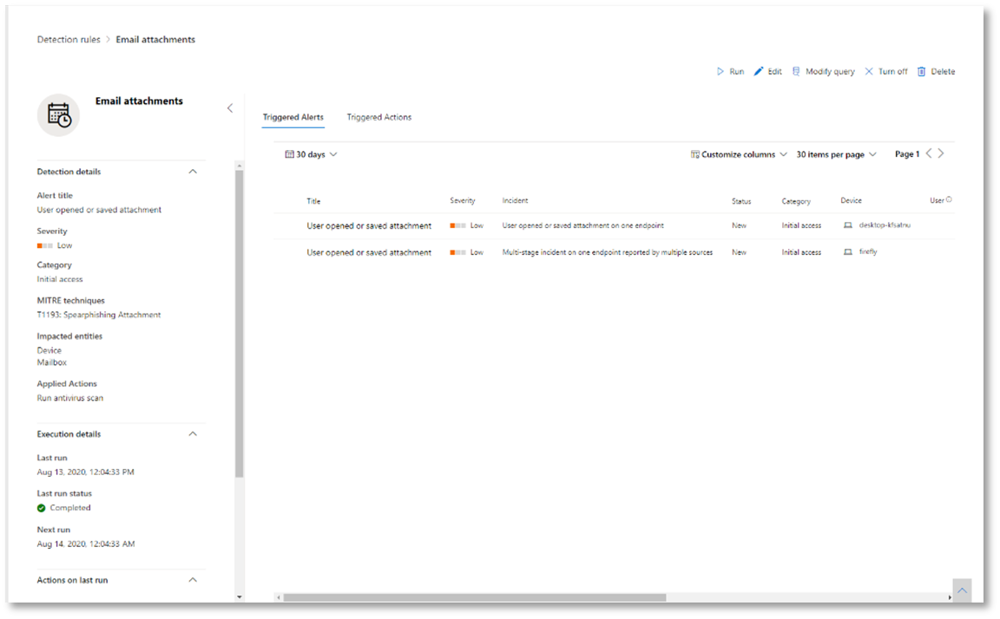

# <a name="try-microsoft-365-defender-incident-response-capabilities-in-a-pilot-environment"></a><span data-ttu-id="52cd2-104">Provare Microsoft 365 Defender di risposta agli incidenti in un ambiente pilota</span><span class="sxs-lookup"><span data-stu-id="52cd2-104">Try Microsoft 365 Defender incident response capabilities in a pilot environment</span></span>

<span data-ttu-id="52cd2-105">**Si applica a:**</span><span class="sxs-lookup"><span data-stu-id="52cd2-105">**Applies to:**</span></span>
- <span data-ttu-id="52cd2-106">Microsoft 365 Defender</span><span class="sxs-lookup"><span data-stu-id="52cd2-106">Microsoft 365 Defender</span></span>

<span data-ttu-id="52cd2-107">Questo articolo è [il passaggio 2 di 2](eval-defender-investigate-respond.md) nel processo di esecuzione di un'indagine e di risposta a un evento imprevisto Microsoft 365 Defender un ambiente pilota.</span><span class="sxs-lookup"><span data-stu-id="52cd2-107">This article is [Step 2 of 2](eval-defender-investigate-respond.md) in the process of performing an investigation and response of an incident in Microsoft 365 Defender using a pilot environment.</span></span> <span data-ttu-id="52cd2-108">Per ulteriori informazioni su questo processo, vedere [l'articolo di panoramica.](eval-defender-investigate-respond.md)</span><span class="sxs-lookup"><span data-stu-id="52cd2-108">For more information about this process, see the [overview](eval-defender-investigate-respond.md) article.</span></span>

<span data-ttu-id="52cd2-109">Dopo aver eseguito una risposta a un evento [imprevisto per](eval-defender-investigate-respond-simulate-attack.md)un attacco simulato, ecco alcune Microsoft 365 Defender da esplorare:</span><span class="sxs-lookup"><span data-stu-id="52cd2-109">Once you have performed an [incident response for a simulated attack](eval-defender-investigate-respond-simulate-attack.md), here are some Microsoft 365 Defender capabilities to explore:</span></span>

|<span data-ttu-id="52cd2-110">Funzionalità</span><span class="sxs-lookup"><span data-stu-id="52cd2-110">Capability</span></span> |<span data-ttu-id="52cd2-111">Descrizione</span><span class="sxs-lookup"><span data-stu-id="52cd2-111">Description</span></span> |
|:-------|:-----|
| [<span data-ttu-id="52cd2-112">Assegnare priorità agli incidenti</span><span class="sxs-lookup"><span data-stu-id="52cd2-112">Prioritize incidents</span></span>](#prioritize-incidents) | <span data-ttu-id="52cd2-113">Utilizzare il filtro e l'ordinamento della coda degli eventi imprevisti per determinare quali eventi imprevisti affrontare successivamente.</span><span class="sxs-lookup"><span data-stu-id="52cd2-113">Use filtering and sorting of the incidents queue to determine which incidents to address next.</span></span> |
| [<span data-ttu-id="52cd2-114">Gestire gli incidenti</span><span class="sxs-lookup"><span data-stu-id="52cd2-114">Manage incidents</span></span>](#manage-incidents) | <span data-ttu-id="52cd2-115">Modificare le proprietà dell'evento imprevisto per garantire l'assegnazione corretta, aggiungere tag e commenti e risolvere un evento imprevisto.</span><span class="sxs-lookup"><span data-stu-id="52cd2-115">Modify incident properties to ensure correct assignment, add tags and comments, and to resolve an incident.</span></span> |
| [<span data-ttu-id="52cd2-116">Analisi e risposta automatizzate</span><span class="sxs-lookup"><span data-stu-id="52cd2-116">Automated investigation and response</span></span>](#examine-automated-investigation-and-response-with-the-action-center) | <span data-ttu-id="52cd2-117">Funzionalità di analisi e risposta automatizzate (AIR) che consentono al team delle operazioni di sicurezza di affrontare le minacce in modo più efficiente ed efficiente.</span><span class="sxs-lookup"><span data-stu-id="52cd2-117">Automated investigation and response (AIR) capabilities that can help your security operations team address threats more efficiently and effectively.</span></span> <span data-ttu-id="52cd2-118">Il centro notifiche è un'esperienza di "singolo riquadro di vetro" per le attività relative a eventi imprevisti e avvisi, ad esempio l'approvazione di azioni di correzione in sospeso.</span><span class="sxs-lookup"><span data-stu-id="52cd2-118">The Action center is a "single pane of glass" experience for incident and alert tasks such as approving pending remediation actions.</span></span> |
| [<span data-ttu-id="52cd2-119">Rilevazione avanzata</span><span class="sxs-lookup"><span data-stu-id="52cd2-119">Advanced hunting</span></span>](#advanced-hunting) | <span data-ttu-id="52cd2-120">Uno strumento di ricerca delle minacce basato su query che consente di esaminare in modo proattivo gli eventi nella rete e individuare gli indicatori di minaccia e le entità.</span><span class="sxs-lookup"><span data-stu-id="52cd2-120">A query-based threat-hunting tool that lets you proactively inspect events in your network and locate threat indicators and entities.</span></span> <span data-ttu-id="52cd2-121">È inoltre possibile utilizzare la ricerca avanzata durante l'indagine e la correzione di un evento imprevisto.</span><span class="sxs-lookup"><span data-stu-id="52cd2-121">You also use advanced hunting during the investigation and remediation of an incident.</span></span> |
||||

## <a name="prioritize-incidents"></a><span data-ttu-id="52cd2-122">Assegnare priorità agli eventi imprevisti</span><span class="sxs-lookup"><span data-stu-id="52cd2-122">Prioritize incidents</span></span>

<span data-ttu-id="52cd2-123">Si arriva alla coda degli eventi imprevisti da **Eventi imprevisti &** avvisi > eventi imprevisti sulla barra di avvio veloce del portale di Microsoft 365 Defender ([security.microsoft.com](https://security.microsoft.com)).</span><span class="sxs-lookup"><span data-stu-id="52cd2-123">You get to the incident queue from **Incidents & alerts > Incidents** on the quick launch of the Microsoft 365 Defender portal ([security.microsoft.com](https://security.microsoft.com)).</span></span> <span data-ttu-id="52cd2-124">Di seguito viene riportato un esempio.</span><span class="sxs-lookup"><span data-stu-id="52cd2-124">Here's an example.</span></span>

:::image type="content" source="../../media/incidents-queue/incidents-ss-incidents.png" alt-text="Esempio di coda degli eventi imprevisti":::

<span data-ttu-id="52cd2-126">La **sezione Eventi imprevisti e avvisi più** recenti mostra un grafico del numero di avvisi ricevuti e di eventi imprevisti creati nelle ultime 24 ore.</span><span class="sxs-lookup"><span data-stu-id="52cd2-126">The **Most recent incidents and alerts** section shows a graph of the number of alerts received and incidents created in the last 24 hours.</span></span>

<span data-ttu-id="52cd2-127">Per esaminare l'elenco degli eventi imprevisti e assegnarne la priorità per l'assegnazione e l'indagine, è possibile:</span><span class="sxs-lookup"><span data-stu-id="52cd2-127">To examine the list of incidents and prioritize their importance for assignment and investigation, you can:</span></span> 

- <span data-ttu-id="52cd2-128">Configurare colonne personalizzabili (selezionare **Scegli** colonne ) per fornire visibilità sulle diverse caratteristiche dell'evento imprevisto o delle entità influenzate.</span><span class="sxs-lookup"><span data-stu-id="52cd2-128">Configure customizable columns (select **Choose columns**) to give you visibility into different characteristics of the incident or the impacted entities.</span></span> <span data-ttu-id="52cd2-129">Ciò consente di prendere una decisione informata sulla definizione di priorità degli incidenti per l'analisi.</span><span class="sxs-lookup"><span data-stu-id="52cd2-129">This helps you make an informed decision regarding the prioritization of incidents for analysis.</span></span>

- <span data-ttu-id="52cd2-130">Usare il filtro per concentrarsi su uno scenario o una minaccia specifici.</span><span class="sxs-lookup"><span data-stu-id="52cd2-130">Use filtering to focus on a specific scenario or threat.</span></span> <span data-ttu-id="52cd2-131">L'applicazione di filtri alla coda degli eventi imprevisti consente di determinare quali eventi imprevisti richiedono un'attenzione immediata.</span><span class="sxs-lookup"><span data-stu-id="52cd2-131">Applying filters on the incident queue can help determine which incidents require immediate attention.</span></span> 

<span data-ttu-id="52cd2-132">Dalla coda eventi imprevisti predefinita, selezionare **Filtri** per visualizzare un riquadro **Filtri,** da cui è possibile specificare un set specifico di eventi imprevisti.</span><span class="sxs-lookup"><span data-stu-id="52cd2-132">From the default incident queue, select **Filters** to see a **Filters** pane, from which you can specify a specific set of incidents.</span></span> <span data-ttu-id="52cd2-133">Ecco un esempio.</span><span class="sxs-lookup"><span data-stu-id="52cd2-133">Here is an example.</span></span>

:::image type="content" source="../../media/incidents-queue/incidents-ss-incidents-filters.png" alt-text="Esempio del riquadro dei filtri per la coda eventi imprevisti":::

<span data-ttu-id="52cd2-135">Per ulteriori informazioni, vedere [Prioritize incidents](incident-queue.md).</span><span class="sxs-lookup"><span data-stu-id="52cd2-135">For more information, see [Prioritize incidents](incident-queue.md).</span></span>

## <a name="manage-incidents"></a><span data-ttu-id="52cd2-136">Gestire gli incidenti</span><span class="sxs-lookup"><span data-stu-id="52cd2-136">Manage incidents</span></span>

<span data-ttu-id="52cd2-137">È possibile gestire gli eventi imprevisti dal **riquadro Gestisci eventi imprevisti** per un evento imprevisto.</span><span class="sxs-lookup"><span data-stu-id="52cd2-137">You can manage incidents from the **Manage incident** pane for an incident.</span></span> <span data-ttu-id="52cd2-138">Di seguito viene riportato un esempio.</span><span class="sxs-lookup"><span data-stu-id="52cd2-138">Here's an example.</span></span>

:::image type="content" source="../../media/incidents-queue/incidents-ss-incidents-manage.png" alt-text="Esempio del riquadro Gestisci evento imprevisto di un evento imprevisto":::

<span data-ttu-id="52cd2-140">È possibile visualizzare questo riquadro dal **collegamento Gestisci operazioni** non consentite in:</span><span class="sxs-lookup"><span data-stu-id="52cd2-140">You can display this pane from the **Manage incident** link on the:</span></span>

- <span data-ttu-id="52cd2-141">Riquadro Proprietà di un evento imprevisto nella coda degli eventi imprevisti.</span><span class="sxs-lookup"><span data-stu-id="52cd2-141">Properties pane of an incident in the incident queue.</span></span>
- <span data-ttu-id="52cd2-142">**Pagina di** riepilogo di un evento imprevisto.</span><span class="sxs-lookup"><span data-stu-id="52cd2-142">**Summary** page of an incident.</span></span>

<span data-ttu-id="52cd2-143">Ecco i modi in cui è possibile gestire gli eventi imprevisti:</span><span class="sxs-lookup"><span data-stu-id="52cd2-143">Here are the ways you can manage your incidents:</span></span>

- <span data-ttu-id="52cd2-144">Modificare il nome dell'evento imprevisto</span><span class="sxs-lookup"><span data-stu-id="52cd2-144">Edit the incident name</span></span>

  <span data-ttu-id="52cd2-145">Modificare il nome assegnato in modo utomatico in base alle procedure consigliate del team di sicurezza.</span><span class="sxs-lookup"><span data-stu-id="52cd2-145">Change the utomatically assigned name based on your security team best practices.</span></span>
  
- <span data-ttu-id="52cd2-146">Aggiungere tag agli eventi</span><span class="sxs-lookup"><span data-stu-id="52cd2-146">Add incident tags</span></span>

  <span data-ttu-id="52cd2-147">Aggiungere tag utilizzati dal team di sicurezza per classificare gli eventi imprevisti, che possono essere filtrati in un secondo momento.</span><span class="sxs-lookup"><span data-stu-id="52cd2-147">Add tags that your security team uses to classify incidents, which can be later filtered.</span></span>
  
- <span data-ttu-id="52cd2-148">Assegnare l'evento imprevisto a se stessi</span><span class="sxs-lookup"><span data-stu-id="52cd2-148">Assign the incident to yourself</span></span>

  <span data-ttu-id="52cd2-149">Assegnarlo al nome dell'account utente, che può essere filtrato in un secondo momento.</span><span class="sxs-lookup"><span data-stu-id="52cd2-149">Assign it to your user account name, which can be later filtered.</span></span>
  
- <span data-ttu-id="52cd2-150">Risolvere un evento imprevisto</span><span class="sxs-lookup"><span data-stu-id="52cd2-150">Resolve an incident</span></span>

  <span data-ttu-id="52cd2-151">Chiudere l'evento imprevisto dopo che è stato corretti.</span><span class="sxs-lookup"><span data-stu-id="52cd2-151">Close the incident after it has been remediated.</span></span>
  
- <span data-ttu-id="52cd2-152">Impostare la classificazione e la determinazione</span><span class="sxs-lookup"><span data-stu-id="52cd2-152">Set its classification and determination</span></span>

  <span data-ttu-id="52cd2-153">Classificare e selezionare il tipo di minaccia quando si risolve un evento imprevisto.</span><span class="sxs-lookup"><span data-stu-id="52cd2-153">Classify and select the threat type when you resolve an incident.</span></span>
  
- <span data-ttu-id="52cd2-154">Aggiungere commenti</span><span class="sxs-lookup"><span data-stu-id="52cd2-154">Add comments</span></span>

  <span data-ttu-id="52cd2-155">Usa i commenti per lo stato, le note o altre informazioni in base alle procedure consigliate del team di sicurezza.</span><span class="sxs-lookup"><span data-stu-id="52cd2-155">Use comments for progress, notes, or other information based on your security team best practices.</span></span> <span data-ttu-id="52cd2-156">La cronologia completa dei commenti è disponibile **nell'opzione Commenti** e cronologia nella pagina dei dettagli di un evento imprevisto.</span><span class="sxs-lookup"><span data-stu-id="52cd2-156">The full comment history is available from the **Comments and history** option in the details page of an incident.</span></span>

<span data-ttu-id="52cd2-157">Per ulteriori informazioni, vedere [Manage incidents](manage-incidents.md).</span><span class="sxs-lookup"><span data-stu-id="52cd2-157">For more information, see [Manage incidents](manage-incidents.md).</span></span>

## <a name="examine-automated-investigation-and-response-with-the-action-center"></a><span data-ttu-id="52cd2-158">Esaminare l'indagine automatizzata e la risposta con il centro notifiche</span><span class="sxs-lookup"><span data-stu-id="52cd2-158">Examine automated investigation and response with the Action center</span></span>

<span data-ttu-id="52cd2-159">A seconda di come vengono configurate le funzionalità di analisi e risposta automatizzate per l'organizzazione, le azioni di correzione vengono eseguite automaticamente o solo dopo l'approvazione da parte del team delle operazioni di sicurezza.</span><span class="sxs-lookup"><span data-stu-id="52cd2-159">Depending on how automated investigation and response capabilities are configured for your organization, remediation actions are taken automatically or only upon approval by your security operations team.</span></span> <span data-ttu-id="52cd2-160">Tutte le azioni, in sospeso o [](m365d-action-center.md)completate, sono elencate nel centro notifiche, in cui sono elencate le azioni di correzione in sospeso e completate per i dispositivi, i contenuti di collaborazione & posta elettronica e le identità in un'unica posizione.</span><span class="sxs-lookup"><span data-stu-id="52cd2-160">All actions, whether pending or completed, are listed in the [Action center](m365d-action-center.md), which lists pending and completed remediation actions for your devices, email & collaboration content, and identities in one location.</span></span>

<span data-ttu-id="52cd2-161">Di seguito viene riportato un esempio.</span><span class="sxs-lookup"><span data-stu-id="52cd2-161">Here's an example.</span></span>

:::image type="content" source="../../media/m3d-action-center-unified.png" alt-text="Centro notifiche unificato in Microsoft 365 Defender":::

<span data-ttu-id="52cd2-163">Nel centro notifiche è possibile selezionare le azioni in sospeso e quindi approvarle o rifiutarle nel riquadro a comparsa.</span><span class="sxs-lookup"><span data-stu-id="52cd2-163">From the Action center, you can select pending actions and then approve or reject them in the flyout pane.</span></span> <span data-ttu-id="52cd2-164">Di seguito viene riportato un esempio.</span><span class="sxs-lookup"><span data-stu-id="52cd2-164">Here's an example.</span></span>

:::image type="content" source="../../media/air-actioncenter-itemselected.png" alt-text="Approvare o rifiutare un’azione":::

<span data-ttu-id="52cd2-166">Approvare (o rifiutare) le azioni in sospeso il prima possibile in modo che le indagini automatizzate possano procedere e completare in modo appropriato.</span><span class="sxs-lookup"><span data-stu-id="52cd2-166">Approve (or reject) pending actions as soon as possible so that your automated investigations can proceed and complete in a timely manner.</span></span>

<span data-ttu-id="52cd2-167">Per ulteriori informazioni, vedere [Analisi e risposta automatizzate e](m365d-autoir.md) Centro [notifiche.](m365d-action-center.md)</span><span class="sxs-lookup"><span data-stu-id="52cd2-167">For more information, see [Automated investigation and response](m365d-autoir.md) and [Action center](m365d-action-center.md).</span></span>

## <a name="advanced-hunting"></a><span data-ttu-id="52cd2-168">Rilevazione avanzata</span><span class="sxs-lookup"><span data-stu-id="52cd2-168">Advanced hunting</span></span>

> [!NOTE]
> <span data-ttu-id="52cd2-169">Prima di illustrare la simulazione di ricerca avanzata, guardare il video seguente per comprendere i concetti di ricerca avanzati, vedere dove è possibile trovarlo nel portale e sapere come può essere utile nelle operazioni di sicurezza.</span><span class="sxs-lookup"><span data-stu-id="52cd2-169">Before we walk you through the advanced hunting simulation, watch the following video to understand advanced hunting concepts, see where you can find it in the portal, and know how it can help you in your security operations.</span></span>

<br>

> [!VIDEO https://www.microsoft.com/videoplayer/embed/RE4Bp7O]


<span data-ttu-id="52cd2-170">Se la simulazione di attacco [di PowerShell](eval-defender-investigate-respond-simulate-attack.md#simulate-an-attack-with-an-isolated-domain-controller-and-client-device-optional) senza file facoltativa era un attacco reale che aveva già raggiunto la fase di accesso alle credenziali, è possibile utilizzare la ricerca avanzata in qualsiasi punto dell'indagine per cercare in modo proattivo gli eventi e i record nella rete usando ciò che si sa già dagli avvisi generati e dalle entità interessate.</span><span class="sxs-lookup"><span data-stu-id="52cd2-170">If the [optional fileless PowerShell attack simulation](eval-defender-investigate-respond-simulate-attack.md#simulate-an-attack-with-an-isolated-domain-controller-and-client-device-optional) were a real attack that had already reached the credential access stage, you can use advanced hunting at any point in the investigation to proactively search through events and records in the network using what you already know from the generated alerts and affected entities.</span></span> <span data-ttu-id="52cd2-171">Ad esempio, è possibile eseguire una query per tutte le connessioni all'indirizzo IP esterno negli ultimi 30 giorni.</span><span class="sxs-lookup"><span data-stu-id="52cd2-171">For instance, you can query for any connections to the external IP address in the past 30 days.</span></span>

### <a name="hunting-environment-requirements"></a><span data-ttu-id="52cd2-172">Requisiti dell'ambiente di ricerca</span><span class="sxs-lookup"><span data-stu-id="52cd2-172">Hunting environment requirements</span></span>

<span data-ttu-id="52cd2-173">Per questa simulazione è necessaria una singola cassetta postale interna e un dispositivo.</span><span class="sxs-lookup"><span data-stu-id="52cd2-173">There's a single internal mailbox and device required for this simulation.</span></span> <span data-ttu-id="52cd2-174">Sarà inoltre necessario un account di posta elettronica esterno per inviare il messaggio di prova.</span><span class="sxs-lookup"><span data-stu-id="52cd2-174">You'll also need an external email account to send the test message.</span></span>

1. <span data-ttu-id="52cd2-175">Verificare che il tenant abbia [abilitato Microsoft 365 Defender](m365d-enable.md#confirm-that-the-service-is-on).</span><span class="sxs-lookup"><span data-stu-id="52cd2-175">Verify that your tenant has [enabled Microsoft 365 Defender](m365d-enable.md#confirm-that-the-service-is-on).</span></span>
2. <span data-ttu-id="52cd2-176">Identificare una cassetta postale di destinazione da utilizzare per la ricezione della posta elettronica.</span><span class="sxs-lookup"><span data-stu-id="52cd2-176">Identify a target mailbox to be used for receiving email.</span></span>

   - <span data-ttu-id="52cd2-177">Questa cassetta postale deve essere monitorata da Microsoft Defender per Office 365</span><span class="sxs-lookup"><span data-stu-id="52cd2-177">This mailbox must be monitored by Microsoft Defender for Office 365</span></span>

   - <span data-ttu-id="52cd2-178">Il dispositivo dal requisito 3 deve accedere a questa cassetta postale</span><span class="sxs-lookup"><span data-stu-id="52cd2-178">The device from requirement 3 needs to access this mailbox</span></span>

3. <span data-ttu-id="52cd2-179">Configurare un dispositivo di test:</span><span class="sxs-lookup"><span data-stu-id="52cd2-179">Configure a test device:</span></span>

    <span data-ttu-id="52cd2-180">a.</span><span class="sxs-lookup"><span data-stu-id="52cd2-180">a.</span></span> <span data-ttu-id="52cd2-181">Assicurati di usare la Windows 10 1903 o versione successiva.</span><span class="sxs-lookup"><span data-stu-id="52cd2-181">Make sure you are using Windows 10 version 1903 or later version.</span></span>

    <span data-ttu-id="52cd2-182">b.</span><span class="sxs-lookup"><span data-stu-id="52cd2-182">b.</span></span> <span data-ttu-id="52cd2-183">Aggiungere il dispositivo di test al dominio di test.</span><span class="sxs-lookup"><span data-stu-id="52cd2-183">Join the test device to the test domain.</span></span>

    <span data-ttu-id="52cd2-184">c.</span><span class="sxs-lookup"><span data-stu-id="52cd2-184">c.</span></span> <span data-ttu-id="52cd2-185">[Attivare Windows Defender Antivirus](/windows/security/threat-protection/windows-defender-antivirus/configure-windows-defender-antivirus-features).</span><span class="sxs-lookup"><span data-stu-id="52cd2-185">[Turn on Windows Defender Antivirus](/windows/security/threat-protection/windows-defender-antivirus/configure-windows-defender-antivirus-features).</span></span> <span data-ttu-id="52cd2-186">In caso di problemi durante l'abilitazione Windows Defender Antivirus, vedere [questo argomento per la risoluzione dei problemi.](/windows/security/threat-protection/microsoft-defender-atp/troubleshoot-onboarding#ensure-that-windows-defender-antivirus-is-not-disabled-by-a-policy)</span><span class="sxs-lookup"><span data-stu-id="52cd2-186">If you are having trouble enabling Windows Defender Antivirus, see [this troubleshooting topic](/windows/security/threat-protection/microsoft-defender-atp/troubleshoot-onboarding#ensure-that-windows-defender-antivirus-is-not-disabled-by-a-policy).</span></span>

    <span data-ttu-id="52cd2-187">d.</span><span class="sxs-lookup"><span data-stu-id="52cd2-187">d.</span></span> <span data-ttu-id="52cd2-188">[Onboard to Microsoft Defender for Endpoint](/windows/security/threat-protection/microsoft-defender-atp/configure-endpoints).</span><span class="sxs-lookup"><span data-stu-id="52cd2-188">[Onboard to Microsoft Defender for Endpoint](/windows/security/threat-protection/microsoft-defender-atp/configure-endpoints).</span></span>

### <a name="run-the-simulation"></a><span data-ttu-id="52cd2-189">Eseguire la simulazione</span><span class="sxs-lookup"><span data-stu-id="52cd2-189">Run the simulation</span></span>

1. <span data-ttu-id="52cd2-190">Da un account di posta elettronica esterno, inviare un messaggio di posta elettronica alla cassetta postale identificata nel passaggio 2 della sezione requisiti dell'ambiente di ricerca.</span><span class="sxs-lookup"><span data-stu-id="52cd2-190">From an external email account, send an email to the mailbox identified in step 2 of the hunting environment requirements section.</span></span> <span data-ttu-id="52cd2-191">Includere un allegato che sarà consentito tramite i criteri di filtro della posta elettronica esistenti.</span><span class="sxs-lookup"><span data-stu-id="52cd2-191">Include an attachment that will be allowed through any existing email filter policies.</span></span> <span data-ttu-id="52cd2-192">Questo file non deve essere dannoso o eseguibile.</span><span class="sxs-lookup"><span data-stu-id="52cd2-192">This file does not need to be malicious or an executable.</span></span> <span data-ttu-id="52cd2-193">I tipi di file suggeriti <i>sono.pdf</i>, <i>.exe</i> (se consentito) o un tipo Office documento, ad esempio un file di Word.</span><span class="sxs-lookup"><span data-stu-id="52cd2-193">Suggested file types are <i>.pdf</i>, <i>.exe</i> (if allowed), or an Office document type such as a Word file.</span></span>

2. <span data-ttu-id="52cd2-194">Aprire il messaggio di posta elettronica inviato dal dispositivo configurato come definito nel passaggio 3 della sezione requisiti dell'ambiente di ricerca.</span><span class="sxs-lookup"><span data-stu-id="52cd2-194">Open the sent email from the device configured as defined in step 3 of the hunting environment requirements section.</span></span> <span data-ttu-id="52cd2-195">Aprire l'allegato o salvare il file nel dispositivo.</span><span class="sxs-lookup"><span data-stu-id="52cd2-195">Either open the attachment or save the file to the device.</span></span>

#### <a name="go-hunting"></a><span data-ttu-id="52cd2-196">Andare a caccia</span><span class="sxs-lookup"><span data-stu-id="52cd2-196">Go hunting</span></span>

1. <span data-ttu-id="52cd2-197">Aprire il [Microsoft 365 Defender portale.](https://security.microsoft.com/)</span><span class="sxs-lookup"><span data-stu-id="52cd2-197">Open the [Microsoft 365 Defender portal](https://security.microsoft.com/).</span></span>

2. <span data-ttu-id="52cd2-198">Nel riquadro di spostamento selezionare **Ricerca > ricerca avanzata.**</span><span class="sxs-lookup"><span data-stu-id="52cd2-198">From the navigation pane, select **Hunting > Advanced hunting**.</span></span>

3. <span data-ttu-id="52cd2-199">Creare una query che inizia raccogliendo eventi di posta elettronica.</span><span class="sxs-lookup"><span data-stu-id="52cd2-199">Build a query that starts by gathering email events.</span></span>

   1. <span data-ttu-id="52cd2-200">Selezionare **Query > Nuovo**.</span><span class="sxs-lookup"><span data-stu-id="52cd2-200">Select **Query > New**.</span></span>

   1. <span data-ttu-id="52cd2-201">In Gruppi **di posta** elettronica in **Ricerca avanzata** fare doppio clic su **EmailEvents.**</span><span class="sxs-lookup"><span data-stu-id="52cd2-201">In the **Email** groups under **Advanced hunting**, double-click **EmailEvents**.</span></span> <span data-ttu-id="52cd2-202">Dovrebbe essere visualizzato nella finestra della query.</span><span class="sxs-lookup"><span data-stu-id="52cd2-202">You should see this in the query window.</span></span>

      ```console
      EmailEvents
      ```

   1. <span data-ttu-id="52cd2-203">Modificare l'intervallo di tempo della query per le ultime 24 ore.</span><span class="sxs-lookup"><span data-stu-id="52cd2-203">Change the time frame of the query to the last 24 hours.</span></span> <span data-ttu-id="52cd2-204">Presupponendo che il messaggio di posta elettronica inviato durante l'esecuzione della simulazione precedente sia stato nelle ultime 24 ore, altrimenti modificare l'intervallo di tempo in base alle esigenze.</span><span class="sxs-lookup"><span data-stu-id="52cd2-204">Assuming the email you sent when you ran the simulation above was in the past 24 hours, otherwise change the time frame as needed.</span></span>

   1. <span data-ttu-id="52cd2-205">Selezionare **Esegui query**.</span><span class="sxs-lookup"><span data-stu-id="52cd2-205">Select **Run query**.</span></span> <span data-ttu-id="52cd2-206">I risultati potrebbero variare a seconda dell'ambiente pilota.</span><span class="sxs-lookup"><span data-stu-id="52cd2-206">You may have differing results depending on your pilot environment.</span></span>

      > [!NOTE]
      > <span data-ttu-id="52cd2-207">Vedere il passaggio successivo per le opzioni di filtro per limitare la restituzione dei dati.</span><span class="sxs-lookup"><span data-stu-id="52cd2-207">See the next step for filtering options to limit data return.</span></span>

      

        > [!NOTE]
        > <span data-ttu-id="52cd2-209">La ricerca avanzata visualizza i risultati delle query come dati tabulari.</span><span class="sxs-lookup"><span data-stu-id="52cd2-209">Advanced hunting displays query results as tabular data.</span></span> <span data-ttu-id="52cd2-210">È inoltre possibile scegliere di visualizzare i dati in altri tipi di formato, ad esempio grafici.</span><span class="sxs-lookup"><span data-stu-id="52cd2-210">You can also opt to view the data in other format types such as charts.</span></span>

   1. <span data-ttu-id="52cd2-211">Esaminare i risultati e verificare se è possibile identificare il messaggio di posta elettronica aperto.</span><span class="sxs-lookup"><span data-stu-id="52cd2-211">Look at the results and see if you can identify the email you opened.</span></span> <span data-ttu-id="52cd2-212">La visualizzazione del messaggio nella ricerca avanzata può richiedere fino a due ore.</span><span class="sxs-lookup"><span data-stu-id="52cd2-212">It may take up to two hours for the message to show up in advanced hunting.</span></span> <span data-ttu-id="52cd2-213">Per limitare i risultati, è possibile aggiungere la condizione **where** alla query per cercare solo i messaggi di posta elettronica con "yahoo.com" come SenderMailFromDomain.</span><span class="sxs-lookup"><span data-stu-id="52cd2-213">To narrow down the results, you can add the **where** condition to your query to only look for emails that have "yahoo.com" as their SenderMailFromDomain.</span></span> <span data-ttu-id="52cd2-214">Ecco un esempio.</span><span class="sxs-lookup"><span data-stu-id="52cd2-214">Here is an example.</span></span>

      ```console
      EmailEvents
      | where SenderMailFromDomain == "yahoo.com"
      ```

   1. <span data-ttu-id="52cd2-215">Fare clic nelle righe risultanti della query in modo da poter esaminare il record.</span><span class="sxs-lookup"><span data-stu-id="52cd2-215">Click the resulting rows from the query so you can inspect the record.</span></span>

      

4. <span data-ttu-id="52cd2-217">Dopo aver verificato che sia possibile visualizzare il messaggio di posta elettronica, aggiungere un filtro per gli allegati.</span><span class="sxs-lookup"><span data-stu-id="52cd2-217">Now that you have verified that you can see the email, add a filter for the attachments.</span></span> <span data-ttu-id="52cd2-218">Concentrarsi su tutti i messaggi di posta elettronica con allegati nell'ambiente.</span><span class="sxs-lookup"><span data-stu-id="52cd2-218">Focus on all emails with attachments in the environment.</span></span> <span data-ttu-id="52cd2-219">Per questa simulazione, concentrarsi sui messaggi di posta elettronica in ingresso, non su quelli inviati dall'ambiente.</span><span class="sxs-lookup"><span data-stu-id="52cd2-219">For this simulation, focus on inbound emails, not those that are being sent out from your environment.</span></span> <span data-ttu-id="52cd2-220">Rimuovere i filtri aggiunti per individuare il messaggio e aggiungere "| dove **AttachmentCount > 0** e **EmailDirection**  ==  **"Inbound""**</span><span class="sxs-lookup"><span data-stu-id="52cd2-220">Remove any filters you have added to locate your message and add "| where **AttachmentCount > 0** and **EmailDirection** == **"Inbound""**</span></span>

   <span data-ttu-id="52cd2-221">La query seguente mostrerà il risultato con un elenco più breve rispetto alla query iniziale per tutti gli eventi di posta elettronica:</span><span class="sxs-lookup"><span data-stu-id="52cd2-221">The following query will show you the result with a shorter list than your initial query for all email events:</span></span>

   ```console
   EmailEvents
   | where AttachmentCount > 0 and EmailDirection == "Inbound"
   ```

5. <span data-ttu-id="52cd2-222">Includere quindi le informazioni sull'allegato (ad esempio: nome file, hash) nel set di risultati.</span><span class="sxs-lookup"><span data-stu-id="52cd2-222">Next, include the information about the attachment (such as: file name, hashes) to your result set.</span></span> <span data-ttu-id="52cd2-223">A tale scopo, unire la **tabella EmailAttachmentInfo.**</span><span class="sxs-lookup"><span data-stu-id="52cd2-223">To do so, join the **EmailAttachmentInfo** table.</span></span> <span data-ttu-id="52cd2-224">I campi comuni da utilizzare per l'aggiunta, in questo caso **sono NetworkMessageId** **e RecipientObjectId**.</span><span class="sxs-lookup"><span data-stu-id="52cd2-224">The common fields to use for joining, in this case are **NetworkMessageId** and **RecipientObjectId**.</span></span>

   <span data-ttu-id="52cd2-225">La query seguente include anche una riga aggiuntiva "| **project-rename EmailTimestamp=Timestamp**" che consente di identificare il timestamp correlato alla posta elettronica e i timestamp correlati alle azioni dei file che verranno aggiunti nel passaggio successivo.</span><span class="sxs-lookup"><span data-stu-id="52cd2-225">The following query also includes an additional line "| **project-rename EmailTimestamp=Timestamp**" that'll help identify which timestamp was related to the email versus timestamps related to file actions that you'll add in the next step.</span></span>

   ```console
   EmailEvents
   | where AttachmentCount > 0 and EmailDirection == "Inbound"
   | project-rename EmailTimestamp=Timestamp
   | join EmailAttachmentInfo on NetworkMessageId, RecipientObjectId
   ```

6. <span data-ttu-id="52cd2-226">Usa quindi il **valore SHA256** della tabella **EmailAttachmentInfo** per trovare **DeviceFileEvents** (azioni di file eseguite nell'endpoint) per l'hash.</span><span class="sxs-lookup"><span data-stu-id="52cd2-226">Next, use the **SHA256** value from the **EmailAttachmentInfo** table to find **DeviceFileEvents** (file actions that happened on the endpoint) for that hash.</span></span> <span data-ttu-id="52cd2-227">Il campo comune qui sarà l'hash SHA256 per l'allegato.</span><span class="sxs-lookup"><span data-stu-id="52cd2-227">The common field here will be the SHA256 hash for the attachment.</span></span>

   <span data-ttu-id="52cd2-228">La tabella risultante ora include i dettagli dell'endpoint (Microsoft Defender for Endpoint), ad esempio il nome del dispositivo, l'azione eseguita (in questo caso filtrata per includere solo gli eventi FileCreated) e la posizione in cui è stato archiviato il file.</span><span class="sxs-lookup"><span data-stu-id="52cd2-228">The resulting table now includes details from the endpoint (Microsoft Defender for Endpoint) such as device name, what action was done (in this case, filtered to only include FileCreated events), and where the file was stored.</span></span> <span data-ttu-id="52cd2-229">Verrà incluso anche il nome dell'account associato al processo.</span><span class="sxs-lookup"><span data-stu-id="52cd2-229">The account name associated with the process will also be included.</span></span>

   ```console
   EmailEvents
   | where AttachmentCount > 0 and EmailDirection == "Inbound"
   | project-rename EmailTimestamp=Timestamp
   | join EmailAttachmentInfo on NetworkMessageId, RecipientObjectId
   | join DeviceFileEvents on SHA256
   | where ActionType == "FileCreated"
   ```

   <span data-ttu-id="52cd2-230">A questo punto è stata creata una query che identificherà tutti i messaggi di posta elettronica in ingresso in cui l'utente ha aperto o salvato l'allegato.</span><span class="sxs-lookup"><span data-stu-id="52cd2-230">You've now created a query that'll identify all inbound emails where the user opened or saved the attachment.</span></span> <span data-ttu-id="52cd2-231">È inoltre possibile perfezionare questa query in modo da filtrare i domini del mittente specifici, le dimensioni dei file, i tipi di file e così via.</span><span class="sxs-lookup"><span data-stu-id="52cd2-231">You can also refine this query to filter for specific sender domains, file sizes, file types, and so on.</span></span>

7. <span data-ttu-id="52cd2-232">Le funzioni sono un tipo speciale di join, che ti consente di estrarre più dati TI su un file come la diffusione, le informazioni sul firmatario e sull'autorità emittente e così via. Per ottenere ulteriori dettagli sul file, utilizzare la **funzione FileProfile():**</span><span class="sxs-lookup"><span data-stu-id="52cd2-232">Functions are a special kind of join, which let you pull more TI data about a file like its prevalence, signer and issuer info, etc. To get more details on the file, use the **FileProfile()** function enrichment:</span></span>

    ```console
    EmailEvents
    | where AttachmentCount > 0 and EmailDirection == "Inbound"
    | project-rename EmailTimestamp=Timestamp
    | join EmailAttachmentInfo on NetworkMessageId, RecipientObjectId
    | join DeviceFileEvents on SHA256
    | where ActionType == "FileCreated"
    | distinct SHA1
    | invoke FileProfile()
    ```

#### <a name="create-a-detection"></a><span data-ttu-id="52cd2-233">Creare un rilevamento</span><span class="sxs-lookup"><span data-stu-id="52cd2-233">Create a detection</span></span>

<span data-ttu-id="52cd2-234">Dopo aver creato una query che identifica le  informazioni di cui si desidera ricevere un avviso se si verificano in futuro, è possibile creare un rilevamento personalizzato dalla query.</span><span class="sxs-lookup"><span data-stu-id="52cd2-234">Once you have created a query that identifies information that you'd like to **get alerted** about if they happen in the future, you can create a custom detection from the query.</span></span>

<span data-ttu-id="52cd2-235">I rilevamenti personalizzati eseguiranno la query in base alla frequenza impostata e i risultati delle query creeranno avvisi di sicurezza, in base alle risorse selezionate.</span><span class="sxs-lookup"><span data-stu-id="52cd2-235">Custom detections will run the query according to the frequency you set, and the results of the queries will create security alerts, based on the impacted assets you choose.</span></span> <span data-ttu-id="52cd2-236">Tali avvisi saranno correlati agli eventi imprevisti e possono essere valutati come qualsiasi altro avviso di sicurezza generato da uno dei prodotti.</span><span class="sxs-lookup"><span data-stu-id="52cd2-236">Those alerts will be correlated to incidents and can be triaged as any other security alert generated by one of the products.</span></span>

1. <span data-ttu-id="52cd2-237">Nella pagina della query rimuovere le righe 7 e 8 aggiunte al passaggio 7 delle istruzioni di ricerca Go e fare clic **su Crea regola di rilevamento.**</span><span class="sxs-lookup"><span data-stu-id="52cd2-237">On the query page, remove lines 7 and 8 that were added in step 7 of the Go hunting instructions and click **Create detection rule**.</span></span>

   

   > [!NOTE]
   > <span data-ttu-id="52cd2-239">Se si fa **clic su Crea** regola di rilevamento e si verificano errori di sintassi nella query, la regola di rilevamento non verrà salvata.</span><span class="sxs-lookup"><span data-stu-id="52cd2-239">If you click **Create detection rule** and you have syntax errors in your query, your detection rule won't be saved.</span></span> <span data-ttu-id="52cd2-240">Verificare che la query non presenti errori.</span><span class="sxs-lookup"><span data-stu-id="52cd2-240">Double-check your query to ensure there's no errors.</span></span>

2. <span data-ttu-id="52cd2-241">Compilare i campi obbligatori con le informazioni che consentiranno al team di sicurezza di comprendere l'avviso, il motivo per cui è stato generato e le azioni previste.</span><span class="sxs-lookup"><span data-stu-id="52cd2-241">Fill in the required fields with the  information that will allow the security team to understand the alert, why it was generated, and what actions you expect them to take.</span></span>

   

   <span data-ttu-id="52cd2-243">Assicurarsi di compilare i campi con chiarezza per fornire all'utente successivo una decisione informata su questo avviso della regola di rilevamento</span><span class="sxs-lookup"><span data-stu-id="52cd2-243">Ensure that you fill out the fields with clarity to help give the next user an informed decision about this detection rule alert</span></span>

3. <span data-ttu-id="52cd2-244">Selezionare le entità che vengono influenzate in questo avviso.</span><span class="sxs-lookup"><span data-stu-id="52cd2-244">Select what entities are impacted in this alert.</span></span> <span data-ttu-id="52cd2-245">In questo caso, selezionare **Dispositivo** e **cassetta postale**.</span><span class="sxs-lookup"><span data-stu-id="52cd2-245">In this case, select **Device** and **Mailbox**.</span></span>

   

4. <span data-ttu-id="52cd2-247">Determinare quali azioni devono essere eseguite se l'avviso viene attivato.</span><span class="sxs-lookup"><span data-stu-id="52cd2-247">Determine what actions should take place if the alert is triggered.</span></span> <span data-ttu-id="52cd2-248">In questo caso, eseguire un'analisi antivirus, anche se è possibile eseguire altre azioni.</span><span class="sxs-lookup"><span data-stu-id="52cd2-248">In this case, run an antivirus scan, though other actions could be taken.</span></span>

   

5. <span data-ttu-id="52cd2-250">Selezionare l'ambito per la regola di avviso.</span><span class="sxs-lookup"><span data-stu-id="52cd2-250">Select the scope for the alert rule.</span></span> <span data-ttu-id="52cd2-251">Poiché questa query coinvolge i dispositivi, i gruppi di dispositivi sono rilevanti in questo rilevamento personalizzato in base al contesto di Microsoft Defender for Endpoint.</span><span class="sxs-lookup"><span data-stu-id="52cd2-251">Since this query involves devices, the device groups are relevant in this custom detection according to Microsoft Defender for Endpoint context.</span></span> <span data-ttu-id="52cd2-252">Quando si crea un rilevamento personalizzato che non include i dispositivi come entità influenzate, l'ambito non si applica.</span><span class="sxs-lookup"><span data-stu-id="52cd2-252">When creating a custom detection that does not include devices as impacted entities, scope does not apply.</span></span>

   

   <span data-ttu-id="52cd2-254">Per questo progetto pilota, è consigliabile limitare questa regola a un sottoinsieme di dispositivi di testing nell'ambiente di produzione.</span><span class="sxs-lookup"><span data-stu-id="52cd2-254">For this pilot, you might want to limit this rule to a subset of testing devices in your production environment.</span></span>

6. <span data-ttu-id="52cd2-255">Selezionare **Crea**.</span><span class="sxs-lookup"><span data-stu-id="52cd2-255">Select **Create**.</span></span> <span data-ttu-id="52cd2-256">Seleziona quindi **Regole di rilevamento personalizzate** nel riquadro di spostamento.</span><span class="sxs-lookup"><span data-stu-id="52cd2-256">Then, select **Custom detection rules** from the navigation panel.</span></span>

   

   

   <span data-ttu-id="52cd2-259">Da questa pagina è possibile selezionare la regola di rilevamento, che aprirà una pagina dei dettagli.</span><span class="sxs-lookup"><span data-stu-id="52cd2-259">From this page, you can select the detection rule, which will open a details page.</span></span>

   

<!--

### Advanced hunting walk-through exercises

To learn more about advanced hunting, the following webcasts will walk you through the capabilities of advanced hunting within Microsoft 365 Defender to create cross-pillar queries, pivot to entities, and create custom detections and remediation actions.

> [!NOTE]
> Be prepared with your own GitHub account to run the hunting queries in your pilot test lab environment.

|Title|Description|Download MP4|Watch on YouTube|CSL file to use|
|---|---|---|---|---|
|Episode 1: KQL fundamentals|We'll cover the basics of advanced hunting capabilities in Microsoft 365 Defender. Learn about available advanced hunting data and basic KQL syntax and operators.|[MP4](https://aka.ms/MTP15JUL20_MP4)|[YouTube](https://youtu.be/0D9TkGjeJwM)|[Episode 1: CSL file in Git](https://github.com/microsoft/Microsoft-threat-protection-Hunting-Queries/blob/master/Webcasts/TrackingTheAdversary/Episode%201%20-%20KQL%20Fundamentals.csl)|
|Episode 2: Joins|We'll continue learning about data in advanced hunting and how to join tables together. Learn about inner, outer, unique, and semi joins, and the nuances of the default Kusto innerunique join.|[MP4](https://aka.ms/MTP22JUL20_MP4)|[YouTube](https://youtu.be/LMrO6K5TWOU)|[Episode 2: CSL file in Git](https://github.com/microsoft/Microsoft-threat-protection-Hunting-Queries/blob/master/Webcasts/TrackingTheAdversary/Episode%202%20-%20Joins.csl)|
|Episode 3: Summarizing, pivoting, and visualizing data|Now that we're able to filter, manipulate, and join data, it's time to start summarizing, quantifying, pivoting, and visualizing. In this episode, we'll cover the summarize operator and some of the calculations you can perform while diving into additional tables in the advanced hunting schema. We turn our datasets into charts that can help improve analysis.|[MP4](https://aka.ms/MTP29JUL20_MP4)|[YouTube](https://youtu.be/UKnk9U1NH6Y)|[Episode 3: CSL file in Git](https://github.com/microsoft/Microsoft-threat-protection-Hunting-Queries/blob/master/Webcasts/TrackingTheAdversary/Episode%203%20-%20Summarizing%2C%20Pivoting%2C%20and%20Joining.csl)|
|Episode 4: Let's hunt! Applying KQL to incident tracking|Time to track some attacker activity! In this episode, we'll use our improved understanding of KQL and advanced hunting in Microsoft 365 Defender to track an attack. Learn some of the tips and tricks used in the field to track attacker activity, including the ABCs of cybersecurity and how to apply them to incident response.|[MP4](https://aka.ms/MTP5AUG20_MP4)|[YouTube](https://youtu.be/2EUxOc_LNd8)|[Episode 4: CSL file in Git](https://github.com/microsoft/Microsoft-threat-protection-Hunting-Queries/blob/master/Webcasts/TrackingTheAdversary/Episode%204%20-%20Lets%20Hunt.csl)|
|

--> 

### <a name="expert-training-on-advanced-hunting"></a><span data-ttu-id="52cd2-261">Formazione esperta sulla ricerca avanzata</span><span class="sxs-lookup"><span data-stu-id="52cd2-261">Expert training on advanced hunting</span></span>

<span data-ttu-id="52cd2-262">**Tenere traccia dell'avversario** è una serie di webcast per i nuovi analisti della sicurezza e i cacciatori di minacce esperti.</span><span class="sxs-lookup"><span data-stu-id="52cd2-262">**Tracking the adversary** is a webcast series for new security analysts and seasoned threat hunters.</span></span> <span data-ttu-id="52cd2-263">Illustra le nozioni di base della ricerca avanzata fino alla creazione di query sofisticate.</span><span class="sxs-lookup"><span data-stu-id="52cd2-263">It guides you through the basics of advanced hunting all the way to creating your own sophisticated queries.</span></span> 

<span data-ttu-id="52cd2-264">Per [iniziare, vedi](advanced-hunting-expert-training.md) Formazione di esperti sulla ricerca avanzata.</span><span class="sxs-lookup"><span data-stu-id="52cd2-264">See [Get expert training on advanced hunting](advanced-hunting-expert-training.md) to get started.</span></span>

### <a name="navigation-you-may-need"></a><span data-ttu-id="52cd2-265">Spostamento che potrebbe essere necessario</span><span class="sxs-lookup"><span data-stu-id="52cd2-265">Navigation you may need</span></span>

[<span data-ttu-id="52cd2-266">Creare l'Microsoft 365 Defender di valutazione</span><span class="sxs-lookup"><span data-stu-id="52cd2-266">Create the Microsoft 365 Defender Evaluation Environment</span></span>](eval-create-eval-environment.md)
