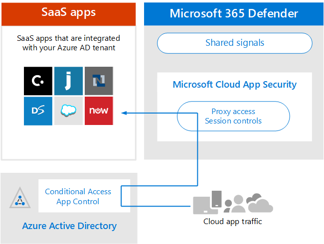

# Esaminare i requisiti di architettura e i concetti chiave per Microsoft Cloud App SecurityReview architecture requirements and key concepts for Microsoft Cloud App Security

**Si applica a:****Applies to:**

- Microsoft 365 DefenderMicrosoft 365 Defender

Questo articolo è [il passaggio 1 di 3 nel](eval-defender-mcas-overview.md) processo di configurazione dell'ambiente di valutazione per Microsoft Cloud App Security insieme Microsoft 365 Defender.This article is [Step 1 of 3](eval-defender-mcas-overview.md) in the process of setting up the evaluation environment for Microsoft Cloud App Security alongside Microsoft 365 Defender. Per ulteriori informazioni su questo processo, vedere [l'articolo di panoramica](eval-defender-identity-overview.md).For more information about this process, see the [overview article](eval-defender-identity-overview.md).

Prima di Microsoft Cloud App Security, assicurarsi di conoscere l'architettura e di soddisfare i requisiti.Before enabling Microsoft Cloud App Security, be sure you understand the architecture and can meet the requirements. 

## Informazioni sull'architetturaUnderstand the architecture

Microsoft Cloud App Security è un Cloud Access Security Broker (CASB).Microsoft Cloud App Security is a Cloud Access Security Broker (CASB). I casb agiscono da gatekeeper per mediare l'accesso in tempo reale tra gli utenti aziendali e le risorse cloud che usano, ovunque gli utenti si trovino e indipendentemente dal dispositivo in uso.CASBs act a gatekeeper to broker access in real time between your enterprise users and cloud resources they use, wherever your users are located and regardless of the device they are using. Microsoft Cloud App Security si integra in modo nativo con le funzionalità di sicurezza Microsoft, tra cui Microsoft 365 Defender.Microsoft Cloud App Security natively integrates with Microsoft security capabilities, including Microsoft 365 Defender. 

Senza Cloud App Security, le app cloud usate dall'organizzazione sono non gestite e non protette, come illustrato.Without Cloud App Security, cloud apps that are used by your organization are unmanaged and unprotected, as illustrated.

Nella figura:In the illustration:
- L'uso di app cloud da parte di un'organizzazione non è monitorato e non protetto.The use of cloud apps by an organization is unmonitored and unprotected. 
- Questo utilizzo non rientra nelle protezioni ottenute all'interno di un'organizzazione gestita.This use falls outside the protections achieved within a managed organization. 

#### Individuazione delle app cloudDiscovering cloud apps

Il primo passaggio per gestire l'uso delle app cloud consiste nell'individuare le app cloud usate dall'organizzazione.The first step to managing the use of cloud apps is to discover which cloud apps are used by your organization. Questo diagramma successivo illustra il funzionamento dell'individuazione cloud con Cloud App Security.This next diagram illustrates how cloud discovery works with Cloud App Security.

In questa figura sono disponibili due metodi che possono essere usati per monitorare il traffico di rete e individuare le app cloud utilizzate dall'organizzazione.In this illustration, there are two methods that can be used to monitor network traffic and discover cloud apps that are being used by your organization.
- R.A. Cloud App Discovery si integra con Microsoft Defender for Endpoint in modo nativo.Cloud App Discovery integrates with Microsoft Defender for Endpoint natively. Defender for Endpoint segnala l'accesso alle app e ai servizi cloud da dispositivi Windows 10 IT.Defender for Endpoint reports cloud apps and services being accessed from IT-managed Windows 10 devices. 
- B.B. Per la copertura su tutti i dispositivi connessi a una rete, l'Cloud App Security di log viene installato nei firewall e in altri proxy per raccogliere dati dagli endpoint.For coverage on all devices connected to a network, the Cloud App Security log collector is installed on firewalls and other proxies to collect data from endpoints. Questi dati vengono inviati a Cloud App Security per l'analisi.This data is sent to Cloud App Security for analysis.

#### Gestione delle app cloudManaging cloud apps

Dopo aver scoperto le app cloud e aver analizzato il comportamento di queste app usate dall'organizzazione, puoi iniziare a gestire le app cloud che scegli.After you discover cloud apps and analyze the behavior of how these are used by your organization, you can begin managing cloud apps that you choose. 

In questa illustrazione:In this illustration:
- Alcune app sono sanzionate per l'uso.Some apps are sanctioned for use. Questo è un modo semplice per iniziare a gestire le app.This is a simple way of beginning to manage apps.
- Puoi abilitare maggiore visibilità e controllo connettendo le app con i connettori dell'app.You can enable greater visibility and control by connecting apps with app connectors. I connettori di app usano le API dei provider di app.App connectors use the APIs of app providers.

#### Applicazione di controlli di sessione alle app cloudApplying session controls to cloud apps

Microsoft Cloud App Security funge da proxy inverso, fornendo l'accesso proxy alle app cloud sanzionate.Microsoft Cloud App Security serves as a reverse proxy, providing proxy access to sanctioned cloud apps. Ciò consente Cloud App Security di applicare i controlli di sessione che si configurano.This allows Cloud App Security to apply session controls that you configure. 

In questa illustrazione:In this illustration:
- L'accesso alle app cloud sanzionate da utenti e dispositivi dell'organizzazione viene instradato attraverso Cloud App Security.Access to sanctioned cloud apps from users and devices in your organization is routed through Cloud App Security.
- Questo accesso proxy consente di applicare i controlli della sessione.This proxy access allows session controls to be applied.
- Le app cloud non sanzionate o esplicitamente non sanzionate non sono interessate.Cloud apps that you have not sanctioned or explicitly unsanctioned are not affected.

I controlli di sessione consentono di applicare parametri al modo in cui le app cloud vengono usate dall'organizzazione.Session controls allow you to apply parameters to how cloud apps are used by your organization. Ad esempio, se l'organizzazione usa Salesforce, è possibile configurare un criterio di sessione che consenta solo ai dispositivi gestiti di accedere ai dati dell'organizzazione in Salesforce.For example, if your organization is using Salesforce, you can configure a session policy that allows only managed devices to access your organization's data in Salesforce. Un esempio più semplice potrebbe essere la configurazione di un criterio per monitorare il traffico da dispositivi non gestiti in modo da poter analizzare il rischio di questo traffico prima di applicare criteri più rigidi.A simpler example could be configuring a policy to monitor traffic from unmanaged devices so you can analyze the risk of this traffic before applying stricter policies.

#### Integrazione con Azure AD con il controllo dell'app con accesso condizionaleIntegrating with Azure AD with Conditional Access App Control

Potresti già aggiungere app SaaS al tenant di Azure AD per applicare l'autenticazione a più fattori e altri criteri di accesso condizionale.You might already have SaaS apps added to your Azure AD tenant to enforce multi-factor authentication and other conditional access policies. Microsoft Cloud App Security si integra in modo nativo con Azure AD.Microsoft Cloud App Security natively integrates with Azure AD. Tutto ciò che devi fare è configurare un criterio in Azure AD per usare il controllo dell'app di accesso condizionale in Cloud App Security.All you have to do is configure a policy in Azure AD to use Conditional Access App Control in Cloud App Security. In questo modo il traffico di rete per queste app SaaS gestite viene instradato tramite Cloud App Security come proxy, che consente a Cloud App Security di monitorare questo traffico e di applicare i controlli della sessione.This routes network traffic for these managed SaaS apps through Cloud App Security as a proxy, which allows Cloud App Security to monitor this traffic and to apply session controls. 

In questa illustrazione:In this illustration:
- Le app SaaS sono integrate con il tenant di Azure AD.SaaS apps are integrated with the Azure AD tenant. Ciò consente ad Azure AD di applicare criteri di accesso condizionale, inclusa l'autenticazione a più fattori.This allows Azure AD to enforce conditional access policies, including multi-factor authentication.
- Viene aggiunto un criterio per Azure Active Directory indirizzare il traffico per le app SaaS a Cloud App Security.A policy is added to Azure Active Directory to direct traffic for SaaS apps to Cloud App Security. Il criterio specifica a quali app SaaS applicare questo criterio.The policy specifies which SaaS apps to apply this policy to. Di conseguenza, dopo che Azure AD applica i criteri di accesso condizionale che si applicano a queste app SaaS, Azure AD indirizza (proxy) il traffico della sessione attraverso Cloud App Security.Consequently, after Azure AD enforces any conditional access policies that apply to these SaaS apps, Azure AD then directs (proxies) the session traffic through Cloud App Security.
- Cloud App Security questo traffico e applica tutti i criteri di controllo della sessione configurati dagli amministratori.Cloud App Security monitors this traffic and applies any session control policies that have been configured by administrators. 

Potresti aver individuato e sanzionato app cloud usando Cloud App Security che non sono state aggiunte ad Azure AD.You might have discovered and sanctioned cloud apps using Cloud App Security that have not been added to Azure AD. Puoi sfruttare il controllo delle app di accesso condizionale aggiungendo queste app cloud al tenant di Azure AD e l'ambito delle regole di accesso condizionale.You can take advantage of Conditional Access App Control by adding these cloud apps to your Azure AD tenant and the scope of your conditional access rules.

#### Protezione dell'organizzazione da hackerProtecting your organization from hackers

Cloud App Security offre una protezione efficace.Cloud App Security provides powerful protection on its own. Tuttavia, se combinato con le altre funzionalità di Microsoft 365 Defender, Cloud App Security fornisce dati nei segnali condivisi che, insieme, aiutano a bloccare gli attacchi.However, when combined with the other capabilities of Microsoft 365 Defender, Cloud App Security provides data into the shared signals which, together, helps stop attacks.

Vale la pena ripetere questa illustrazione dalla panoramica a questa guida Microsoft 365 Defender e pilota.It's worth repeating this illustration from the overview to this Microsoft 365 Defender evaluation and pilot guide. 

Concentrandosi sul lato destro di questa illustrazione, Microsoft Cloud App Security rileva comportamenti anomali come viaggi impossibili, accesso alle credenziali e attività insolite di download, condivisione file o inoltro della posta e le segnala al team di sicurezza.Focusing on the right side of this illustration, Microsoft Cloud App Security notices anomalous behavior like impossible-travel, credential access, and unusual download, file share, or mail forwarding activity and reports these to the security team. Di conseguenza, Cloud App Security impedisce lo spostamento laterale da parte di hacker e l'esfiltrazione di dati sensibili.Consequently, Cloud App Security helps prevent lateral movement by hackers and exfiltration of sensitive data. Microsoft 356 Defender correla i segnali di tutti i componenti per fornire la storia di attacco completa.Microsoft 356 Defender correlates the signals from all the components to provide the full attack story.

## Comprendere i concetti chiaveUnderstand key concepts

Nella tabella seguente sono stati identificati i concetti chiave importanti da comprendere durante la valutazione, la configurazione e la Microsoft Cloud App Security.The following table identified key concepts that are important to understand when evaluating, configuring, and deploying Microsoft Cloud App Security.

|ConcettiConcept  |DescrizioneDescription |Ulteriori informazioniMore information  |
|---------|---------|---------|
| Cloud App Security DashboardCloud App Security Dashboard | Presenta una panoramica delle informazioni più importanti sull'organizzazione e fornisce collegamenti a un'indagine più approfondita.Presents an overview of the most important information about your organization and gives links to deeper investigation.        | [Utilizzo del dashboard Working with the dashboard ](/cloud-app-security/daily-activities-to-protect-your-cloud-environment)       |
| Controllo app per l'accesso condizionaleConditional Access App Control    | Architettura del proxy inverso che si integra con il provider di identità (IdP) per fornire criteri di accesso condizionale di Azure AD e applicare in modo selettivo i controlli della sessione.Reverse proxy architecture that integrates with your Identity Provider (IdP) to give Azure AD conditional access policies and selectively enforce session controls.        |  [Proteggere le app con Microsoft Cloud App Security controllo dell'app con accesso condizionaleProtect apps with Microsoft Cloud App Security Conditional Access App Control](/cloud-app-security/proxy-intro-aad)       |
|  Catalogo app cloudCloud App Catalog   | Il Catalogo app cloud offre un'immagine completa rispetto al catalogo Microsoft di oltre 16.000 app cloud classificate e classificate in base a più di 80 fattori di rischio.The Cloud App Catalog gives you a full picture against Microsoft catalog of over 16,000 cloud apps that are ranked and scored based on more than 80 risk factors.    |  [Utilizzo dei punteggi di rischio delle appWorking with App risk scores](/cloud-app-security/risk-score)       |
| Cloud Discovery DashboardCloud Discovery Dashboard    | Cloud Discovery analizza i log del traffico ed è progettato per fornire maggiori informazioni su come vengono usate le app cloud nell'organizzazione, nonché per fornire avvisi e livelli di rischio.Cloud Discovery analyzes your traffic logs and is designed to give more insight into how cloud apps are being used in your organization as well as give alerts and risk levels.     |  [Uso delle app individuate   Working with discovered apps   ](/cloud-app-security/discovered-apps)    |
|App connesseConnected Apps |Cloud App Security offre protezione end-to-end per le app connesse tramite l'integrazione da cloud a cloud, connettori API e controlli di accesso e sessione in tempo reale sfruttando i controlli di accesso condizionale alle app.Cloud App Security provides end-to-end protection for connected apps using Cloud-to-Cloud integration, API connectors, and real-time access and session controls leveraging our Conditional App Access Controls. |[Protezione delle app connesseProtecting connected apps](/cloud-app-security/protect-connected-apps) |
| | | |

## Esaminare i requisiti dell'architetturaReview architecture requirements

### Individuazione delle app cloudDiscovering cloud apps

Per individuare le app cloud usate nell'ambiente, è possibile eseguire una o entrambe le operazioni seguenti:To discover cloud apps used in your environment, you can do one or both of the following:

- Iniziare rapidamente a utilizzare Cloud Discovery integrandosi con Microsoft Defender for Endpoint.Get up and running quickly with Cloud Discovery by integrating with Microsoft Defender for Endpoint. Questa integrazione nativa consente di avviare immediatamente la raccolta di dati sul traffico cloud nei dispositivi Windows 10, all'interno e all'uscita dalla rete.This native integration enables you to immediately start collecting data on cloud traffic across your Windows 10 devices, on and off your network.
- Per individuare tutte le app cloud accessibili da tutti i dispositivi connessi alla rete, distribuire l'Cloud App Security di log nei firewall e in altri proxy.To discover all cloud apps accessed by all devices connected to your network, deploy the Cloud App Security log collector on your firewalls and other proxies. In questo modo vengono raccolti i dati dagli endpoint e inviati a Cloud App Security per l'analisi.This collects data from your endpoints and sends it to Cloud App Security for analysis. Cloud App Security si integra in modo nativo con alcuni proxy di terze parti per altre funzionalità.Cloud App Security natively integrates with some third-party proxies for even more capabilities.

Queste opzioni sono incluse nel [passaggio 2. Abilitare l'ambiente di valutazione](eval-defender-mcas-enable-eval.md).These options are included in [Step 2. Enable the evaluation environment](eval-defender-mcas-enable-eval.md). 

### Applicazione dei criteri di accesso condizionale di Azure AD alle app cloudApplying Azure AD Conditional Access policies to cloud apps

Il controllo delle app di accesso condizionale (la possibilità di applicare criteri di accesso condizionale alle app cloud) richiede l'integrazione con Azure AD.Conditional Access App Control (the ability to apply Conditional Access policies to cloud apps) requires integration with Azure AD. Questo non è un requisito per iniziare a usare Cloud App Security.This isn't a requirement for getting started with Cloud App Security. È un passaggio che ti invitiamo a provare durante la fase pilota, [passaggio 3. Progetto pilota Microsoft Cloud App Security](eval-defender-mcas-pilot.md).It is a step we encourage you to try out during the pilot phase — [Step 3. Pilot Microsoft Cloud App Security](eval-defender-mcas-pilot.md).

## Integrazione SIEMSIEM integration

È possibile integrare Microsoft Cloud App Security con il server SIEM generico o con Azure Sentinel per abilitare il monitoraggio centralizzato di avvisi e attività da app connesse.You can integrate Microsoft Cloud App Security with your generic SIEM server or with Azure Sentinel to enable centralized monitoring of alerts and activities from connected apps. 

Azure Sentinel include inoltre un connettore Microsoft Cloud App Security per fornire un'integrazione più approfondita con Azure Sentinel.Additionally, Azure Sentinel includes a Microsoft Cloud App Security connector to provide deeper integration with Azure Sentinel. Ciò consente non solo di ottenere visibilità nelle app cloud, ma anche di ottenere analisi sofisticate per identificare e contrastare le minacce informatiche e controllare il modo in cui viaggiano i dati.This enables you to not only gain visibility into your cloud apps but to also get sophisticated analytics to identify and combat cyberthreats and to control how your data travels.

- [Integrazione SIEM genericaGeneric SIEM integration](/cloud-app-security/siem)
- [Stream alerts and Cloud Discovery logs from MCAS into Azure SentinelStream alerts and Cloud Discovery logs from MCAS into Azure Sentinel](/azure/sentinel/connect-cloud-app-security)

### Passaggi successiviNext steps

Passaggio 2 di 3: [Abilitare l'ambiente di valutazione per Microsoft Cloud App Security](eval-defender-mcas-enable-eval.md)Step 2 of 3: [Enable the evaluation environment for Microsoft Cloud App Security](eval-defender-mcas-enable-eval.md)

Tornare alla panoramica di [Evaluate Microsoft Cloud App Security](eval-defender-mcas-overview.md)Return to the overview for [Evaluate Microsoft Cloud App Security](eval-defender-mcas-overview.md)

Tornare alla panoramica per [valutare e valutare Microsoft 365 Defender](eval-overview.md)Return to the overview for [Evaluate and pilot Microsoft 365 Defender](eval-overview.md)