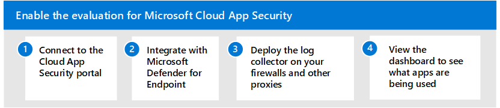

# Abilitare l'ambiente di valutazione per Microsoft Cloud App SecurityEnable the evaluation environment for Microsoft Cloud App Security

**Si applica a:****Applies to:**

- Microsoft 365 DefenderMicrosoft 365 Defender

Questo articolo è [il passaggio 2 di 2](eval-defender-mcas-overview.md) nel processo di configurazione dell'ambiente di valutazione per Microsoft Cloud App Security.This article is [Step 2 of 2](eval-defender-mcas-overview.md) in the process of setting up the evaluation environment for Microsoft Cloud App Security. Per ulteriori informazioni su questo processo, vedere [l'articolo di panoramica](eval-defender-mcas-overview.md).For more information about this process, see the [overview article](eval-defender-mcas-overview.md).

Questo articolo illustra il processo di accesso al portale Cloud App Security e la configurazione dell'integrazione necessaria per raccogliere i dati sul traffico delle app cloud.This article walks you through the process of accessing the Cloud App Security portal and configuring the necessary integration to collect cloud app traffic data.

Per individuare le app cloud usate nell'ambiente, è possibile eseguire una o entrambe le operazioni seguenti:To discover cloud apps used in your environment, you can do one or both of the following:

- Iniziare rapidamente a utilizzare Cloud Discovery integrandosi con Microsoft Defender for Endpoint.Get up and running quickly with Cloud Discovery by integrating with Microsoft Defender for Endpoint. Questa integrazione nativa consente di avviare immediatamente la raccolta di dati sul traffico cloud nei dispositivi Windows 10, all'interno e all'uscita dalla rete.This native integration enables you to immediately start collecting data on cloud traffic across your Windows 10 devices, on and off your network.
- Per individuare tutte le app cloud accessibili da tutti i dispositivi connessi alla rete, distribuire l'Cloud App Security di log nei firewall e in altri proxy.To discover all cloud apps accessed by all devices connected to your network, deploy the Cloud App Security log collector on your firewalls and other proxies. In questo modo vengono raccolti i dati dagli endpoint e inviati a Cloud App Security per l'analisi.This collects data from your endpoints and sends it to Cloud App Security for analysis. Cloud App Security si integra in modo nativo con alcuni proxy di terze parti per altre funzionalità.Cloud App Security natively integrates with some third-party proxies for even more capabilities.

Questo articolo include indicazioni per entrambi i metodi.This article includes guidance for both methods.

Eseguire la procedura seguente per configurare Microsoft Cloud App Security.Use the following steps to set up Microsoft Cloud App Security.

- [Passaggio 1. Connessione al portale Cloud App SecurityStep 1. Connect to the Cloud App Security portal](#step-1-connect-to-the-cloud-app-security-portal)
- [Passaggio 2. Integrazione con Microsoft Defender for EndpointStep 2. Integrate with Microsoft Defender for Endpoint](#step-2-integrate-with-microsoft-defender-for-endpoint)
- [Passaggio 3. Distribuire l'Cloud App Security di log nei firewall e in altri proxyStep 3. Deploy the Cloud App Security log collector on your firewalls and other proxies](#step-3-deploy-the-cloud-app-security-log-collector-on-your-firewalls-and-other-proxies)
- [Passaggio 4. Visualizzare il dashboard di Cloud Discovery per sapere quali app vengono usate nell'organizzazioneStep 4. View the Cloud Discovery dashboard to see what apps are being used in your organization](#step-4-view-the-cloud-discovery-dashboard-to-see-what-apps-are-being-used-in-your-organization)

## Passaggio 1.Step 1. Connessione al portale Cloud App SecurityConnect to the Cloud App Security portal

Per verificare le licenze e connettersi al portale Cloud App Security, vedere [Guida introduttiva:](/cloud-app-security/getting-started-with-cloud-app-security)Introduzione a Microsoft Cloud App Security .To verify licensing and to connect to the Cloud App Security portal, see [Quickstart: Get started with Microsoft Cloud App Security](/cloud-app-security/getting-started-with-cloud-app-security). 

Se non si è immediatamente in grado di connettersi al portale, potrebbe essere necessario aggiungere l'indirizzo IP all'elenco consenti del firewall.If you're not immediately able to connect to the portal, you might need to add the IP address to the allow list of your firewall. Vedere [Configurazione di base per Cloud App Security](/cloud-app-security/general-setup).See [Basic setup for Cloud App Security](/cloud-app-security/general-setup).

Se il problema persiste, vedere Requisiti [di rete.](/cloud-app-security/network-requirements)If you're still having trouble, review [Network requirements](/cloud-app-security/network-requirements).

## Passaggio 2.Step 2. Integrazione con Microsoft Defender for EndpointIntegrate with Microsoft Defender for Endpoint

Microsoft Cloud App Security si integra in modo nativo con Microsoft Defender for Endpoint.Microsoft Cloud App Security integrates with Microsoft Defender for Endpoint natively. L'integrazione semplifica l'implementazione di Cloud Discovery, estende le funzionalità di Cloud Discovery oltre la rete aziendale e consente l'analisi basata su dispositivi.The integration simplifies roll out of Cloud Discovery, extends Cloud Discovery capabilities beyond your corporate network, and enables device-based investigation. Questa integrazione rivela le app cloud e i servizi a cui si accede da dispositivi Windows 10 IT.This integration reveals cloud apps and services being accessed from IT-managed Windows 10 devices. 

Se hai già configurato Microsoft Defender per Endpoint, la configurazione dell'integrazione con Cloud App Security è un interruttore in Microsoft 365 Defender.If you've already set up Microsoft Defender for Endpoint, configuring integration with Cloud App Security is a toggle in Microsoft 365 Defender. Dopo aver attivato l'integrazione, è possibile tornare al portale Cloud App Security e visualizzare dati rtf nel dashboard di individuazione cloud.After integration is turned on, you can return to the Cloud App Security portal and view rich data in the Cloud Discovery Dashboard.

Per eseguire queste attività, vedi [Integrazione di Microsoft Defender per Endpoint con Microsoft Cloud App Security](/cloud-app-security/mde-integration).To accomplish these tasks, see [Microsoft Defender for Endpoint integration with Microsoft Cloud App Security](/cloud-app-security/mde-integration). 

## Passaggio 3.Step 3. Distribuire l'Cloud App Security di log nei firewall e in altri proxyDeploy the Cloud App Security log collector on your firewalls and other proxies

Per la copertura su tutti i dispositivi connessi alla rete, distribuire l'agente di raccolta log di Cloud App Security nei firewall e in altri proxy per raccogliere i dati dagli endpoint e inviarli a Cloud App Security per l'analisi.For coverage on all devices connected to your network, deploy the Cloud App Security log collector on your firewalls and other proxies to collect data from your endpoints and send it to Cloud App Security for analysis. 

Se si utilizza uno dei seguenti gateway Web protetti (SWG), Cloud App Security la distribuzione e l'integrazione senza problemi:If you're using one of the following Secure Web Gateways (SWG), Cloud App Security provides seamless deployment and integration:
- ZscalerZscaler
- ibossiboss
- CorrataCorrata
- Menlo SecurityMenlo Security

Per ulteriori informazioni sull'integrazione con questi dispositivi di rete, vedere [Set up Cloud Discovery.](/cloud-app-security/set-up-cloud-discovery)For more information on integrating with these network devices, see [Set up Cloud Discovery](/cloud-app-security/set-up-cloud-discovery). 
## Passaggio 4.Step 4. Visualizzare il dashboard di Cloud Discovery per sapere quali app vengono usate nell'organizzazioneView the Cloud Discovery dashboard to see what apps are being used in your organization

Il dashboard di Cloud Discovery è progettato per fornire informazioni più approfondite sull'uso delle app cloud nell'organizzazione.The Cloud Discovery dashboard is designed to give you more insight into how cloud apps are being used in your organization. Fornisce una panoramica generale dei tipi di app in uso, degli avvisi aperti e dei livelli di rischio delle app nell'organizzazione.It provides an at-a-glance overview of what kinds of apps are being used, your open alerts, and the risk levels of apps in your organization. 

Per iniziare a usare il dashboard di Cloud Discovery, vedi [Uso delle app individuate.](/cloud-app-security/discovered-apps)To get started using the Cloud Discovery dashboard, see [Working with discovered apps](/cloud-app-security/discovered-apps).

## Passaggi successiviNext steps

Passaggio 3 di 3: [test pilota Microsoft Cloud App Security](eval-defender-mcas-pilot.md)Step 3 of 3: [Pilot Microsoft Cloud App Security](eval-defender-mcas-pilot.md)

Tornare alla panoramica di [Evaluate Microsoft Cloud App Security](eval-defender-mcas-overview.md)Return to the overview for [Evaluate Microsoft Cloud App Security](eval-defender-mcas-overview.md)

Tornare alla panoramica per [valutare e valutare Microsoft 365 Defender](eval-overview.md)Return to the overview for [Evaluate and pilot Microsoft 365 Defender](eval-overview.md)