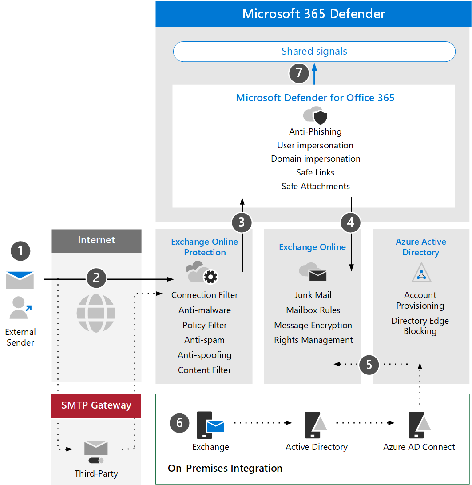

# Esaminare Microsoft Defender per i requisiti Office 365 architettura e i concetti chiaveReview Microsoft Defender for Office 365 architecture requirements and key concepts

**Si applica a:****Applies to:**
- Microsoft 365 DefenderMicrosoft 365 Defender

Questo articolo è [il passaggio 1 di 3 nel](eval-defender-office-365-overview.md) processo di configurazione dell'ambiente di valutazione per Microsoft Defender per Office 365.This article is [Step 1 of 3](eval-defender-office-365-overview.md) in the process of setting up the evaluation environment for Microsoft Defender for Office 365. Per ulteriori informazioni su questo processo, vedere [l'articolo di panoramica](eval-defender-office-365-overview.md).For more information about this process, see the [overview article](eval-defender-office-365-overview.md).

Prima di abilitare Defender per Office 365, assicurati di conoscere l'architettura e di soddisfare i requisiti.Before enabling Defender for Office 365, be sure you understand the architecture and can meet the requirements. In questo articolo vengono descritti l'architettura, i concetti chiave e i prerequisiti che l'ambiente Exchange Online deve soddisfare.This article describes the architecture, key concepts, and the prerequisites that your Exchange Online environment must meet.

## Informazioni sull'architetturaUnderstand the architecture

Il diagramma seguente illustra l'architettura di base per Microsoft Defender per Office che può includere un gateway SMTP di terze parti o un'integrazione locale.The following diagram illustrates baseline architecture for Microsoft Defender for Office which can include a third-party SMTP gateway or on-premises integration. Gli scenari di coesistenza ibrida (ad esempio, le cassette postali di produzione sono sia locali che online) richiedono configurazioni più complesse e non sono trattate in questo articolo o indicazioni di valutazione.Hybrid coexistence scenarios (i.e. production mailboxes are both on-premise and online) require more complex configurations and are not covered in this article or evaluation guidance.

Nella tabella seguente viene descritta questa figura.The following table describes this illustration.

|Call-outCall-out  |DescrizioneDescription  |
|---------|---------|
|11     | Il server host per il mittente esterno esegue in genere una ricerca DNS pubblica per un record MX che fornisce al server di destinazione di inoltrare il messaggio.The host server for the external sender typically performs a public DNS lookup for an MX record which provides the target server to relay the message.  Questa segnalazione può essere Exchange Online (EXO) direttamente o un gateway SMTP configurato per l'inoltro su EXO.This referral can either be Exchange Online (EXO) directly or an SMTP gateway that has been configured to relay against EXO.  |
|2 2     | Exchange Online Protection negozia e convalida la connessione in ingresso e esamina le intestazioni e il contenuto dei messaggi per determinare quali criteri aggiuntivi, tagging o elaborazione sono necessari.Exchange Online Protection negotiates and validates the inbound connection and inspects the message headers and content to determine what additional policies, tagging, or processing is required.  |
|3 3     | Exchange Online si integra con Microsoft Defender per Office 365 per offrire protezione, mitigazione e correzione delle minacce più avanzate.Exchange Online integrates with Microsoft Defender for Office 365 to offer more advanced threat protection, mitigation, and remediation. |
|4 4     | Un messaggio non dannoso, bloccato o messo in quarantena viene elaborato e recapitato al destinatario in EXO in cui vengono valutate e attivate le preferenze dell'utente relative alla posta indesiderata, alle regole delle cassette postali o ad altre impostazioni.A message that is not malicious, blocked, or quarantined is processed and delivered to the recipient in EXO where user preferences related to junk mail, mailbox rules, or other settings are evaluated and triggered. |
|5 5     | L'integrazione con Active Directory locale può essere abilitata usando Azure AD Connessione per sincronizzare ed eseguire il provisioning di account e oggetti abilitati alla posta elettronica Azure Active Directory e infine Exchange Online.Integration with on-premises Active Directory can be enabled using Azure AD Connect to synchronize and provision mail-enabled objects and accounts to Azure Active Directory and ultimately Exchange Online. |
|6 6     | Quando si integra un ambiente locale, è consigliabile utilizzare un server Exchange per la gestione e l'amministrazione supportate di attributi, impostazioni e configurazioni correlati alla posta elettronicaWhen integrating an on-premises environment, it is strongly encouraged to use an Exchange server for supported management and administration of mail related attributes, settings, and configurations |
|7 7     | Microsoft Defender per Office 365 condivide i segnali Microsoft 365 Defender per il rilevamento esteso e la risposta (XDR).Microsoft Defender for Office 365 shares signals to Microsoft 365 Defender for extended detection and response (XDR).|

L'integrazione locale è comune ma facoltativa.On-premises integration is common but optional. Se l'ambiente è solo cloud, questa guida funzionerà anche per te.If your environment is cloud-only this guidance will also work for you.

## Comprendere i concetti chiaveUnderstand key concepts

Nella tabella seguente sono stati identificati i concetti chiave importanti da comprendere durante la valutazione, la configurazione e la distribuzione di MDO.The following table identified key concepts that are important to understand when evaluating, configuring, and deploying MDO.

|ConcettiConcept  |DescrizioneDescription |Ulteriori informazioniMore information  |
|---------|---------|---------|
|Exchange Online ProtectionExchange Online Protection      |    Exchange Online Protection (EOP) è il servizio di filtro basato su cloud che consente di proteggere l'organizzazione dalla posta indesiderata e dai messaggi di posta elettronica di malware.Exchange Online Protection (EOP) is the cloud-based filtering service that helps protect your organization against spam and malware emails. EOP è incluso in tutte le Microsoft 365 che includono Exchange Online.EOP is included in all Microsoft 365 licenses which include Exchange Online.     |   [Panoramica su Exchange Online ProtectionExchange Online Protection overview](../office-365-security/exchange-online-protection-overview.md)      |
|Protezione anti-malwareAnti-malware protection     |    Le organizzazioni con cassette postali in EXO sono protette automaticamente da malware.Organizations with mailboxes in EXO are automatically protected against malware.     |  [Protezione antimalware in EOPAnti-malware protection in EOP](../office-365-security/anti-malware-protection.md)       |
|Protezione dalla posta indesiderataAnti-spam protection     |   Le organizzazioni con cassette postali in EXO vengono automaticamente protette dai criteri di posta indesiderata e posta indesiderata.Organizations with mailboxes in EXO are automatically protected against junk mail and spam policies.      |  [Protezione da posta indesiderata in EOPAnti-spam protection in EOP](../office-365-security/anti-spam-protection.md)       |
|Protezione anti-phishingAnti-phishing protection |  MDO offre una protezione anti-phishing più avanzata correlata a spear phishing, caccia alle whaling, ransomware e altre attività dannose.MDO offers more advanced anti-phishing  protection related to spear phishing, whaling, ransomware, and other malicious activities.   | [Protezione anti-phishing aggiuntiva in Defender per Office 365Additional anti-phishing protection in Microsoft Defender for Office 365](../office-365-security/anti-phishing-protection.md)   |
|Protezione anti-spoofingAnti-spoofing protection     |   EOP include funzionalità che consentono di proteggere l'organizzazione da mittenti contraffatti (falsificati).EOP includes features to help protect your organization from spoofed (forged) senders.      |   [Protezione anti-spoofing in EOPAnti-spoofing protection in EOP](../office-365-security/anti-spoofing-protection.md)      |
|Allegati sicuriSafe attachments     |   Cassaforte Gli allegati offrono un ulteriore livello di protezione utilizzando un ambiente virtuale per controllare e "detonare" gli allegati nei messaggi di posta elettronica prima che siano recapitati.Safe Attachments provides an additional layer of protection by using a virtual environment to check and "detonate" attachments in email messages before they are delivered.      |   [Cassaforte Allegati in Microsoft Defender per Office 365Safe Attachments in Microsoft Defender for Office 365](../office-365-security/safe-attachments.md)      |
|Cassaforte allegati per SharePoint, OneDrive e Microsoft TeamsSafe attachments for SharePoint, OneDrive, and Microsoft Teams     |    Inoltre, Cassaforte allegati per SharePoint, OneDrive e Microsoft Teams offre un ulteriore livello di protezione per i file caricati negli archivi di archiviazione cloud.In addition, Safe Attachments for SharePoint, OneDrive, and Microsoft Teams offers an additional layer of protection for files that have been uploaded to cloud storage repositories.     |  [Allegati sicuri per SharePoint, OneDrive e Microsoft TeamsSafe Attachments for SharePoint, OneDrive, and Microsoft Teams](../office-365-security/mdo-for-spo-odb-and-teams.md)       |
|Collegamenti sicuriSafe Links     | Cassaforte Collegamenti è una funzionalità che fornisce l'analisi e la riscrittura degli URL all'interno dei messaggi di posta elettronica in ingresso e offre la verifica di tali collegamenti prima che questi siano recapitati o su cui si fa clic.Safe Links is a feature that provides URL scanning and rewriting within inbound email messages and offers verification of those links before they are delivered or clicked.        |   [Cassaforte Collegamenti in Microsoft Defender per Office 365Safe Links in Microsoft Defender for Office 365](../office-365-security/safe-links.md)      |
|    |         |         |

Per informazioni più dettagliate sulle funzionalità incluse in Microsoft Defender per Office, vedere [Microsoft Defender for Office 365 service description](/office365/servicedescriptions/office-365-advanced-threat-protection-service-description).For more detailed information about the capabilities included with Microsoft Defender for Office, see [Microsoft Defender for Office 365 service description](/office365/servicedescriptions/office-365-advanced-threat-protection-service-description).

## Esaminare i requisiti dell'architetturaReview architecture requirements
Una valutazione MDO o un progetto pilota di produzione si basa sui prerequisiti seguenti:A successful MDO evaluation or production pilot assumes the following pre-requisites:
- Tutte le cassette postali dei destinatari sono attualmente Exchange Online.All your recipient mailboxes are currently in Exchange Online.
- Il record MX pubblico viene risolto direttamente in EOP o in un gateway SMTP di terze parti che quindi inoltra la posta elettronica esterna in ingresso direttamente a EOP.Your public MX record resolves directly to EOP or a third-party SMTP gateway that then relays inbound external email directly to EOP.
- Il dominio di posta elettronica principale è configurato *come autorevole* in Exchange Online.Your primary email domain is configured as *authoritative* in Exchange Online.
- È stato distribuito e configurato *correttamente IL DBEB (Directory Based Edge Blocking)* in base alle esigenze.You successfully deployed and configured *Directory Based Edge Blocking* (DBEB) as appropriate. Per ulteriori informazioni, vedere [Utilizzare il blocco Edge basato su directory per rifiutare i messaggi inviati ai destinatari non validi](/exchange/mail-flow-best-practices/use-directory-based-edge-blocking).For more information, see [Use Directory Based Edge Blocking to reject messages sent to invalid recipients](/exchange/mail-flow-best-practices/use-directory-based-edge-blocking).

> [!IMPORTANT]
> Se questi requisiti non sono applicabili o si è ancora in uno scenario di coesistenza ibrida, una valutazione di Microsoft Defender per Office 365 può richiedere configurazioni più complesse o avanzate che non sono completamente trattate in questa guida.If these requirements are not applicable or you are still in a hybrid coexistence scenario, then a Microsoft Defender for Office 365 evaluation can require more complex or advanced configurations which are not fully covered in this guidance.

## Integrazione SIEMSIEM integration

È possibile integrare Microsoft Defender per Office 365 con Azure Sentinel per analizzare in modo più completo gli eventi di sicurezza nell'organizzazione e creare playbook per una risposta efficace e immediata.You can integrate Microsoft Defender for Office 365 with Azure Sentinel to more comprehensively analyze security events across your organization and build playbooks for effective and immediate response. Per altre informazioni, vedi [Connessione avvisi da Microsoft Defender per Office 365](/azure/sentinel/connect-office-365-advanced-threat-protection).For more information, see [Connect alerts from Microsoft Defender for Office 365](/azure/sentinel/connect-office-365-advanced-threat-protection).

Microsoft Defender per Office 365 può anche essere integrato in altre soluzioni SIEM (Security Information and Event Management) tramite l'API Office 365 [Activity Management](/office/office-365-management-api/office-365-management-activity-api-reference).Microsoft Defender for Office 365 can also be integrated into other Security Information and Event Management (SIEM) solutions using the [Office 365 Activity Management API](/office/office-365-management-api/office-365-management-activity-api-reference).

## Passaggi successiviNext steps

Passaggio 2 di 3: [Abilitare l'ambiente di valutazione Microsoft Defender per Office 365](eval-defender-office-365-enable-eval.md)Step 2 of 3: [Enable the evaluation environment Microsoft Defender for Office 365](eval-defender-office-365-enable-eval.md)

Torna alla panoramica di [Evaluate Microsoft Defender for Office 365](eval-defender-office-365-overview.md)Return to the overview for [Evaluate Microsoft Defender for Office 365](eval-defender-office-365-overview.md)

Tornare alla panoramica per [valutare e valutare Microsoft 365 Defender](eval-overview.md)Return to the overview for [Evaluate and pilot Microsoft 365 Defender](eval-overview.md) 

