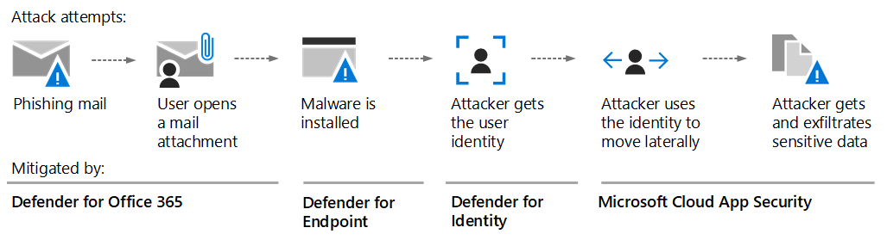

# Valutare e valutare le Microsoft 365 DefenderEvaluate and pilot Microsoft 365 Defender

**Si applica a:****Applies to:**

- Microsoft 365 DefenderMicrosoft 365 Defender

Microsoft 365 Defender è una soluzione XDR (Extended Detection and Response) che raccoglie, correla e analizza automaticamente i dati relativi a segnali, minacce e avvisi nell'ambiente Microsoft 365, inclusi endpoint, posta elettronica, applicazioni e identità.Microsoft 365 Defender is an extended detection and response (XDR) solution that automatically collects, correlates and analyzes signal, threat and alert data from across your Microsoft 365 environment, including endpoint, email, applications and identities. Sfrutta un'ampia intelligenza artificiale e automazione per arrestare automaticamente gli attacchi e correggere gli asset interessati in uno stato sicuro.It leverages extensive AI and automation to automatically stop attacks and remediate affected assets to a safe state. Gli articoli seguenti consentono di eseguire il processo di configurazione di un ambiente di valutazione in modo da poter valutare le funzionalità e le funzionalità di Microsoft 365 Defender.The following articles step you through the process of setting up a trial environment so you can evaluate the features and capabilities of Microsoft 365 Defender. 

Durante l'illustrazione di questi articoli, i passaggi illustrano come abilitare ogni componente, configurare le impostazioni e iniziare il monitoraggio con un gruppo pilota.As you walk through these articles, the steps will illustrate how to enable each component, configure settings, and begin monitoring with a pilot group. Quando si è pronti, è possibile completare la promozione dell'ambiente di valutazione direttamente nell'ambiente di produzione.When you’re ready, you can finish by promotion your evaluation environment directly into production. 

Microsoft consiglia di creare la valutazione in una sottoscrizione di produzione esistente di Office 365.Microsoft recommends you create your evaluation in an existing production subscription of Office 365. In questo modo potrai ottenere immediatamente informazioni approfondite sul mondo reale e ottimizzare le impostazioni in modo che funzionino contro le minacce correnti nel tuo ambiente.This way you will gain real-world insights immediately and can tune settings to work against current threats in your environment. Dopo aver acquisito esperienza e aver acquisito familiarità con la piattaforma, è sufficiente promuovere ogni componente, uno alla volta, in produzione.After you’ve gained experience and are comfortable with the platform, simply promote each component, one at a time, to production. 

## Anatomia di un attaccoThe anatomy of an attack

Microsoft 365 Defender è una suite di difesa aziendale basata su cloud, unificata, pre e post-violazione.Microsoft 365 Defender is a Cloud-based, unified, pre- and post-breach enterprise defense suite. Coordina la *prevenzione,* *il rilevamento,* *l'indagine* e la *risposta* tra endpoint, identità, app, posta elettronica, applicazioni di collaborazione e tutti i relativi dati.It coordinates *prevention*, *detection*, *investigation*, and *response* across endpoints, identities, apps, email, collaborative applications, and all of their data.

In questa figura è in corso un attacco.In this illustration an attack is underway. La posta elettronica di phishing arriva nella posta in arrivo di un dipendente dell'organizzazione, che apre inconsapevolmente l'allegato di posta elettronica.Phishing email arrives at the Inbox of an employee in your organization, who unknowingly opens the email attachment. In questo modo viene installato il malware, che porta a una catena di eventi che potrebbero terminare con il furto di dati sensibili.This installs malware, which leads to a chain of events that could end with the theft of sensitive data. Ma in questo caso, Defender for Office 365 è in funzione.But in this case, Defender for Office 365 is in operation.

Nella figura:In the illustration:

- **Exchange Online Protection,** parte di Microsoft Defender per Office 365, può rilevare la posta elettronica di phishing e usare le regole del flusso di posta per assicurarsi che non arrivi mai nella Posta in arrivo.**Exchange Online Protection**, part of Microsoft Defender for Office 365, can detect the phishing email and use mail flow rules to make certain it never arrives in the Inbox.
- **Defender per Office 365** allegati sicuri verifica l'allegato e lo determina come dannoso, quindi il messaggio che arriva non è utilizzabile dall'utente o i criteri impediscono l'arrivo della posta.**Defender for Office 365** safe attachments tests the attachment and determines it is harmful, so the mail that arrives either isn't actionable by the user, or policies prevent the mail from arriving at all.
- **Defender for Endpoint** gestisce i dispositivi che si connettono alla rete aziendale e rilevano le vulnerabilità di dispositivo e di rete che potrebbero altrimenti essere sfruttate.**Defender for Endpoint** manages devices that connect to the corporate network and detect device and network vulnerabilities that might otherwise be exploited.
- **Defender for Identity** prende nota di cambiamenti improvvisi dell'account come l'escalation dei privilegi o il movimento laterale ad alto rischio.**Defender for Identity** takes note of sudden account changes like privilege escalation, or high-risk lateral movement. Segnala inoltre problemi di identità facilmente sfruttati, come la delega Kerberos non vincolata, per la correzione da parte del team di sicurezza.It also reports on easily exploited identity issues like unconstrained Kerberos delegation, for correction by the security team.
- **Microsoft Cloud App Security** comportamenti anomali come viaggi impossibili, accesso alle credenziali e attività insolite di download, condivisione file o inoltro della posta e le segnala al team di sicurezza.**Microsoft Cloud App Security** notices anomalous behavior like impossible-travel, credential access, and unusual download, file share, or mail forwarding activity and reports these to the security team.

### Microsoft 365 Defender componentiMicrosoft 365 Defender components

Microsoft 365 Defender è costituito da queste tecnologie di sicurezza, che operano in tandem.Microsoft 365 Defender is made up of these security technologies, operating in tandem. Non sono necessari tutti questi componenti per trarre vantaggio dalle funzionalità di XDR e Microsoft 365 Defender.You don’t need all of these components to benefit from the capabilities of XDR and Microsoft 365 Defender. Potrai ottenere vantaggi ed efficienza anche usando uno o due.You will realize gains and efficiencies through using one or two as well. 

|ComponenteComponent  |DescrizioneDescription  |Materiale di riferimentoReference material  |
|---------|---------|---------|
|Microsoft Defender per identitàMicrosoft Defender for Identity     |      Microsoft Defender for Identity usa i segnali di Active Directory per identificare, rilevare e analizzare minacce avanzate, identità compromesse e azioni insider dannose indirizzate all'organizzazione.Microsoft Defender for Identity uses Active Directory signals to identify, detect, and investigate advanced threats, compromised identities, and malicious insider actions directed at your organization.     |     [Che cosa è Microsoft Defender per identità?What is Microsoft Defender for Identity?](/defender-for-identity/what-is)   |
|Exchange Online ProtectionExchange Online Protection     |      Exchange Online Protection è il servizio di inoltro e filtro SMTP basato su cloud nativo che consente di proteggere l'organizzazione da posta indesiderata e malware.Exchange Online Protection is the native cloud-based SMTP relay and filtering service that helps protect your organization against spam and malware.      |   [panoramica di Exchange Online Protection (EOP) - Office 365Exchange Online Protection (EOP) overview - Office 365](../office-365-security/overview.md)     |
|Microsoft Defender per Office 365Microsoft Defender for Office 365     |     Microsoft Defender per Office 365 protegge l'organizzazione dalle minacce dannose poste da messaggi di posta elettronica, collegamenti (URL) e strumenti di collaborazione.Microsoft Defender for Office 365 safeguards your organization against malicious threats posed by email messages, links (URLs) and collaboration tools.      |    [Microsoft Defender per Office 365 - Office 365Microsoft Defender for Office 365 - Office 365](../office-365-security/overview.md)    |
|Microsoft Defender per endpointMicrosoft Defender for Endpoint     |     Microsoft Defender for Endpoint è una piattaforma unificata per la protezione dei dispositivi, il rilevamento post-violazione, l'indagine automatizzata e la risposta consigliata.Microsoft Defender for Endpoint is a unified platform for device protection, post-breach detection, automated investigation, and recommended response.      |   [Microsoft Defender per endpoint - Windows sicurezzaMicrosoft Defender for Endpoint - Windows security](../defender-endpoint/microsoft-defender-endpoint.md)    |
|Microsoft Cloud App SecurityMicrosoft Cloud App Security     |      La sicurezza di Microsoft Cloud App è una soluzione saaS completa che offre visibilità profonda, controlli dei dati forti e protezione avanzata dalle minacce per le tue app cloud.Microsoft Cloud App security is a comprehensive cross-SaaS solution bringing deep visibility, strong data controls, and enhanced threat protection to your cloud apps.       |    [Che cos'è Cloud App Security?What is Cloud App Security?](/cloud-app-security/what-is-cloud-app-security)    |
|Azure AD Identity ProtectionAzure AD Identity Protection|Azure AD Identity Protection valuta i dati sui rischi di miliardi di tentativi di accesso e usa questi dati per valutare il rischio di ogni accesso all'ambiente.Azure AD Identity Protection evaluates risk data from billions of sign-in attempts and uses this data to evaluate the risk of each sign-in to your environment. Questi dati vengono usati da Azure AD per consentire o impedire l'accesso all'account, a seconda di come sono configurati i criteri di accesso condizionale.This data is used by Azure AD to allow or prevent account access, depending on how Conditional Access policies are configured. Azure AD Identity Protection è concesso in licenza separatamente da Microsoft 365 Defender.Azure AD Identity Protection is licensed separately from Microsoft 365 Defender. È incluso in Azure Active Directory Premium P2.It is included with Azure Active Directory Premium P2.|[Che cos'è Identity Protection?What is Identity Protection?](/azure/active-directory/identity-protection/overview-identity-protection)|
| | | |

## Microsoft 365 Defender architetturaMicrosoft 365 Defender architecture

Il diagramma seguente illustra l'architettura di alto livello per le Microsoft 365 Defender e le integrazioni chiave.The diagram below illustrates high-level architecture for key Microsoft 365 Defender components and integrations. *In questa* serie di articoli vengono fornite architetture dettagliate per ogni componente Defender e scenari di casi d'uso.*Detailed* architecture for each Defender component, and use-case scenarios, are given throughout this series of articles.

In questa illustrazione:In this illustration:

- Microsoft 365 Defender combina i segnali di tutti i componenti defender per fornire il rilevamento esteso e la risposta (XDR) tra domini.Microsoft 365 Defender combines the signals from all of the Defender components to provide extended detection and response (XDR) across domains. Ciò include una coda di eventi imprevisti unificata, una risposta automatizzata per arrestare gli attacchi, l'auto-riparazione (per i dispositivi compromessi, le identità degli utenti e le cassette postali), la ricerca tra minacce e l'analisi delle minacce.This includes a unified incident queue, automated response to stop attacks, self-healing (for compromised devices, user identities, and mailboxes), cross-threat hunting, and threat analytics.
- Microsoft Defender protegge l'organizzazione dalle minacce dannose poste da messaggi di posta elettronica, collegamenti (URL) e strumenti di collaborazione.Microsoft Defender safeguards your organization against malicious threats posed by email messages, links (URLs), and collaboration tools. Condivide i segnali risultanti da queste attività con Microsoft 365 Defender.It shares signals resulting from these activities with Microsoft 365 Defender. Exchange Online Protection (EOP) è integrato per fornire protezione end-to-end per i messaggi di posta elettronica e gli allegati in arrivo.Exchange Online Protection (EOP) is integrated to provide end-to-end protection for incoming emails and attachments.
- Microsoft Defender for Identity raccoglie i segnali dai server che eseguono Active Directory Federated Services (AD FS) e Servizi di dominio Active Directory locali.Microsoft Defender for Identity gathers signals from servers running Active Directory Federated Services (AD FS) and on-premises Active Directory Domain Services (AD DS). Usa questi segnali per proteggere l'ambiente di identità ibrido, inclusa la protezione da hacker che usano account compromessi per spostarsi lateralmente tra le workstation nell'ambiente locale.It uses these signals to protect your hybrid identity environment, including protecting against hackers that use compromised accounts to move laterally across workstations in the on-premises environment.
- Microsoft Defender for Endpoint raccoglie i segnali e protegge i dispositivi usati dall'organizzazione.Microsoft Defender for Endpoint gathers signals from and protects devices used by your organization.
- Microsoft Cloud App Security raccoglie i segnali dall'uso delle app cloud dell'organizzazione e protegge il flusso di dati tra l'ambiente e queste app, incluse le app cloud sanzionate e non sanzionate.Microsoft Cloud App Security gathers signals from your organization's use of cloud apps and protects data flowing between your environment and these apps, including both sanctioned and unsanctioned cloud apps.
- Azure AD Identity Protection valuta i dati sui rischi di miliardi di tentativi di accesso e usa questi dati per valutare il rischio di ogni accesso all'ambiente.Azure AD Identity Protection evaluates risk data from billions of sign-in attempts and uses this data to evaluate the risk of each sign-in to your environment. Questi dati vengono usati da Azure AD per consentire o impedire l'accesso all'account, a seconda di come sono configurati i criteri di accesso condizionale.This data is used by Azure AD to allow or prevent account access, depending on how Conditional Access policies are configured. Azure AD Identity Protection è concesso in licenza separatamente da Microsoft 365 Defender.Azure AD Identity Protection is licensed separately from Microsoft 365 Defender. È incluso in Azure Active Directory Premium P2.It is included with Azure Active Directory Premium P2.  

Ulteriori componenti dell'architettura facoltativi non inclusi in questa figura:Additional optional architecture components not included in this illustration:

- I dati dettagliati del segnale di tutti i componenti di Microsoft Defender possono essere integrati in Azure Sentinel e combinati con altre origini di registrazione per offrire informazioni dettagliate e funzionalità SIEM e SOAR complete.Detailed signal data from all Microsoft Defender components can be integrated into Azure Sentinel and combined with other logging sources to offer full SIEM and SOAR capabilities and insights.

## Processo di valutazioneThe evaluation process

Microsoft consiglia di abilitare i componenti di Microsoft 365 nell'ordine illustrato:Microsoft recommends enabling the components of Microsoft 365 in the order illustrated:

Nella tabella seguente viene descritta questa figura.The following table describes this illustration.

|      |PassaggioStep  |DescrizioneDescription  |
|------|---------|---------|
|11     | [Creare l'ambiente di valutazioneCreate the evaluation environment](eval-create-eval-environment.md)       |Questo passaggio garantisce la licenza di valutazione per Microsoft 365 Defender.This step ensures you have the trial license for Microsoft 365 Defender.         |
|2 2     | [Abilitare Defender per l'identitàEnable Defender for Identity](eval-defender-identity-overview.md)        | Esaminare i requisiti di architettura, abilitare la valutazione ed eseguire esercitazioni per identificare e correggere diversi tipi di attacco.Review the architecture requirements, enable the evaluation, and walk through tutorials for identifying and remediating different attack types.   |
|3 3     | [Abilitare Defender per Office 365Enable Defender for Office 365 ](eval-defender-office-365-overview.md)       | Assicurarsi di soddisfare i requisiti di architettura, abilitare la valutazione e quindi creare l'ambiente pilota.Ensure you meet the architecture requirements, enable the evaluation, and then create the pilot environment. Questo componente include Exchange Online Protection e quindi valuterai *entrambi qui.*This component includes Exchange Online Protection and so you will actually evaluate *both* here.      |
|4 4     | [Abilitare Defender per Endpoint Enable Defender for Endpoint ](eval-defender-endpoint-overview.md)       | Assicurarsi di soddisfare i requisiti di architettura, abilitare la valutazione e quindi creare l'ambiente pilota.Ensure you meet the architecture requirements, enable the evaluation, and then create the pilot environment.         |
|5 5     | [Abilita Microsoft Cloud App SecurityEnable Microsoft Cloud App Security](eval-defender-mcas-overview.md)        |  Assicurarsi di soddisfare i requisiti di architettura, abilitare la valutazione e quindi creare l'ambiente pilota.Ensure you meet the architecture requirements, enable the evaluation, and then create the pilot environment.        |
|6 6     | [Indagare e rispondere alle minacceInvestigate and respond to threats](eval-defender-investigate-respond.md)        |   Simulare un attacco e iniziare a usare le funzionalità di risposta agli incidenti.Simulate an attack and begin using incident response capabilities.      |
|7 7     | [Promuovere la versione di valutazione in produzionePromote the trial to production](eval-defender-promote-to-production.md)        | Alzare Microsoft 365 componenti di produzione uno alla volta.Promote the Microsoft 365 components to production one-by-one.        |
| | | |

Si tratta di un ordine comunemente consigliato progettato per ottenere rapidamente il valore delle funzionalità in base a quanto impegno è in genere necessario per distribuire e configurare le funzionalità.This is a commonly recommended order designed to gain the value of the capabilities quickly based on how much effort is typically required to deploy and configure the capabilities. Ad esempio, Defender per Office 365 può essere configurato molto più velocemente di quanto sia necessario per registrare i dispositivi per Defender per Endpoint.For example, Defender for Office 365 can be configured much quicker than is required to enroll devices for Defender for Endpoint. Naturalmente è possibile assegnare priorità ai componenti per soddisfare le esigenze aziendali e abilitarlo in un ordine diverso.Of course you can prioritize the components to meet your business needs and enable these in a different order.

## Passaggi successiviNext steps

[Creare l'Microsoft 365 Defender di valutazioneCreate the Microsoft 365 Defender Evaluation Environment](eval-create-eval-environment.md)
