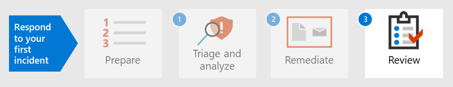

# Passaggio 2.Step 2. Correggere il primo evento imprevistoRemediate your first incident

[!INCLUDE [Microsoft 365 Defender rebranding](../includes/microsoft-defender.md)]

**Si applica a:****Applies to:**
- Microsoft 365 DefenderMicrosoft 365 Defender

Microsoft 365 Defender non solo fornisce funzionalità di rilevamento e analisi, ma fornisce anche il contenimento e l'eliminazione di malware.Microsoft 365 Defender not only provides detection and analysis capabilities but also provides containment and eradication of malware. Containment includes steps to reduce the impact of the attack while eradication ensures all traces of attacker activity are removed from the network.Containment includes steps to reduce the impact of the attack while eradication ensures all traces of attacker activity are removed from the network.  Microsoft 365 Defender offre diverse azioni di correzione che possono essere configurate per la correzione automatica a seconda del sistema operativo e del tipo di attacco.Microsoft 365 Defender offers several remediation actions which can be configured to auto-remediate depending on your operating system and the attack type.

Microsoft 365 Defender offre diverse azioni di correzione che gli analisti possono avviare manualmente.Microsoft 365 Defender offers several remediation actions that analysts can manually initiate. Le azioni sono suddivise in due categorie, Azioni su dispositivi e Azioni sui file.Actions are separated into two categories, Actions on devices and Actions on files. Alcune azioni possono essere usate per arrestare immediatamente la minaccia, mentre altre azioni sono utili per un'ulteriore analisi forense.Some actions can be used to immediately stop the threat while other actions assist in further forensic analysis.

## Azioni nei dispositiviActions on devices

- **Isolare il** dispositivo- Questa attività blocca immediatamente tutto il traffico di rete (Internet e interno) per ridurre al minimo la diffusione di malware e consentire agli analisti di continuare l'analisi senza che un attore malintenzionato sia in grado di continuare un attacco.**Isolate the device** - This activity immediately blocks all network traffic (internet and internal) to minimize the spread of malware and allow analysts to continue analysis without a malicious actor being able to continue an attack. L'unica connessione consentita è al cloud del servizio Microsoft Defender for Identity, in modo che Microsoft Defender for Identity possa continuare a monitorare il dispositivo.The only connection allowed is to the Microsoft Defender for Identity service cloud so Microsoft Defender for Identity can continue to monitor the device. 
- **Limitare l'esecuzione dell'app:** per limitare l'esecuzione di un'applicazione, vengono applicati criteri di integrità del codice che consentono l'esecuzione dei file solo se firmati da un certificato emesso da Microsoft.**Restrict app execution** - To restrict an application from running, a code integrity policy is applied that only allows files to run if they are signed by a Microsoft-issued certificate. Questo metodo di restrizione può aiutare a impedire a un utente malintenzionato di controllare i dispositivi compromessi ed eseguire ulteriori attività dannose.This method of restriction can help prevent an attacker from controlling compromised devices and performing further malicious activities.
- **Eseguire l'analisi antivirus** : un'Antivirus Microsoft Defender di analisi può essere eseguita insieme ad altre soluzioni antivirus, indipendentemente dal fatto che Defender Antivirus sia o meno la soluzione antivirus attiva.**Run Antivirus scan** - A Microsoft Defender Antivirus scan can run alongside other antivirus solutions, whether Defender Antivirus is the active antivirus solution or not. Se un altro prodotto fornitore di antivirus è la soluzione principale per la protezione degli endpoint, puoi eseguire Defender Antivirus in modalità passiva.If another antivirus vendor product is the primary endpoint protection solution, you can run Defender Antivirus in Passive mode.
- **Avviare un'indagine automatizzata:** è possibile avviare una nuova indagine automatizzata di uso generale nel dispositivo.**Initiate automated investigation** - You can start a new general purpose automated investigation on the device. Durante l'esecuzione di un'indagine, qualsiasi altro avviso generato dal dispositivo verrà aggiunto a un'indagine automatizzata in corso fino al completamento dell'indagine.While an investigation is running, any other alert generated from the device will be added to an ongoing automated investigation until that investigation is completed. Inoltre, se la stessa minaccia viene vista su altri dispositivi, questi dispositivi vengono aggiunti all'indagine.In addition, if the same threat is seen on other devices, those devices are added to the investigation.
- **Initiate live response** - La risposta in tempo reale è una funzionalità che consente l'accesso istantaneo a un dispositivo tramite una connessione shell remota.**Initiate live response** - Live response is a capability that gives you instantaneous access to a device by using a remote shell connection. In questo modo è possibile eseguire un lavoro di indagine approfondito e intraprendere azioni di risposta immediate per contenere prontamente le minacce identificate in tempo reale.This gives you the ability to do in-depth investigative work and take immediate response actions to promptly contain identified threats in real time. La risposta in tempo reale è progettata per migliorare le indagini consentendoti di raccogliere dati forensi, eseguire script, inviare entità sospette per l'analisi, correggere le minacce e cercare in modo proattivo minacce emergenti.Live response is designed to enhance investigations by enabling you to collect forensic data, run scripts, send suspicious entities for analysis, remediate threats, and proactively hunt for emerging threats.
- **Raccogli pacchetto di indagine:** nell'ambito del processo di indagine o di risposta, puoi raccogliere un pacchetto di indagine da un dispositivo.**Collect investigation package** - As part of the investigation or response process, you can collect an investigation package from a device. Raccogliendo il pacchetto di analisi, è possibile identificare lo stato corrente del dispositivo e comprendere ulteriormente gli strumenti e le tecniche utilizzati dall'autore dell'attacco.By collecting the investigation package, you can identify the current state of the device and further understand the tools and techniques used by the attacker. 
- **Consultare un esperto** di minacce (disponibile in Azioni su dispositivi e file): è possibile consultare un esperto di minacce Microsoft per ulteriori informazioni su dispositivi o dispositivi potenzialmente compromessi già compromessi.**Consult a threat expert** (available in both Actions on devices and files) - You can consult a Microsoft threat expert for more insights regarding potentially compromised devices or devices that are already compromised. Gli esperti di minacce Microsoft possono essere coinvolti direttamente dall'Microsoft Defender Security Center per una risposta accurata e immediata.Microsoft threat experts can be engaged directly from within the Microsoft Defender Security Center for a timely and accurate response. 

## Azioni sui fileActions on files

- **Stop and quarantine file** - Questa azione include l'interruzione dei processi in esecuzione, la messa in quarantena dei file e l'eliminazione di dati permanenti, ad esempio le chiavi del Registro di sistema.**Stop and quarantine file** - This action includes stopping running processes, quarantining files, and deleting persistent data, such as any registry keys. Questa azione ha effetto sui dispositivi con Windows 10 versione 1703 o successiva, in cui il file è stato osservato negli ultimi 30 giorni.This action takes effect on devices with Windows 10, version 1703 or later, where the file was observed in the last 30 days. 
- **Aggiungere indicatori per bloccare o consentire i file-** Impedire l'ulteriore propagazione di un attacco nell'organizzazione vietando file potenzialmente dannosi o malware sospetto.**Add indicators to block or allow file** - Prevent further propagation of an attack in your organization by banning potentially malicious files or suspected malware. Questa operazione impedirà la lettura, la scrittura o l'esecuzione del file nei dispositivi dell'organizzazione.This operation will prevent the file from being read, written, or executed on devices in your organization.
- **Scaricare o raccogliere file:** questa azione consente agli analisti di scaricare un file in un file di archivio .zip protetto da password per un'ulteriore analisi da parte dell'organizzazione.**Download or collect file** – This action allows analysts to download a file in a password protected .zip archive file for further analysis by the organization.
- **Analisi approfondita:** questa azione esegue un file in un ambiente cloud sicuro e completamente instrumentato.**Deep analysis** – This action executes a file in a secure, fully instrumented cloud environment. I risultati dell'analisi approfondita mostrano le attività, i comportamenti osservati e gli artefatti associati del file, ad esempio i file eliminati, le modifiche al Registro di sistema e la comunicazione con gli indirizzi IP.Deep analysis results show the file's activities, observed behaviors, and associated artifacts, such as dropped files, registry modifications, and communication with IP addresses. 

Continuando l'esempio in [Rilevare, analizzare](first-incident-analyze.md#analyze-your-first-incident)e analizzare gli eventi imprevisti, un analista può correggere questo incidente con queste azioni:Continuing the example in [Detect, triage, and analyze incidents](first-incident-analyze.md#analyze-your-first-incident), an analyst can remediate this incident with these actions:

1. Reimpostare immediatamente la password dell'account utenteImmediately reset the user account password
2. Isolare il dispositivo in Microsoft 365 Defender fino al completamento dell'analisi approfonditaIsolate the device in Microsoft 365 Defender until deep analysis is complete
3. Verificare che il file dannoso sia stato messo in quarantena SharePointEnsure the malicious file was quarantined from SharePoint
4. Verificare quali endpoint sono stati interessati dal malwareCheck which endpoints were affected by malware
5. Rigenerare i sistemiRebuild systems
6. Verificare la presenza di avvisi Microsoft Cloud App Security simili per altri utentiCheck for similar Microsoft Cloud App Security alerts for other users
7. Creare un indicatore personalizzato in Microsoft Defender for Endpoint per bloccare un indirizzo IP TorCreate a custom indicator in Microsoft Defender for Endpoint to block a Tor IP address
8. Creare un'azione di governance in Microsoft Cloud App Security per questo tipo di avviso, ad esempio quelle mostrate nell'immagine seguente:Create a governance action in Microsoft Cloud App Security for this type of alert such as those shown in the following image:

   :::image type="content" source="../../media/first-incident-remediate/first-incident-mcas-governance.png" alt-text="Esempio di azioni di governance nel portale Microsoft Cloud App Security governance"::: 
 
La maggior parte delle azioni di correzione può essere applicata e monitorata in Microsoft 365 Defender.Most of the remediation actions can be applied and tracked in Microsoft 365 Defender. 

## Uso di PlaybookUsing Playbooks

Inoltre, è possibile creare correzioni automatizzate usando playbook.In addition, automated remediation can be created using playbooks. Attualmente, Microsoft dispone di [modelli Playbook GitHub](https://github.com/microsoft/Microsoft-Cloud-App-Security/tree/master/Playbooks) che forniscono playbook per gli scenari seguenti:Currently, Microsoft has [Playbook templates on GitHub](https://github.com/microsoft/Microsoft-Cloud-App-Security/tree/master/Playbooks) that provide playbooks for the following scenarios:

- Rimuovere la condivisione di file sensibili dopo aver richiesto la convalida dell'utenteRemove sensitive file sharing after requesting user validation
- Auto-triage infrequent country alertsAuto-triage infrequent country alerts
- Richiedere l'azione del manager prima di disabilitare un accountRequest for manager action before disabling an account
- Disabilitare le regole di Posta in arrivo dannoseDisable malicious inbox rules

I playbook usano Power Automate per creare flussi di automazione dei processi robotizzati personalizzati per automatizzare determinate attività dopo l'attivazione di criteri specifici.Playbooks use Power Automate to create custom robotic process automation flows to automate certain activities once specific criteria have been triggered. Le organizzazioni possono creare playbook da modelli esistenti o da zero.Organizations can create playbooks either from existing templates or from scratch. 

Di seguito viene riportato un esempio.Here's an example.
 
:::image type="content" source="../../media/first-incident-remediate/first-incident-power-automate.png" alt-text="Esempio di un flusso Power Automate di automazione dei processi robot personalizzati"::: 
 
I Playbook possono essere creati anche durante la revisione [post-incidente](first-incident-post.md) per creare azioni di correzione dagli eventi imprevisti per azioni correttive più rapide.Playbooks can also be created during [post-incident review](first-incident-post.md) to create remediation actions from incidents for faster remediation actions. 

## Passaggio successivoNext step

Informazioni su come [eseguire una revisione post-incidente di un evento imprevisto.](first-incident-post.md)Learn how to [perform a post-incident review of an incident](first-incident-post.md).

## Vedere ancheSee also

- [Panoramica degli eventi imprevistiIncidents overview](incidents-overview.md)
- [Analizzare gli incidentiAnalyze incidents](investigate-incidents.md)
- [Gestire gli incidentiManage incidents](manage-incidents.md)
