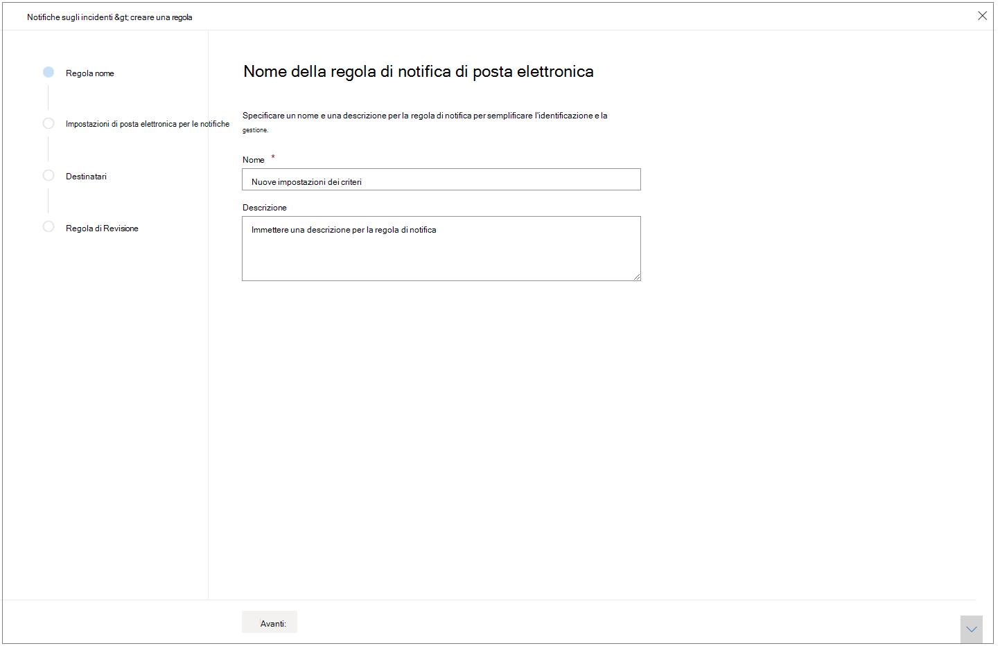
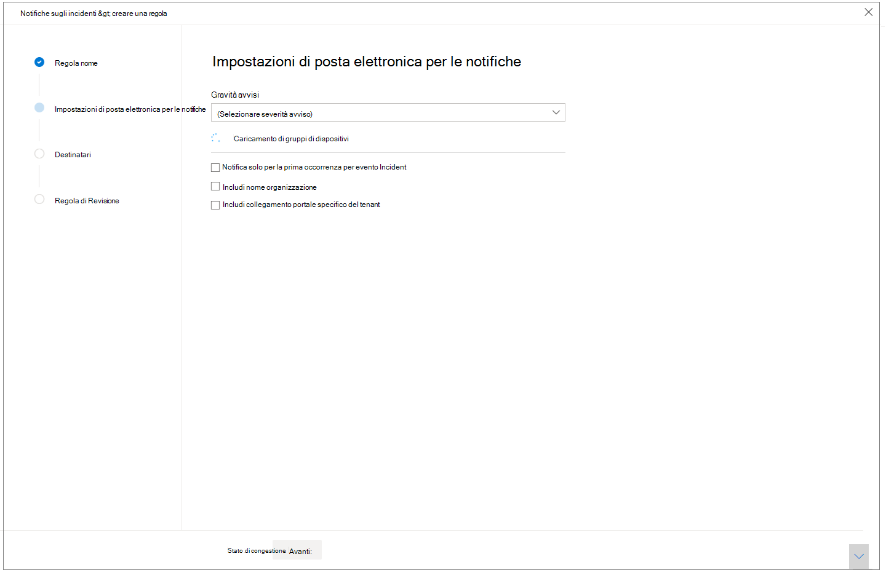
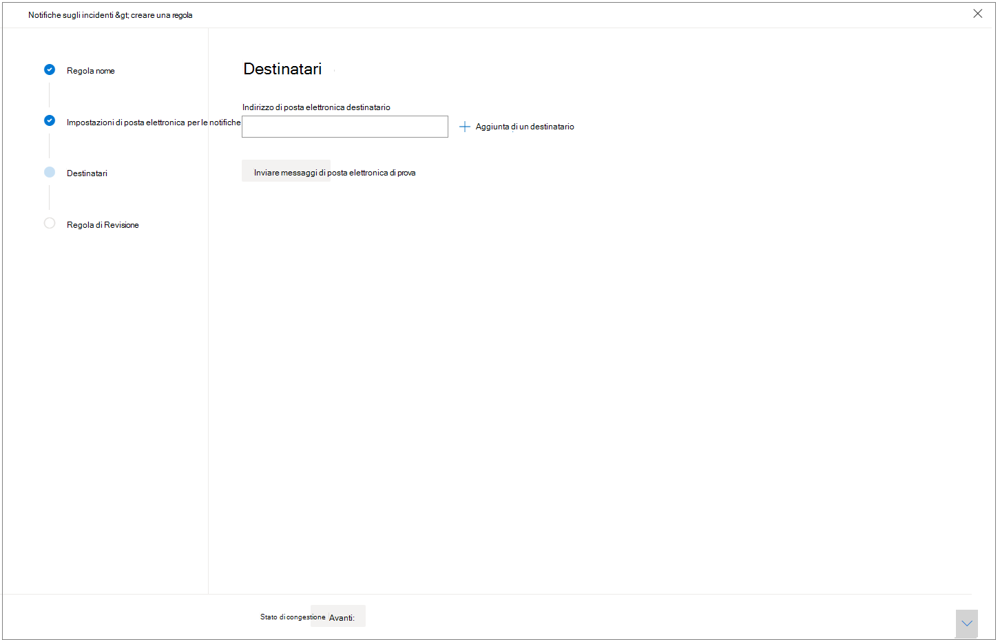

# Ricevere notifiche di eventi imprevisti tramite posta elettronicaGet incident notifications by email

[!INCLUDE [Microsoft 365 Defender rebranding](../includes/microsoft-defender.md)]

**Si applica a:****Applies to:**
- Microsoft 365 DefenderMicrosoft 365 Defender

È possibile configurare Microsoft 365 Defender per inviare una notifica tramite posta elettronica ogni volta che sono presenti nuovi eventi imprevisti o nuovi aggiornamenti a eventi imprevisti esistenti.You can set up Microsoft 365 Defender to notify you by email every time there are new incidents or new updates to existing incidents. 

Puoi scegliere di ricevere notifiche in base alla gravità dell'incidente o in base al gruppo di dispositivi.You can choose to get notifications based on incident severity or by device group. Puoi anche scegliere di ricevere una notifica solo al primo aggiornamento per evento imprevisto.You can also choose to get a notification only on the first update per incident.

È possibile aggiungere o rimuovere destinatari nelle notifiche di posta elettronica.You can add or remove recipients in the email notifications. I nuovi destinatari aggiunti riceveranno una notifica sugli eventi imprevisti dopo l'aggiunta.Newly added recipients get notified about incidents after they're added. 

La notifica di posta elettronica contiene dettagli importanti sull'evento imprevisto, ad esempio il nome, la gravità e le categorie dell'evento imprevisto, tra gli altri.The email notification contains important details about the incident like the incident name, severity, and categories, among others. È inoltre possibile passare direttamente agli eventi imprevisti in modo da poter avviare immediatamente l'indagine.You can also directly go to incidents so you can start your investigation right away. Per ulteriori informazioni sull'analisi degli incidenti, vedere [Investigate incidents in Microsoft 365 Defender.](./investigate-incidents.md)For more on investigating incidents, see [Investigate incidents in Microsoft 365 Defender](./investigate-incidents.md).

>[!NOTE]
>Per configurare le impostazioni di notifica tramite posta elettronica, è necessario disporre delle autorizzazioni "Gestisci impostazioni di sicurezza".You need 'Manage security settings' permissions to configure email notification settings. Se si è scelto di utilizzare la gestione delle autorizzazioni di base, gli utenti con ruoli amministratore della sicurezza o amministratore globale possono configurare automaticamente le notifiche di posta elettronica.If you've chosen to use basic permissions management, users with Security Administrator or Global Administrator roles can configure email notifications for you.    
Allo stesso modo, se l'organizzazione utilizza il controllo di accesso basato sui ruoli(RBAC), è possibile creare, modificare, eliminare e ricevere notifiche in base ai gruppi di dispositivi che sono autorizzati a gestire.Likewise, if your organization is using role-based access control (RBAC), you can only create, edit, delete, and receive notifications based on device groups that you are allowed to manage.

## Creare regole per le notifiche di eventi imprevistiCreate rules for incident notifications

Per configurare la prima notifica tramite posta elettronica per gli eventi imprevisti, creare una nuova regola e personalizzare le impostazioni di notifica tramite posta elettronica.To set up your first email notification for incidents, create a new rule and customize email notification settings.

1. Nel riquadro di spostamento, selezionare **Impostazioni**  >  **Notifiche e-mail evento imprevisto.**In the navigation pane, select **Settings** > **Incident email notifications**.
2. Selezionare **Aggiungi elemento**.Select **Add item**.
3. Assegnare un nome alla regola in **Nome** e specificare una **Descrizione.**Give the rule a name in **Name** and supply a **Description**.

     
4. Selezionare **Avanti** per passare a **Impostazioni notifica.**Select **Next** to go to **Notification settings**. Qui puoi specificare:Here you can specify:
    - **Gravità avviso:** scegliere la gravità dell'avviso che attiverà una notifica di evento imprevisto.**Alert severity** - Choose the alert severity that will trigger an incident notification. Ad esempio, se si desidera essere informati solo sugli eventi imprevisti di gravità elevata, selezionare Alta.For example, if you only want to be informed about High severity incidents, select High.
    - **Ambito del gruppo di dispositivi-** Questo elenco a discesa visualizza tutti i gruppi di dispositivi a cui l'utente può accedere.**Device group scope** - This dropdown displays all the device groups the user can access. Seleziona i gruppi di dispositivi per cui stai creando le regole di notifica degli eventi imprevisti.Select which device groups you're creating the incident notification rules for.
    - **Notifica solo alla prima occorrenza per evento** imprevisto: selezionando questa opzione verrà inviata una notifica tramite posta elettronica solo al primo avviso corrispondente alle altre selezioni.**Only notify on first occurrence per incident** - Selecting this option will send an email notification only on the first alert that matches your other selections. Gli aggiornamenti o gli avvisi successivi correlati all'evento imprevisto non attivano una notifica.Later updates or alerts related to the incident won't trigger a notification.
    - **Includi nome organizzazione** - Indica se il nome del cliente viene visualizzato o meno nella notifica tramite posta elettronica.**Include organization name** - Indicates whether the customer name appears on the email notification or not.
    - **Includi collegamento al portale specifico del** tenant - Aggiunge un collegamento con l'ID tenant per consentire l'accesso a un tenant specifico.**Include tenant-specific portal link** -  Adds a link with the tenant ID to allow access to a specific tenant.
    
    
5. Selezionare **Avanti** per passare alla **sezione** Destinatari.Select **Next** to go the **Recipients** section. Qui è possibile specificare gli indirizzi di posta elettronica che riceveranno le notifiche di posta elettronica degli eventi imprevisti.Here you can specify email addresses that will receive the incident email notifications. Selezionare **Aggiungi un destinatario dopo** aver digitato ogni indirizzo di posta elettronica.Select **Add a recipient** after typing every email address.

     

6. Infine, selezionare **Avanti** per passare a **Rivedi regola** in modo da poter visualizzare tutte le impostazioni associate alla nuova regola.Finally, select **Next** to go to **Review rule** so you can see all the settings associated with your new rule. I destinatari inizieranno a ricevere notifiche di eventi imprevisti tramite posta elettronica in base alle impostazioni.Recipients will start receiving incident notifications through email based on the settings.

## Vedere ancheSee also
- [Panoramica degli incidenti in Microsoft 365 DefenderIncidents overview in Microsoft 365 Defender](./incidents-overview.md)
- [Assegnare priorità agli incidenti in Microsoft 365 DefenderPrioritize incidents in Microsoft 365 Defender](./incident-queue.md)
- [Analizzare gli incidenti in Microsoft 365 DefenderInvestigate incidents in Microsoft 365 Defender](./investigate-incidents.md)
