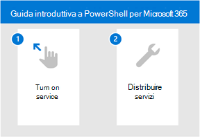

# Introduzione a Microsoft 365 per DefenderGet started with Microsoft 365 for Defender

[!INCLUDE [Microsoft 365 Defender rebranding](../includes/microsoft-defender.md)]

**Si applica a:****Applies to:**
- Microsoft 365 DefenderMicrosoft 365 Defender

Microsoft 365 Defender è un'esperienza unificata in cui è possibile monitorare e gestire la sicurezza nell'organizzazione.Microsoft 365 Defender is a unified experience where you can monitor and manage security across your enterprise. Con gli avvisi integrati tra identità, endpoint, dati, app, posta elettronica e strumenti di collaborazione, l'analisi e la risposta alle minacce si verificano ora in una posizione centrale.With the integrated alerts across identities, endpoints, data, apps, email, and collaboration tools - investigating and responding to threats now happen in a central location. 

Sia che tu non abbia familiarità con la famiglia di prodotti microsoft per la sicurezza o abbia familiarità con i singoli flussi di lavoro, questo argomento ti guiderà nei semplici passaggi da eseguire per iniziare a usare Microsoft 365 Defender.Whether you're new to the Microsoft suite of security products or familiar with individual workflows, this topic will guide you in the simple steps you need to take to get started with Microsoft 365 Defender.

In generale, è necessario eseguire la procedura seguente per iniziare:In general, you'll need to take the following steps to get started:

- **[Passaggio 1: attivare Microsoft 365 Defender](m365d-enable.md)****[Step 1: Turn on Microsoft 365 Defender](m365d-enable.md)**  
    Dovrai innanzitutto attivare il servizio assicurandoti di disporre della licenza giusta e che i ruoli siano assegnati in modo da poter accedere al portale.You'll first need to turn on the service by making sure you have the right license in place and roles are assigned so that you can access the portal. 

    Verranno quindi trattate alcune semplici impostazioni e sarà possibile verificare che il servizio sia in servizio.You'll then go through some simple settings and then you can confirm that the service is on.

- **[Passaggio 2: Distribuire i servizi supportati](deploy-supported-services.md)****[Step 2: Deploy supported services](deploy-supported-services.md)**  
    Dopo aver completato i passaggi iniziali, dovrai distribuire i servizi supportati disponibili con Microsoft 365 Defender.After completing the initial steps, you'll need to deploy the supported services that come with Microsoft 365 Defender. La distribuzione dei servizi aumenta in modo efficace la visibilità dei segnali provenienti dagli asset nella rete.Deploying services effectively increases your visibility in the signals from assets across your network.

## Funzionalità chiaveKey capabilities
L'attivazione Microsoft 365 Defender e la distribuzione dei servizi ti permetteranno di accedere alle funzionalità chiave seguenti:Turning on Microsoft 365 Defender and deploying services will give you access to the following key capabilities:

| FunzionalitàCapability | DescrizioneDescription |
| ------ | ------ |
| Microsoft Defender per endpointMicrosoft Defender for Endpoint | Suite di endpoint protection basata su potenti sensori comportamentali, analisi cloud e intelligence per le minacceEndpoint protection suite built around powerful behavioral sensors, cloud analytics, and threat intelligence |
|Microsoft Defender per Office 365Microsoft Defender for Office 365 | Protezione avanzata per le app e i dati in Office 365, inclusi la posta elettronica e altri strumenti di collaborazioneAdvanced protection for your apps and data in Office 365, including email and other collaboration tools |
| Microsoft Defender per identitàMicrosoft Defender for Identity | Difendersi da minacce avanzate, identità compromesse e utenti malintenzionati che usano segnali di Active Directory correlatiDefend against advanced threats, compromised identities, and malicious insiders using correlated Active Directory signals |
| Microsoft Cloud App SecurityMicrosoft Cloud App Security | Identificare e contrastare le minacce informatiche nei servizi cloud Microsoft e di terze partiIdentify and combat cyberthreats across your Microsoft and third-party cloud services |

